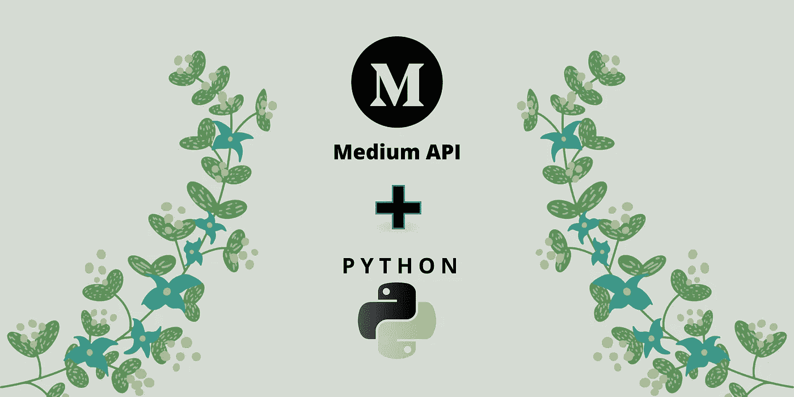

# 中型 API:使用 Python 获取帖子

> 原文：<https://blog.devgenius.io/medium-api-get-posts-using-python-e8ca4331845e?source=collection_archive---------3----------------------->

## 编程和 API

## 仅带有“请求”库！



作者图片

嘿伙计们！

今天，我们将使用 Python 和 Medium API(非官方版本)从 Medium Platform([https://medium.com](https://medium.com))获取一个用户写的帖子(文章或故事)。这非常简单明了…

所以，不要浪费太多时间，让我们来看看代码吧！

**要获得更高级的教程，请使用** `**medium-api**` **python 包，转到—**

[](https://pub.towardsai.net/medium-api-get-posts-using-python-126d6d859ca8) [## 中型 API:使用 Python 获取帖子

### 用户撰写的文章、发布文章和顶级订阅源

pub.towardsai.net](https://pub.towardsai.net/medium-api-get-posts-using-python-126d6d859ca8) 

# 先决条件—

1.  [安装 **python**](https://www.python.org/downloads/)
2.  [安装**请求**库](https://pypi.org/project/requests/) ( *pip 安装请求*)
3.  注册到 [RapidAPI](https://rapidapi.com/nishujain199719-vgIfuFHZxVZ/api/medium2) 获取[**YOUR _ API key**](https://docs.rapidapi.com/docs/keys)**(*不会很久的，相信我！*)**

**什么是 Medium API(非官方)？—作者的视频(可选观看)**

# **分步编码—**

1.  **导入请求库**

```
import **requests**
```

**2.设置标题和 base_url**

```
headers = {
  "x-rapidapi-host": **"YOUR_APIHOST"**, # 'medium2.p.rapidapi.com'
  "x-rapidapi-key": **"YOUR_APIKEY"**
}base_url = **'https://medium2.p.rapidapi.com'**
```

**3.设置用户名**

```
username = ***'nishu-jain'***
```

**4.获取`user_id`**

```
response = requests.get(
                    base_url + **'/user/id_for/'** + username, 
                    headers = headers
)json_data = response.json()
**user_id** = json_data[**'id'**]
```

**5.获取作者写的所有文章(`article_ids`)**

```
response = requests.get(
                    base_url + **'/user/'** + user_id + **'/articles',** headers = headers
)json_data = response.json()
**article_ids** = json_data[**'associated_articles'**]
```

**6.获取与每篇文章相关的信息**

```
**articles** = []
for article_id in article_ids:
   response = requests.get(base_url + **'/article/'** + article_id)
   **article** = response.json()
   print('[FETCHING]: ', **article['title']**)
   articles.append(**article**)
```

**7.搞定了。你已经使用 python 成功地获得了所有的帖子**

```
print('Total number of articles: ', **len(articles)**, '\n')
print('Details of the first article: \n')
print(**articles[0])**
```

****首条信息输出—****

```
{ **'id':** '562c5821b5f0',
 **'title':** 'About Me :) - Nishu Jain',
 **'subtitle':** 'Who am I and what do I do ...',
 **'author':** '1985b61817c3',
 **'tags':** ['about-me', 'nishu-jain', 'bio', 'software-engineer', 'introduction'],
 **'publication_id':** '*Self-Published*',
 **'published_at':** '2021-04-17 17:42:10',
 **'last_modified_at':** '2021-09-13 06:48:43',
 **'claps':** 52,
 **'voters':** 2,
 **'word_count':** 527,
 **'reading_time':** 2.3720125786164,
 **'topics':** ['self'],
 **'url':** '[https://nishu-jain.medium.com/about-me-nishu-jain-562c5821b5f0'](https://nishu-jain.medium.com/about-me-nishu-jain-562c5821b5f0'),
 **'image_url':** '[https://miro.medium.com/1*4cUFmh4kDyGvf4y-73tBaA.png'](https://miro.medium.com/1*4cUFmh4kDyGvf4y-73tBaA.png'),
}
```

# **完整的代码—**

**作者代码**

# **帮助和参考—**

**如果你被困在某个地方，请阅读以下文章获取更多信息—**

**[](https://nishu-jain.medium.com/medium-api-documentation-90a01549d8db) [## 中等 API —文档

### 中型 API 入门

nishu-jain.medium.com](https://nishu-jain.medium.com/medium-api-documentation-90a01549d8db) [](https://nishu-jain.medium.com/how-to-retrieve-medium-stories-of-a-user-using-apis-fcdb1576558a) [## 如何使用 API 检索用户的媒体故事？

### 废弃任何用户使用中型 API 编写的中型文章的最简单方法

nishu-jain.medium.com](https://nishu-jain.medium.com/how-to-retrieve-medium-stories-of-a-user-using-apis-fcdb1576558a) 

或者你可以联系我，我很乐意帮忙…

> [nishu@mediumapi.com](mailto:nishu@mediumapi.com)

感谢您的阅读，祝您愉快！

**PS:** 我们发布与 Medium 和 Medium API 相关的教程、视频、代码片段和见解。所以一定要跟着我们

*   推特:[**twitter.com/medium_api**](https://twitter.com/medium_api)
*   领英:[**www.linkedin.com/company/medium-api**](https://www.linkedin.com/company/medium-api)

*如果你喜欢阅读这些故事，那么我相信你会很乐意成为一名* [***中等付费会员***](https://nishu-jain.medium.com/membership) ***。每月只需 5 美元，你就可以无限制地接触成千上万的故事和作家。你可以通过* [***注册使用此链接***](https://nishu-jain.medium.com/membership) ，*来支持我，我将赚取一点佣金，这将帮助我成长并出版更多像这样的故事。*****