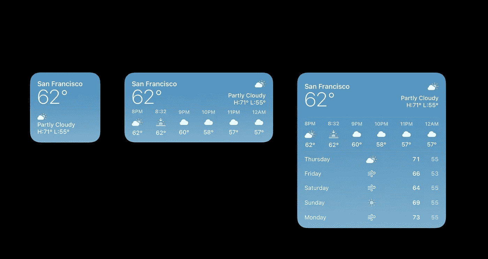
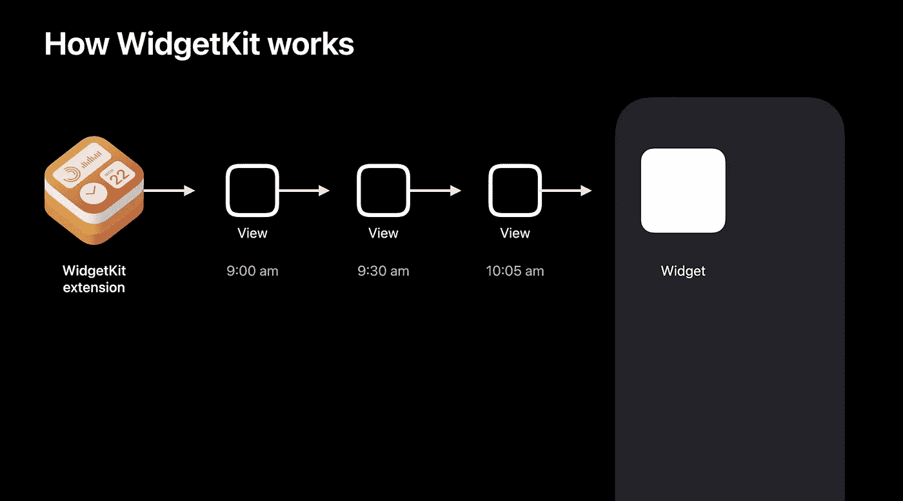
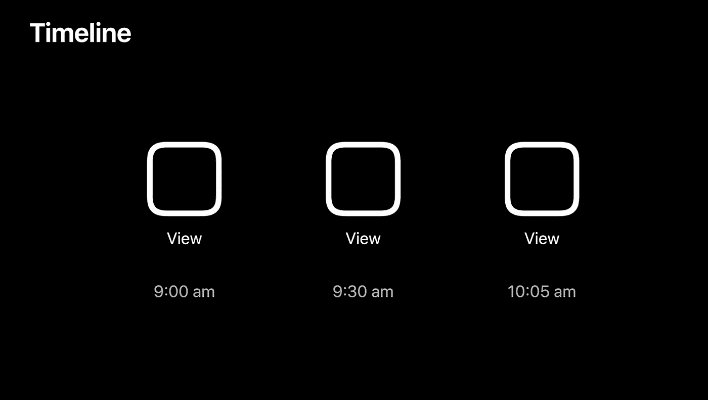

# 认识 WidgetKit

> 原文：<https://blog.devgenius.io/meet-widgetkit-eaa10d5c27c8?source=collection_archive---------5----------------------->

# 认识 WidgetKit

> *🗂 WWDC2020 |会议:10028 |类别:框架*
> 
> *🔗*
> 
> **🔖认识 WidgetKit:将应用程序最有用的信息直接带到主屏幕的最佳方式。我们将向您展示什么是优秀的小部件，并看看 widget 的特性和功能。了解如何开始创建小部件，并了解 WidgetKit 如何利用 SwiftUI 的强大功能来提供无状态体验。了解如何利用您现有的主动技术来确保您的小工具呈现相关材料。并创建一个时间表，确保您的内容总是新鲜的。有关创建小部件的更多信息，请查看“为小部件构建 SwiftUI 视图”和“小部件代码”并探索越来越多的作为 Swift 包提供的 API。**

*在 iOS 14 中，我们有一个引人注目的新主屏幕体验，更加动态和个性化，重点是小工具。*

*新的小工具设计得很醒目，很容易浏览，不仅可以在 iPhone 主屏幕上显示，还可以在 iPad 主屏幕上显示我们更新的今日视图，最后在 macOS Big Sur 上华丽的新通知中心显示。*

# *什么是伟大的部件？*

**

# *简略的*

**

*新的部件可以有多种尺寸。尤其是在最小的窗口小部件尺寸下，你只有大约四个主屏幕图标的空间。你不需要点击任何按钮，甚至不需要花时间去弄清楚一个复杂的用户界面。内容才是重点。*

*   *小工具不是迷你应用。*

> **设计优秀的 widget—wwdc 20**

# *相关的*

*智能堆栈*

*智能堆栈是一个小部件的集合，它会自动旋转以在顶部显示正确的小部件。但是你也可以刷过去。*

*   *堆栈使用设备智能*
*   *Siri 快捷方式捐赠*
*   *WidgetKit API*

> **为您的小部件添加配置和智能— WWDC20**

# *个性化*

**

*不同的度量*

*3 种不同的尺寸:小号、中号或大号*

*→您不需要支持所有尺寸，但建议支持尽可能多的尺寸*

*韦德基特*

*我们可以根据您的意图完全自动地生成整个配置 UI，不需要您做任何额外的工作。*

# *韦德基特*

**

*从一开始，widgets 的目标就是多平台，并让开发者尽可能容易地将他们的知识应用于 iOS、iPadOS 和 macOS。*

*所以 WidgetKit 中的 widgets 用户界面完全是用 SwiftUI 构建的。*

*SwiftUI 还使得几乎自动支持动态类型和黑暗模式等功能变得容易。*

**

*普通人一天会浏览主屏幕 90 次以上，只在那里停留片刻。*

*当我们在 watchOS 上设计复杂功能时，我们有着非常相似的目标，那就是让事情准备好，并且可以立即浏览。所以我们从它们的建造过程中获得了一些灵感。*

# *WidgetKit 如何工作*

**

*WidgetKit 扩展是后台扩展，它返回时间轴中的一系列视图层次结构。*

*利用 SwiftUI 的声明性质，我们可以将这些视图打包在这个时间线中，并将其发送到主屏幕，主屏幕将根据时间线在正确的时间呈现它们。*

*这避免了整个“启动一个流程，加载，然后呈现一个视图”的过程。他们整装待发，并立即简略。*

**

*事实上，我们已经预先准备好了您的视图，这意味着我们也可以在系统的其他区域重用它们。*

*例如，我们可以从 widget Gallery 添加 Widget，这是一个非常有趣的体验，使用您的应用程序的人可以在主屏幕上预览您的 Widget 的确切外观。*

**

*日历小部件示例*

**

*该扩展可以使用这些信息来呈现我的下一次会议发生的时间、我正在开会的时间以及之后的下一次会议的正确视图。*

*如果我进入日历并更新事件，日历将使用 API 重新加载时间线。*

*我们的意思是，扩展唤醒并返回一个包含所有新更新的新时间线。*

# *定义小部件*

**

*我们希望有一种机制允许单个扩展支持多种小部件。*

**

*例如，单个股票扩展提供了类似于股票概览窗口小部件的体验，这是一个很棒的窗口小部件，提供了一些股票的简略信息。而且，该扩展还支持股票详细信息小部件，允许用户在其主屏幕或 mackOS 上的通知中心显示单只股票。*

*WidgetKit 扩展可以支持 SwiftUI、AppKit 和基于 Catalyst 的 macOS 应用。*

# *配置*

**

*各种小部件还可以表示它们支持哪种类型的配置。*

## *静态配置*

**

## *意向配置*

**

# *支持的家庭*

**

*一种特定类型还可以启用一个或多个受支持的系列。默认情况下，小部件支持所有家族类型。*

****

*这些家庭在 iOS 和 macOS 上看起来很棒。*

# *占位符*

**

*伟大的占位符用户界面展示了你的部件是什么样的。*

*   *默认内容每种小部件都需要提供一个占位符 UI。占位符 UI 是小部件的默认内容。它应该是你的部件类型的代表，但仅此而已。*
*   *无用户数据此 UI 中不应有任何用户数据。*
*   *关于环境变化的查询需要注意的另一件重要的事情是这个用户界面很少被检索到。没有人能保证什么时候会发生。通常，我们只会在设备环境改变时要求新的占位符 UI。*

*示例小部件代码*

**

# *创造一种简略的体验*

**

*这三者都向我展示了有用的信息，并邀请我作为用户点击以启动应用程序并了解更多信息。创建简略体验的第一个方面是创建 StatelessUI，SwiftUI 非常适合这一点。*

# *国家队*

*   *小工具不是迷你应用*
*   *不滚动*
*   *没有视频或动画图像*
*   *点击互动*

# *深层链接*

**

*用户可以点击最近播放的专辑，并直接进入该应用程序的深层链接。systemSmall 有一个点击目标，所以整个小部件都是一个点击目标，目的是让用户直接进入应用程序。*

**

*每个相册都是一个单独的链接，可以直接带你进入那个应用程序。*

# *点击互动*

**

*可以使用 widgetURL API 将整个小部件与一个 URL 链接相关联。*

**

*如果您想在 systemMedium 或 systemLarge 中创建子链接，那么您可以在 Swift UI 中使用新的链接 API。*

# *视图、时间线和重新加载*

# *视图*

*   *占位符*
*   *快照*
*   *时间表*

## *拍摄照片*

**

*快照是系统需要快速显示单个条目的地方。所以期望你的扩展能尽快返回一个视图，因为当你这么做的时候，你会在 iOS 上华丽的小部件图库中看到你真正的小部件。*

*这不是我们在设计时必须提供的截图或图像。这是您在 iOS、iPadOS 和 macOS 上的真实 widget 体验。*

## *时间表*

**

*您在 Widget Gallery 中看到的是当用户将它添加到他们的设备时得到的内容/*

*如果快照只是一个条目，那么在适当的时间显示的一系列多个视图就是一个时间轴。*

*时间线是返回的视图和日期的组合，它允许您指定特定视图应该在什么时间显示。*

**

*通过返回时间线，我们可以推动小工具体验。时间线的返回应适用于黑暗和光明模式。*

*当 WidgetKit 扩展返回一个条目时，我们将获取该信息并将视图层次结构序列化到磁盘。这意味着我们及时呈现每个条目。这使得系统能够在多个时间线内同时驱动多个小部件。*

*时间线通常应该返回一天的内容。但是，有时您的小部件需要返回更多的最新信息。*

*我们通过我们称之为重载的概念来做到这一点。*

# *重新加载*

**

*重新加载是系统将唤醒你的分机，并为设备上放置的每个小部件要求一个新的时间线。*

*重新加载有助于确保您的内容对于您的用户始终是最新的。*

*`TimelineProvider`协议*

**

*`TimelineEntry`:主要由日期组成*

*`Context`:提供系统要求您输入的环境信息和上下文*

*`func snapshot`:系统要求单次输入*

*`func timeline`:系统要求输入一系列条目*

*如何符合`TimelineProvider`协议的示例*

**

*每个时间线都包含一个重载策略。您可以在这里告诉系统何时请求下一个时间线。*

# *重载策略*

*   *`atEnd`*
*   *`after(date: Date)`*
*   *`never`*

# *系统重新加载*

*   *重新加载策略系统将考虑您的重新加载策略，并确定重新加载您的小工具的最佳时间。*
*   *经常查看的窗口小部件会收到更多的重新加载*
*   *环境变化无论设备环境发生变化，系统都会强制重新加载。*

# *应用驱动的重新加载*

**

*系统将确定重新加载您的小工具的最佳时间，但也有其他事件可能需要您向系统请求从您的应用程序重新加载。*

*例如，您的应用程序可能会收到后台通知，或者用户可能会对应用程序本身进行更改。*

**

*当收到后台通知时，您可以通过 WidgetCenter 使用 WidgetKit API 来重新加载您的时间线，这将唤醒您的扩展。如果你的用户在你的前台应用程序中做了相关的改变，你也可以重新加载你的时间线。*

*明智地重新加载你的前台应用程序。只有当应用程序发生相关变化时，才重新加载你的小部件，这些变化应该会反映在你的小部件中。*

*您可以在应用程序流程或扩展中使用 WidgetCenter APIs 来重新加载您的时间线。*

# *WidgetCenter*

*   *`reloadTimelines(ofKind:)`*
*   *`reloadAllTimelines`*
*   *`getCurrentConfigurations(completion:)`*

# *URLSession*

*   *后台会话*
*   *onBackgroundURLSessionEvents*
*   *对服务器的批处理请求*

# *重新加载*

*   *后台重载是有预算的*
*   *高效了解您的小部件需要多少处理和网络。*

**

*有许多方法可以驱动重新加载，以帮助您的小部件保持最新。仔细考虑适合你的小工具的体验。记住如何有效地用不同的方法重新加载你的时间表。*

# *个性化和智能化*

*   *意图，用作允许用户配置小部件的机制*
*   *相关性，它允许开发人员通知堆栈中的智能。*

# *WidgetKit 如何工作*

*   *意图框架意图都是由意图框架驱动的。*
*   *参数意图包含一组参数，这些参数是要问用户的问题。(例如。天气的配置问题是返回预报的位置)*
*   *配合 Siri、快捷方式以及现在的 widgets 使用*

**

*股票单个符号小部件询问某人要显示哪只股票。当用户厌倦配置小部件时，Intents 可以通过允许股票返回与股票应用程序中显示的相同的股票列表来帮助回答这个问题。*

**

*如果有人想在主应用程序中显示一只不存在的股票，该怎么办？*

*由于意图的力量，我们实际上可以使用意图的动态选项功能来驱动这种类型的体验。因此，用户可以在配置 UI 中进行搜索，系统将启动股票意向扩展，然后以股票符号的形式返回一系列答案。*

**

*🆕iOS 14 中的新功能，意图现在支持应用内意图处理，你的应用可以回答这些问题。*

> **SiriKit 和快捷方式的新功能— WWDC20**

**

*现在我们指定一个`IntentConfiguration`而不是一个`StaticConfiguration`，并且我们指定一个相关的意图。*

**

*现在演变成符合`IntentTimelineProvider`的提供者。*

*您将被传入一个 Intent 对象，并且基于 Intent 中的参数，您可以生成一个特定的时间线。*

*该系统可以智能地旋转到最相关的小部件，而您的应用程序和小部件可以帮助提供这种智能。*

# *智力*

*   *快捷方式捐赠当用户在你的应用中执行操作时，你的应用可以捐赠快捷方式。如果你的部件由相同的 INIntent 支持，那么你的部件可能会在堆栈中旋转到用户通常会执行的动作。*

> **为您的小工具添加配置和智能— WWDC20**

*   *TimelineEntryRelevance 小部件扩展还能够用相关性值注释时间轴条目。*

# *TimelineEntryRelevance*

*   *相对于您曾经提供的所有条目，您提供的分数浮动值*
*   *持续时间特定条目相关的时间间隔*
*   *相对于您曾经提供的所有条目*

*当时间合适，你觉得你的条目是最相关的，然后你可以返回一个分数和持续时间，通知系统旋转到你的特定部件。*

# *包裹*

*   *小工具不是迷你应用*
*   *简略的*
*   *时间线、重新加载和情报*