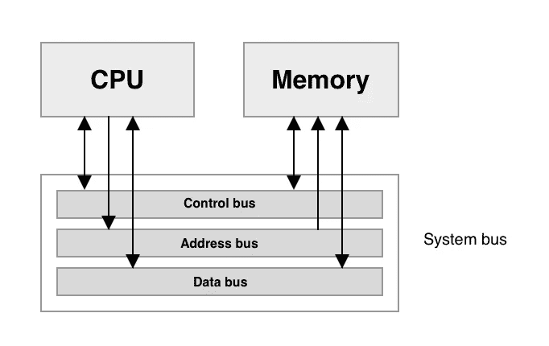
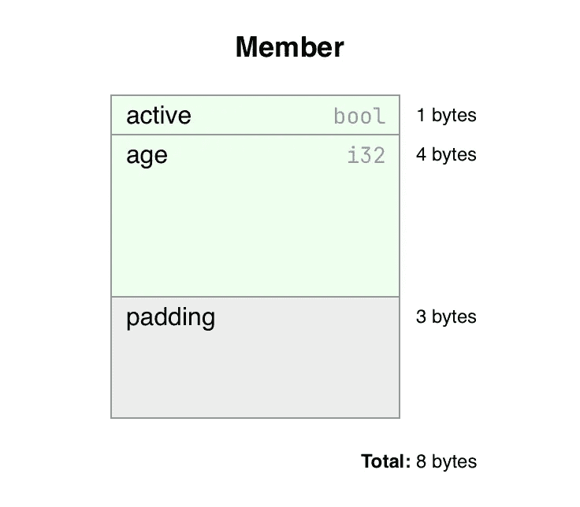
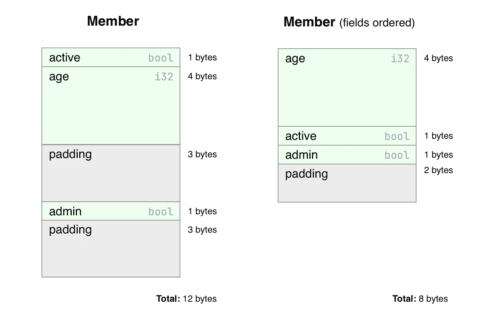

# 内存对齐

> 原文：<https://blog.devgenius.io/memory-alignment-8760a5dfc4dc?source=collection_archive---------3----------------------->

今天我们要谈谈记忆对齐。在我们深入探讨之前，让我们从 Rust 中的一个实际例子开始，来说明为什么这是相关的:

```
use std::mem;struct Member {
    active: bool,
    age: i32,
}fn main() {
    println!("bool: {} bytes", mem::size_of::<bool>());
    println!("i32: {} bytes", mem::size_of::<i32>());
    println!("Member: {} bytes", mem::size_of::<Member>());
}
```

我们定义了一个名为`Member`的结构，它包含两个字段。然后我们打印所有类型的内存大小。rust 中一个`bool`的大小是 1 个字节，32 位整数的大小是 4 个字节；因此，我们结构的总大小应该是 5 个字节，对吗？

```
➜ cargo run
    Finished dev [unoptimized + debuginfo] target(s) in 0.00s
     Running `target/debug/memory-alignment`
bool: 1 bytes
i32: 4 bytes
Member: 8 bytes
```

这是什么样的黑魔法...这多出来的三个字节从何而来？

# CPU 和内存

为了理解这是如何工作的，我们需要理解 CPU 是如何读取内存的。CPU 将它想要读取的内存地址发送到地址总线。然后，它在控制总线上向存储器发送“读取”命令，最后，存储器将向数据总线发送数据。



系统总线概述(不包括 I/O)

传输的数据量通常与一个字(处理器专用的单位)的大小相同。在大多数 64 位 CPU 上，字长等于 8 字节(=64 位)，而在大多数 32 位 CPU 上，字长为 4 字节(=32 位)。未对齐的内存通常会降低性能，因为需要更多的 CPU 指令。这就是内存对齐发挥作用的地方。

# 回到我们的代码

还记得我们的`Member`结构有 8 个字节的大小，而它的字段加起来只占 5 个字节吗？这是因为编译器会自动调整我们的内存。为此，它添加了三个额外字节的填充。



x86_64 上我们的结构的内存布局

填充量基于字段类型、结构大小和 CPU 属性(如单词大小)。

# 字段顺序

在 C、C++、Go 和其他可能的编程语言中，字段的顺序很重要，因为会使用额外的填充。然而，在 Rust 中，默认情况下，struct 字段将被重新排序，以获得尽可能小的大小。编译器被允许这样做，因为默认情况下，Rust [对 struct 类型不做任何保证](https://doc.rust-lang.org/reference/type-layout.html#the-default-representation)。

为了演示，我们可以使用 C 表示，它将使用与 C 语言互操作的类型布局。让我们向结构中添加另一个布尔字段:

```
use std::mem;#[repr(C)]
struct Member {
    active: bool,
    age: i32,
    admin: bool,
}fn main() {
    println!("Member: {} bytes", mem::size_of::<Member>());
}
```

`repr(C)`属性启用 C 表示。这样，字段就不会被重新排序。让我们执行它来看看结果:

```
➜ cargo run
   Compiling memory-alignment v0.1.0 
    Finished dev [unoptimized + debuginfo] target(s) in 0.53s
     Running `target/debug/memory-alignment`
Member: 12 bytes
```

我们现在可以通过手动重新排序字段来“优化”我们的`Member`结构。为了将内存大小恢复到 8 字节，我们必须将`age`字段移动到 struct:

```
use std::mem;#[repr(C)]
struct Member {
    age: i32,
    active: bool,
    admin: bool,
}fn main() {
    println!("Member: {} bytes", mem::size_of::<Member>());
}
```

为了验证这是否有预期的结果，我们需要再次执行我们的程序:

```
➜ cargo run
   Compiling memory-alignment v0.1.0 
    Finished dev [unoptimized + debuginfo] target(s) in 0.42s
     Running `target/debug/memory-alignment`
Member: 8 bytes
```

为了理解这是如何工作的，我们可以看看我们的`Member`结构在重新排序字段之前和之后的内存布局。



x86_64 上使用 C 表示的内存布局，包括排序字段和不排序字段

# 工具作业

如前所述，在使用 Rust 时，工具是不必要的，因为您很可能不需要手动重新排序字段。然而，当你使用 Go 时，你可以用 [golangci-lint](https://github.com/golangci/golangci-lint) 配置[字段对齐分析器](https://pkg.go.dev/golang.org/x/tools/go/analysis/passes/fieldalignment)来警告“未优化”的结构。

我不知道任何 C 或 C++的工具，所以如果你有任何建议，请告诉我。