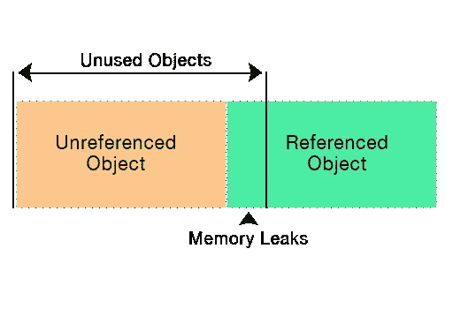

# Java 中的内存泄漏

> 原文：<https://blog.devgenius.io/memory-leaks-in-java-b92558fba65?source=collection_archive---------16----------------------->


在这个故事中，我们将看到什么是内存泄漏、垃圾收集器、Java 中的泄漏示例以及检测泄漏的工具。

Java 的一个关键好处是内存管理主要由 Java 虚拟机或者更具体的 Java 垃圾收集器(GC)来处理。Java 垃圾收集器负责堆上对象的分配和释放。

# 什么是内存泄漏

在计算机科学中，内存泄漏是指计算机程序通过不释放不需要的资源来错误地管理内存分配。在 Java 中，当应用程序不再使用某个对象，但垃圾收集器无法将它从工作内存(堆)中移除时，就会发生内存泄漏。从长远来看，积累物体而不能清除它们会导致`OutOfMemoryError`

# 为什么对象没有被垃圾收集

对象是否会从工作记忆中移除取决于对象的类型。有两种类型，被引用和未被引用。GC 会定期收集未被引用的对象，另一方面，GC 无法收集具有有效引用的对象。

为了更好的理解，请看下图。



此外，Java 中有四种类型的引用可以用来管理 GC 如何以及何时收集对象。

*   **强引用** —这是默认的对象引用。除非引用指向 null，否则无法收集具有强引用的对象。
*   **软引用** —使用`java.lang.ref.SoftReference`类引用的对象不会被收集，即使该对象对于 GC 是自由的。一旦 JVM 需要内存，就需要 GC 来清除所有的软引用。
*   **弱引用** —如果 JVM 检测到没有强引用或软引用链接到任何对象，使用`java.lang.ref.WeakReference`类引用的对象将被标记为 GC。
*   **幻象引用** —使用`java.lang.ref.PhantomReference`引用的对象不会被 GC 自动清理，需要手动清理。在其引用对象的`finalize`方法被执行后，虚引用被放入引用队列。

# 什么是垃圾收集器

垃圾收集器是一个 JVM 守护线程，它定期从堆内存中收集未引用的对象。当一个对象不再被引用时，它就有资格从堆内存中被逐出。堆内存分为三大区域:**年轻一代**(伊甸园空间、S0 幸存者空间和 S1 幸存者空间)**老一代**和**永久一代**。

垃圾收集器也有四种类型:**串行垃圾收集器、并行垃圾收集器**(默认 JVM GC) **、CMS 垃圾收集器和 G1 垃圾收集器。**

垃圾收集器之间的区别:

*   **串行垃圾收集器**是为单线程环境设计的，它使用单线程来收集对象。这个 GC 适用于命令行应用程序，并通过使用`-XX:+UseSerialGC` JVM 参数来启用。
*   **并行垃圾收集器**是默认的 JVM 垃圾收集器，与串行 GC 不同，并行 GC 使用多线程从工作内存中收集未被引用的对象。
*   **CMS 垃圾收集器**或并发标记清除垃圾收集器使用多线程来收集未引用的对象，它是为偏好缩短的 GC 暂停的应用程序而设计的。要启用 CMS 垃圾收集器，请使用`-XX:UseConcMarkSweepGC` JVM 参数。
*   **G1 垃圾收集器**用于大堆区。它使用技术将堆内存分成多个区域，并并行进行对象收集。要启用 G1 GC，请使用`-XX:+UseG1GC` JVM 参数。

# 内存泄漏的示例

为了更快地再现内存泄漏，例如，我将使用 JVM 参数`-Xmx125m`将堆大小降低到 125MB

内存泄漏最常见的情况之一是引用大量元素作为静态字段。让我们来看一个例子:

```
private static final List<String> *listOfStrings* = new ArrayList<>(100000);

public static void main(String[] args) {
    *fillStaticList*();

    try {
        Thread.*sleep*(100_000);
    } catch (InterruptedException e) {
        e.printStackTrace();
    }
}

private static void fillStaticList() {
    for (int i = 0; i < 100000; i++) {
        *listOfStrings*.add("Some large text + " + i);
    }
}
```


在 JVM 进程生存期内，静态收集永远不会被 GC 收集。现在，我将在示例中声明 heavy collection 作为局部变量:

```
public static void main(String[] args) {
    *fillLocalList*();

    try {
        Thread.*sleep*(100_000);
    } catch (InterruptedException e) {
        e.printStackTrace();
    }
}

private static void fillLocalList() {
    List<String> listOfStrings = new ArrayList<>(100000);
    for (int i = 0; i < 100000; i++) {
        listOfStrings.add("Some large text + " + i);
    }
}
```


正如您可以从分析器中注意到的，一旦方法执行完毕，集合就会被 GC 移除。

## Java 分析器

Java Profiler 是一个在 JVM 级别监控操作的工具。有许多可用的 Java Profilers，其中一些最流行的是 YourKit、JProfiler 和 VisualVM。