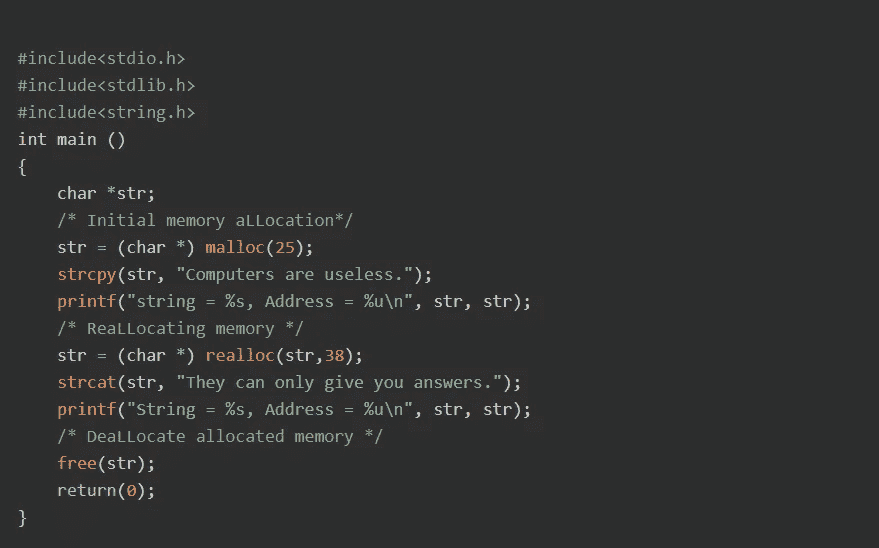
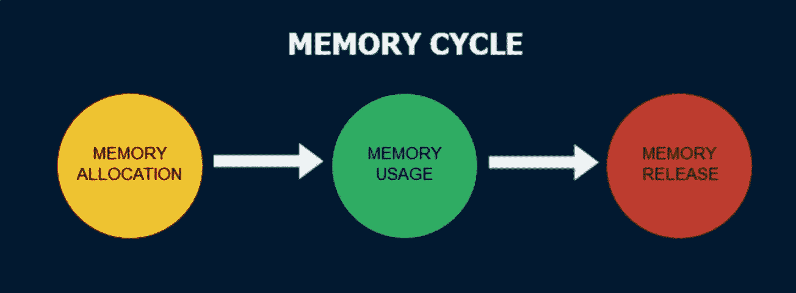
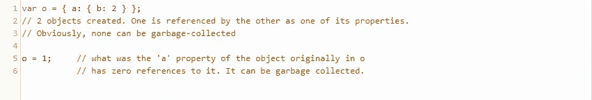
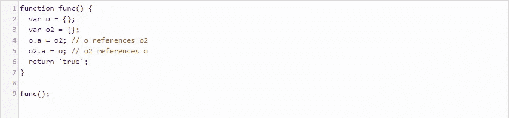

# 内存管理和垃圾收集

> 原文：<https://blog.devgenius.io/memory-management-and-garbage-collection-3b9660ccf7ba?source=collection_archive---------7----------------------->

## JavaScript 如何将复杂的内存管理变得神奇

由 [Unsplash](https://unsplash.com?utm_source=medium&utm_medium=referral) 上的 [L O R A](https://unsplash.com/@loravisuals?utm_source=medium&utm_medium=referral) 拍摄的照片

在像 C 和 C++这样的编程语言中，有两种类型的内存分配:静态和动态。静态内存分配是在我们创建一个固定大小的全局或局部变量时发生的。程序启动时分配一次，直到应用程序结束执行才释放。C 和 C++中的例子包括类型化变量和数组。另一种是动态内存分配。我们可以使用 malloc()创建任何大小的“对象”，并且它们包含的字节数可以在运行时使用 realloc()来更改。我们可以使用 free()手动释放这样分配的内存。

C 语言中动态内存分配的一个例子

这些事情会造成不可预见的内存泄漏和复杂性，比如需要知道变量(静态)和指针(动态)之间的区别，或者数组(固定长度)和链表(大小可以动态变化)之间的区别。人们使用 C 和 C++已经有很长一段时间了，这些语言可能不会很快消失，但幸运的是，今天许多语言从程序员那里抽象出了这些概念。

Java、C#、JavaScript 和 Ruby 等语言使用一种称为垃圾收集的系统，将所有这些东西从程序员那里抽象出来。JS 中的收集器使用了一些方法。尽管如此，基本思想还是被称为内存周期:我们分配内存，程序使用内存，然后当不再需要内存时，垃圾收集器释放内存。

内存生命周期

当变量、对象或函数被创建时，JavaScript 自动分配内存。垃圾收集器寻找一个好的理由在运行时释放这些内存，有一些算法可以帮助实现这个目标。

# 引用计数垃圾收集

引用计数垃圾收集是最简单的垃圾收集方法。它检查的不是某个对象是否仍然需要，而是其他变量或对象是否包含对它的引用。如果对该项目的引用数为零，则该项被确定为“垃圾”并被收集。

示例 1

然而，这种方法有其局限性。如果我们在一个函数的作用域中创建两个变量，并将其中一个属性设置为与另一个对象相同。当我们调用这个函数时，程序为这两个对象分配内存。尽管如此，由于它们是循环引用的，即它们相互引用，所以使用引用计数算法的垃圾收集器不会将这些对象标记为垃圾，因为它们仍然有引用，即使程序离开了函数的作用域！我们现在有一个问题，如果我们调用这样的函数很多次，这是一个巨大的内存泄漏！

示例 2 —循环引用

# 标记-扫描算法

第二种更聪明的算法被称为标记-清除算法。一旦变量不可达，标记和清除将释放内存，而不是天真地计算对对象或变量的简单引用，就像我们的第二个循环引用变量的情况一样。顾名思义，这是一个两遍算法，首先将对象标记为删除，然后在第二遍中“清除”内存。

这里的核心概念是*可达性。*根据定义，有一组变量是可到达的，并且垃圾收集不会删除它们:根变量。这些变量包括当前函数的局部变量/参数、现有函数调用链中其他函数的变量/参数以及全局变量。如果一个非根变量被任何一个根变量引用，那么它就是可达的。这样，一旦变量超出范围，它就不再是根变量，并被标记为垃圾收集。

总之，尽管我们无法控制在高级语言中如何以及何时分配/释放内存，但垃圾收集的魔力让程序员少了一件担心的事情，即使只是以一种次要的方式。

## 来源:

 [## JavaScript 中的内存管理和垃圾收集— DZone Web Dev

### JavaScript 中的内存管理和垃圾收集是一个有点陌生的话题，因为在 JavaScript 中我们不…

dzone.com](https://dzone.com/articles/memory-management-and-garbage-collection-in-javasc)  [## 碎片帐集

### JavaScript 中的内存管理是自动执行的，对我们来说是不可见的。我们创造基本元素，物体…

javascript.info](https://javascript.info/garbage-collection)  [## 内存管理

### 像 C 这样的低级语言有手工内存管理原语，比如 malloc()和 free()。相比之下…

developer.mozilla.org](https://developer.mozilla.org/en-US/docs/Web/JavaScript/Memory_Management)