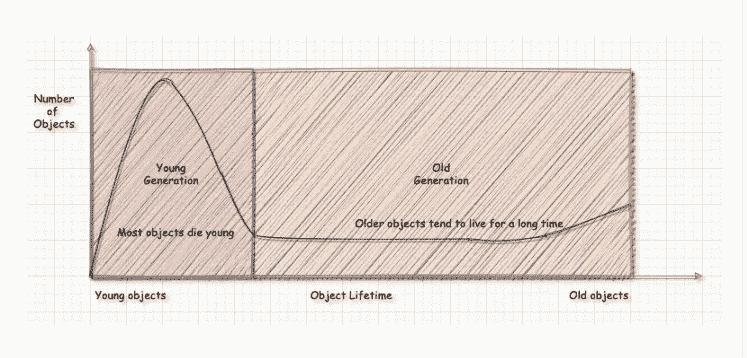

# Java 中的内存管理和垃圾收集

> 原文：<https://blog.devgenius.io/memory-management-and-garbage-collection-in-java-44074d9c0e6d?source=collection_archive---------3----------------------->

# Java 如何工作 works(一次编写，随处运行)

在 Java 中，源代码包含在。java 文件被编译成字节码或扩展名为. class 的文件，然后从字节码转换成机器码。字节码是代码的中间表示。然后，这些代码被传递给 JVM，JVM 将字节码转换成机器码。因此，在一种架构上生成的字节码可以在另一种架构上运行。JVM 及其组件是特定于机器的，因此它能够为 Java 提供独立于平台的特性，这与 C++等语言相反，在 c++等语言中，可执行文件或机器代码是直接从。c++文件。


# 存储器分配

在 Java 中，有原始数据类型和引用类型。
有 8 种原始数据类型，即:

```
boolean
char
short
byte
int
long
float
double
```

引用类型变量存储对象的地址或位置。Java 基于面向对象的范例，因此广泛使用类和对象，尽管也支持过程化范例。与原语相比，对象在内存中的存储方式是不同的。

这是一个示例类`Person`

```
public class Person {
    private int age;
    private String name;

    Person(int age, String name){
        this.age = age;
        this.name = name;
    }

    void getDetails(){
        System.*out*.println(this.name + " is " + this.age + " years old ");
    }

    public static void main(String[] args){
        int primitiveOne = 1;
        float primitiveTwo = 2.0F;

        Person person = new Person(20, "sam");
        person.getDetails();

        int[] ages = {1, 2, 3, 4}; }
}
```


内存分配表示

# 碎片帐集

在 JVM 中，垃圾收集进程总是作为守护线程运行。它是一个总是在后台运行的低优先级进程。堆包含对象，而栈包含对象名/引用。原语存储在堆栈中，并根据 LIFO 机制清除。垃圾收集负责自动管理内存，它在堆中运行。没有像 C++中那样显式的内存分配和释放(使用 malloc，free)。当一个对象没有引用或者没有指向它的东西时，它就变得无用。本质上，当一个对象不可达时，它可以被移除或者释放内存。

垃圾收集或 GC 的主要步骤包括:

> 标记

这是使用类似图形的数据结构在内部实现的。可到达的对象被识别和标记。

> 删除

无法访问或不再引用的对象将被删除

> 压紧

已经被释放的内存将被组装在一起，以避免外部碎片，这种情况下，有足够的内存完全分配给一个对象，但它不在一起)

这是堆内存的结构


将堆分成年轻和年老的世代

由于垃圾收集是一个开销很大的过程，它有两种运行方式:

*   次要垃圾收集
*   主要垃圾收集

新创建的对象存储在伊甸区，**一旦伊甸区接近满**，**小 GC 运行**，不可达的对象仅从**伊甸区中移除**，而存活下来的对象移动到存活区。有 2 个幸存区域来启用压缩，创建的对象尽可能保持紧凑。一旦对象在年轻一代区域中存活超过阈值数量的垃圾收集周期，它们就移动到老一代

这里使用了**世代假设**的思想，也就是说，如果对象的寿命超过了垃圾收集周期的阈值数，那么它们将停留更长时间，因此驻留在更老的世代中。换句话说，大多数物体在年轻的时候就死去了，但是那些幸存下来的，在记忆中存在了很长时间



图片来源:[http://abiasforaction . net/understanding-JVM-garbage-collection-part-3/](http://abiasforaction.net/understanding-jvm-garbage-collection-part-3/)

因此，年轻区域中的垃圾收集比老区域中的垃圾收集更频繁。

当旧区域快满时，**主 GC 运行。**这个在整个堆内存上运行，释放未被引用的对象。

资源链接:

*   [https://www . Java point . com/difference-between-JDK-JRE-and-JVM](https://www.javatpoint.com/difference-between-jdk-jre-and-jvm)
*   [https://www . Java point . com/difference-between-JDK-JRE-and-JVM](https://www.javatpoint.com/difference-between-jdk-jre-and-jvm)
*   [ttps://www . YouTube . com/watch？v = unanqgzw 4 zyh](https://www.youtube.com/watch?v=UnaNQgzw4zY)(Java 中的垃圾收集)
*   [https://www . tutorialspoint . com/difference-between-internal-fragmentation-and-external-fragmentation](https://www.tutorialspoint.com/difference-between-internal-fragmentation-and-external-fragmentation)
*   [https://www.youtube.com/watch?v=ZhbIReLe-r8](https://www.youtube.com/watch?v=ZhbIReLe-r8)
*   [https://www.ibm.com/cloud/blog/jvm-vs-jre-vs-jdk](https://www.ibm.com/cloud/blog/jvm-vs-jre-vs-jdk)
*   [https://www.youtube.com/watch?v=LTnp79Ke8FI](https://www.youtube.com/watch?v=LTnp79Ke8FI)
*   [https://www.youtube.com/watch?v=UDZX4UGj9_Y](https://www.youtube.com/watch?v=UDZX4UGj9_Y)