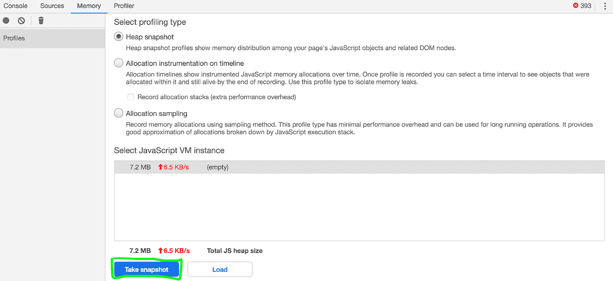
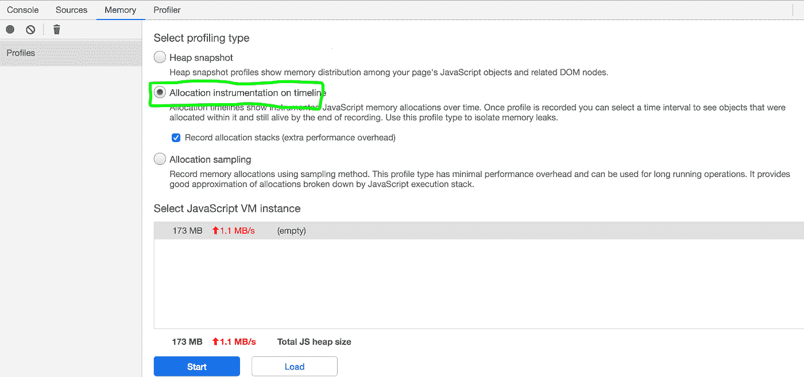
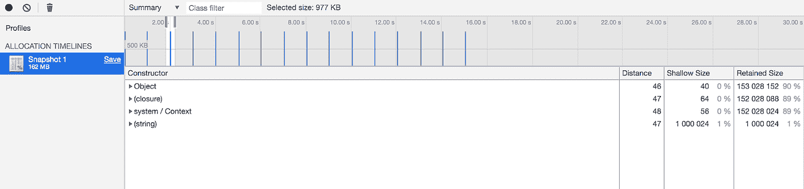

# 在 JavaScript 应用程序中寻找内存泄漏

> 原文：<https://blog.devgenius.io/memory-management-and-hunting-leakage-in-javascript-47fca2527ddf?source=collection_archive---------1----------------------->


弓箭手阿拉什(来源: [Unsplash](https://unsplash.com/@alirzasahb)

# **垃圾收集**

它是程序通过回收程序中不再使用的对象所占用的内存来执行自动内存管理的过程。一个对象在创建时使用的内存会一直保持分配状态，直到有对该对象的引用为止。当这些对象被认为不再使用时，释放内存的自动完成就发生了，这就是垃圾收集，简单地说，就是销毁未使用的对象。

另一方面，**手动内存管理**是指程序员明确使用指令来释放内存。在 C 编程中，开发人员需要使用 malloc()和 deallocate()函数来处理内存分配和释放。在 JavaScript 中，由于没有接口暴露给内存管理，所以所有的内存管理都交给了用户。就是**垃圾收集**。

# **节点中的存储方案**

NodeJs 中的内存管理是通过[**V8**](https://v8.dev/)**:**' Google 的开源高性能 JavaScript 和 WebAssembly 引擎 *'* 。分配给程序执行的总内存是**常驻集**。这又分为以下几个部分:


图 V8 中的存储方案

## **代号**

正在执行的实际代码。

## **堆栈**

静态数据包括方法、原始值、定义程序控制流的指针和指向堆中对象的指针都存储在这里。

## **堆**

V8 存储对象或动态数据的内存段。堆是最大的内存块，专门用于存储引用类型，如对象、字符串和闭包，在这里进行垃圾收集。堆有两个主要部分:

*   **新空间:**新空间的大小约为 1-8MB，驻留在此的对象称为**新一代**。
*   **旧空间:**经历了两次清除收集的对象现在从新空间转移到旧空间，称为**老代**。在分配了某些旧空间内存后，会发生昂贵的垃圾收集(标记-清除和标记-压缩)。

为了获得程序中内存使用的基本信息，让我们在 NodeJs 程序中执行下面的代码并观察输出。

```
**process.memoryUsage();**// Output (in bytes){

 rss: 365801472, heapTotal: 94416896, heapUsed: 79383696, external: 351234}
```

# **内存泄漏的来源**

内存泄漏是指程序不需要的内存没有返回到操作系统或空闲内存池的情况。

## **1。关闭**

让我们考虑下面的内存泄漏**流星开发商**成立。

```
var theThing = null;const replaceThing = function () {
  var originalThing = theThing;

  var unused = function () {
    if (originalThing)
      console.log("hi");
  };

  theThing = {
    longStr: new Array(1000000).join('*'),
    someMethod: function () {
      console.log(someMessage);
    }
  };};setInterval(replaceThing, 1000);
```

## **解说**

在 JavaScript 中，[闭包](https://developer.mozilla.org/en-US/docs/Web/JavaScript/Closures)允许您从内部函数访问外部函数的范围。内部函数可以访问外部函数的变量和参数。在上面的例子中，在 ***replaceThing*** 中定义的函数，即函数 ***someMethod*** 和函数 ***unused*** 共享同一个父作用域。

变量 ***原值*** 仅从函数 ***中引用，未使用*** 。执行 ***replaceThing*** 时，函数 ***未使用的*** 本身被清理。但是，第二个闭包 ***someMethod*** 不会被清理，因为它可以从全局范围内的**thing**中被引用。我们可以看到 ***someMethod*** 根本不引用 **originalThing** 但是，***original thing***仍然没有被垃圾收集。为什么？嗯，实现闭包的典型方式是每个函数对象都有一个到表示其词法范围的字典式对象的链接。

一旦一个变量被任何闭包*使用，它就会出现在该范围内所有*闭包共享的词法环境中。由于 ***somemethod*** 与*共享闭包范围，引用*必须将 ***改为*** 强制其保持活动状态。这阻止了它的收集。****

## **2。意外全局变量**

JavaScript 中未声明的变量会在全局对象中创建新的变量。

```
function foo(arg) {
    bar = "this is hidden global variable";
}// is equivalent to:function foo(arg) {
    window.bar = "this is explicit global variable";
}
```

在浏览器的情况下，全局对象是“**窗口”。在 NodeJs 中，根节点通常是对象“**全局**或“**流程**”。变量 **bar** 永远不能被收集，因为它是在全局作用域中定义的，会导致内存泄漏。**

## **3。忘记回调或定时器**

```
var someResource = getData();setInterval(function() {
  var node = document.getElementById('domode');

  if(node) {
    node.innerHTML = JSON.stringify(someResource));
  }
}, 1000);
```

如果**节点**变量未被使用，区间处理程序中的整个块就变得不必要了。无法收集处理程序，因为间隔处于活动状态并会导致内存泄漏。

## **4。超出 DOM 引用范围**

```
var elements = {
  button: document.getElementById('button'),
  image: document.getElementById('image'),
  text:document.getElementById('text')
};function doStuff() {     
  image.src = 'http://some.url/image';     
  button.click();     
} function removeButton() {
  // The button is a direct child of body.
  document.body.removeChild(document.getElementById('button')); // still have reference to button in global elements dictionary
  // cannot be garbage collected
}
```

## **解说**

button 元素仍在字典中，并且由于对 button 的引用而无法通过垃圾回收来回收。

让我们考虑一个场景:一个 HTML 由许多和

| 组成，从 DOM 中移除表格但保留对单元格的 | 引用，GC 不会收集所有内容。事实上，该表仍然保留在内存中。 | 保持对表的引用，不能被垃圾收集。换句话说，javascript 代码对表格单元格的引用允许表格保留在内存中。 |

## **5。旧浏览器和漏洞百出的扩展**

旧浏览器(IE6–7)因造成内存泄漏而臭名昭著，因为它不能处理 DOM 对象和 JavaScript 对象之间的循环引用。有时，错误的浏览器扩展可能会导致内存泄漏。

## **6。** **事件监听器&缓存**

当 DOM 元素及其对应的事件侦听器没有相同的生命周期时，可能会导致内存泄漏。无限增长的缓存会导致高内存消耗，并导致内存泄漏。

# **垃圾收集机制**

垃圾收集分两个阶段进行:

## **1。扫气**

新空间中的内存分配是廉价的。当我们需要新空间中的空间时，分配指针增加。当这个分配指针超过某个限制时，清除算法被触发，快速移除死对象。

## **2。标记、扫描和压缩阶段**

旧空间的大小可能超过数百兆字节，标记-清除和标记-压缩在该空间上运行的频率会降低。程序和旧空间大小的行为改变了这种垃圾收集。简单地说，对象被标记为“活的”或“死的”，删除“死的”对象，然后压缩内存以进行优化。

*   **标记阶段** : V8 使用三种标记方案，分别是**白色(**未发现的物体)、**灰色**(发现了物体，但其邻居未被发现)、以及**黑色(**物体及其所有邻居被发现)。
*   **扫描阶段:**释放**白色**(“死”)对象的内存。
*   **压缩阶段**:内存组织在此阶段进行，以实现更快的内存访问，将对象从碎片页面迁移到内存区域的开头。

传统的垃圾收集实现了**Stop World**垃圾收集，在垃圾收集过程中程序会暂停。

# **or Nico——V8 发动机中的垃圾收集器**

它部署并行、增量和并发机制来释放主线程。


图 V8 垃圾收集器— Ornico

## **平行**

尽管如此，Stop-the-world 机制引入了助手线程，它们在同一时间完成大致等量的工作。总暂停时间除以引入的线程数(加上一些同步时间)。

## **并发**

主线程完全自由地执行 Javascript，辅助线程在后台进行垃圾收集。

## **惰性/增量**

这是在一系列增量暂停中进行的，其中所需的总工作的一小部分是立即进行的。花费在主线程上的总时间并没有减少，但是，它会随着时间的推移而增加。

# **狩猎内存泄漏**

## **1。使用节点检查器**

让我们以检查模式开始我们的应用程序:

```
node --inpsect=9229 index.js 
```

在 Chrome 浏览器上打开:

```
chrome://inspect
```


图通过浏览器检查

点击**检查后，**专用开发工具打开如下。在内存- >配置文件下，点击**拍摄快照。**可以在**汇总**、**比较**、**遏制**、&、**支配者**模式下查看输出。



图获取堆快照

## **汇总视图**

这个视图对于追踪 DOM 泄漏特别有帮助。当元素已经从 DOM 中移除，但由于 Javascript 中的引用而保留了它们的内存时，会导致 DOM 泄漏。有关源代码，请参考此处的。

*   **构造函数**表示使用该构造函数创建的所有对象。
*   **Shallow size** 是对象本身所拥有的内存大小。
*   **Retained size** 是对象及其相关对象被删除后释放的内存大小。
*   **距离**使用节点的最短简单路径显示到根的距离。


图摘要视图

## **对比视图**

它用于记录和比较两个(或多个)内存快照，并执行比较。释放内存和引用计数中的增量的存在使您可以确认内存泄漏的存在和原因，这可以进一步深入。


图不同快照的堆比较

## **堆比较的细节**


图堆比较详细信息

## **安全壳视图**

它提供了一个更好的对象结构视图，允许我们深入到一个较低的层次。

## **支配者视图**

这个视图有助于确认没有对对象的意外引用仍然存在(即它们被很好地包含)，并且删除/垃圾收集实际上正在工作。

## **2。使用堆转储模块并加载**

或者，heapdump 模块允许获取堆快照。

```
const heapDump = require('heapdump');function writeSnapShot() {
  heapDump.writeSnapshot(function (err, filename) {
   console.log('dump written to', filename);
 });
}; module.exports = writeSnapShot;
```


图加载堆快照

在 Chrome 浏览器中加载快照文件，并像以前一样继续进行分析。

## 3.分配抽样/时间表

可以通过分配分析来查看时间序列上的分配。选择“时间线上的分配工具”。



图选择分配采样模式



图分配抽样详细信息

蓝色条显示代表新的内存分配，这是您的**内存泄漏**的潜在候选。单击蓝线以查看当时发生的分配分析的详细信息。

## **4。时间线视图**

对于 UI 跟踪，时间轴视图可能会有所帮助。在 Chrome Dev Tools 中:选择**性能** → **启用内存复选框** → **进行录制**。

提示:通过单击收集垃圾按钮，从强制垃圾收集后开始记录。


图时间轴视图


图放大的时间轴视图

蓝线表示 JavaScript 堆内存，还指定了程序在采样周期内消耗的范围。当单击蓝色虚线部分(内存使用情况)时，会显示主要 GC 和次要 GC。我们可以看到，次要 GC 比主要 GC 出现得更频繁。

绿线表示文档中 HTML 节点的数量。程序中增加的 HTML 节点表明未被引用的 DOM 节点可能无法被 GC 收集，从而导致内存泄漏。

## **5。命令行选项**

Node 提供了不同的命令行选项来更深入地研究垃圾收集。考虑以下命令行:

```
node --expose-gc --trace-gc index.js
```

*   **trace-gc** :显示每次垃圾收集后的跟踪行。
*   **expose-gc** :启用调用 global.gc()强制节点运行垃圾回收。

更多命令行文本请参考[这里的](https://gist.github.com/listochkin/10973974)。

## 6。云服务和 NPM 包

像 GCP ( [Cloud Profiler](https://cloud.google.com/profiler) )这样的云服务提供了关于 JavaScript 堆细节的信息。不同的 npm 包可用于跟踪垃圾收集。

## **参考文献**

1.  [https://auth 0 . com/blog/four-types-of-leaks-in-your-JavaScript-code-and-how-to-get-off-them/](https://auth0.com/blog/four-types-of-leaks-in-your-javascript-code-and-how-to-get-rid-of-them/)
2.  [https://developers . Google . com/web/tools/chrome-dev tools/memory-problems](https://developers.google.com/web/tools/chrome-devtools/memory-problems)
3.  [https://auth 0 . com/blog/four-types-of-leaks-in-your-JavaScript-code-and-how-to-get-off-them/](https://www.lambdatest.com/blog/eradicating-memory-leaks-in-javascript/)
4.  [https://blog . rising stack . com/node-js-at-scale-node-js-garbage-collection/](https://blog.risingstack.com/node-js-at-scale-node-js-garbage-collection/)
5.  [https://developer . Mozilla . org/en-US/docs/Web/JavaScript/Memory _ Management](https://developer.mozilla.org/en-US/docs/Web/JavaScript/Memory_Management)