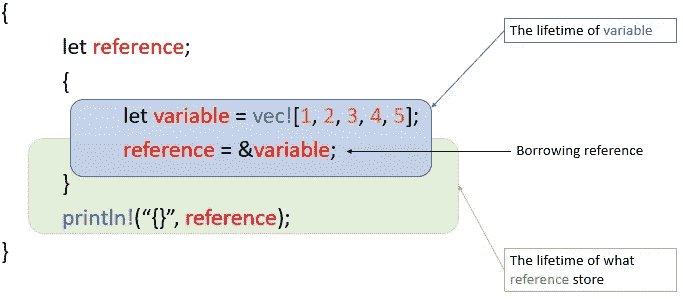
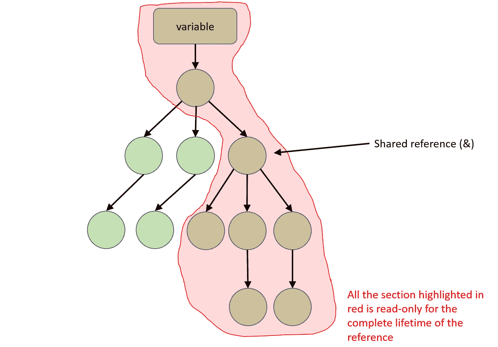
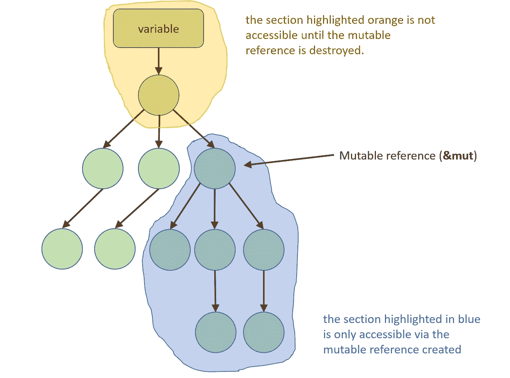

# Rust 中的内存管理-第 2 部分:引用借用

> 原文：<https://blog.devgenius.io/memory-management-in-rust-part-2-reference-borrowing-52f6654419e?source=collection_archive---------10----------------------->

在我之前的文章[Rust 中的内存管理——第 1 部分:所有权和移动](https://anismousse.medium.com/ownership-and-moves-in-rust-4a9c6f02108d)中，我们轻松地理解了 Rust 中的内存管理方式。

我们发现了**所有权**和**移动**的概念，可以用下面这句话来概括:

> ***每个值都有一个唯一的所有者，这个所有者决定了它的寿命。***

在这篇文章的第二部分，我们将介绍**引用**和**引用借用**的概念；我们就要到达终点了…所以请坚持住🦾.

# 什么是参考？

引用是一个指针， ***不拥有它所指向的*** 值；它是一个内存地址，它所指向的值就是在这个地址上表示的。

使用**与符号** `**&**`创建引用，使用**星号(*)** 进行解引用(访问其引用的值)。

假设我们有`let variable = 1;`，有`let reference = &variable;`，`reference`是指向`value`的引用，`*reference`相当于`1`是在`variable`内排序的值。

Rust 中的引用

引用不能比它所引用的值更长寿，这就引入了**借用**的概念。

引用**从它的所有者那里借用**它们所指向的值，并最终将它返回。

你可能已经意识到了**引用借用**概念给**所有权**和**移动**概念引入了一些灵活性(在这里复习那些概念[)。](https://anismousse.medium.com/ownership-and-moves-in-rust-4a9c6f02108d)

在下面的例子中，我们打印变量`missy_favorite_humans,`中的所有值，然后打印它的大小。这是不可能的，因为`missy_favorite_humans`将其值的所有权传递给了`for`循环，因此当我们试图对变量`missy_favorite_humans`调用`len()`方法时，变量`missy_favorite_humans`是未定义的。

Rust 编译器拒绝的示例

现在让我们在同一个示例中引入一个引用:

参考借阅示例

在这个例子中，`for`循环是在对`missy_favorite_humans`的引用上完成的。`for`循环可以通过`&missy_favorite_humans`访问借用值并打印出来。在循环的最后，`&missy_favorite_humans`正在脱离范围，而`missy_favorite_humans`仍然拥有其项目的所有权。因此，可以处理第 10 行上的指令。

但是 Rust 是如何确保一个引用不能比它所引用的值更长寿的呢？救援来了: ***生生世世*** 。

# 一生

正如在 [Rust by Examples](https://doc.rust-lang.org/rust-by-example/scope/lifetime.html) 中提到的，一个**生存期**是编译器(借位检查器)用来确保所有借位有效的一个构造。换句话说，生命周期是代码的一部分，其中变量或引用可以安全地使用。

为了满足 ***引用不能比它所引用的*** 的值更长寿的规则，编译器检查引用**的生存期是否必须包含在它所引用的变量的生存期内**。(在这里暂停一下，再读一遍🧐).

下面的代码示例**被编译器拒绝**，因为变量`reference`(一个借用引用)的生存期不包含在`variable`的生存期内；它引用的值。

不合规的参考文献借用示例

让我们看一个稍加修改的类似例子:

符合规范的参考文献借阅示例

正如你在这里看到的，引用借用是可能的，因为生命周期规则得到了尊重。

当在函数签名、结构、枚举、`impl`块中使用引用时，我们需要精确它们的生存期。在某些情况下，Rust 编译器会自动推断生存期，并允许我们省略它( [Lifetime Elision](https://doc.rust-lang.org/nomicon/lifetime-elision.html) )。

寿命用撇号`'`表示。按照惯例，小写字母用于命名。以下是一些例子:

具有生存期的函数、结构和枚举的示例

`'static`寿命注释是**保留的**寿命注释。这些**参考对整个程序**有效。它们保存在二进制文件的数据段中，引用的数据永远不会超出范围。

***需要注意的是，Rust 没有空引用。***

# 不同类型的参考

引用有两种类型，**共享引用**和**可变引用**。让我们逐一探究。

## 共享参考

共享引用允许您读取它们所引用的值，但不允许您更改它们。您可以同时拥有对同一值的多个引用。

当存在共享引用时，无论是它所引用的项目还是通过该项目的任何其他内容都不能被任何内容更改。**所有权树**中所有涉及共享引用的部分**都是不可更改的。**

借用共享引用时的可访问性

## 可变引用

可变引用允许您读取和修改它所引用的值。关键字:`&mut`允许你创建一个可变的引用。

可变引用是**排他的**，这意味着当一个值上有一个可变引用时，除了现有可变引用上的可变引用之外，我们不能同时拥有该值上任何类型的任何其他引用。

借用可变引用时的可访问性

共享引用和可变引用的区别可以用下面的规则来概括: ***一个值可以有多个读取者(共享引用)或者一个写入者(可变引用)*** 。

## 最后

在对内存管理的概述中，我们看到为了实现其三连胜愿望的**安全**支柱，Rust 对**所有权有一个限制性的规则**。由于**移动**概念、**引用**、**引用借用**以及所有促进我们与记忆互动的规则，这个规则的一些灵活性是可能的。

> Rust 的美妙之处在于那些在编译时强制执行的严格规则，这些规则迫使我们从一开始就拥有一个深思熟虑的、架构正确的、安全的程序。

在 Rust，所有的支票都是预先兑现的！！！

米西等着我销毁门上的可变引用

# 资源

[所有权](https://doc.rust-lang.org/book/ch04-01-what-is-ownership.html?highlight=ownership#what-is-ownership)章出自‘T**何锈编程语言**’。

[编程生锈，第二版](https://www.oreilly.com/library/view/programming-rust-2nd/9781492052586/)

[锈由例](https://doc.rust-lang.org/rust-by-example/index.html)