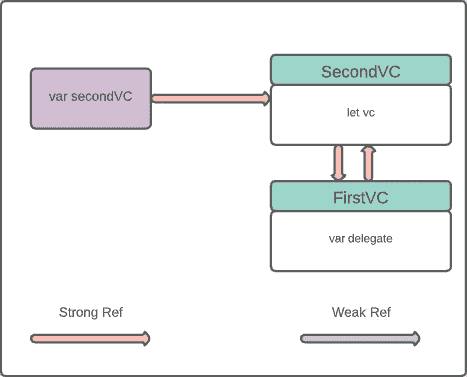
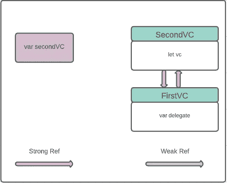
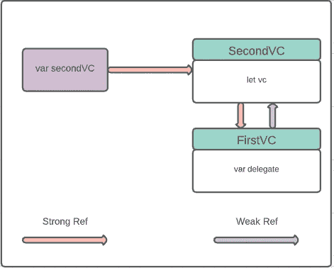
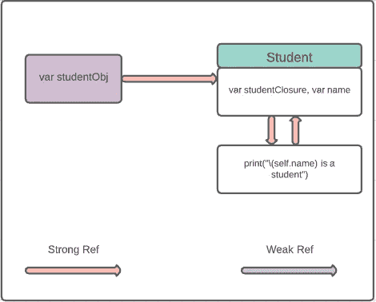
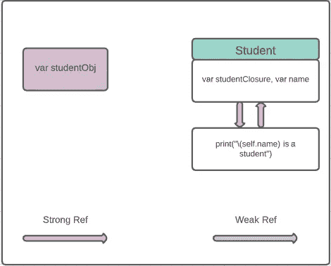

# swift 中的内存管理(第二部分)

> 原文：<https://blog.devgenius.io/memory-management-in-swift-part-02-b5b5f9fbb12b?source=collection_archive---------3----------------------->

描述如何在 Swift 中使用自动引用计数来管理应用程序内存。


乔纳斯·斯维德拉斯通过 [Unsplash](https://unsplash.com/) 拍摄的照片

# 概观

在 iOS 开发中，ARC(自动引用计数)用来管理 app 内存。它跟踪初始化的引用、代码之间的关系，并在不再需要实例时自动释放它们。但有时清理过程会因某些原因而中断。在本教程中，我们将了解在委托和闭包的情况下，ARC 何时无法释放内存以及如何解决它。如果你想学习内存管理的基础知识，可以看看我的内存管理教程的第一部分[这里](https://levelup.gitconnected.com/arc-memory-management-in-swift-165fd0329f16)。

> *本教程使用* ***Swift 5，Xcode 12.4 编写。***

# 委托保留周期

我们经常使用委托在视图之间发送数据。假设我们使用委托在 **FirstVC** 和 **SecondVC** 之间传递数据。

这就是为什么我们声明一个名为 **SendDataDelegate** 的协议，并通过它连接 **FirstVC** 和 **SecondVC** 。

```
protocol SendDataDelegate {}class FirstVC{
    var delegate: SendDataDelegate? deinit{
        print("Delegate ref removed from FirstVC")
    }
}class SecondVC: SendDataDelegate {
    let vc = FirstVC()    

    init() { 
        vc.delegate = self
    } deinit{
        print("Delegate ref removed from SecondVC")
    }
}var secondVC: SecondVC? = SecondVC()
```

我们通过创建 **SecondVC** 的引用来触发 VC 之间的连接。我们在每个类中都编写了 deinit 方法来指示 ARC 何时释放内存。

在这个阶段， **FirstVC** 和 **SecondVC** 相互之间有很强的引用关系。



我们期望如果我们设置**变量 secondVC: SecondVC？随着 **nil** 的出现，ARC 有望通过移除未使用的引用来完成清理过程。但是等等，不是的。在您的代码中尝试一下，并检查控制台输出，实际上没有调用 deinit 方法。**

就像我之前说的，将对象值设置为 nil 只是移除了引用，而没有销毁对象，如下所示。



你所要做的就是让委托引用变弱。它将创建从 **FirstVC** 到 **SecondVC** 的弱引用，从而解决了内存保留周期问题。



进行更改，运行您的代码并检查您的控制台。ARC 能够如你所愿清理你的记忆。

```
protocol SendDataDelegate: class {}class FirstVC{
    weak var delegate: SendDataDelegate? deinit{
        print("Delegate ref removed from FirstVC")
    }
}class SecondVC: SendDataDelegate {
    let vc = FirstVC()    

    init() { 
        vc.delegate = self
    } deinit{
        print("Delegate ref removed from SecondVC")
    }
}var secondVC: SecondVC? = SecondVC()
secondVC = nil**Console Output:** Delegate ref removed from SecondVC
Delegate ref removed from FirstVC
```

# 闭合保持周期

假设我们有一个名为 **Student** 的 swift 类，它有两个属性 **studentClosure** 和 **name** 。**学生**类有一个**学生闭包**的引用，因为它是该类的一个属性。

通过创建一个**学生**的对象，我们也创建了一个从闭包到**学生**类的引用。

```
class Student {
var studentClosure: (() -> ())?
var name: String = "Amit" init() {
        studentClosure = {
        print("\(self.name) is a student")
    }
  } deinit{
        print("Student gone")
    }
}var studentObj: Student? = Student()
studentObj?.studentClosure!()
```

在这个场景中， **Student** class 和 **studentClosure** 彼此都有一个反过来的强关系。



现在，如果我们将 studentObj 的值设置为 0，我们希望 ARC 通过中断所有关系来为我们释放内存。但不幸的是，设置 nil 不能打破**学生**类和闭包之间的保持循环。



我们可以通过使用如下的**弱**关键字来解决内存泄漏。

```
init() {
    studentClosure = { [weak self] in
        guard let obj = self else {
        return
    } print("\(obj.name) the Developer")
  }
}
```

捕获**弱**内闭合成为可选类型。**弱**引用可以允许将引用对象设置为 nil。现在 ARC 可以像我们预期的那样释放我们的内存，并将调用 deinit()方法。

将 **studentObj** 的值设置为**零**并检查您的控制台。

```
import UIKit
class Student {
    var studentClosure: (() -> ())?
    var name: String = "Amit"

    init() {
        studentClosure = { [weak self] in
            guard let obj = self else {
                return
            }

            print("\(obj.name) the Developer")
        }
    }

    deinit{
        print("Student gone")
    }
}var studentObj: Student? = Student()
studentObj?.studentClosure!()
studentObj = nil**Console Output:**Amit the Developer
Student gone
```

你也可以在闭包内捕获自己作为**无主**，但是在使用它之前要确保你知道。

```
init() {
    bobClosure = { [unowned self] in
      print("\(self.name) the Developer")
    }
  }
```

我想现在您已经对使用 Swift 编程语言进行内存管理有了一些了解。您可以在 Swift 的官方文档中找到对它们的简短讨论。

如果你觉得这篇文章有用，请分享并鼓掌👏👏👏
在[媒体](https://medium.com/@arifulislam14)上查看我的其他文章，在 [LinkedIn](https://www.linkedin.com/in/arifparvez14/) 上给我连线。

感谢您阅读&快乐编码🙂