# 内存管理第 1 部分:区域、类型和泄漏

> 原文：<https://blog.devgenius.io/memory-management-part-1-regions-types-and-leaks-884c231f5135?source=collection_archive---------2----------------------->

> 这篇文章基于我在柏林和 T2 的演讲。

我的儿子“优素福”曾经告诉我，大象能够记住水源几十年。由[拍摄的照片由](https://unsplash.com/@photosbybeks?utm_source=unsplash&utm_medium=referral&utm_content=creditCopyText) [Unsplash](https://unsplash.com/s/photos/elephant?utm_source=unsplash&utm_medium=referral&utm_content=creditCopyText) 上的 Beks 拍摄。

作为一名移动软件工程师，你应该意识到你的应用程序的内存占用。建议在为您的应用或框架提供修复或新功能之前，检查您的应用内存使用情况。

您应该有意识地避免保留周期和内存泄漏，这是与内存相关的主要问题，会导致不必要的副作用、糟糕的用户体验和崩溃。

本文将让您了解 Swift 语言在内存管理方面发生了什么，以及如何调试内存问题，特别是泄漏和保留周期。

在本文中，您将了解到:

*   记忆和为什么它的管理是重要的
*   堆栈和堆内存区域之间的差异
*   类和结构生命周期
*   引用计数
*   自动引用计数与垃圾收集
*   商业周期
*   内存泄漏

# **为什么内存管理很重要？**

**软件需要内存访问:**
1。加载软件的字节码
2。存储软件的数据值和结构
3。加载任何软件所需的运行时系统

与硬盘驱动器不同，RAM 不是无限的。如果一个程序继续消耗内存而不释放它，最终它会耗尽内存并使自己崩溃，甚至更糟的是使操作系统崩溃。

因此，大多数编程语言都提供了自动内存管理的方法，而不是让软件开发人员来解决这个问题。

# **堆栈对堆**

任何软件程序都使用两个内存区域，即堆栈和堆。栈和堆在任何程序的执行中都有重要的作用。

对它们是什么以及它们如何工作的总体理解将帮助您形象化类和结构之间的功能差异(换句话说，引用语义和值语义)以及您应该如何利用内存使用。

堆栈

**堆栈**由 CPU 组织管理。它用于**静态内存分配**，顾名思义，它是一个后进先出堆栈(把它想象成一个煎饼堆栈🥞).

由于这种性质，从堆栈中存储和检索数据的过程非常快**因为不需要查找，你只需要从最顶层的块中存储和检索数据。**

多线程应用程序通常每个线程都有一个堆栈。

**局部变量**(值类型，原始常量)和**指针**是系统存储在堆栈上的典型数据。

垃圾堆

另一方面，堆不组织数据。它只留下四处散落的一切(像一堆红砖🧱).

堆是一个很大的内存池，系统可以从中请求和动态分配内存块。系统使用**堆**来存储引用类型的实例，比如 Swift 5.5 中的**类**、**闭包**以及现在的**角色**。

堆不会像栈那样自动销毁它的数据；编程语言需要做额外的工作来做到这一点。与在堆栈上相比，这使得在堆上创建和移除数据的过程更慢。

当我们谈论内存管理时，我们主要谈论的是管理堆内存。

记忆，因为每个人都有良好的关系🥞。

# 类与结构

在 Swift 中，class 是一个引用类型。一个类类型的变量并不存储一个实际的实例——它使用***assign-by-reference***将一个**引用**存储到内存中存储实例的位置。

而 struct 是一种值类型，它使用 ***通过复制*** 来存储实际值，并提供对它的直接访问。

让我们使用一个作者类和一个 person 结构来分解它。

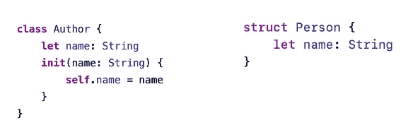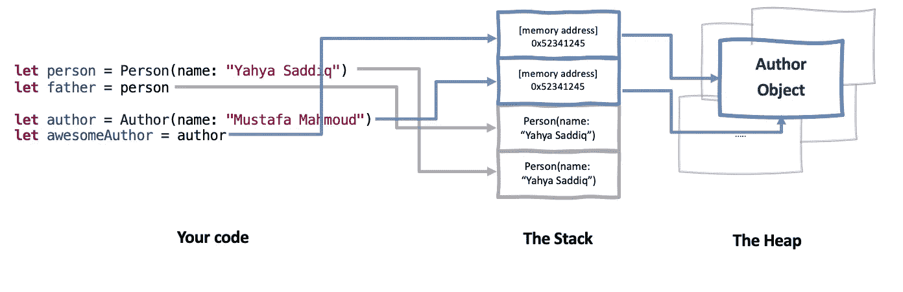

1.  一个 **person** 实例不会引用内存中的某个位置，但其值将只属于 person。
2.  同一个**人**的新**父**实例将成为**副本分配**，并在堆栈中占据一个新位置。
3.  **author** 类的一个实例将在堆中创建一个对象，并将它的地址存储在堆栈中。
4.  相同 auhor 实例的新常量 **awesomeAuthor** 将通过保存相同的地址并指向内存中相同的位置而被**按引用分配**。

**注意:**值类型不是必需的值语义，那是另一篇文章的另一个主题。但是记住这一点很重要🤔。

# 引用计数

到目前为止，我们知道引用类型对象存储在堆中。堆上的对象*不会*自动销毁，因为堆有一个动态的本质，更难管理。

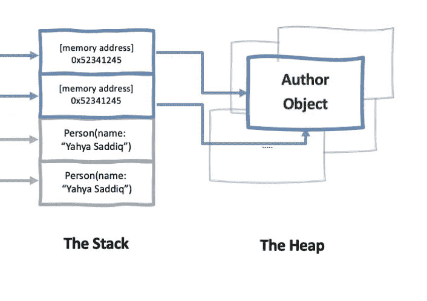

如果没有调用堆栈的作用，进程就无法自动知道一块内存将不再被使用。

在 Swift 中，决定何时清理堆上未使用的对象的机制被称为**引用计数**。

简而言之，**引用计数**给每个对象一个引用计数，该计数随着引用该对象的每个常量或变量而递增，并随着引用的每次移除而递减。

当引用计数达到零时，该对象被放弃，因为系统中没有保存对它的引用。当这种情况发生时，Swift 将清理该对象并将该内存标记为空闲。

让我们使用上面使用的同一个 author 类来演示这一点:

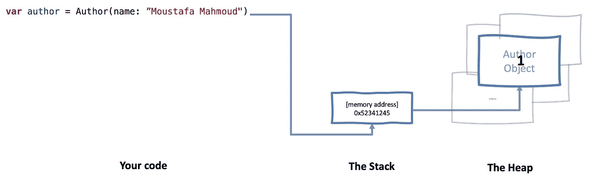

创建 **author** 的实例会在堆中创建一个引用计数为 1 的对象，并将其地址保存在堆栈中。

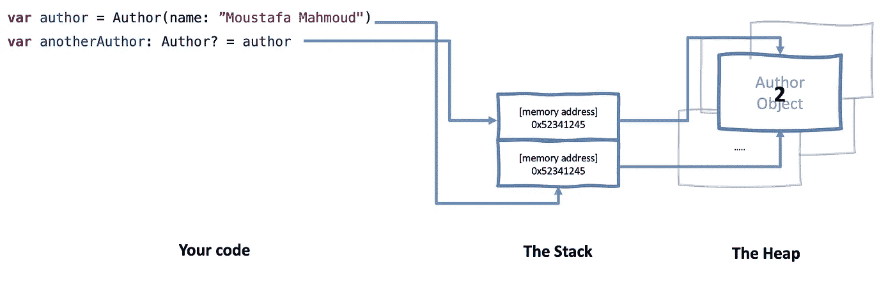

为同一个 **author** 实例创建 **anotherAuthor** 会将其引用计数增加到 2。

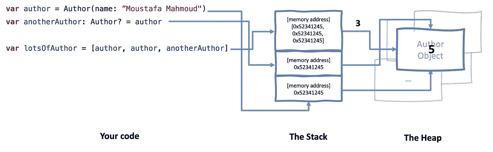

创建相同的**作者**和**另一个作者**实例的 **lotsOfAuthor** 数组，使其递增到 5。

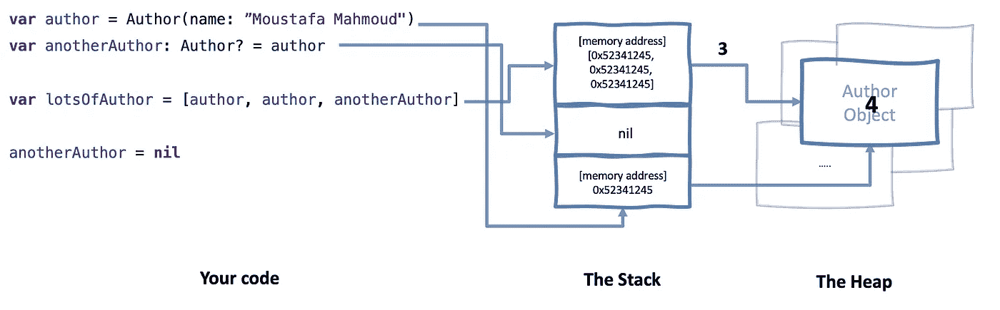

丢弃**另一个作者**将作者的引用计数减为 4。

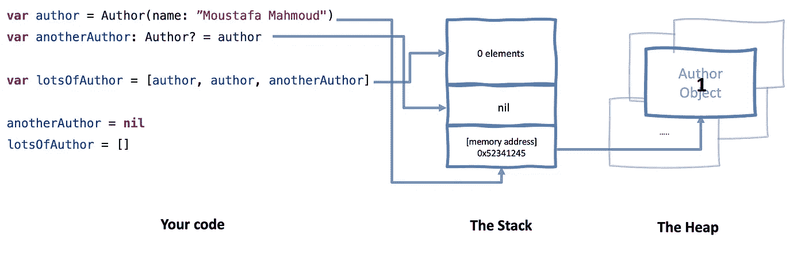

丢弃 **lotsOfAuthor** 元素，将其递减为 1

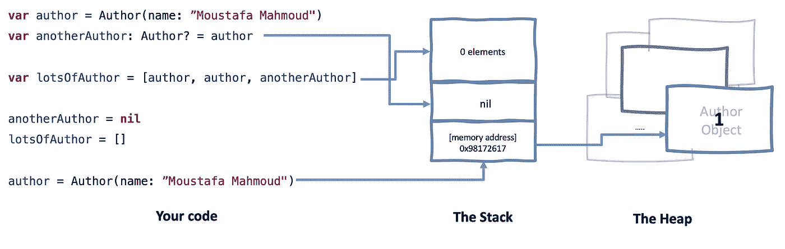

现在！将一个新的**作者**对象分配给原始作者变量:

1.  将原始作者对象递减为零
2.  将旧的废弃对象的内存块标记为空闲
3.  创建引用计数= 1 的新 author 对象

在上面的例子中，您不必做任何工作来增加或减少对象的引用计数。那是因为 Swift 有一个功能叫做**自动参考计数**或**圆弧**。

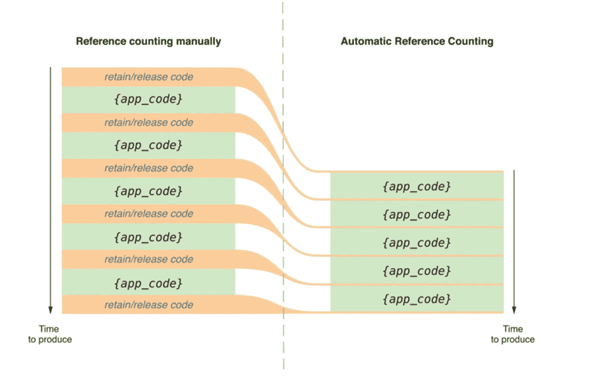

虽然一些较老的语言要求您手动增加和减少代码中的引用计数，但 Swift 编译器会在编译时自动添加这些调用。

**注**:这种引用计数的原理大多适用于类。因为，当你在代码中传递一个类的实例时，你传递的是一个内存引用，这意味着多个对象指向同一个内存地址。

当你传递值类型时，值被复制。这意味着值类型的保留计数通常总是 1；永远不会有一个以上的对象指向值类型的内存地址。

# ARC 与垃圾收集

如果你使用像 C 这样的低级语言，你需要手动释放你不再使用的内存。

像 Java 和 C#这样的高级语言使用一种叫做**垃圾收集**的东西。在这种情况下，该语言的运行时将在您的进程中搜索对对象的引用，然后清除那些不再使用的对象。

与 GC 不同，ARC 支持**确定性终结**，但不能处理**引用周期**。在我看来，一旦你理解了弱引用以及它们是如何打破**引用周期**的，ARC 就会成为**性能**、**可预测性**和**减少竞争条件**的最佳选择。

## *确定性终结*

*   在 ARC 中，当一个对象的引用计数达到零时，Swift 在从内存中移除一个对象之前调用 **deinitializer。**
*   就像 init 是类初始化中的一个特殊方法一样，deinit 是处理取消初始化的一个特殊方法。
*   你在反初始化器中做什么取决于你，一个实例直到它的反初始化器被调用后才会被释放。

# 商业周期

所有这些关于堆、栈、GC、ARC 的讨论都是好的，但是现在，您将看到 ARC 和引用循环在起作用。

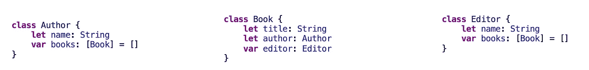

我将使用**作者**、 **b *ook*** 和**编辑**类来演示一个引用循环。作者和编辑都有他们的书单。并且**书**链接到**作者**和**编辑**。

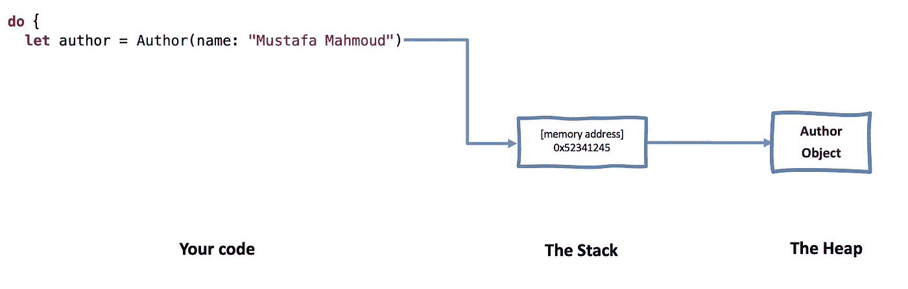

创建一个**作者**实例*穆斯塔法·马哈茂德(*一位伟大的埃及医生、哲学家和作家)

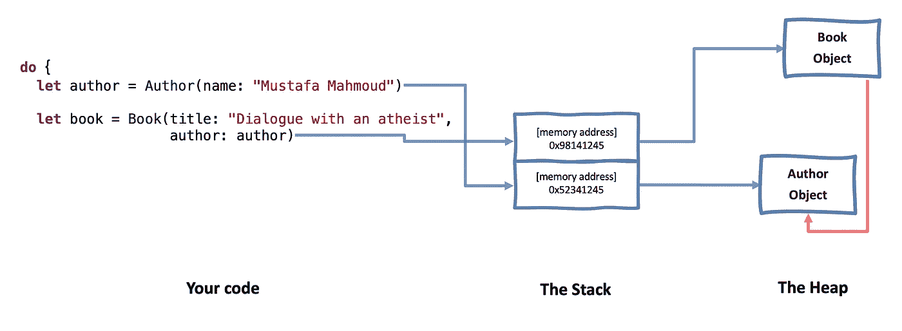

一本**的书**实例*与一位无神论者的对话*为**作者**(顺便说一句，这本书读起来不错)

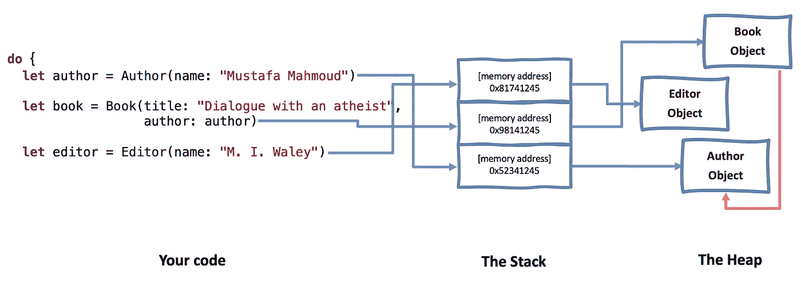

一个**编辑**实例*吴昊。*

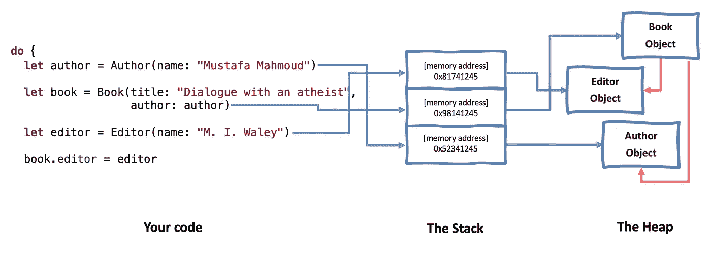

将**编辑器**分配给**书。**

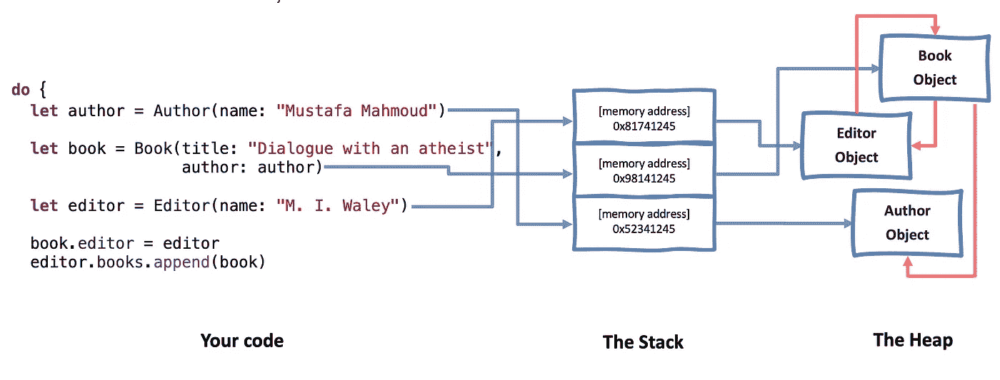

将**图书**添加到**编辑的**图书列表中。

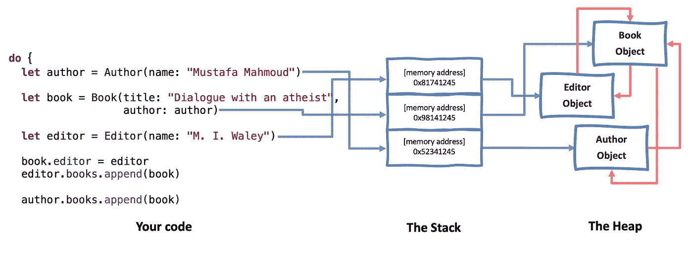

并将**书**也添加到**作者的**书单中。

这是典型的出版社数据模型。

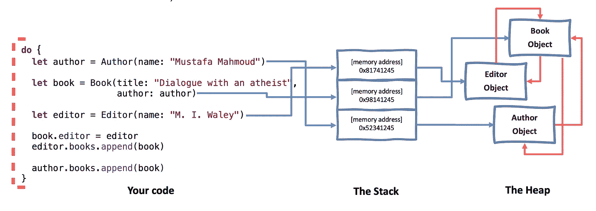

然后，让我们把它们都放在范围内，这样一旦它们超出范围，对**书**、**编辑**和**作者**的引用应该降到零并解除分配。

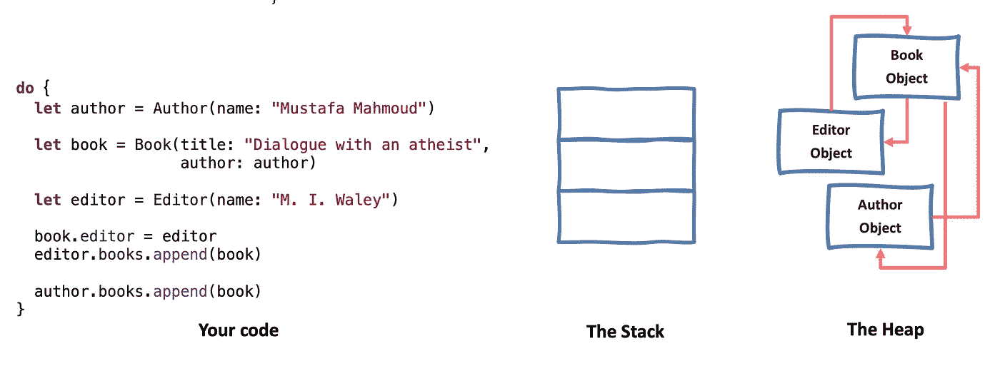

这里的问题是，在范围的末端，**书**、**编辑**和**作者**的引用从未下降并达到零。

🤔为什么？！因为书和作者相互引用，每个实例都使另一个实例保持活力，对于书和编辑器也是如此。

我们通过结束作用域使事情变得更糟，堆栈列表项将被释放，不再有对初始对象的引用。

这是一个典型的引用周期案例，它导致了一个被称为**内存泄漏**的软件错误。由于内存泄漏，即使内存的实际生命周期已经结束，内存也不会被释放。

引用周期是内存泄漏的最常见原因。

**注意:** ARC 会自动为您处理参考计数，但注意参考周期很重要。

**注:**参考循环在一些书籍和网络资源中被称为“保留循环”。两者指的是同一个东西！

# 内存泄漏

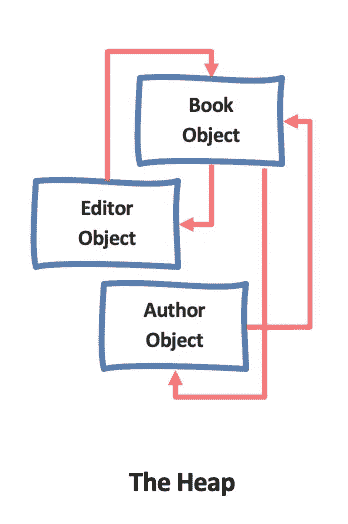

## 内存泄漏是不好的！

内存泄漏是指在某个时间点分配了内存，但从未释放，并且您的应用程序不再引用该内存。因为没有对它的引用，所以没有办法释放它，并且那个内存位置不能再次使用。

从新手到高级工程师，我们都会在某个时候制造漏洞。不管我们有多有经验。

最重要的是消除它们，以获得干净和无崩溃的应用程序。

在应用程序运行很长时间之前，内存泄漏可能不会出现。(内存泄漏通常就像汽车轮胎慢慢漏气一样。几个小时后就没有问题了。放一周你的车就停飞了)。

## **增加应用的内存占用量**

内存泄漏通过不释放被放弃的对象来增加内存占用。那些东西是垃圾。随着创建这些对象的操作的重复，占用的内存将会增加。

## **引入不必要的副作用**

想象一个对象，当它被创建时，在它的初始化器中开始监听一个通知。它对此做出反应，改变数据库，播放视频，或将事件发布到分析引擎。由于对象需要被平衡，我们让它在被释放时停止监听通知，在 deinit 内部。

如果这个对象泄漏了，就不会调用反初始化器:它永远不会死，也永远不会停止监听通知。每次发布通知时，对象都会对其做出反应。如果用户重复创建相关对象的操作，将会有多个实例处于活动状态。所有这些实例对通知做出响应并相互进入。

在这些情况下，你会希望崩溃！

## 泄露从何而来？

泄漏可能来自第三方 SDK 或框架。甚至来自苹果公司创建的类，如 CALayer 或 UILabel。在这种情况下，除了等待更新或丢弃 SDK，我们无能为力。

但是更有可能的是，我们在代码中引入了漏洞😅。

# 从这里去哪里？

在本文中，您已经了解了内存区域、数据类型、类中的引用周期和内存泄漏。

在本系列的下一部分 [**第 2 部分:引用周期、闭包和调试**](/memory-management-part-2-reference-cycles-closures-and-debugging-59b917dc064b#ce92-869979fd6b4b) 中，您将学习在类和闭包中打破引用周期、Xcode 内存调试器以及如何使用苹果的 Malloc 库定位漏洞。

我希望你喜欢这篇文章。如果你有任何问题或意见，不要犹豫，就把它们写在这里🤗。