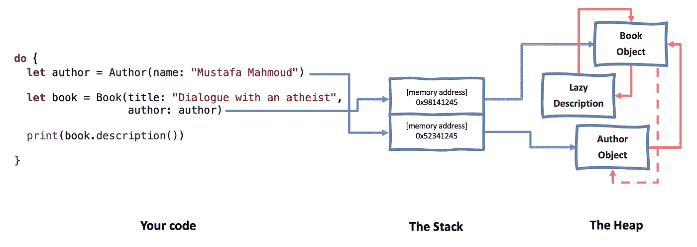
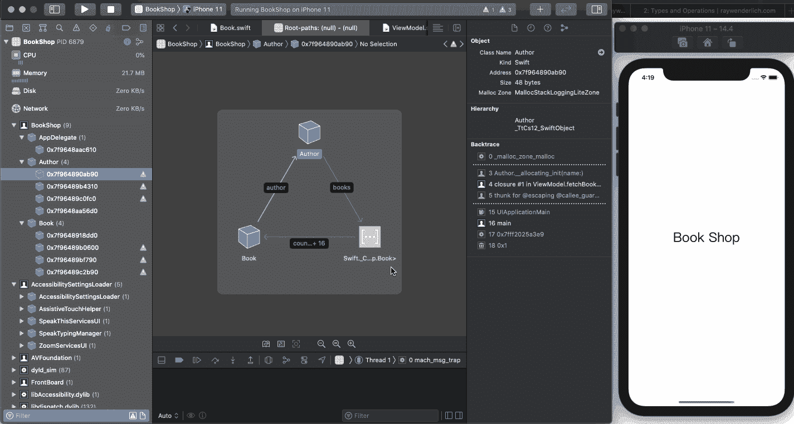

# 内存管理第 2 部分:引用周期、闭包和调试

> 原文：<https://blog.devgenius.io/memory-management-part-2-reference-cycles-closures-and-debugging-59b917dc064b?source=collection_archive---------1----------------------->

> 这篇文章基于我在柏林和 T2 的演讲。

我的儿子“优素福”曾经告诉我，大象能够记住水源几十年。由[拍摄的照片由](https://unsplash.com/@photosbybeks?utm_source=unsplash&utm_medium=referral&utm_content=creditCopyText) [Unsplash](https://unsplash.com/s/photos/elephant?utm_source=unsplash&utm_medium=referral&utm_content=creditCopyText) 上的 Beks 拍摄。

欢迎阅读这个关于内存管理的小系列的第二部分！本部分接续[第 1 部分:区域、结构和泄漏](/memory-management-part-1-regions-types-and-leaks-884c231f5135)。我建议您从本系列文章的第一部分开始，以便从中获得最大收益。

在本文中，您将了解到:

*   打破类和闭包中的引用循环
*   转义和非转义闭包
*   延迟解除分配
*   Xcode 内存调试器
*   定位泄漏的🕵🏽‍♂️

# 跟进！

在前一部分；书、作者和编辑被困在堆内存区域，他们的内存槽不可重用。

因为书和作者相互引用，每个实例都使另一个实例保持活力，对于书和编辑器也是如此。

我们通过结束作用域使事情变得更糟，堆栈列表项将被释放，不再有对初始对象的引用。

这是一个典型的引用周期案例，它导致了一个被称为**内存泄漏**的软件错误。由于内存泄漏，即使内存的实际生命周期已经结束，内存也不会被释放。

# 中断参考循环

那么，你能猜出我们应该去哪个班级🛠吗👷🏽‍♂️👷🏽‍♀️?

确切地说， **book** 类，因为它不是 owner 类，它在属性中存储对其所有者的引用。

一本**书**并不总是分配给一个**编辑**，所以让我们把它建模为一个**可选**类型。而且**书**不拥有**编辑**，所以让它成为**弱引用**也是有道理的。

**弱表示**该变量中的引用不参与引用计数。当引用不是弱引用时，它被称为**强引用**，这是 Swift 中的默认设置。

使用**弱**变量的好处在于，当底层对象离开时，它们会自动检测到。这就是为什么*总是用可选类型和变量*来声明它们。因为一旦引用计数达到零，它们就变为零。

**无主引用**是打破引用循环的另一种方式，其行为很像**弱引用**，因为它们不改变对象的引用计数。但是与弱引用不同，它们总是期望有一个值——你不能将它们声明为可选的。

这样想:一本书没有作者就不可能存在。同时，一本书并不“拥有”作者，因此引用应该是**无主的**。

这里我们保证一本书总是有一个作者，因此，作者不是可选的。一本书在某个时间可以有一个编辑，因此，这个编辑被声明为可选的。

另一方面，books 是一个变量，所以它可以在初始化后被修改。

瞧啊。我们的代码用**弱**和**无主**关键字打破了引用循环。

所有的 deinit 方法都将运行，它们将被取消分配。

# 关闭

闭包只是一个没有名字的函数；您可以将它赋给一个变量，并像其他值一样传递。

它们被命名为“闭包”，因为它们可以“封闭”闭包范围内的变量和常量。

这仅仅意味着 closure 可以从周围的上下文中访问、存储和操作任何变量或常量的值。

闭包体内使用的变量和常量据说已经被闭包捕获。

封闭有两种，非逃逸和逃逸。

## 非转义闭包

在 Swift 中，闭包在默认情况下是非转义的，它们是:

*   不可储存。
*   在范围内执行。
*   不会导致参考循环。

如果你不介意延迟释放，不需要使用[弱或无主自我]进行非转义闭包。

## 逃脱关闭

*   可储存的
*   可以传递给其他闭包。
*   可以在未来执行。
*   导致**参考周期。**

🤔逃避闭包会如何导致引用循环？

Swift 是一种安全的语言，闭包延长了它们使用的任何对象的生命周期，以保证这些对象是活的和有效的。

这种自动安全很酷，但是如果你延长一个本身捕获闭包的对象的生命周期，这就是引用周期的原因。

让我们看一个例子！

# 转义闭包中的引用循环

例如，如果您为 book 类添加一个计算图书描述的惰性属性。

**注意:**一个**懒惰属性**直到第一次使用时才被赋值，而 self 只有在初始化后才可用。

当我们在我们的作用域中调用 *book.description()* 时，book 对象为 *description()* 创建一个内存块，并保存它的引用。同时 *description()* 通过标题和作者强烈地捕捉自我，这反过来增加了图书对象的引用计数。

我们又有一个参考循环，现在在书和*描述()*之间。在作用域的末尾，只调用作者的 deinit 方法。

# 断开闭合参考循环

为了打破这个循环，你需要了解一个叫做**捕获列表**的语言特性。

**Capture list 是**一种语言特性，帮助你精确地控制闭包如何扩展它所引用的对象的生命周期。它们是由闭包捕获的变量列表。

由于在从内存中释放 book 对象后闭包不应该存在，self 永远不会为零，所以我们可以使用捕获列表将强引用改为一个**无主的**对象。

没有引用循环，Swift 将在范围结束时取消分配描述对象。

## 【软弱的自己】

有些时候你不能捕获 self 作为一个无主引用，因为 self 可能会变成 nil，应用程序会因为读取 nil 对象而崩溃。

***【弱自我】*** 表示闭包不会延长自我的生存期，但是如果代表自我的底层对象消失了，它就会被设置为零。

如果 self 离开，应用程序不会崩溃，但会生成一个“字符串插值”警告，您可以通过**强弱模式修复该警告。**

**注:**用*【弱自】*代替无主是明智的，一直推荐。

# 什么时候该用【弱自我】？

你并不总是需要一个软弱的自己，贝希尔·艾尔·马勒

这里有一个综合流程图，由[**Besher Al Maleh**](https://medium.com/flawless-app-stories/you-dont-always-need-weak-self-a778bec505ef)来决定你的封闭是否在逃避，是否需要*。*

# *参考循环— GCD*

*GCD 不会导致引用循环，除非您存储它以备将来执行。*

# *参考循环-动画*

**UIView.animate()* 不会导致引用循环，除非您存储了一个*uiviewpropertyimator*供将来执行。*

# *参考循环—计时器*

*计时器就不同了。它可以保留一个对象，即使它没有存储在属性中。*

*只要计时器重复并且 self 没有在其中被捕获，计时器将防止被引用对象由于无限期延迟的释放而被释放，而不是内存泄漏。*

*记住在不需要计时器的时候让它无效，并在其中微弱地捕捉自我。*

# *延迟解除分配*

*这不是内存泄漏，这是转义和非转义闭包都会发生的副作用。这种副作用会导致不良行为。*

*正如我们前面所说的，如果您没有弱地捕获自我*，*闭包会强有力地捕获周围环境中的任何变量或常量。这意味着只要闭包体还活着，闭包就会阻止被强捕获的对象被释放。*

*[查看这篇文章](https://medium.com/flawless-app-stories/you-dont-always-need-weak-self-a778bec505ef)了解可以保持封闭体存活的场景。*

# *书店*

*最后，是时候使用 Xcode 内存调试器显示参考周期了。我将用一个演示 app BookShop(从[下载 BookShop app**这里**](https://github.com/ysadiq/BookShop/tree/develop/Final) )给大家展示一下内存可视化和泄露。*

**

*演示应用程序是一个简单的两个视图和一个表格应用程序。它包含一个图书数据存根，带有我在[第 1 部分:区域、结构和漏洞](/memory-management-part-1-regions-types-and-leaks-884c231f5135)中提到的出版社模型。*

# *Xcode 内存调试器*

*苹果在 Xcode 8 中引入了新的视觉内存调试器。运行书店应用程序并调试内存图。*

**

*内存调试器中断应用程序的执行，并构建当前内存使用情况的可视化，使查找、诊断和修复内存泄漏变得更加容易。请注意，根据应用程序的大小，绘制图表可能需要一点时间。*

**

*左侧的导航窗口显示了在堆上创建的对象，这些对象按类型和实例进行组织。*

*当您在导航器中选择一个对象时，中间部分将向您显示所选对象的内存图，以及它与其他对象的关系。关系的类型由箭头的样式表示。如果箭头是粗体的，这是强关系，否则是保守关系(🤔Swift 不认，可能弱也可能强)。*

*有时，它是一个大图，有时，它是一个只有几个对象的小图。右侧的内存检查器显示了诸如大小、类层次结构和分配回溯等细节。*

*厉害！内存目前没有显示任何泄漏。*

**

*现在，取消暂停应用程序，并通过返回到根视图来释放当前视图和对象。然后再打开内存图。*

**

*哎呀！这本书既没有作者对象也没有被释放。发生这种情况是因为书强持有作者，而作者强持有数组列表中的书。这是一个导致内存泄漏的引用循环。你打开的书店视图越多，内存泄漏就越多。*

*正如我前面提到的，内存泄漏是指内存在某个时候被分配，但从未被释放，并且不再被您的应用程序引用。因为没有对它的引用，所以没有办法释放它，并且那个内存位置不能再次使用。*

# *定位泄漏源🕵🏽‍♂️*

*如果您不知道从哪里开始查找，调试与内存相关的错误可能会非常耗时。幸运的是，Xcode 包含了一些选项，可以在内存问题发生时识别这些问题。*

*Apple 有 Malloc 库，它提供了调试功能来帮助跟踪:*

*   *内存粉碎错误*
*   *堆损坏*
*   *对释放内存的引用*
*   *缓冲区溢出。*

*默认情况下不启用此功能，您可以通过一组环境变量来启用这些调试选项。*

**

*有很多 Malloc 环境变量，我现在关心的一个是 **Malloc 堆栈日志，** it 允许malloc 在每次分配时记住函数调用堆栈。*

*这是每个方案都支持的。不调试内存泄漏时，应该关闭 malloc 堆栈日志记录。因为它需要大量的记录过程，并且在调试过程中有些属性没有被完全记录下来。*

**

*如果您启用了 malloc 堆栈日志记录，回溯将向您显示代码中内存图中每个对象的分配行。通常，分配行是无害的，问题是在该行之前或之后。*

**

*正如我们在本文开头的图表中提到的，要修复这个内存泄漏，您必须将图书-作者关系更改为一个**无主关系**。一本**书**不能没有一个**作者，同时，一本书并不“拥有”作者。***

# *从这里去哪里？*

*帮助您消除内存错误的 3 个最终提示:*

1.  *为你的项目定义一个强大的代码风格，并尊重它。*
2.  *使用[快速棉绒](https://github.com/realm/SwiftLint)。它是在编译时检测早期问题的一个很好的工具。*
3.  *经常分析应用程序，尤其是在使用 Xcode 内存调试器创建功能或修复请求之前。*

*厉害！你已经到达这个迷你系列的结尾。*

*在本文中，您学习了如何打破类和闭包中的引用循环，Xcode 内存调试器，以及如何使用 Apple 的 Malloc 库定位泄漏。*

## *参考*

***书籍
-**-[雨燕学徒](https://www.raywenderlich.com/books/swift-apprentice)，Raywenderlich*

***文章
-** [内存管理与值类型性能](https://swiftrocks.com/memory-management-and-performance-of-value-types.html)、Swift Rocks
**-** [编程中的内存管理](https://deepu.tech/memory-management-in-programming/)、Deepu Tech
**-** [内存栈 vs 堆](https://gribblelab.org/CBootCamp/7_Memory_Stack_vs_Heap.html)、Gribble lab
**-** [内存、栈、堆和指针图解指南](https://medium.com/young-coder/an-illustrated-guide-to-memory-the-stack-the-heap-and-pointers-40a604f7bc53)、年轻的编码者
**-** [Xcode 动动脑筋
**-**](https://useyourloaf.com/blog/xcode-visual-memory-debugger/) [内存泄漏和保留周期检测](https://doordash.engineering/2019/05/22/ios-memory-leaks-and-retain-cycle-detection-using-xcodes-memory-graph-debugger/)、DoorDash 工程
-**-**[你并不总是需要一个软弱的自我](https://medium.com/flawless-app-stories/you-dont-always-need-weak-self-a778bec505ef)，贝希尔·阿尔·马勒*

*我希望你喜欢这篇文章。如果你有任何问题或意见，不要犹豫，就把它们写在这里🤗。*