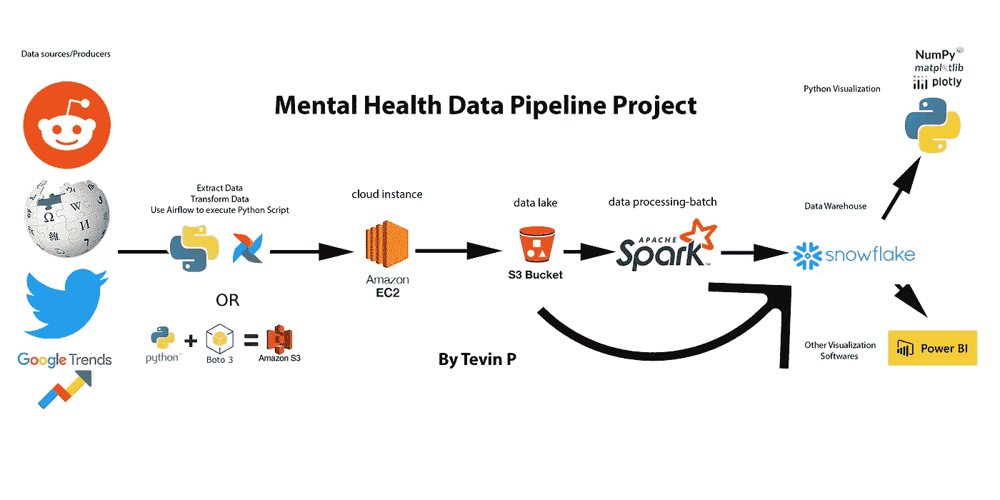
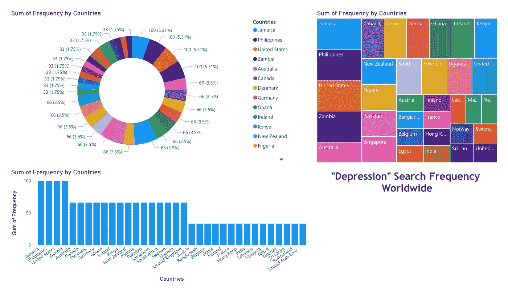
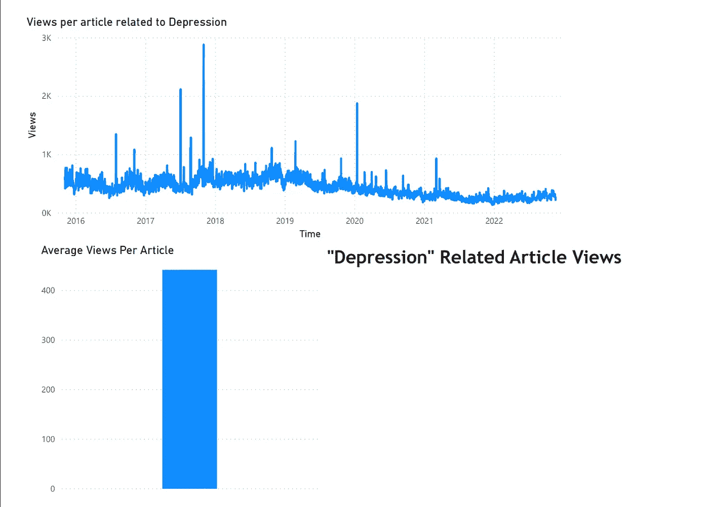
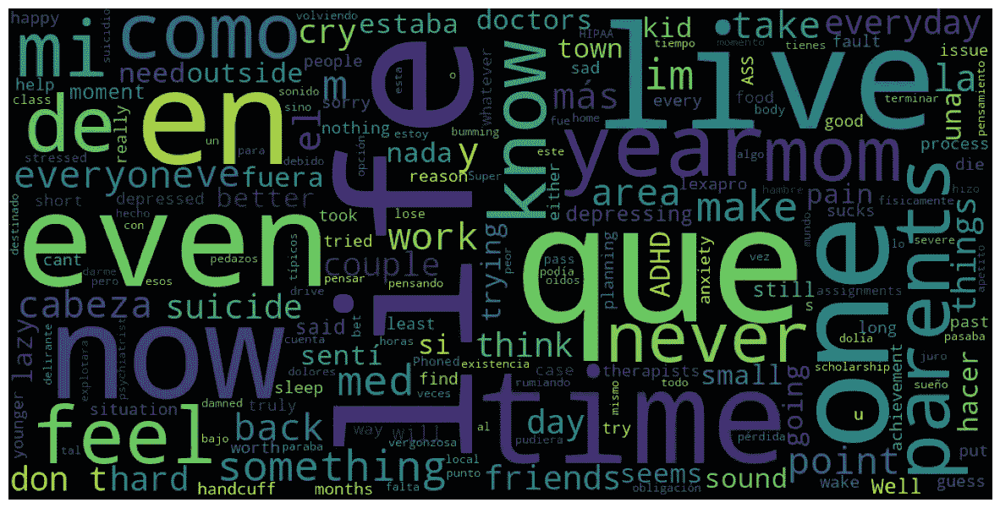
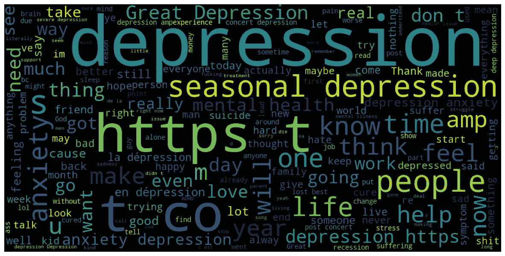
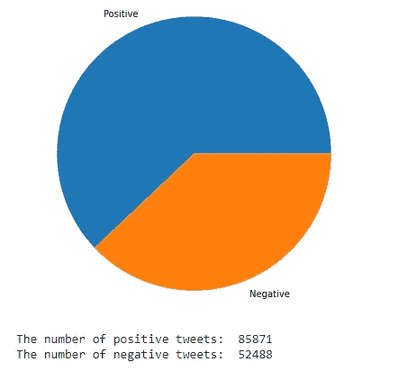
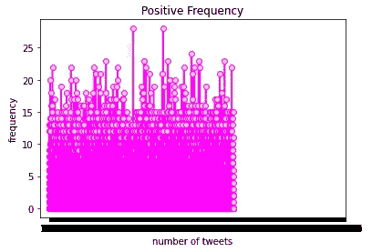
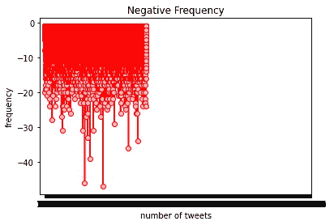
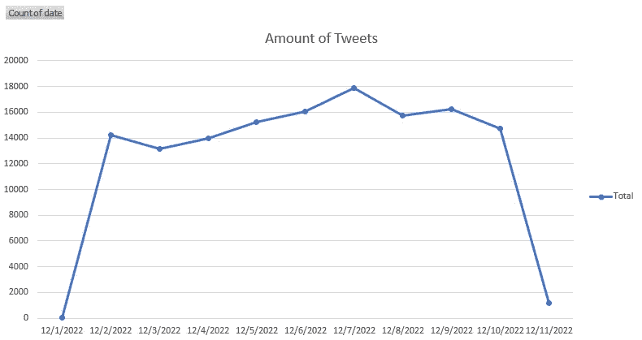

# 心理健康认知数据管道和分析

> 原文：<https://blog.devgenius.io/mental-awareness-data-pipeline-analysis-202c81b6ee51?source=collection_archive---------10----------------------->

Tevin P 概述的数据管道

M 心理健康是当今社会的一个重要研究课题，对心理健康问题的认识也在增加对心理健康问题的了解和理解方面发挥着重要作用，通过增加对心理健康问题的认识，我们可以创造一个更具包容性和支持性的社会，在这个社会中，个人感到寻求帮助是舒适的，并且不会受到歧视。

这篇文章的目的是从许多不同的来源获得关于“精神健康”的见解，并能够将它们联系在一起。随着我最终进入数据工程领域的兴趣，我认为这将是一个很好的主意。

# 第一步

通过这个，我创建了一个数据管道，首先使用 Python 从 Reddit、Twitter、Google Trends 和 Wikipedia 中提取数据。

数据提取片段，不包括导入

# 第二步

在对每个单独的平台进行单元测试以确保其正常工作后，我制作了一个 AWS EC2(Ubuntu)云实例。这背后的原因是使用气流作为执行 python 和在 AWS S3 上存储数据的一种方式。此外，我还使用 Boto3 手动将数据上传到 S3 自动气象站。

气流 Dag 设置片段，不包括导入

# 第三步

一旦数据存储到数据湖中。我从 Google Colab 访问了 S3 桶，并使用 PySpark 处理数据。对于 twitter 数据(超过 100，000 行),我必须删除 10 多个不需要的列和过滤掉的只有英文的推文。此外，文章数据必须更改，时间戳数据格式需要从 20151121 更改为 2015–11–21。最后，reddit 数据需要改变，包括删除更多不需要的列。当谈到这个项目时，谷歌趋势数据是唯一结构化的数据集，这是由于我选择的编码格式。

Google Colab 处理

# **第四步**

然后，我会将结构化数据加载回一个新的 S3 存储桶，在那里，通过使用工作簿创建一个数据仓库并创建一个阶段，将结构化数据加载到雪花。在这个数据仓库中，可以在不同的软件(如 PowerBI 等)中访问和使用数据以进行分析。

雪花工作簿代码

# 分析

PowerBI Google 趋势仪表板

对谷歌趋势数据的分析让我们能够识别出“抑郁症”一词搜索频率最高的国家。排名前三的国家是牙买加、菲律宾和美国。为了确认数据的准确性，我在谷歌趋势官方网站上进行搜索，发现结果相对相似，尽管数据是在不同的时间提取的。这表明，在牙买加、菲律宾和美国，“抑郁症”的高搜索频率是一个持续的趋势，而不是一个异常现象。值得注意的是，虽然牙买加是一个文化充满活力的美丽国家，但它面临着众多的社会和经济挑战，这可能导致“抑郁症”的搜索频率很高。此外，牙买加的抑郁症发病率可能被低估了，因为许多病例没有得到诊断。总的来说，这一分析为关于抑郁症的全球对话以及持续支持和意识的需要提供了有价值的见解。

PowerBI 文章仪表板

除了确定“抑郁症”搜索频率最高的国家，我们的分析还允许我们绘制出六年内与抑郁症相关的每篇文章的观点。每篇文章的平均浏览量为 441，为关于抑郁症及其影响因素的全球对话提供了宝贵的见解。例如，2020 年关于抑郁症的文章浏览量的显著增加可能要归因于新冠肺炎疫情的影响，它导致了大范围的失业并扰乱了日常生活的许多方面。此外，这些数据可能反映了其他事件的影响，如季节性抑郁症、金融危机和战争对抑郁症患病率的影响以及公众对该话题的兴趣。总的来说，这一分析揭示了许多有助于抑郁症全球对话的因素，以及对持续支持和意识的需要。

Reddit WordCloud-Python

鉴于 Reddit 数据集相对较小，我决定创建一个单词云来可视化所有帖子中最常见的单词。与 Twitter 的分析只关注英语推文不同，Reddit 的分析包括了英语和西班牙语的帖子。虽然有可能开发一种方法来排除用西班牙语撰写的帖子，但数据集已经相对较小，删除西班牙语帖子会进一步减少样本量。尽管存在这种局限性，但单词 Cloud 为 Reddit 上最常讨论的与抑郁症有关的话题和主题提供了宝贵的见解。

Twitter WordCloud-Python

另外，我用词云分析了推文数据集。这项分析以及之前的分析揭示了社交媒体用户在讨论心理健康问题时相互参与和相互支持的方式，并提供了关于抑郁症的全球对话的一瞥。

情感分析-Python

使用 Afinn 分析推文显示，大多数与抑郁症有关的推文都是积极的。这表明，Twitter 上对抑郁症的总体看法在很大程度上是积极的，这是一个令人耳目一新的变化，与通常围绕心理健康问题的负面污名不同。这种对抑郁症的积极看法可能会激励其他人寻求支持，并鼓励在社交媒体上更加开放和诚实地讨论心理健康。

推文的正频率

推文的负频率

除了分析与抑郁症相关的推文的总数量，检查积极和消极推文的频率也很重要。这种分析也有助于识别抑郁症话语中的潜在趋势和模式，并为干预和支持旨在促进心理健康和福祉的努力提供信息。

数据透视表-12 月推文数量的折线图

尽管提取了超过 130，000+条推文，但大多数都是在 12 月发布的。这确实令人印象深刻，因为它让我们看到了 Twitter 用户在 10 天内讨论抑郁症最活跃的日子。在如此短的时间内，推特的绝对数量证明了这一问题的普遍存在，以及继续支持和提高认识的必要性。

# 结论

## 本项目的主要收获:

1.  对于那些与心理健康做斗争的人来说，你并不孤单，你周围的许多人都可能正在经历某种类型的心理健康问题，你不应该因此感到尴尬或不像一个人。
2.  在困难时期，尤其是在疫情，许多人发表文章，直接针对那些患有精神疾病的人，因此有一些资源可以帮助你的精神健康之旅。
3.  将搜索频率国家与每个国家抑郁率的实际数据相比较，抑郁率和频率之间存在相关性。
4.  根据情绪分析，twitter 上大多数与抑郁症相关的推文都是积极的，这意味着积极的抑郁症推文比消极的多。
5.  我们还能够检查正面和负面推文的频率，显示负面推文的频率很高，而正面频率较低，这可以让我们了解社交媒体应用程序上如何讨论抑郁症。
6.  我们可以看到人们在 12 月的哪几天发关于抑郁症的微博最多。

## 以下是处理心理健康的一些步骤:

1.  首先，重要的是要认识到抑郁症的迹象，包括情绪、食欲、睡眠模式、能量水平和注意力的变化。如果你正在经历这些症状中的几个，并且它们正在干扰你的日常生活，那么和医疗保健专业人士谈谈是个好主意。
2.  让自己了解抑郁症及其原因也是有帮助的。这可以帮助你了解自己的症状，并制定管理它们的策略。
3.  管理抑郁症最有效的方法之一是建立一个有规律的日常生活，包括健康的习惯，如锻炼、均衡的饮食和充足的睡眠。这有助于改善你的情绪和整体幸福感。
4.  另一个重要的步骤是向他人寻求支持。这可以包括与治疗师或顾问交谈，加入支持团体，或向朋友和家人倾诉。重要的是要记住，正如这个项目所示，你并不孤独，寻求帮助是力量的象征，而不是软弱的象征。
5.  还有一些自我保健策略可以帮助你管理抑郁症。这些可以包括练习放松技巧，如冥想或深呼吸，参加你喜欢的活动，每天留出时间做一些给你带来快乐的事情。
6.  同样重要的是要记住，管理抑郁症是一个长期的过程。这意味着有挫折和不总是马上感觉更好是没关系的。最重要的是继续努力，保持精神健康。

我希望这篇文章能够为我提供一些价值，如果你决定使用这个项目的任何方面，如代码，请相信我，以及任何问题或想法，请随时分享！