# 探索性数据分析导论:心理健康与信息技术

> 原文：<https://blog.devgenius.io/mental-health-vs-i-t-1bed0362a966?source=collection_archive---------21----------------------->

我知道，我知道。我花了很长时间来发表我在这个旅程中的第一篇文章的后续。我的借口？我还在努力接受第一篇文章的正面评价(现在情况不同了，我是名人了，哈哈)。本系列的第二部分，EDA 简介，将关注 it 行业的心理健康。


图 1:因为代码中一个错误的逗号，我们经历了什么！

**序幕。**

在这个项目中，我们感兴趣的是衡量 it/技术工作场所如何看待心理健康，以及雇主和雇员之间是否存在脱节。这个[数据集](https://www.kaggle.com/datasets/osmi/mental-health-in-tech-survey)来自 2014 年的一项调查，该调查测量了人们对精神健康的态度以及科技工作场所中精神健康障碍的频率。

这些数据来自不同国家的受访者，记录了他们对工作场所心理健康的不同看法。

此数据集包含以下列:

```
Age

Gender

Country

State:  If you live in the United States, which state or territory do you live in?

Self_employed: Are you self-employed?

family_history: Do you have a family history of mental illness?

treatment: Have you sought treatment for a mental health condition?

Work_interfere: If you have a mental health condition, do you feel that it interferes with your work?

no_employees: How many employees does your company or organization have?

remote_work: Do you work remotely (outside of an office) at least 50% of the time?

tech_company_work: Is your employer primarily a tech company/organization?

benefits: Does your employer provide mental health benefits?  

Care_options: Do you know the options for mental health care your employer provides?   

wellness_program: Has your employer ever discussed mental health as part of an employee wellness program?  

sought_help: Does your employer provide resources to learn more about mental health issues and how to seek help? 

sought_anonymity: Is your anonymity protected if you choose to take advantage of mental health or substance abuse treatment resources? 

Difficulty_to_get_leave: How easy is it for you to take medical leave for a mental health condition?   

mental_health_consequence: Do you think that discussing a mental health issue with your employer would have negative consequences?  

phys_health_consequence: Do you think that discussing a physical health issue with your employer would have negative consequences?  

coworkers_know?: Would you be willing to discuss a mental health issue with your coworkers?

supervisor_know: Would you be willing to discuss a mental health issue with your direct supervisor(s)?

mental_health_interview_attendance: Would you bring up a mental health issue with a potential employer in an interview?

phys_health_interview_attendance: Would you bring up a physical health issue with a potential employer in an interview?

mental_vs_physical: Do you feel that your employer takes mental health as seriously as physical health?

obs_consequence: Have you heard of or observed negative consequences for coworkers with mental health conditions in your workplace?

comments: Any additional notes or comments
```

**本研究的提问、准备、处理和分析阶段。**

我们首先开始制定可行的问题，让我们尝试和回答。快速浏览一下列表，有一件事变得很明显，似乎有很多“你知道吗…”或“你的雇主知道吗…”类型的问题，表明这项研究可能更像是“雇员和雇主是否意识到他们的问题和解决方案”类型的研究。我形成的问题如下:

1.  在这项研究中，哪个性别受影响最大？
2.  科技工作场所的心理健康问题是疏忽还是无知？
3.  雇主和雇员是否尽了最大努力来找出问题所在？

让我们开始编码吧！

首先，我们将加载必要的库和数据集。 **Pandas** 库将用于数据操作，而 **seaborn** 库将用于数据可视化。 **Numpy** 将用于数组操作。

```
import pandas as pd
import seaborn as sns
import numpy as np
%pip install openpyxl

data = pd.read_excel("Insert dataset path here")
data.head()
```

**数据。head()** 将向您简要介绍这些列的外观，结果如下:

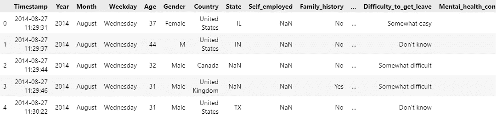

图 2:查看列

EDA 部分从这里开始！在开始任何分析之前，我总是计算每一列丢失了多少数据。数据集包含 30 列和 1，259 行。我的期望是每一列有 1，259 个元组，或者相当多的元组。
我已经将每一列的阈值设置为 10%,这意味着任何缺少 1，259 个元组中至少 10%的列都被认为是不可用的，可能会导致错误分析。

```
total = data.isnull().sum().sort_values(ascending=False)
percent = (data.isnull().sum()/data.isnull().count()).sort_values(ascending=False)
missing_data = pd.concat([total,percent],axis=1, keys=['Total','Percent'])
missing_data.head(20)
```

下面的结果显示了缺失的元组总数以及每个数字对数据的贡献百分比。
四列丢失的数据超过总数据的 10%,因此将被删除。这些列是评论、状态、工作干扰和自雇。

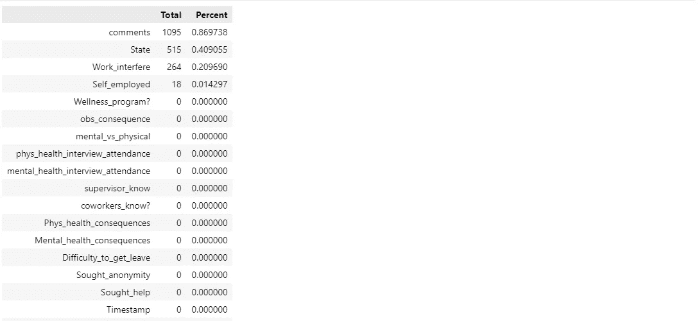

图 3:带有各自缺失值的列。

```
new_data= data.drop(missing_data[missing_data['Percent']>0.10].index,1)
new_data.isnull().sum()
new_data.head()
```

使用 **new_data.head()，**我能够通过年龄列进行计划，并注意到一些年龄没有意义，例如一个工人是 1000 岁。原因可能是人们在填写调查时的疏忽(调查对我来说也是一个大问题，可以理解)。我把退休年龄定为 72 岁，最低年龄定为 18 岁，这样研究才合理。

```
new_data = new_data.loc[(new_data['Age']  >= 18) & (new_data['Age']  <= 72)]
maxAge= new_data.Age.max()
minAge= new_data.Age.min()
print("The oldest person in this survey is" , maxAge , "while the youngest is" , minAge)

code result = The oldest person in this survey is 72 while the youngest is 18
```

最后一点涉及排除频率小于 3 的性别。这并不是说他们对这项研究不重要，他们只是缺乏足够的代表性来提出可行的建议和结论。

```
threshold = 3
value_counts = new_data.Gender.value_counts() # Entire DataFrame 
to_remove = value_counts[value_counts <= threshold].index
new_data.replace(to_remove, np.nan, inplace=True)
new_data.Gender.value_counts()
```

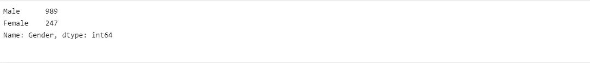

图 5:男性对女性的分布

**本研究的分享和行动阶段**

这两个阶段包括分享我们的发现和提供建议。从上述性别分布来看，很明显，男士们要么受心理健康的影响最大，要么最有可能的假设是，男士们更愿意参加这种调查。
我们的任务是确定本次调查中受影响最大的受访者年龄。

```
#Determining the mode of column age
sns.boxplot(y=new_data['Age'])
plt.show()
```

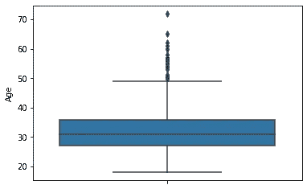

图 6:调查的年龄分布

年龄范围似乎在 28 到 35 岁之间。我们必须非常小心，不要马上得出这个年龄段受影响最大的结论。很可能这个年龄段的人很容易接受这种调查的想法。目前，我们假设这是受影响最大的年龄。我的理由是，如果进行了调查，受影响的人口更有可能参与所述调查，这更有意义。

我们的下一个任务是找出问题出在雇主还是雇员身上。首先，我们要弄清楚受访者过去是否接受过精神健康问题的治疗。

```
sns.catplot(y ='Age', x ='Gender', 
data = new_data, hue ='Received_treatment', kind = "bar") 
```

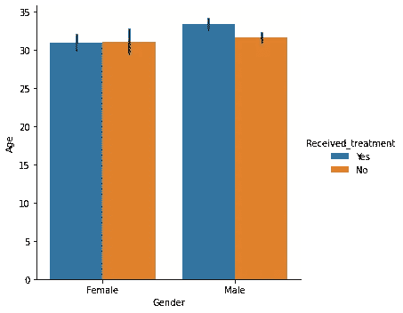

图 7:您过去是否接受过心理健康治疗？

从以上情况来看，男性接受治疗的比例很高，而女性没有接受治疗的比例很高。下一步是弄清楚员工是否觉得他们的心理健康与他们的身体健康相比受到了重视，以及他们是否通过他们的同事观察到了任何负面的心理健康后果。

```
sns.boxplot(y ='Gender', x ='Age', data = new_data, hue ='mental_vs_physical')
```

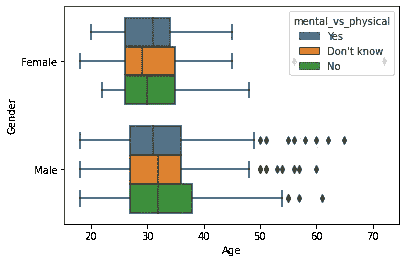

图 8:心理健康与身体健康？

```
sns.boxplot(x ='Gender', y ='Age', data = new_data, hue ='obs_consequence')
```

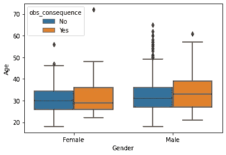

图 9:你有没有观察到任何负面的心理健康后果？

从这个角度来看，绅士们更倾向于认为他们的心理健康没有像他们希望的那样受到重视。男性和女性都在工作场所观察到负面的心理健康后果，这意味着他们非常清楚身边的心理健康问题。

接下来，要弄清楚受访者是否害怕以任何方式提出他们的问题。下图显示了受访者提出心理问题的意愿分布情况:

a)员工？

```
sns.boxplot(y ='Gender', x ='Age', data = new_data, hue ='coworkers_know?')
```

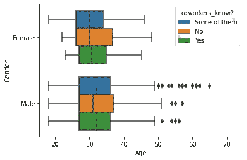

图 10:你会和同事分享你的心理健康问题吗？

b)主管？

```
sns.boxplot(x ='Age', y ='Gender', data = new_data, hue ='supervisor_know')
```

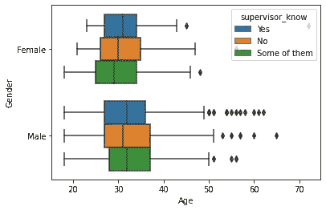

图 11:你会和主管分享你的心理健康问题吗

男女都不愿意与同事和上司分享他们的心理健康问题。一个有趣的发现是，女性似乎比男性更不愿意分享她们的问题。与男士相比，很多女士不愿意与同事分享她们的问题，很少有人愿意与上司分享她们的问题。

下一部分关注雇主方面，看看他们做了多少。下图显示了受访者是否认为提出他们的精神问题会有负面后果，以及他们是否认为很难获得精神健康休息。

```
sns.boxplot(x ='Age', y ='Gender', data = new_data, hue ='Mental_health_consequences') 
```

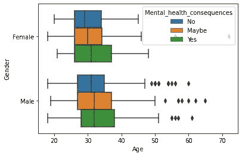

图 12:有心理健康的后果吗

```
sns.catplot(y ='Age', x ='Gender', data = new_data, hue ='Difficulty_to_get_leave', kind = "bar") 
```

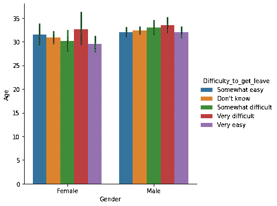

图 13:精神健康休息对你来说容易吗？

我们的第一个观察结果是，男士们更愿意参与这项调查，这开始得到更多人的支持。与男性相比，害怕负面后果的女性比例明显更高，这表明在 it 行业中，由于害怕后果或可能受到歧视，与心理健康作斗争的女性更有可能保持沉默。男女都认为获得精神健康休息是非常困难的。

这一部分的最后一部分是要弄清楚雇主在试图为他们的员工提供心理健康服务时是否尽了他们的职责。下图显示了:
a)员工是否知道他们的雇主提供的心理健康护理方案

```
sns.catplot(y ='Age', x ='Gender', data = new_data, hue ='Care_options', kind = "bar") 
```

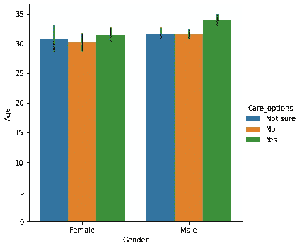

图 14:你知道提供给你的护理选择吗？

b)雇主是否曾将心理健康作为员工健康计划的一部分进行过讨论？

```
sns.catplot(y ='Age', x ='Gender', data = new_data, hue ='Wellness_program?', kind = "bar")
```

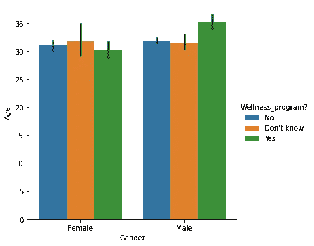

图 15:雇主有没有和你讨论过健康计划？

c)员工相信，如果他们公开身份，他们的匿名是安全的？

```
sns.catplot(y ='Age', x ='Gender', data = new_data,
 hue ='Sought_anonymity', kind = "bar") 
```

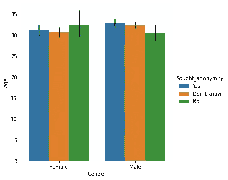

图 16:你觉得你的匿名是安全的吗？

图 14 和图 15 显示，雇主在某种程度上为提供这些启示做了一些工作，但是，在某种程度上，这些启示似乎是由性别驱动的，这一点可以从以下事实中得到证明:大多数女性不知道任何心理健康保健计划，而且大多数女性担心当她们提出心理健康问题时，她们的匿名性得不到保证。

**结论和建议**

从这篇文章中，很明显，人们很清楚精神健康在工作场所的负面影响。然而，当谈到如何看待心理健康时，似乎存在性别偏见，女性更不愿意提出她们的问题，因为她们害怕自己的问题会被如何看待。尽管越来越多的男士似乎已经利用了给予他们的便利，但他们仍然觉得可以做得更多，这一事实证明，大多数男士认为他们的精神问题没有得到他们所希望的重视。

我的建议如下:
a)工作场所应该有更多关注性别问题的设施，以便在性别敏感性方面增加额外的一层。
b)雇主应该定期开展活动，确保匿名是优先事项，让员工更容易出柜。
c)雇主应优先确保他们定期让员工知道心理健康护理是可用的，并像对待任何其他健康问题一样认真对待。