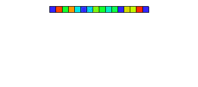
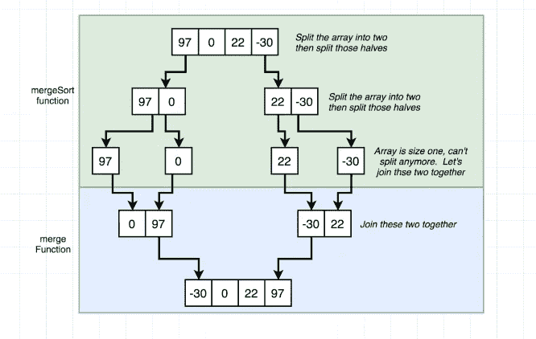
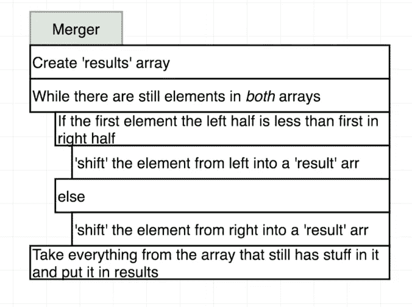

# 合并排序 JavaScript

> 原文：<https://blog.devgenius.io/merge-sort-javascript-bd3f94772fab?source=collection_archive---------16----------------------->


作为一名程序员，经常会遇到需要以某种方式进行排序的问题。无论是过滤你想呈现在页面上的数据，还是为下一次大型面试学习数据结构和算法，排序都是必不可少的。

在这里，我主要关注合并排序:一种被认为是最有效的排序算法之一的算法。合并排序的工作原理是分而治之。也就是说，它重复地将一个数组分解成几个子数组，直到每个子数组都由一个元素组成，然后将这些子数组合并成一个有序的数组(见下图)。



合并排序算法通常使用两个独立的子程序递归求解:一个分裂子程序和一个合并子程序。



为了理解这两个子例程如何生成合并排序的重要性，让我们首先检查“merge”函数。假设给你两个排序的数组，并要求你将它们合并成一个排序的数组。实现这一点的方法如下:



本质上…:-)


用 JavaScript 写的，看起来像:

```
function merger(left, right) {
  const results = [];
  while (left.length && right.length) {
    if (left[0] < right[0]) {
      results.push(left.shift());
    } else {
        results.push(right.shift());
    }
  }
  return [...results, ...left, ...right];
}
```

现在我已经展示了如何合并两个已排序的数组，我们可以对一个未排序的数组进行排序，方法是将它分成两个独立的数组，分别进行排序，然后对这两个数组调用合并函数(如上)。这是合并排序的第二个子例程的工作方式。它获取输入数组并将其分成尽可能小的块，即一个只有一个元素的数组。因为只有一个元素的数组已经是一个“排序数组”，所以以有序的方式将每个元素合并在一起是很容易的。

换句话说，

1.  将给定数组分成两半，
2.  在每一半上递归调用除法函数，
3.  合并结果。

```
function mergeSort(arr) {
  if (arr.length === 1) {
    return arr;
  }
  const center = Math.floor(arr.length / 2);
  const left = arr.slice(0, center);
  const right = arr.slice(center); 
  return merge(mergeSort(left), mergeSort(right));
}
```

那还不算太糟！

需要考虑一个有趣的小细节:合并排序算法在最坏和最好的情况下都具有相同的时间复杂度，因为即使数组是预先排序的，该算法仍然必须执行完整的过程来确定数据是否排序。

请在下面评论您认为的时间复杂度，以及您如何看待自己在项目中使用合并排序！

资源

编码面试训练营:算法和数据结构