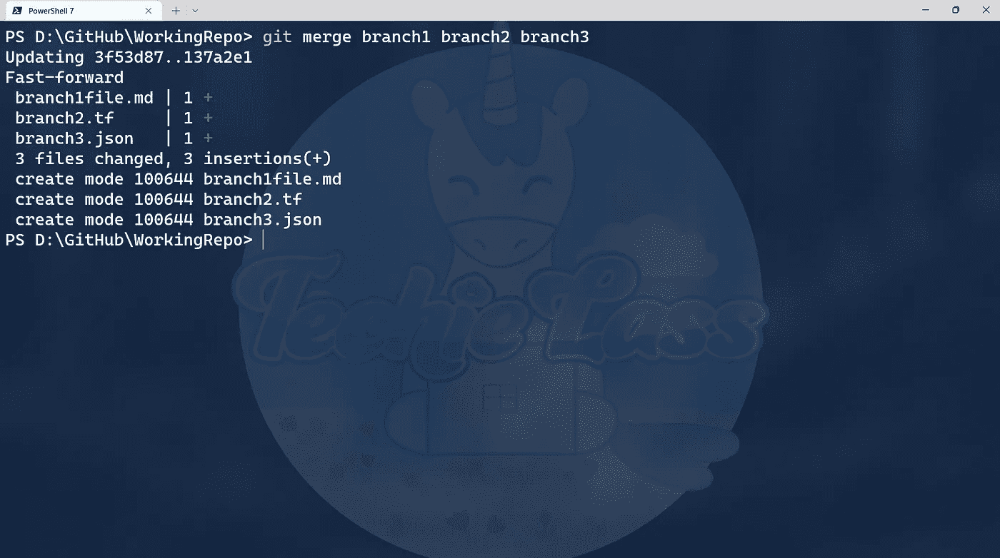
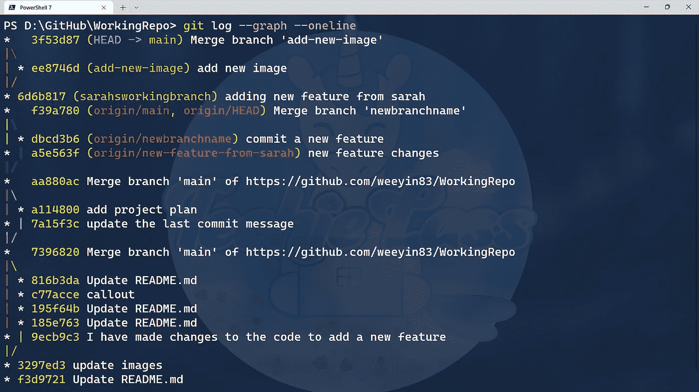

# 与 Git 合并— 14 天的 Git

> 原文：<https://blog.devgenius.io/merging-with-git-14-days-of-git-bfc648a7d334?source=collection_archive---------7----------------------->

这是我学习 Git 的第 10 天。到目前为止，在我的学习旅程中，我走上了以下道路:

你一直跟着吗？今天，我将更详细地学习合并。

# 什么是合并？

合并就是把两个分支合并起来。Git 将获取两个分支中的提交指针，并尝试在它们之间找到一个公共的基础提交，然后将两个分支统一起来。

# 将两个 Git 分支合并在一起

你有一个分支，它准备合并到你的主。

您需要做的第一件事是确保您在您想要将更改合并到的分支中。

在这个例子中，我有一个名为“new-feature”的分支，我想将它与我的主分支合并。我首先切换到我的主分支:

现在我在分支中，我想将我的更改合并到 I 类型中:

*当您发出这个命令时，您可能会收到合并冲突，我们将在* [*第 13 天的 Git*](https://github.com/weeyin83/14daysofgit) *中查看如何处理它们。*

现在，我必须将这个合并从我的本地存储库推送到我的远程存储库，我使用命令:

这可能是将分支合并在一起的最常见的用例。

# 合并多个分支

您可以一次合并多个分支。这样做可能会有冲突和问题，我们将在第[天第 13](https://github.com/weeyin83/14daysofgit) 关注这些问题。

在这个例子中，我有三个稍有改动的分支，我想将它们合并到我的主分支中。我发出命令*git merge branch 1 branch 2 branch 3*

在 git 中合并多个分支

# 查看合并日志

我们在 [Day 6](https://www.techielass.com/inspect-a-git-respository/) 看到有一个名为 *git log* 的命令，我们可以用它来找到更多关于存储库当前状态的信息。如果我们向该命令添加更多的选项，我们就可以得到提交的图形化版本。

git 日志和图表

该命令为我们提供了不同提交和合并的更新，并在左侧显示了一些图形。同样，我们可能更喜欢在图形编辑器中执行这些操作，但是命令行工具非常强大，可以为您提供大量信息。

# Git 合并策略

当深入研究合并时，我发现有不同的[合并策略](https://git-scm.com/docs/merge-strategies)可用于不同的用例。

这些是典型的合并策略:

每种策略都有自己的用例，例如当我们将三个分支合并成一个主分支时, [Git](https://git-scm.com/) 使用了快速前进合并策略。而递归是合并一个分支时的默认合并策略。

在我学习旅程的第 14 天，我将更详细地研究子树。

# 14 天的饭钱

今天是一个相当长的学习之旅，我不知道 Git 有这么多不同的方式将分支合并在一起。但这是有意义的，人们通常只是将一个分支合并到另一个分支。但是情况并不总是这样，Git 必须处理更大更复杂的情况，尤其是当大型团队同时处理不同的分支时。

合并绝对是一个需要回头真正理解每个策略及其用例的领域，但是我期待着第 14 天看到子树的时候！

明天，虽然我正在研究 rebasing，但请务必[订阅](https://www.techielass.com/newsletter)，和我一起踏上这一步的学习之旅！

你可以跟着这里:【https://github.com/weeyin83/14daysofgit】T4

*原载于 2022 年 9 月 29 日 https://www.techielass.com**[*。*](https://www.techielass.com/merging-with-git/)*