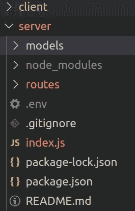
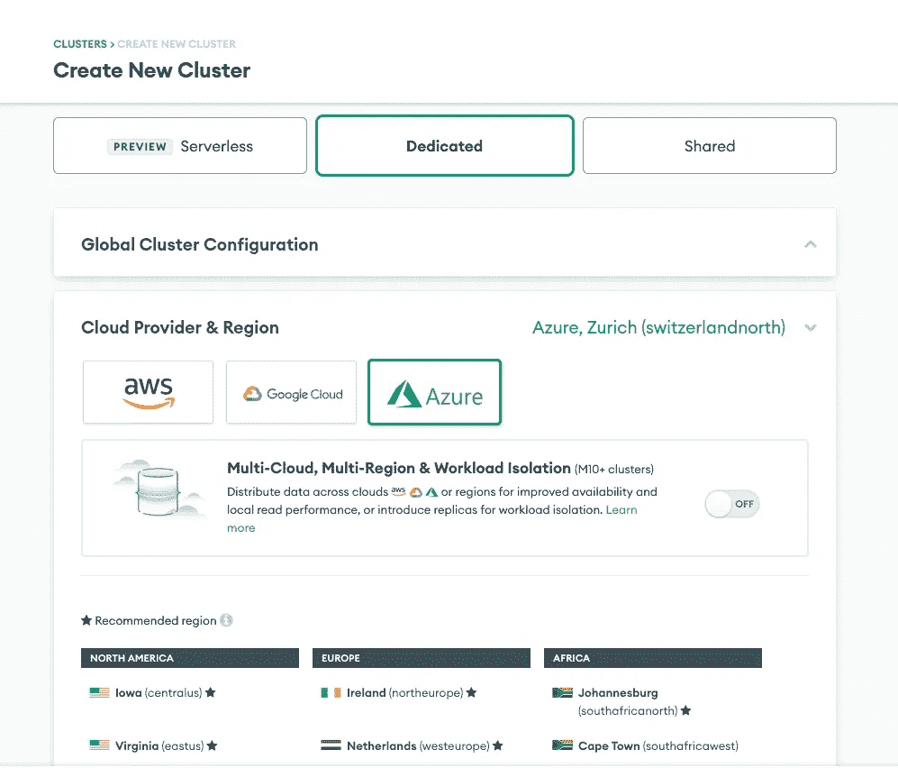
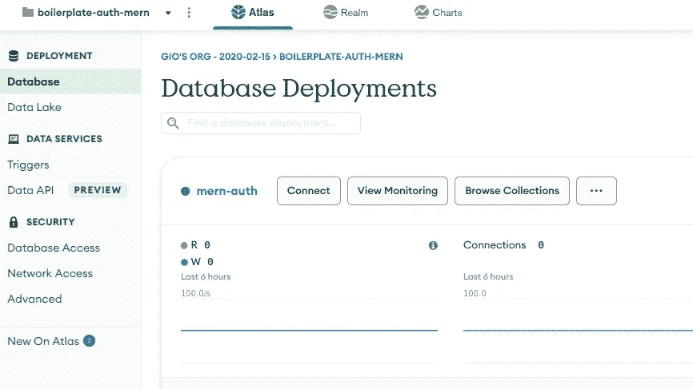
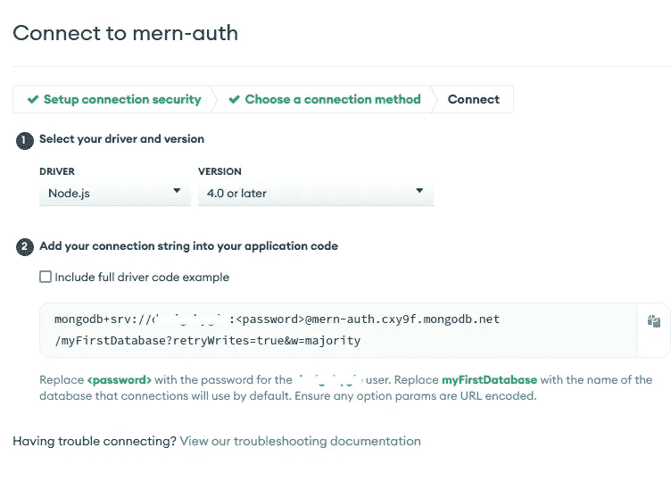

# 带会话的 MERN 认证—第 1 部分:快速登录 API

> 原文：<https://blog.devgenius.io/mern-auth-with-session-part-1-express-login-api-922cd29336a8?source=collection_archive---------0----------------------->

**TL；在本教程中，我们将使用 Expressjs、Session Auth、Reactjs 和 Material UI 构建一个登录/注册表单。**

这是三部分中的第一部分，在这一部分中，我们将重点关注设置项目、创建 Express 应用程序、连接 MongoDB 以及创建登录/注册 API。

下面是最终代码:[https://github.com/gsambrotta/auth-session-mern-boilerplate](https://github.com/gsambrotta/auth-session-mern-boilerplate)

下面是第二部分:[https://medium . com/@ design bygio/mern-auth-with-session-part-2-session-with-MongoDB-and-express-b 185 c 17 ad 6 f 0](https://medium.com/@designbygio/mern-auth-with-session-part-2-session-with-mongodb-and-express-b185c17ad6f0)

下面是第三部分:[https://medium . com/@ design bygio/mern-auth-with-session-part-3-register-log in-form-with-auth-af 4a 1 f 314 DD 1](https://medium.com/@designbygio/mern-auth-with-session-part-3-register-login-form-with-auth-af4a1f314dd1)

注册或登录是大多数应用程序最基本的功能之一；然而，开发它的过程相当复杂。通常，认证过程是这样的:用户通过一个表单注册到一个平台。
然后，用户信息被保存到数据库中，并向用户发回成功消息。
用户现在可以通过一个表单再次登录到平台，该表单将检查数据库该用户是否存在以及插入的凭证是否正确。如果是，用户可以登录。
如果我们考虑客户端和服务器端验证以及安全密码，这个过程可能已经相当复杂了。
除此之外，在实现的这一点上，如果用户重新加载页面或打开一个新的标签，它将不会被登录。我们需要实现一个持久的登录，这就是本教程的内容。

实现持久登录有三种常用方法:

*   **Cookies** :在 Cookies 上存储用户数据，并在服务器发出请求时发送
*   **JWT** :将用户数据存储在浏览器的本地存储器上，并在客户端发出请求时发送给服务器。
*   **Session** :登录后创建一个包含用户数据的 Session 对象，并存储在数据库中。这个会话对象的 id 和截止日期一起保存在 cookies 中，然后在客户机和服务器之间随每个请求一起发送。

这些方法各有利弊。如今，在生产应用程序中，混合使用 JWT 和会话认证是很常见的。
我不会详细讨论每种方法的优缺点，因为这超出了本教程的范围。

# 我们将在本教程中使用什么？

我们将用 Reactjs 和 Material UI 构建一个简单的登录/注册表单 UI，它通过 REST API 连接到 Expressjs 中的后端。
在后台，我们将在用户通过`express-session`登录时创建一个会话对象，我们将在前端检查是否存在一个`session-id` cookie，以确定用户是否应该看到一个登录表单。
我们还将创建一个注册表单，以便能够创建我们的用户数据，并使示例更加完整。

# 项目设置

我们开始创建存放项目的文件夹。
我称它为`mern-auth`，你当然可以随意称呼它。
在终端中，我们键入:

```
$ mkdir mern-auth && cd mern-auth
```

然后我们创建两个文件夹，一个用于客户端应用程序，另一个用于服务器应用程序。为了更好的组织，我们将前端和后端代码放在同一个文件夹下，但它们是完全独立的应用程序。
之后，我们转到服务器文件夹并创建一个`package.json`文件。

```
$ mkdir client server
$ cd server
$ npm init 
```

让我们创建一些开始编写后端代码所需的文件夹和文件。

```
$ mkdir models routers
$ touch index.js .env
```

如果你想用 git 跟踪这个，记得添加一个 `*.gitignore*` *文件。*

这是我们目前为止的文件夹结构:



此时，客户端文件夹是空的。我们将填写本教程的第 3 部分。
现在我们安装一些服务器代码需要的包。请确保在您的`server`文件夹中运行这些命令。

```
$ npm i express mongoose dotenv cors
```

我们要安装什么？
**Express** —我们用于后端
**mongose**—[ODM](https://www.freecodecamp.org/news/introduction-to-mongoose-for-mongodb-d2a7aa593c57/)for MongoDB
**Dotenv**—一个允许我们访问。env 文件，在我们的代码中通过 Nodejs `process`对象。
**Cors** —允许来自我们请求的域之外的域的请求的包。(如果你不知道 cors 是什么，这个[链接](https://findanyanswer.com/what-is-cors-in-express-js)可以帮你解决)。现在，我们已经完成了设置。让我们写一些代码。

# 索引. js

这里我们需要上面安装的所有包。
注意首先要要求`dotenv`，这样我们就可以在代码的早期使用 env 变量。第 6 行我们需要`loginRoutes.js`，这意味着我们需要创建这个文件。我们马上就做。

之后，我们在一个`app`变量中启动 express app 保存，然后我们定义端口，该端口可以是保存在`.env`文件中的值，也可以是保存在`5001.`
文件中的值，然后我们为 cors 中间件定义选项。这里我说允许来自`localhost:3000`的请求。
然后我们通过 mongoose connect 方法连接到 MongoDB 数据库。MongoDB url 也在`.env`文件中定义。
之后，我们让`cors`和`json`中间件可用于应用程序中的所有请求。然后我们告诉 express 使用`loginRoutes`来调用`/api`下的任何调用，最后我们监听端口`3000`来接收来自客户端的任何请求。

让我们快速创建一条路线，这样我们就可以测试我们的应用程序到目前为止是否工作正常。
我们前往`/routes`并创建`loginRoutes.js`
，这里我们在`/login`上写一个简单的 GET 请求，以便能够测试它。

您现在可以在`npm start`下运行服务器。您应该能够在`localhost:5001/api/login`打开浏览器，并在屏幕上看到`login page`消息。

> 为了加速你的开发过程，你可以安装`nodemon`，它是一个包，每次代码发生变化时，它会自动重启服务器。

# 猫鼬和猫鼬 b

是时候创建我们的数据库并与 Express 连接了。
我将演示如何从 [Atlas](https://account.mongodb.com/account/login) 创建一个 Mongo 数据库，显然，您可以随意从任何对您来说更舒适的地方创建它(终端、指南针……)。

这个过程大概是这样的:

*   进入[图集](https://account.mongodb.com/account/login)登录或注册
*   创建一个新的集群—您应该会看到类似这样的内容



*   记得去网络接入，给你现在的 IP 或者更好的`0.0.0.0`。这将允许任何 IP 地址连接到您的群集，因此这只是为了演示。
*   然后单击连接



点击“连接”按钮

*   选择“连接您的应用程序”并获取您的数据库 URL。这里您将看到您的用户名、数据库名，但看不到您的密码。你需要记住这一点！



太好了！我们创建了数据库。现在我们转到`.env`文件，并在那里添加数据库 url。
类似于:

我们最终可以创建我们的模式，这样一旦我们收到用户信息，我们就可以使用数据库了。
让我们转到`/models`并创建一个`UserSchema.js`

这里我们只是为数据库中的用户文档创建一个模式。
我们要说的是:Mongoose 请每次我们向 MongoDB 中的用户文档发送或请求信息时，检查该文档中有三个字段:电子邮件、密码和日期。
它们都是必需的，前两个是字符串，最后一个是日期。
如果这些信息中的任何一条不正确，Mongoose 将不会写入或读取数据库。
在最后一行，在导出模型之前，我们将数据库中的用户文档与这个特定的模式绑定在一起。

厉害！我们现在准备编写我们的`/register`和`/login`表单。

# 路由器

现在是我们应用程序的业务逻辑:路由器。
我们的路由器是 Rest API。每个路由器都是一个端点，我们的 API 将在这里被调用。我们有两台路由器:

*   POST `/register` —当用户注册表单时，信息被发送到这个端点，如果没有通过验证，将在数据库中创建一个新用户。我们没有在数据库中保存实际的密码，而只是一个加密版本。
*   POST `/login` —当用户通过登录表单登录时，信息被发送到这个端点。如果验证通过并且密码匹配，则成功的消息被发送回客户端。

为了散列密码并检查客户端给出的密码是否与保存在数据库中的散列匹配，我们将使用一个众所周知的包:`[bcrypt](https://www.npmjs.com/package/bcrypt)`
所以让我们回到终端并安装它:

```
$ npm i bcrypt
```

现在我们可以开始写路线了。

这里重要的部分有:
**寄存器**

*   检查`email`或`password`是否为空。如果是，返回一个错误(状态`400`)
*   检查密码是否少于 8 个字符。如果是，则返回一个错误。
*   通过 Mongoose Schema 连接到数据库，并使用客户端给出的电子邮件`const user = await userSchema.find({ email })`搜索用户。保存`user`常量中的任何结果
*   如果`user`不为空，返回错误。这意味着数据库中已经有一个使用该电子邮件的用户。一个用户只能有一个电子邮件地址。
*   根据用户模式创建用户对象:`const newUser = new userSchema({email, password})`
*   如果我们到了这一步，散列密码。正如`bcrypt`文档所说，`bcrypt.hash`有一个回调函数作为参数，当操作完成时调用它，返回一个错误或散列密码。
    如果操作成功，我们用散列重写`user.password`字段。用户对象现在将类似于:`{email: 'some@email.com', password: 'jadfkajfdllda380514'}`
*   现在，我们终于可以将新创建的用户(电子邮件和哈希)保存到数据库中了。如果在这个过程中没有错误，我们将向客户端发送一个成功的消息。

**登录:**

*   检查`email`和`password`是否存在。
*   在数据库中搜索带有`email`的用户。将结果保存在`user`中
*   如果`user`是 falsy(空)返回错误。否则，将密码与`bcrypt.compare`进行比较，并将结果保存到`matchPassword`
*   如果`matchPassword`为真，则向客户端返回成功消息，否则返回错误。

现在让我们测试我们的路由器。
我们可以使用类似于`Postman`的工具向`/register`端点发送一个带有电子邮件和密码的 POST 请求。
检查是否没有错误，新用户是否正确保存在您的数据库中(前往 Atlas，查看您的数据库集合)。

如果是，测试`/login`端点。
使用刚才用于`/registration`路线的相同电子邮件和密码发送一个 JSON 主体，并确保没有错误。您应该会看到“您已成功登录”的消息。

在进入主要部分之前，让我们在这里休息一下，我们将在这里实现会话。


你的学习之路需要支持吗？[我们来聊聊共同导师](https://www.codementor.io/@giorgiasambrotta?refer=badge)