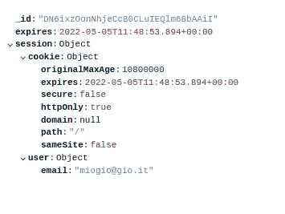

# 使用会话的 MERN 认证—第 2 部分:使用 MongoDB 和 Express 的会话

> 原文：<https://blog.devgenius.io/mern-auth-with-session-part-2-session-with-mongodb-and-express-b185c17ad6f0?source=collection_archive---------3----------------------->

**TL；在本教程中，我们将使用 Expressjs、Session Auth、Reactjs 和 Material UI 构建一个登录/注册表单。**

这是三个部分中的第二部分，在这一部分中，我们将重点关注使用保存在数据库中的会话来授权用户。

下面是最终代码:[https://github.com/gsambrotta/auth-session-mern-boilerplate](https://github.com/gsambrotta/auth-session-mern-boilerplate)

下面是第 1 部分:[https://medium . com/@ design bygio/mern-auth-with-session-part-1-express-log in-API-922 CD 29336 A8](https://medium.com/@designbygio/mern-auth-with-session-part-1-express-login-api-922cd29336a8)

下面是第三部分:[https://medium . com/@ design bygio/mern-auth-with-session-part-3-register-log in-form-with-auth-af 4a 1 f 314 DD 1](https://medium.com/@designbygio/mern-auth-with-session-part-3-register-login-form-with-auth-af4a1f314dd1)

# 什么是会话认证？

当我们谈到会话身份验证时，我们指的是在用户登录后，创建与用户会话相关的信息并将其保存到数据库的过程。

实际情况是:
每次用户登录时，一个会话对象被创建并保存在数据库中。
该对象包含:

*   标识对象的 id
*   有保质期的饼干。这将跟踪用户会话的生存期。例如，如果我们给定 10 天的到期日期，用户将能够从他/她第一次登录开始连续登录 10 天。然后会话过期，用户需要再次登录。
*   用户信息



数据库中的会话条目示例

同时，这个 cookie 是会话对象的一部分，它也被发送到客户端，并且将自动随每个请求一起发送。
一旦我们在前端有了这个 cookie，我们就可以很容易地用它来验证用户是否通过了身份验证(在本教程的第 3 部分中解释)。

现在，希望对会话认证的工作原理有了更清楚的了解，让我们看看如何对它进行编码。

# 在数据库中创建会话条目

为此，我们将使用两个流行的包。

*   `express-session` —创建会话对象
*   `connect-mongodb-session` —将会话自动保存到 MongoDB

让我们首先在我们的 Express 项目中安装软件包:

```
$ cd server
$ npm i express-session connect-mongodb-session
```

index.js —只是会话代码

这些是我们将添加到`index.js`中的新代码位。
我们先来看看它们是什么，再来看看如何整合到`index.js`中。

首先，我们需要两个包。
注意`connect-mongodb-session`期望一个参数，即`session` ，这样它可以将会话保存到 MongoDB。
之后，我们将 MongoDBStore 与 MongoDB 连接起来。
我们通过传递数据库 url 和集合名称来实现。
我将我的会话集合命名为`mySessions.`
如果这个集合在您的数据库中还不存在，MongoDB 会为您创建一个。

接下来是时候配置我们的会话了。
首先，我们用`app.use(session(...))`调用 session 对象作为 Express 应用级中间件。
要设置会话，您可以阅读软件包中的文档，但主要是:

*   **秘密**:服务器用来验证会话的随机令牌
*   **name**:cookie 的名称，如何从客户端读取
*   **store** : `MongoDBStore`或者你所说的与 MongoDB 的连接
*   maxAge:cookie 的截止日期

下面是我们如何将这些行与`index.js`中的其余代码集成在一起

索引. js

# 每次登录时使用会话

既然我们已经设置了会话对象和到数据库的连接。是时候使用会话了。我们前往`/routers/loginRoutes.js`并修改`POST /login`路线。

loginRoutes.js

我们只添加了三行代码:

*   ***const user session = { email:user . email }***—这里简单创建一个带有用户信息的对象，并将其命名为`userSession`
*   ***req . session . user = user session****—我们将`userSession`对象保存到`req.session`对象，这样它就可以被每个请求传递*
*   ****res.status(200)。json({ msg:'您已成功登录'，userSession })*** —将`userSession`添加到响应中，这样它将作为 cookie 发送到客户端。*

*这就是我们在每次用户登录时将会话对象保存到数据库所需要做的全部工作。
如果现在您使用有效凭证向`/login`发出 POST 请求，您应该会在数据库上看到一个名为`mySession`的新集合，它应该包括一个会话对象，如上图所示，带有到期日期和用户电子邮件。
请注意，此会话对象将在 3 小时内有效，然后将从数据库中删除。你可能想延长有效期。*

*在下一部分中，我们将构建登录和注册表单，并了解如何从客户端发送信息，以及如何基于 cookie 值显示不同的 UI。在顶部检查到下一部分的链接。*

**

*你的学习之路需要支持吗？[我们来聊聊 codementor](https://www.codementor.io/@giorgiasambrotta?refer=badge)*