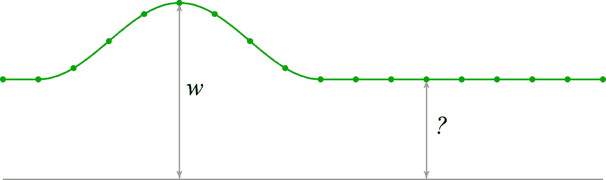
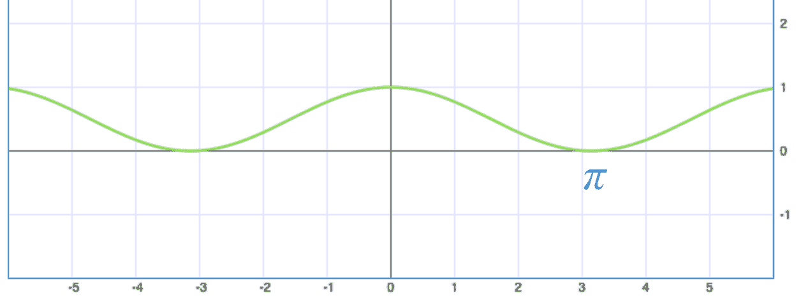
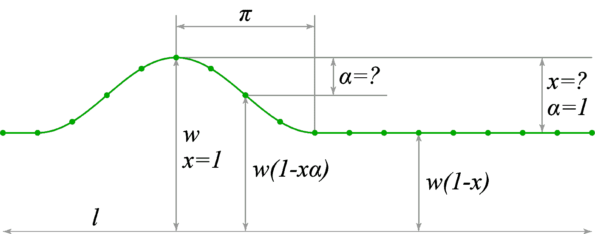
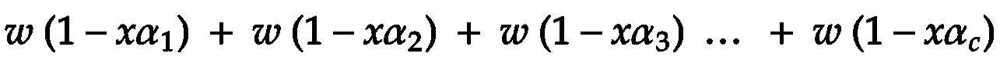
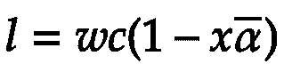
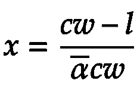
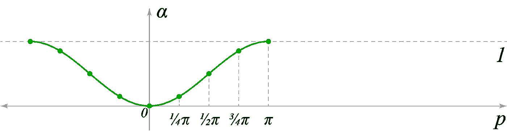
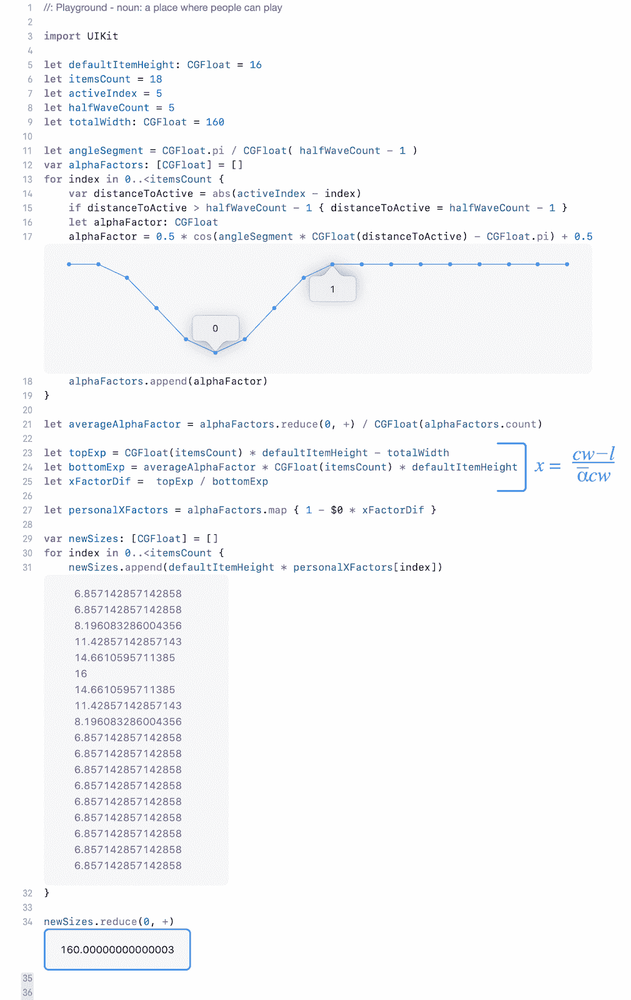

# 界面上的快乐数学

> 原文：<https://blog.devgenius.io/merry-mathematics-at-the-interfaces-3e6baaf720f5?source=collection_archive---------28----------------------->

[JESHOOTS.COM](https://unsplash.com/@jeshoots?utm_source=medium&utm_medium=referral)在 [Unsplash](https://unsplash.com?utm_source=medium&utm_medium=referral) 上拍照

在将我的 iOS 应用程序 [***发布到商店***](https://www.bodich.me/to-the-shop/) 后，我有一种愿望，想分享开发过程中出现的问题的有趣解决方案。尤其是因为这种元素非常常见且经常使用。但是我希望这个方法可以对其他人有用，甚至对其他任务有用，或者启发改进，所以我决定分享这个方法如何工作的详细解释。

在为 iOS 编写自己的应用程序的过程中，我需要创建一个自定义页面控件，以圆圈的形式显示卡片列表中的当前位置。

首先，我将解释问题的本质。页面控件的最简单版本看起来像下面的第一个动画:

问题是我们有一个宽度限制，在某一点上，元素的数量达到这样一个水平，页面控件的整体宽度将超出指定的限制。由于我没有找到我喜欢的现成解决方案，我画了几个选项，选择了我认为可以接受的一个。拒绝所有带有空格元素(如三个点)的选项，或者转换为滑块，用户可以清楚快速地意识到位置，分配如下:

1.  缩小所有项目的尺寸，以满足宽度限制(但当前元素在小尺寸下看不清楚)。
2.  保留原始大小的一个元素，并平均减少所有其他元素。
3.  通过指定数量的步骤，从元素的原始大小平滑过渡到较小的大小。

我选择选项#3，因为它给出了最有趣和最吸引人的外观，而且我们可以清楚地看到当前页面是最突出显示的项目。此外，为了实现谐波过渡，决定通过余弦函数进行过渡。

结果清楚地显示在下面的动画中。

## 1.计算步数

让我们把元素的基本尺寸为 ***w*** 并在图上标出。计算的最终目标是找到最小元素的大小。一个余弦波之外的所有元素将与该波末端的最小元素大小相同。

问题的主要条件和本质是保持整个页面控件的宽度不变，即所有元素的总和必须是常数。

****对于较少的元素，您可以手动输入元素大小限制，如上面动画中所应用的。没有限制，在缺少元素的情况下，边元素反而会变大。此外，如果宽度非常小，尺寸可以取负值。在本文中，我不会强加这些限制，以免使文章变得复杂。***

首先，让我们构建所需的图表:

让我们设计一个能给出适当图形的函数。下面的函数给出了从 ***0*** 到 ***1*** 范围内的结果，这对于计算 reduction ***w*** 基值的相对系数是很有用的，通过它我们可以计算出最小元素的大小。

***0.5 cos(p)+0.5***，其中 ***p*** 是以弧度为单位的角度。

记住这个公式，在下面的计算中会用到它。图表:

下一步是输入计算每个元素大小所需的值。

***l*** —页面控件的总宽度(所有元素的总和)

***w*** —一个元素的基本尺寸

***c*** —页面控件中的元素总数

***s*** —最小元素的期望尺寸

***x*** —反比系数 ***w*** 尺寸缩小，从 ***0*** 到 ***1*** 。例如，当 ***x = 0.2，******s = w * 0.8***

***α***——是与系数 ***x*** 成正比的缩减系数

假设基数大小为 ***w*** 。由于较小的尺寸将被**T5【x】T6**缩小，最小元素通过公式***s = w(1–x)***计算。为了计算中间尺寸，使用 ***x*** 是不够的，所以我们引入了一个附加系数 ***α*** ，它将在从*到 ***1*** 的范围内取部分 ***x*** 。所以现在任何尺寸都可以用公式***s = w(1–xα)***计算。根据该公式，对于每个元素，只有 ***α*** 将被改变，因此所有元素的总和将被计算如下:*

**

*其中 ***c*** 这是元素的个数*(见最后一个索引)*。因此，要找到总宽度，我们可以推导出以下最终公式:*

**

*其中 ***α*** ‾是从 ***1*** 到 ***c*** 所有 *α* 的算术平均值。*

*由于我们的目标是找到元素的大小，我们需要从这个公式中推导出 ***x*** ，我们将这样做。为了便于计算和防止错误，我使用了 WolframAlpha 服务(原谅我的数学老师)。*

**

## *2.画波浪*

*我们现在要做的就是计算每个元素的所有 ***α*** 并求它们的算术平均值。记得我们的余弦函数吗？*

****. 5 cos(p)+0.5***。向左移动角度 rad，使其相对于具有元素大小的图形反转，得到公式:*

****α= 0.5 cos(p–π)+0.5***，其中 ***p*** 为以弧度为单位的角度(或距中心元素的距离)。*

*让我们建立一个指示所需值的图表:*

**

*你注意到了吗？当然啦！未知范围 ***x*** :)中的前一幅图像的相同倒置图*

*让我们记住上面开发的规则，它决定了页面控件的外观。过渡的最后一个元素的 ***p*** 的值总是落在 ***π*** 弧度上。因此，对于一个波之外的所有元素，我们确定 ***p = π*** ，这将在图上给出一条直线，并且对于所有后续元素具有相同的大小。*

*示例图上的半波分为 4 个部分*(在下面的代码示例中，它将被确定为半波中的 5 个元素，最大和最小的)*。因此，对于最大元素，计算采用以下形式:*

****α= 0.5 cos(0–π)+0.5 = 0***，因此*

****s = w(1–x * 0)= w****

*即全尺寸。对于波的最后一个元素，我们将进行下一个计算:*

****α= 0.5 cos(π–π)+0.5 = 1***，因此*

****s = w(1–x * 1)= w(1–x)****

*即基数减去 x，这是最小的元素。*

*下一步是什么？然后我们为每个元素计算 ***α*** ，代入上一段推导的公式。*

## *3.构建结果*

*理论当然很有趣，但更有趣的是创造出有用的东西。让我们用代码总结所有的计算。我用的是 Swift 语言，但我确信用你使用的任何语言重写都不会很难，语法很容易理解。*

**

*一切正常，计算正确。在测试代码的最后检查产生期望的 160 点的宽度。*

*基于上述计算，复制真实界面元素的变体。看起来更好的动画和真实的 60 帧/秒；)*

*那么从这篇文章中可以学到什么呢？事实上，我更加坚信，至少偶尔锻炼创造力和发明创造性的解决方案会更有趣。它不会让你感到无聊，并给你享受工作成果的理由。我们当中有谁不想感受一点审美的愉悦呢…*

*你怎么想呢?请在评论中添加您感兴趣的解决方案。*