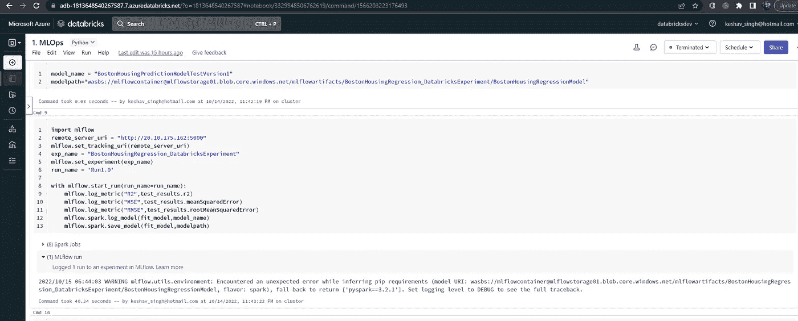
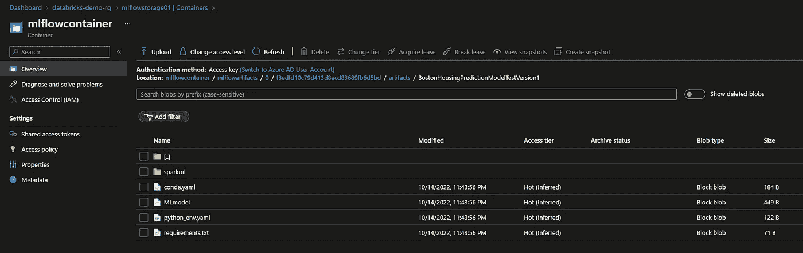

# 将 Azure 上的 MLOPS 与 MLFlow 啮合

> 原文：<https://blog.devgenius.io/meshing-mlops-on-azure-with-mlflow-c1c1ffa59e32?source=collection_archive---------5----------------------->

高层建筑

这是 3 部分系列的第一部分，接下来是—

[**2。MLFLOW** 上的分散式 m lops](https://medium.com/@masterkeshav/decentralized-mlops-on-mlflow-ab25199f7ba4)

[**3。MLFLOW 上的分散式 MLOPs 规模化生产模式**](https://medium.com/@masterkeshav/decentralized-mlops-on-mlflow-productizing-model-for-scale-c99ed4ed625)

# 搭建舞台

典型的网状架构意味着一个中央自助式开放标准互操作平台，为域(总线)提供访问管理、数据管理、数据共享、治理、合规性和**本质上的 MLOPs** 等功能。在这篇博客中，我们将利用 MLFlow 建立 ML 生命周期，ML flow 是一个用于管理 ML 生命周期的开源机器学习平台和框架。参考[https://mlflow.org/](https://mlflow.org/)

网格平台团队利用 MLFlow 为所有领域团队集成中央" **MLFlow 服务器和注册中心**"服务，以满足他们各自的 MLOps 需求。上面的架构将“**领域数据产品开发人员**”角色进一步分解为 3 个角色

*   数据工程师
*   **b .)数据科学家&**
*   ML 工程师

数据发布工厂

“**数据发布工厂**是一个高度专业化的数据集成、工程、数据发布系统，用于**操作原始数据摄取**和**构建分析丰富的数据产品**。它是一个 ETL 框架，用于构建高质量、可靠、可维护和可测试的数据管道。它具有内置的集成功能，可以产生所需的沿袭、一致的文件格式(如 delta)、版本、可观察性(遥测、监控、数据新鲜度)指标和更广泛的组织合规性。它是一个有效的低代码 ETL 框架，由中央平台团队为所有领域团队开发，以增加和创建数据开发一致性并加速网格。

分散网格方法

***分散式方法*** 建议中央自助服务平台充当促进者和边界治理守护者。在中央自助控制平面上，域数据是可发现和可预订的。数据科学家能够从控制平面上的不同领域发现、订阅数据和功能(功能存储)。然后，DS 社区可以实验、训练、调整和注册 ML 值资产，他们可以将特性发布回特性存储，并实验和建模工件。这些都被版本化和维护。然后，它们可以作为组织资产在整个组织中广泛访问。DS 充当模型的控制和质量管理员。

然后，整个组织的领域 ML 工程师可以发现、访问和采用理想的任何 3 种(请求-响应、批处理、事件流)评分模式的模型。维护评分管道是领域 MLE 的工作。

领域数据工程师维护源数据集。维护模型质量是负责数据科学家的责任。类似地，维护 ML 评分管道是领域 ML 工程师的职责。他们都继续在自助服务平台上发布可观察性和服务健康指标，以实现完全透明、信任和可见性。DPF(数据发布工厂)ETL 框架及其内置的沿袭、可观察性和服务健康接口有助于高效集成和加速分散式开发。

参考我的系列来理解和建立更丰富的背景知识。

*   [分散领域数据工程第一部分](https://medium.com/@masterkeshav/decentralized-domain-data-engineering-part-i-c1ada63c2023)
*   [分散领域数据工程第二部分](https://medium.com/@masterkeshav/decentralized-domain-data-engineering-part-ii-842a8589250c)

参考架构

在 2022 年**数据+人工智能峰会**上的这个演讲引起了我的共鸣，提升了我的推荐，我强烈推荐在这里听这个演讲:[https://www.youtube.com/watch?v=cZwjL0vps5k&t = 915s](https://www.youtube.com/watch?v=cZwjL0vps5k&t=915s)

本博客的目的是实际操作，针对中央平台团队，并为域团队建立一个集中式 MLFlow 服务器和注册中心，以在平台上建立 MLOPs 作为域采用的开放标准。这是一个非常实用的演示，一步一步地演示如何设置服务器，并通过演示 2 个领域团队利用这一点来评估**价值成果。**

**托管 MLFlow 的 Windows 服务器**

我们利用我们在这里设置[的 Windows VM，并利用它来设置我们的 MLFlow 服务器。](https://medium.com/@masterkeshav/serving-data-products-with-delta-sharing-protocol-33b1d4d051a0)

我们首先在这个虚拟机上安装来自【Python.org】Python 版本 Python 3 . 10 . 8 | T2 的最新 Python 版本。

确保安装还在 Windows 虚拟机上配置环境变量。

窗口虚拟机上的环境变量

确认 Python 安装

创建目录

并创建一个 Python 虚拟环境。

在目录 environment_folder 上创建一个 Python 虚拟环境

**我们创建了一个虚拟环境，PIP 在我们的虚拟环境上安装了 ml flow**。

从[https://git-scm.com/download/win](https://git-scm.com/download/win)在 Windows 虚拟机上安装 Bash

以及来自[https://learn . Microsoft . com/en-us/CLI/Azure/install-Azure-CLI-windows 的 Azure CLI？tabs=azure-cli](https://learn.microsoft.com/en-us/cli/azure/install-azure-cli-windows?tabs=azure-cli)

一旦通过我们就可以确认。

登录 Azure 订阅

我们现在应该能够从 BASH 连接到您的 Azure 帐户。

登录 Azure 并创建 Azure Blob 存储帐户

Azure Blob 存储帐户

该帐户将作为 MLFLow 服务器的工件和指标的存储。

创建一个容器

在 Blob 存储容器上创建目录

为后续步骤复制存储密钥

上 Bash，用配置好的 Azure Blob 存储连接 MLFlow，并启动 MLFlow 服务器。此时，服务器已经启动..

MLFlow 服务器

可以通过 URL [确认本地的服务器 http://localhost:5000/#/experiments/0](http://localhost:5000/#/experiments/0)

MLFlow 服务器

此时，服务器还不能从外部完全访问。要启用它，我们需要在虚拟机上添加一个入站规则。

添加入站规则以允许入站连接

在 Windows 虚拟机上进一步打开端口 5000

在 Windows 虚拟机上打开端口 5000

[http://<IP>:5000/#/experiments/0](http://20.10.175.162:5000/#/experiments/0)

在这一点上，它在外部被激活并发挥作用。

MLFlow 外部功能

**领域团队利用 MLFLow**

中央团队已经准备好服务器，现在我们将演示两个领域团队使用 Azure Synapse 和 Azure Databricks 来开发、注册他们的 ML 模型，并将其用于他们的 e2e mlop。

**第一个域用户:Azure Synapse Spark Pool**

领域团队使用 Azure Synapse，并在波士顿住房数据上开发了一个回归模型。它们引用 MLFLow URI 并在服务器上记录必要的模型度量、参数、工件。他们的开发之旅被大大简化和结构化了。数据工程师通过数据发布工厂帮助构建必要的管道，数据科学家对结果执行所需的分析和严格要求，ML 工程师进一步将该模型与来自该平台中央服务器的实时数据相集成，以便为组织启用和支持评分分析。这个过程是高度分散的。

在 Azure Synapse 上开发和注册模型

在 MLFlow 服务器上注册的实验

所有工件和度量。

后端存储。

**第二域用户:Azure Databricks**

数据块回归

领域团队 ML

作为 Databricks 或 Azure Synapse 笔记本上的配置，请确保 Blob 的配置已设置，并且库依赖项已就位。

域团队存储连接

度量和工件

文物储存

这两个领域团队都成功地拥有并利用了他们的 MLOPs 的 MLFlow，而平台团队也为此提供了便利。

MLFlow 模型的详细信息被完整记录以供参考 [MLflow 模型-ml flow 1 . 29 . 0 文档](https://www.mlflow.org/docs/latest/models.html)

**摘要**

*概括本博客中提出的观点——这是网状平台上 MLOPs 标准化的实际演示。虽然这只是这个想法的一个粗略的表述，但是它从根本上确立了这个概念和对它的需求。通过深思熟虑的工程和解决方案，可以进一步完善 MLFLow 订阅的整体体验，并将其包装在一个干净的场所中。这成为组织网状 MLOPs 转型的基础。让我们加入* [*系列的下一个*](https://medium.com/@masterkeshav/decentralized-mlops-on-mlflow-ab25199f7ba4) *！*