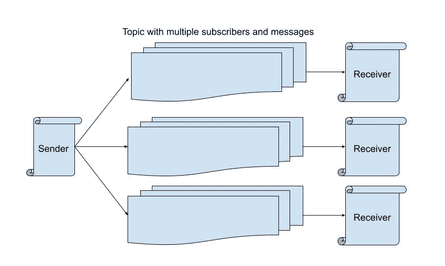
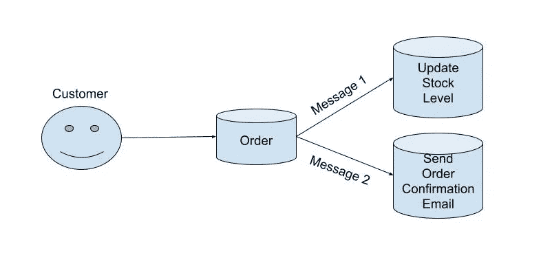

# 消息代理架构，它是什么，如何工作

> 原文：<https://blog.devgenius.io/message-broker-architecture-what-is-it-and-how-does-it-work-60a62f8ce784?source=collection_archive---------5----------------------->

## 什么是队列、主题和订阅

照片由
穆罕默德·拉赫马尼在 [Unsplash](https://unsplash.com/photos/gA396xahf-Q) 拍摄

**快速概览**

随着技术成为我们生活中必不可少的一部分，我们渴望速度，因为时间是一种巨大的资源，但应用程序越来越大，越来越复杂，数据越来越多，这可能会减慢速度。但是不要害怕，因为有相当多的解决方案，其中之一是使用消息代理。

消息代理是一个软件，它使服务和应用程序能够通过消息进行通信。消息结构独立于发送它们的服务。我们可以说消息代理有三个基本部分。

1.  **生产者** —负责发送消息的应用程序或服务。(在主题-订阅概念中也称为发布者)。
2.  **消费者** —将接收消息的应用程序或服务。(在主题订阅概念中也称为订阅者)。
3.  **队列/主题** —消息代理使用它们来存储消息，我们将在下面看到不同之处。

**关键概念**

1.  **队列**

队列是两个关键概念中较简单的一个。消息进入队列，并按到达时间排序。在这种情况下只有一个接收者，所以如果您有触发单个事件的操作，比如说一个用户创建了一个帐户，我们想要发送一封欢迎电子邮件，那么队列将是理想的解决方案。

**2。主题**

这个主题更加通用，可以有多个订阅附加到这个主题上。如果一个服务订阅了一个主题，它可以接收发送到该主题的每条消息的副本，或者可以使用过滤器来缩小我们希望服务接收的特定消息的范围。

举个简单的例子，我们有以下场景:

我们有一个网上商店，一个客户从我们这里订购了一些东西。当订单成功插入时，我们希望 A)相应地更新我们的库存水平，B)向该客户发送一封确认电子邮件，让他知道我们正在处理他的订单。

实现这一点的一种方法是编写如下内容:

但是，这样做的问题是，即使我们创建了订单，我们仍然需要等待两个异步调用。(这可能在您的领域逻辑中，而不是在控制器中，但是为了减少代码行和简单性，我将把它留在这里)。如果每个调用需要几百毫秒，那么整个请求会慢一些。

另一种选择是做类似的事情:

现在，这将做的是删除异步，并向我们的服务总线发送两个消息。另一方面，我们将有两个服务— EmailService 和 StockService，它们正在等待接收这些消息并发挥它们的魔力。这将使我们的整个请求更快，因为这两个调用应该是即时的，如果例如发送电子邮件有问题，订单仍然会被确认，而在第一个示例中，如果两个调用中的任何一个失败，请求将失败。另一件要知道的好事是，如果我们发送邮件，但是说，我们的电子邮件服务关闭了，当它恢复时，它仍然会接收邮件并发送电子邮件。

**使用消息代理的优势**

1.  在可能不同时运行的服务之间提供通信。
2.  通过将任务分配到不同的进程来提高系统性能，从而提高速度并带来更好的用户体验。
3.  通过保证消息将被传输来提高可靠性。正如我们提到的，在消费者失败的情况下，消息可以重新发送。

**有些缺点**

1.  复杂性增加。使用消息代理将为您的系统架构添加一个全新的层，并且需要考虑更多的细节，例如维护组件之间的网络或潜在的安全问题。
2.  调试可能会变得更加困难，因为您将使用的消息传递代理将拥有自己的日志，所以您最好实现一些自己的日志记录，以使工作更加轻松。
3.  一开始学习曲线很陡。