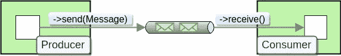

# PHP 中的消息处理— Symfony Messenger、Laravel 队列和生态区

> 原文：<https://blog.devgenius.io/message-processing-in-php-symfony-messenger-laravel-queues-and-ecotone-8ca17102c5b2?source=collection_archive---------2----------------------->


# PHP 中的消息处理— Symfony Messenger、Laravel 队列和生态区

消息处理在 PHP 中越来越受欢迎。
把所有的逻辑放在简单的请求-响应模型中已经不足以满足我们当前的系统需求。
我们的应用越来越多。注册后发送电子邮件、呼叫外部服务或执行一些密集任务已成为标准。

消息平台(RabbitMQ、Kafka、SQS 等)**通过增加系统可以承受的负载量、引入后台处理和处理失败重试来帮助解决这些问题**。

**Symfony Messenger** 、 **Laravel Queues** 和**econtero Framework**为消息处理提供了更高层次的抽象，隐藏了与给定消息平台的集成并引入了附加功能。

# 任务队列和消息代理之间的区别

有不同类型的平台可以用来解决 PHP 中的异步处理，其中一些是任务队列，另一些是消息代理。

***任务队列*** 像 [Beanstalkd](https://beanstalkd.github.io/) 一样提供了对任务(消息)的抽象。任务或工作描述需要做什么，异步工作进程处理它。
任务队列提供完整的生命周期支持，因此我们可以跟踪给定任务的状态(准备处理、正在处理、已完成)。
他们提供`Point to Point Channels`，这意味着我们发送任务(消息)，它将被准确地交付给一个工人(消费者)。

> 任务队列有助于减轻系统工作负载

另一方面， ***消息代理*** 像 [RabbitMQ](https://www.rabbitmq.com/) 提供了更灵活的处理消息的方式。
它允许`Message Routing`基于不同的标准或者向多个消费者(工作者)传递一个消息的副本。对于消息代理来说，消息只是从一个地方传递到另一个地方的信息。应用程序使它具有实际意义。

多亏了路由功能，消息代理可以以`Point To Point`的方式或者在`Publish And Subscribe`之前传递消息。
在发布和订阅中，消息被发布，任何感兴趣的人都可以订阅它。由于这一点，发布者可以与订阅者(消费者)完全分离。

> 消息代理可以减轻您的工作负担，但也非常适合构建消息流和跨服务通信，因为它们本质上处理消息分发和解耦通信。

Symfony Messenger、Laravel Queues 和 econtero**提供自己的抽象来发送和处理消息**。
这意味着，他们**将平台视为传输层**，提供足够的集成来覆盖他们自己的功能。
这有助于在不同平台上提供相似的体验，并通过隐藏复杂性来降低入口点。

> 了解你的框架提供了哪些功能是很有价值的。
> 只要它将覆盖您的用例，您就不需要直接处理消息代理或任务队列集成。

# 什么是消息传递？

下面的描述来自伟大的著作[企业集成模式](https://www.enterpriseintegrationpatterns.com/patterns/messaging/)，它描述了消息传递模式的使用和实现。


消息传递或消息传递架构是使用消息实现**通信的一种方式。**

就像一封信一样，消息包含**有效载荷**和**报头**。
有效载荷包含我们想要传输的数据。
另一方面，消息头用于路由消息，并为其添加额外的信息，如消息的标识符、谁是执行者或何时发生。



使用**端点**从**通道**发送和接收消息。
通道可以是点对点的，只有一个消费者可以接收发送到通道的消息，也可以是发布-订阅的，将消息广播到所有订阅端点。
端点是我们处理、转换或过滤消息的地方，这是我们通常称之为**消息处理器**的地方。

一般来说，应用程序不应该知道它正在使用消息传递。应用程序的大部分代码应该不考虑消息传递。这将应用程序从集成问题中解放出来，让它解决业务问题。

那么，消息处理程序(端点)如何能够在不知道消息传递的情况下仍然接收和发送消息呢？
由**消费者**包装，根据需要可以是**事件驱动**(同步执行)或**轮询**(异步轮询消息)。
为了向通道发送消息，我们使用了**消息网关**。这是抽象，隐藏了构造消息和连接外部平台的复杂性。

# 高级框架抽象

让我们看看每个框架提供的抽象。我将遵循消息传递术语，但是我将把这些术语映射到每个框架的实现细节。

# Symfony 信使

[**Messenger**](https://symfony.com/doc/current/messenger.html) 在 Symfony 框架中引入消息解决方案。
它提供了一个消息总线，能够发送消息，然后在您的应用程序中立即处理它们，或者通过传输(例如队列)发送它们以便以后处理。

> Symfony Messenger 与 Message Broker 的相似之处多于与任务队列的相似之处。

# 什么是消息？

Message(称为 **Envelope** )是一个类，包含净荷(称为 **Message** )和报头(称为 **Stamps** )。

> 在 Symfony Messenger **中，有效载荷**必须是 **PHP 类**。

只要不想扩展基本功能，就不需要直接使用 Symfony 实现 Message。

# 消息如何发送到消息处理程序？

消息网关被称为**总线**。

```
$bus->dispatch(new PlaceOrder('milk'));
```

`Dispatch method`获取类，并根据类名寻找可以处理该类的消息处理程序。

> 默认情况下，Symfony Messenger 不提供点对点通道，因为您可以从多个消息处理程序订阅单个消息。
> 然而，Messenger 允许定义自己的总线，可以通过设置来实现这一点。

# 如何通过路由关键字路由消息？

不可能使用路由关键字来路由消息。
这来自于设计，因为消息期望一个实际的类作为有效载荷，并且基于给定的类，我们知道它应该被路由到哪里。

# 如何丰富这种行为？

Symfony Messenger 附带了中间件的实现。
中间件连接到给定的总线并拦截消息流，提供添加额外行为或改变消息的可能性。

# 如何同步处理消息？

每当我们使用消息网关(总线)发送消息时，默认情况下都是同步处理的。

# 如何异步处理消息？

当我们使用消息网关发送消息时，Symfony 增加了特殊的中间件`SendMessageMiddleware`。
该中间件停止流程，并向外部平台(数据库、RabbitMQ 等)发送消息。
然后有一个消费者消费消息并再次运行消息网关，然而这一次是通过`ReceivedStamp`告诉中间件让流继续。

# 如何传递消息头？

为了构造带有消息头消息，我们需要为每个消息头提供实现 StampInterface 的类。

> *您可以在中间件中访问标题，但是目前无法在消息处理程序中访问标题。*

# 如何整合不同的应用？

对此没有现成的解决方案。
但是，您可以在两个应用程序之间共享配置，其中一个应用程序将发布消息，另一个应用程序将运行消费者。

> Messenger 中的 Payload 是一个类，因此它要求这个类在两端都可用，以便正确地反序列化它。

# 生态交错带框架

[生态区](https://github.com/ecotoneFramework/ecotone)从地面上看是围绕着信息传递概念建立的。它提供了企业集成模式的实现，并提供了易于工作的 API，该 API 隐藏了应用程序代码中的消息传递细节。
Ecotone 可以与 Symfony、Laravel 一起使用，或者根本不使用额外的框架。

> 与任务队列相比，生态区与消息代理有更多的相似之处。

# 什么是消息？

Message 是一个类，包含有效载荷和报头。

> 在生态区**中，有效载荷**可以是任何 PHP 类或数组、XML、JSON、简单字符串。

econtero 遵循的原则是**你不应该被迫使用框架特定的类**。或许，你永远不需要直接使用 econtero 的消息实现。

# 消息如何发送到消息处理程序？

生态区提供消息网关实现。默认提供 3 种实现:**命令总线**、**事件总线**和**查询总线**。

```
$commandBus->send(new PlaceOrder('milk'));
```

`Send method`获取类，并根据类名寻找可以处理该类的消息处理程序。

> CommandBus 和 QueryBus 由点对点通道支持，这意味着它们的目标是单一的消息处理程序。
> 另一方面，EventBus 提供了发布/订阅解决方案，其中多个处理程序可以订阅一个给定的消息。

# 如何通过路由关键字路由消息？

您可以使用路由发送您的消息。

您的命令处理程序将使用属性中提供的路由关键字连接到给定总线。

> 生态区将获取消息的有效负载，并根据消息处理程序的类型提示将其反序列化为给定的类。
> 您也可以不使用任何参数，只使用路由来调用命令处理程序。

# 如何丰富这种行为？

生态区提供了**截击机**的概念。
它允许在选定的时刻丰富给定消息处理程序或一组消息处理程序的行为。
您可以在处理程序执行之前/之后或者在消息发送到异步通道之前拦截消息流。

> 您也可以定义自己的属性来注释您的消息处理程序，然后您可以将它们作为拦截的目标。

# 如何同步处理消息？

每当我们使用消息网关(总线)发送消息时，默认情况下都是同步处理的。

# 如何异步处理消息？

生态区允许用异步通道替换消息处理程序连接的默认同步通道。

> 消息处理程序自行决定是以同步方式还是异步方式处理给定的消息。

生态区允许将特定的消息处理程序标记为异步运行，而不是将整个消息标记为异步处理。
当有多个消息处理程序订阅给定的消息时，这就不同了，因为它允许决定系统的哪些部分应该异步运行，哪些不应该。

> 每个消息处理程序接收它自己的消息副本。当我们异步运行它们时，这将改变游戏规则，因为每个处理程序都在独立地处理自己的消息，所以一个失败的处理程序不会影响另一个。

# 如何传递消息头？

生态区提供了将消息头注入消息处理器和拦截器的可能性。

# 如何整合不同的应用？

生态区提供了使用 RabbitMQ 集成将不同应用程序集成在一起的可能性。

您可以发送命令，通过定位给定的应用程序来实现点对点集成。
除此之外，你可以发布事件来实现发布和订阅，其中多个应用程序可以订阅给定的消息。

> 因为 econtero 与 Symfony 和 Laravel 一起工作，根本没有框架，你可以用它来集成任何 PHP 应用程序。

# Laravel 队列

[Laravel Queues](https://laravel.com/docs/9.x/queues) 允许您轻松创建队列作业，这些作业可以在后台处理，以减轻您的 web 请求密集型任务。

> Laravel Queues 与任务队列的相似性大于与消息代理的相似性。

# 什么是消息？

Laravel Queues 将 Job 作为消息引入。Message 是一个 PHP 类，也是一个消息处理程序。
标题的概念不存在。

# 消息如何发送到消息处理程序？

Message 是一个消息处理程序，所以它执行自身来完成工作。

```
PlaceOrder::dispatch($order);
```

# 如何通过路由关键字路由消息？

设计期望能够访问给定的类以便执行它，所以没有通过键路由的概念。

# 如何丰富这种行为？

Laravel Queues 提供了在消息中注册中间件的可能性。
中间件必须符合给定的接口。

# 如何同步处理消息？

利用`dispatchSync`方法进行同步调度。

```
PlaceOrder::dispatchSync($order);
```

# 如何异步处理消息？

默认情况下，消息是异步处理的

> 如果要使用默认队列，可以省略 onQueue 方法。

# 如何传递消息头？

没有消息头的概念。

# 如何整合不同的应用？

Laravel Queues 是一个类似任务队列的实现，它不是为跨应用程序通信而设计的。

# 摘要

**Symfony Messenger** 和**econtero**面向通用消息处理，可用于系统解耦、构建消息流和卸载工作。
**排队等候**主要是为了卸下工作。

最重要的是，每个框架都提倡使用消息和异步处理。这推动了我们 PHP 社区的发展:)

点击了解更多关于 Symfony Messenger [的信息。
点击](https://symfony.com/doc/current/messenger.html)了解更多关于生态交错带框架[的信息。
点击](https://github.com/ecotoneframework/ecotone)了解更多关于 Laravel 队列的信息[。](https://laravel.com/docs/9.x/queues)