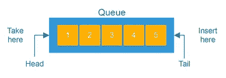
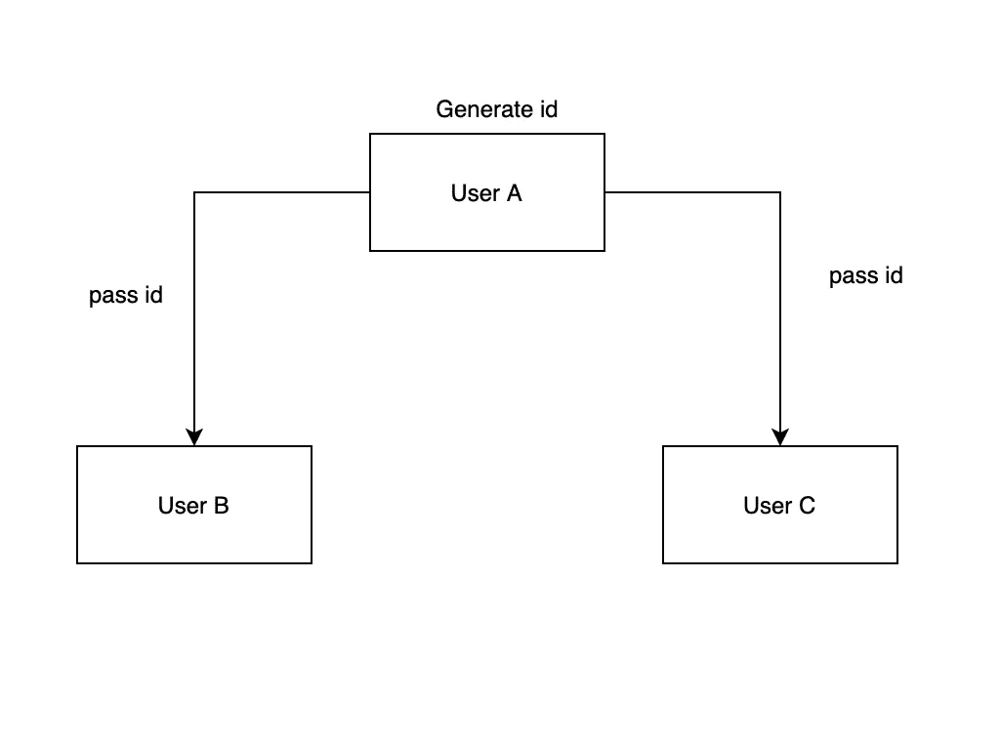
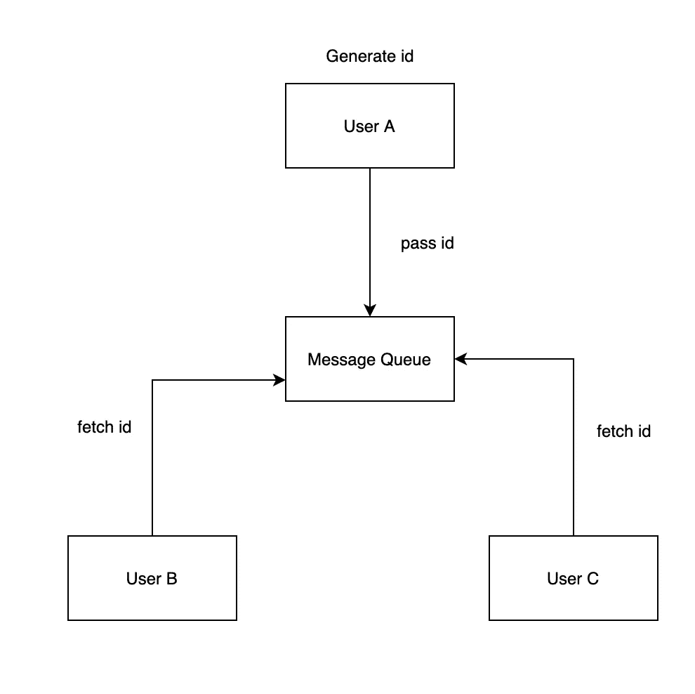

# 向奶奶解释消息队列

> 原文：<https://blog.devgenius.io/message-queue-what-and-why-230bdf295469?source=collection_archive---------27----------------------->

解释什么是消息队列以及我们为什么使用它的最简单的方法。


由 [Ethan Hu](https://unsplash.com/@ethanhjy?utm_source=medium&utm_medium=referral) 在 [Unsplash](https://unsplash.com?utm_source=medium&utm_medium=referral) 上拍摄的照片

如果你不知道什么是消息队列，我想你可能知道什么是数据结构中的队列。如果你不知道，我想你应该明白上图的人在做什么。

## 我们的问题是

队列不是一个复杂的术语，它解释了对象在被处理之前必须等待它前面的对象完成。下面是数据结构中的队列:



消息队列有一个非常相似的功能。生产者将消息发送到队列的尾部，而消费者从队列的头部获取消息。很简单！但是我们为什么在系统设计中使用它呢？

## 为什么我们使用消息队列？

假设用户 A 为用户 B 和用户 c 生成一个 id，现在我们有一个这样的结构:



我们可以得到下面的伪代码:

```
public class UserA {      
  UserB userB = new UserB();    
  UserC userC = new UserC();      
  private String userId = "myID";  

  public void doSomething() {      
            userB.UserBneed(myID);  
            userC.UserCneed(myID);      
  }
}
```

一切看起来都很好！然而，几天后:

*   用户 B 告诉 A:“嘿，我不再需要你的 ID 了，你能把它拿掉吗？”。
*   用户 D 来告诉 A:“嘿，你能把我包括在你的系统中吗，我需要你的 ID 来做一些事情”

用户 A:“好的，我可以做到”。

```
public class UserA {      
  UserB userB = new UserB();    
  UserC userC = new UserC();   
  UserD userD = new UserD();  

  private String userId = "myID";  

  public void doSomething() {      
          //  userB.UserBneed(myID);  
            userC.UserCneed(myID);   
            userD.UserDneed(myID);   
  }
}
```

很简单。嗯，随着时间的推移:

*   d 说:“你能把我撤了吗？”
*   e 说:“可以加我吗？”
*   d 说:“可以加我回去吗？”
*   f 说:“可以加我吗？”

似乎用户 A 必须花费大量时间来添加或删除这些依赖项。

这还不是最糟糕的。有一天用户 A 没有把 ID 成功传递给用户 B。与此同时，将 ID 传递给用户 b 要花费非常多的时间。现在，用户 A 必须一个接一个地解决问题。我相信用户 A 除了解决这个问题，还要思考如何逃跑。

## 这就是解决方案——消息队列！

现在我们来解决这个问题。用户 A 意识到我为什么要做你们应该做的工作？然后，他创建了一个消息队列，在这个队列中，他只发送 B 和 C 想要的所有数据。现在 B 和 C 可以在任何需要的时候获取数据。



通过提供这种架构，我们有 4 个好处:

1.  用户 A 只是将数据发送到消息队列，并不关心谁使用它。不管用户 D 是否想要数据，这与用户 A 完全没有关系。
2.  其他用户可以从消息队列中获取数据，而不是等待用户 A 调用他们的 API。通过这样做，即使其他用户无法获取数据或者获取速度很慢，这也不再是用户 A 的工作。
3.  需要来自用户 A 的数据的其他用户可以异步获取数据。如果我们没有消息队列，用户 A 必须一个接一个地调用其他用户来发送数据，这将花费更多的时间。因此，消息队列显著提高了请求速度。
4.  想象一下，我们有处理请求的服务器，但没有消息队列。如果短时间内请求的数量增加超过了服务器的处理限制，服务器将会关闭。有了消息队列，服务器可以根据自己的能力获取数据，确保不会处理超出限制的请求。

## 使用消息队列的好处是什么？

*   如果消息队列关闭，整个系统将失去功能。因此，我们必须确保消息队列总是分布式的。如果当前消息队列消失，这将把数据定向到其他健康的消息队列。
*   如果消息队列已关闭，队列中的数据将会丢失。复制可以解决这个问题。
*   添加消息队列会使系统更加复杂。一个主要原因是消费者必须从消息队列中获得推送通知，或者定期从队列中轮询数据。

## **结论**

消息队列无疑是在复杂系统中分离组件的好方法。

感谢您花时间阅读这篇文章。如果您有任何建议，请随时发表评论或通过 [LinkedIn](https://www.linkedin.com/in/lee-qi/) 联系我。