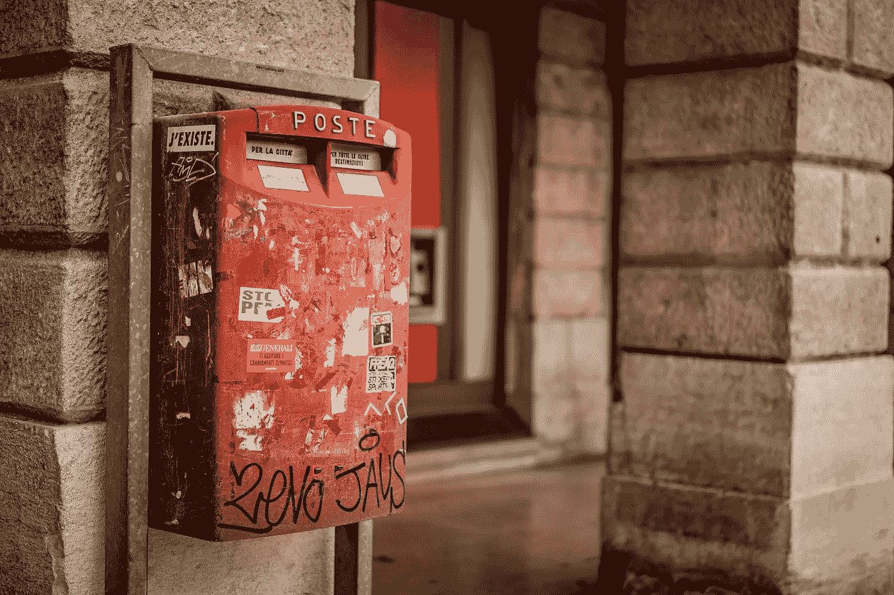
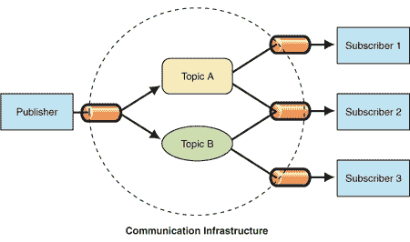
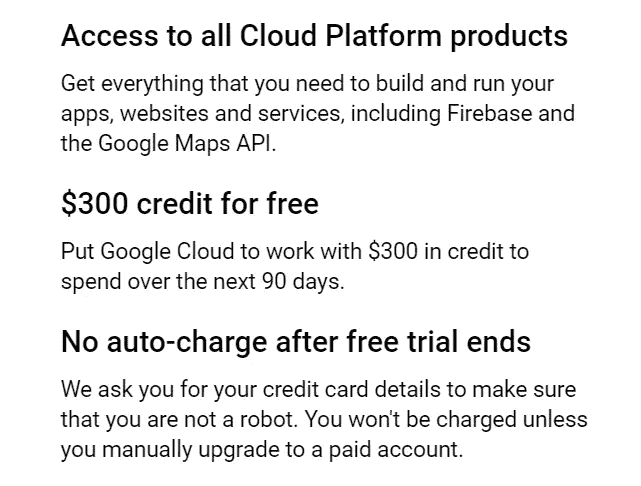
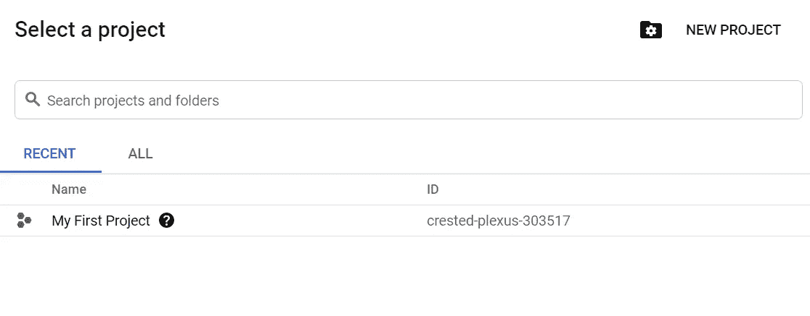
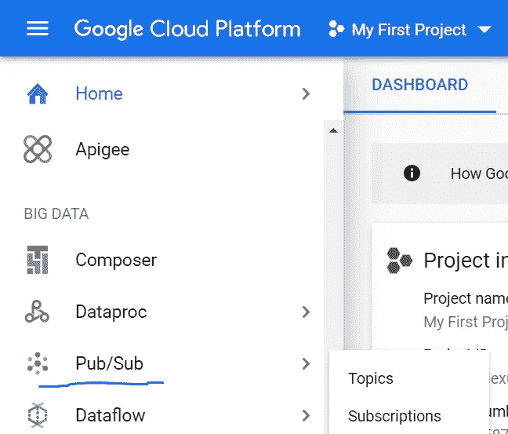
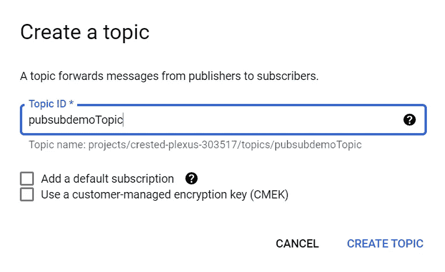
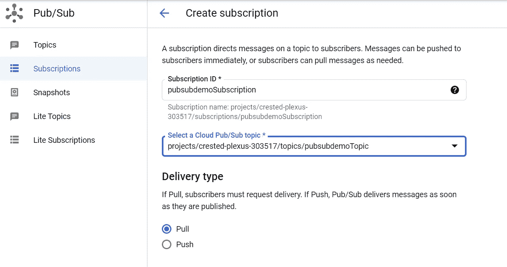
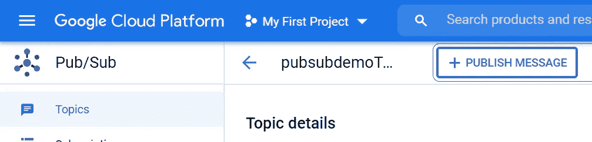
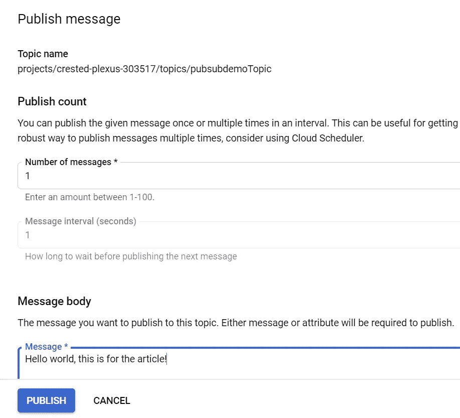
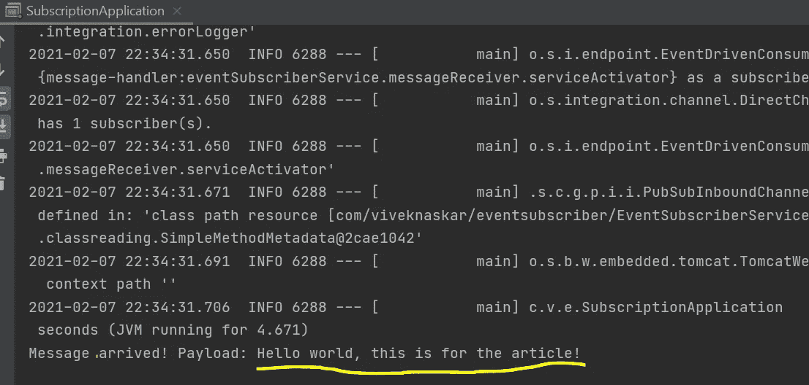

# 使用谷歌发布/订阅和 Spring Boot 发送消息

> 原文：<https://blog.devgenius.io/messaging-using-google-pub-sub-and-spring-boot-1bc8a20adb2c?source=collection_archive---------0----------------------->

## Pub/Sub 是一个完全托管的实时消息服务，允许您在独立的应用程序之间发送和接收消息。



托马索·佩奇奥利在 [Unsplash](https://unsplash.com/s/photos/post-office?utm_source=unsplash&utm_medium=referral&utm_content=creditCopyText) 上的照片

你可能遇到过很多这样的情况，当你打开你的电子邮件收件箱时，你会发现一封来自亚马逊的促销邮件，声明其即将到来的销售，但随后你可能会发现你的邮件也是同样的邮件(当然，如果他允许你偷看他的收件箱)。这些邮件发送给所有像你我一样订阅了亚马逊促销通知的消费者。这些邮件是发布者-订阅者设计模式的一个广泛的例子，像 Google，Amazon，Spotify 等更大的组织。定期使用向所有消费者(或者更确切地说是订户)推广活动。

# 发布/订阅模式

发布/订阅模式，也称为发布/订阅，是一种架构设计模式，为发布者和订阅者之间交换消息提供了一个框架。这种模式涉及依赖消息代理的发布者和订阅者，消息代理将消息从发布者中继到订阅者。主持人(发布者)将消息(事件)发布到订阅者可以注册的频道。



发布/订阅通信基础设施。图片来自[微软](https://docs.microsoft.com/en-us/previous-versions/msp-n-p/images/ff649664.despublishsubscribe_f01(en-us,pandp.10).gif)

# 云发布/订阅

Google Cloud Pub/Sub 是一种异步消息服务，建立在许多 Google 产品依赖了十多年的核心 Google 基础设施组件之上。包括广告、搜索和 Gmail 在内的谷歌产品使用这一基础设施每秒发送超过 5 亿封邮件，总计超过 1TB/s 的数据。太棒了！不是吗？

据说它是谷歌自己实现的 Apache Kafka，并且它完全由谷歌管理，这使得它具有很高的可靠性和可扩展性。

一个优秀的 YouTube 视频，概述了 Pub/Sub 在现实生活中的应用

# 一些动手操作来开始

最近，我为我的组织创建了一个 Spring boot 应用程序，该应用程序订阅了一个主题事件，并将在接收来自发布者的消息时执行一项任务。当然，主题是在 Google 发布/订阅服务中创建的。

在本文中，我将在 Google Cloud Platform 中创建一个发布/订阅主题，并发布一条消息，这条消息将被一个 Spring boot 应用程序订阅，并将在控制台中记录这条消息。显然，这篇文章将是一个简单的演示，向您介绍发布/订阅服务的要点。

## 先决条件

*   你需要有一个 GCP 账户。如果你没有，你可以用你的信用卡或借记卡轻松创建，他们不会向你收取任何费用。90 天的免费试用给你 300 美元。更多详情请参考 [*此处*](https://console.cloud.google.com/freetrial/signup/tos) 。



*   您必须熟悉 [Cloud SDK](https://cloud.google.com/sdk/) 来认证您的本地机器以连接到发布/订阅服务。阅读 [*此处*](https://cloud.google.com/sdk/docs/authorizing) 用谷歌云认证你的机器。
*   基本了解 Spring boot 框架(考虑到你懂一些 Java)。当然，编程语言并不妨碍学习发布/订阅服务，只是，对于本文和演示的范围，我使用的是 Spring boot。

## 创建云发布/订阅主题和订阅

假设您已经在 GCP 帐户中创建了一个项目，因为 Google Cloud 中的每个服务都需要一个项目，该项目可以被视为创建 VPC、VPN、虚拟机、数据库和其他云服务的工作空间。



我创建发布/订阅主题的项目名称

然后您需要*启用发布/订阅 API* 来使用服务。您可以将鼠标悬停在菜单上的所有服务上，然后选择发布/订阅，这将进入启用发布/订阅 API 页面。



选择发布/订阅以启用 API 并使用服务。

一旦启用了发布/订阅服务，您就可以创建一个主题来发布消息。所以，我们来创造一个话题。我给了一个名字`pubsubdemoTopic`，点击*创建话题*。



在 Pub/Sub 主页中，您需要点击*创建订阅*按钮并创建订阅`pubsubdemoSubscription**.**` 您需要选择云 Pub/Sub 主题`pubsubdemoTopic**,**`交付类型为*拉*并点击*创建。*



## 创建 Spring Boot 应用程序

我已经创建了一个 spring boot 应用程序，它使用订阅来阅读发布的消息。为此，您基本上需要使用两个依赖项。

```
<dependency>
   <groupId>org.springframework.cloud</groupId>
   <artifactId>spring-cloud-gcp-starter-pubsub</artifactId>
</dependency>

<dependency>
   <groupId>org.springframework.integration</groupId>
   <artifactId>spring-integration-core</artifactId>
</dependency>
```

事件订阅者的完整 pom.xml 由两个重要的依赖项组成，`spring-cloud-gcp-starter-pubsub` 和`spring-integration-core`。****应用程序是一个 web 应用程序，将使用嵌入式 tomcat 服务器。****

******pom.xml******

****为了从创建的订阅中提取消息，我创建了一个名为`EventSubscriberService.`的服务****

******EventSubscriberService.java******

****`inboundChannelAdapter`使用`PubSubTemplate`从订阅`pubsubdemoSubscription`异步提取消息，并将消息发送给`inputMessageChannel.``inboundChannelAdapter`将确认模式设置为`MANUAL`，这样应用程序就可以在处理完消息后确认消息。`PubSubInboundChannelAdapter`类型的默认确认模式是`AUTO`。`ServiceActivator` bean `messageReceiver`将到达`inputMessageChannel`的每个消息记录到标准输出，然后确认该消息。****

## ****从订阅发布消息和打印****

****要发布消息，您必须进入发布/订阅主页，然后选择主题，您必须点击*发布消息。*****

********

****将出现一个页面，让您在*消息正文*中发布一条消息，然后*发布。*****

********

****现在，因为应用程序已经订阅了主题，所以消息将被成功地记录到控制台上。****

********

****控制台中记录的消息****

****如果您遵循了，那么恭喜您，您刚刚创建了一个订阅应用程序，它记录了来自云发布/订阅主题的消息。****

****你可以从 [*这个 GitHub 库*](https://github.com/viveknaskar/event-subscriber/tree/master) 获取完整代码。****

# ****这是一个总结！****

****这只是发布者-订阅者模式的一个小概述，这只是一个小应用程序。Pub/Sub 服务可以做的事情太多了，老实说，本文几乎没有涉及到。我强烈建议 [*阅读文档以获得更多见解*](https://cloud.google.com/pubsub/docs) 。****

****包括亚马逊网络服务(AWS)和微软 Azure 在内的所有其他主要云服务提供商都实现了发布/订阅服务。对于 Google Cloud，Pub/Sub 是平台中使用最多的服务之一，在构建各种“企业”事件交付系统方面表现突出。****

****一个这样的例子是 *Spotify 的事件交付系统*，你可以从他们的文档中读到。****

****[](https://engineering.atspotify.com/2016/03/03/spotifys-event-delivery-the-road-to-the-cloud-part-ii/) [## Spotify 的活动交付——通向云之路(下)

### 每当用户在 Spotify 客户端执行一项操作时——比如听歌或搜索艺术家——一个小的…

engineering.atspotify.com](https://engineering.atspotify.com/2016/03/03/spotifys-event-delivery-the-road-to-the-cloud-part-ii/)**** 

******如果你喜欢读这篇文章，你可能也会发现下面的文章值得你花时间去读。******

****[](https://medium.com/dev-genius/a-developers-guide-for-passing-google-cloud-associate-cloud-engineer-exam-8a95adb44721) [## 通过谷歌云助理云工程师考试的开发者指南

### 我最近通过了云考试，这是我如何准备考试的旅程。

medium.com](https://medium.com/dev-genius/a-developers-guide-for-passing-google-cloud-associate-cloud-engineer-exam-8a95adb44721) [](https://medium.com/dev-genius/features-that-every-developer-must-know-about-spring-boot-c1c0d7f1c0a8) [## 每个开发人员都必须知道的关于 Spring Boot 的特性

### 该框架通常被称为“类固醇上的弹簧”，的确如此。

medium.com](https://medium.com/dev-genius/features-that-every-developer-must-know-about-spring-boot-c1c0d7f1c0a8) [](https://medium.com/dev-genius/everything-a-developer-must-know-about-microservices-dae854782ab) [## 开发人员必须了解的关于微服务的一切

### 微服务是首选的应用平台，每个开发人员都必须了解它。

medium.com](https://medium.com/dev-genius/everything-a-developer-must-know-about-microservices-dae854782ab)****