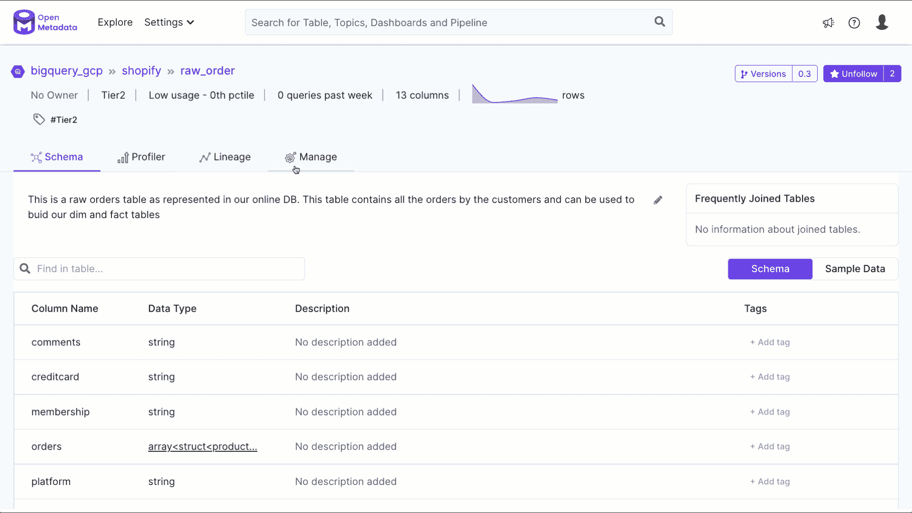
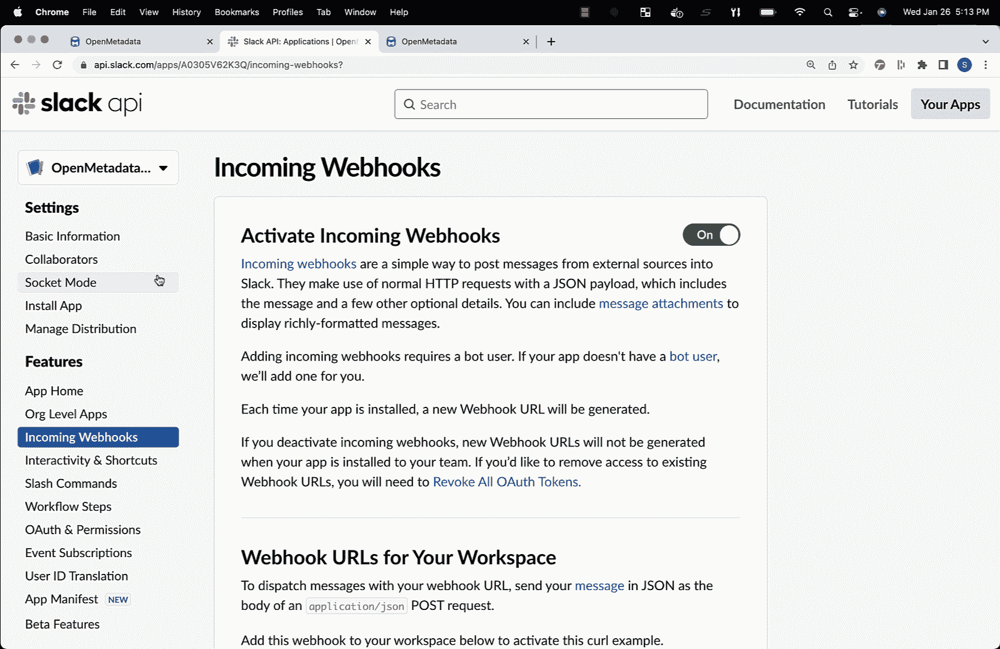
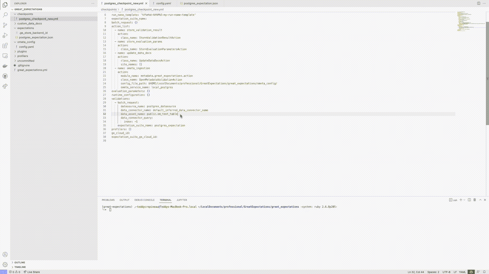

# 元数据:隐藏在创业公司和公司内部的新黄金！

> 原文：<https://blog.devgenius.io/metadata-the-new-gold-hidden-inside-startups-and-companies-ea5d7498acfa?source=collection_archive---------14----------------------->

Irena Carpaccio 在 [Unsplash](https://unsplash.com?utm_source=medium&utm_medium=referral) 上拍摄的照片

## 数据目录、智能数据字典、数据治理和优化数据驱动程序的来源！

本出版物旨在详细介绍什么是元数据、元数据的重要性、如何构建元数据，以及在您的公司或初创企业中使用这一强大信息源的一些方法。

## 什么是元数据？

> “元数据是关于数据的数据，即能够组织、分类、关联和推断关于数据集的新数据的信息。所报告的元数据的质量有助于用户获取数据，更好地理解和使用数据。”，【dados.gov.br】T4

元数据是标识、量化和限定数据的一组信息。

## 因为这很重要？

想象一下，在许多公司中，存在着孤立的、无主的、无组织的和未编目的数据孤岛，有了解数据生命周期的一部分如何工作的专家，有利用不同解决方案和技术来解决相同问题的团队，所有这些情况都可以通过元数据可视化。

在这个混乱的场景中，有许多钻石和创造所谓的“数据产品”的机会，而这方面的巨大宝藏是元数据，这是关于真实存在的真相、谁在使用它以及它是如何被使用的来源。

“数据产品”不是客户的短期解决方案，而是提供可见性和影响业务的来源，公司可以开始基于数据驱动的文化(数据驱动)创建战略和动态，对目标受众更加自信，同时对数据有更大的控制权。

## 主要开源解决方案:

智能数据目录有几种解决方案，它们是可访问的、开源的、有许多集成的可能性，并且易于定制；在本书中，我们将探讨其中的一些，这些只是我已经研究过的:

**阿蒙森**

这是最著名的解决方案，它是最早出现在技术市场上的解决方案之一，并在世界各地获得了大量的维护人员，其主要原因之一是除了具有用户友好的界面之外，还可以取消从不同解决方案和数据库摄取元数据。

 [## Amundsen，领先的开源数据目录

### 发现和信任用于您的分析和模型的数据通过打破孤岛提高工作效率获得即时的环境信息…

www.amundsen.io](https://www.amundsen.io/) 

根据我的经验，我很难接受它，因为我必须手动创建和构造雪花的元数据作为元数据的来源；与该地区的其他人交谈，反馈总是相同的，需要有人甚至一个团队定期对该解决方案进行补充和维护。

**数据中枢**

这是第二代目录解决方案的主要解决方案，该解决方案伴随着更简单易用的提议而出现，由 LinkedIn 团队创建，该团队验证了在一个用户要么受制于从 AWS 等云服务提供商的解决方案中收集元数据，要么采用 Amundsen 等难以维护的解决方案的市场中增长的可能性。

Datahub 提出了不同的建议，安装在不同的云中，甚至安装在 Kubernetes 环境中，此外还创建了从不同来源获取元数据的自动化集成，例如:

*   气流
*   火花
*   巨大的期望
*   Protobuf 模式
*   雅典娜(智慧与技艺的女神)
*   蓝色广告
*   BigQuery
*   商业词汇
*   点击之家
*   战斗支援车
*   dbt
*   三角洲湖
*   德鲁伊特
*   弹性搜索
*   宴会
*   基于文件的沿袭
*   文件
*   胶
*   SAP HANA
*   储备
*   冰山
*   卡夫卡连接
*   卡夫卡
*   轻量级目录访问协议
*   检查员
*   MariaDB
*   元数据库
*   方式
*   MongoDB
*   Microsoft SQL Server
*   关系型数据库
*   尼菲
*   天空的八分之一
*   OpenAPI
*   神谕
*   Postgres
*   PowerBI
*   蜂房上的急板
*   脉冲星
*   红灰
*   红移
*   S3 数据湖
*   SageMaker
*   销售力量
*   雪花
*   超集
*   （舞台上由人扮的）静态画面
*   特里诺
*   Vertica

除了有可能从不同来源摄入外，我们还有机会:

*   对源模式进行版本控制，即结构中的变化历史，
*   用于向数据中心提供信息的术语表，
*   建立标签以将不同的数据源分组到特定的组中，甚至将它们放置在特定的“域”中，
*   指导整个数据链和数据生命周期的数据谱系，以及最终变更的风险，
*   通过时差通知

由于自动化集成的可能性，这个解决方案已经获得了很大的空间，是完全可定制的，并且有广泛的活跃社区。

 [## 现代数据堆栈的元数据平台|数据中心

### DataHub 的可扩展元数据平台支持数据发现、数据可观察性和联合治理，有助于…

datahubproject.io](https://datahubproject.io/) 

在我使用该解决方案的实践中，配置部署很复杂，但是一旦部署完毕，使用起来就很简单了。团队很快适应了使用它。

**开放元数据**

从这个列表中，这是最新和最有前途的解决方案，已经引起了越来越多的社区的注意，并轻松地吸收了其他解决方案的市场份额。

Open-Metadata 已经有几种自动化集成的可能性，例如:

*   [雅典娜](https://docs.open-metadata.org/openmetadata/connectors/database/athena)
*   [AzureSQL](https://docs.open-metadata.org/openmetadata/connectors/database/azuresql)
*   [BigQuery(T1)](https://docs.open-metadata.org/openmetadata/connectors/database/bigquery)
*   [Clickhouse(T3)](https://docs.open-metadata.org/openmetadata/connectors/database/clickhouse)
*   (T4) Databricks (T5)
*   (T6) Datalake (T7)
*   [DB2](https://docs.open-metadata.org/openmetadata/connectors/database/db2)
*   (T10) DeltaLake(T11)
*   [德鲁伊德(T13)](https://docs.open-metadata.org/openmetadata/connectors/database/druid)
*   [DynamoDB (T15)](https://docs.open-metadata.org/openmetadata/connectors/database/dynamocb)
*   [Glue(T17)](https://docs.open-metadata.org/openmetadata/connectors/database/glue)
*   [Hive(T19)](https://docs.open-metadata.org/openmetadata/connectors/database/hive)
*   [MariaDB (T21)](https://docs.open-metadata.org/openmetadata/connectors/database/mariadb)
*   [MSSQL](https://docs.open-metadata.org/openmetadata/connectors/database/mssql)
*   [MySQL(T25)](https://docs.open-metadata.org/openmetadata/connectors/database/mysql)
*   甲骨文(T27)
*   (T28) Postgres (T29)
*   [Presto(T31)](https://docs.open-metadata.org/openmetadata/connectors/database/presto)
*   (T32) Redshift (T33)
*   (T34) Salesforce(T35)
*   [SingleStore(T37)](https://docs.open-metadata.org/openmetadata/connectors/database/singlestore)
*   [雪花](https://docs.open-metadata.org/openmetadata/connectors/database/snowflake)
*   [崔诺](https://docs.open-metadata.org/openmetadata/connectors/database/trino)
*   [Vertica](https://docs.open-metadata.org/openmetadata/connectors/database/vertica)
*   [看客](https://docs.open-metadata.org/openmetadata/connectors/dashboard/looker)
*   [元数据库](https://docs.open-metadata.org/openmetadata/connectors/dashboard/metabase)
*   [模式](https://docs.open-metadata.org/openmetadata/connectors/dashboard/mode)
*   [PowerBI](https://docs.open-metadata.org/openmetadata/connectors/dashboard/powerbi)
*   [Redash](https://docs.open-metadata.org/openmetadata/connectors/dashboard/redash)
*   [超集](https://docs.open-metadata.org/openmetadata/connectors/dashboard/superset)
*   [画面](https://docs.open-metadata.org/openmetadata/connectors/dashboard/tableau)
*   [卡夫卡](https://docs.open-metadata.org/openmetadata/connectors/messaging/kafka)
*   [空气生物](https://docs.open-metadata.org/openmetadata/connectors/pipeline/airbyte)
*   [气流](https://docs.open-metadata.org/openmetadata/connectors/pipeline/airflow)
*   [胶水](https://docs.open-metadata.org/openmetadata/connectors/pipeline/glue)
*   [Fivetran](https://docs.open-metadata.org/openmetadata/connectors/pipeline/fivetran)
*   [Mlflow](https://docs.open-metadata.org/openmetadata/connectors/ml-model/mlflow)
*   [阿蒙森](https://docs.open-metadata.org/openmetadata/connectors/metadata/amundsen)

此外，还可以通过与 DBT 完全集成的方式接收元数据。

它是第一个在自动化数据目录中处理元数据沿袭和版本控制主题的解决方案，非常简单，看起来很傻，不需要代码来创建数据沿袭，划分其来源和目的地，并通过不同解决方案的不同元数据。

除了版本控制的可能性，最近还实现了通过 Webhooks 进行事件通知的集成接口；也就是说，如果有人更改了数据库模式，Open-Metadata 将捕捉到这一更改，并将在 Slack 中提醒这一事件。

另一个引起关注的实现是创建自动化例程来捕获和结构化数据质量、丰富元数据信息，甚至使用大期望的可能性。

根据我的经验，由于这是一个非常新的解决方案，我注意到缺乏更多的摄取可能性，如 MongoDB，并且使用可用的集成，我在解决一般错误方面有很多困难，因为文档不足并且必须求助多次，或者问题在 GitHub 资源库或 Slack 上的社区中打开。

通过捕获和构建元数据，可以创建数据生命周期的字典，并获得每个阶段如何以及谁使用信息的答案。除了通过统计数据和使用频率，甚至数据质量和健康状况来指导项目和业务领域，数据目录还将是数据治理、遵守 LGPD 等法律以及 Dice 指导的公司或创业战略的重要工具。

减少开支的第一步是根据每个解决方案及其数据的实际使用情况来监控和构建基础设施，忽略了治理不仅是技术性的，还涉及业务。假设我们有一个很少访问和低增长预测的数据库。在这种情况下，按需提供必要的结构和一致的水平增长策略，或者将数据保存在 Parquet、Orc、Delta 或 Iceberg 文件中更有价值。

初创公司和当前公司中另一个普遍存在的问题是，由于缺乏沟通或缺乏流程结构，团队最终会复制不同部门或董事会中其他团队的相同数据流和转换，通过发现和数据传承，这可以可视化和减轻，从而节省资金和精力。

影响工程师日常生活的一个问题是他们源中数据结构的变化，团队独立地改变一个表、集合或主题，这会影响另一个系统或仪表板。为了使这一点可见，不仅需要监控和版本化结构，还需要生成警报，以便数据团队可以有效地采取行动。

另一个显著影响技术领域的问题是团队中的人员流动，随着时间的推移，人们经常更换团队甚至公司。为了减少这种情况的影响，我们可以采用数据目录作为关于业务及其术语和行话的信息源。

所有这些场景都会显著影响各种形式的数据管理(例如:MDM)、数据团队组织策略(例如:数据网格)和现代数据解决方案堆栈的采用，除了面向数据的业务领域之外，组织和管理数据及其生命周期的一个很好的起点是从元数据中获取价值，这是创建数据产品和高效扩展公司整个业务和运营的绝佳机会。

这份简短的出版物介绍了元数据的一些概念和重要性，可以获得的一些值，以及一些构建您的“数据目录”或“元数据湖”的开源解决方案，以及您如何在您的公司或初创公司中使用这些信息源？你值了吗？它是否表示另一种解决方案或技术？

## 参考资料:

 [## 零到部署和演进数据目录

### 这是什么？开源替代品？如何实施？挑战和更多！

levelup.gitconnected.com](https://levelup.gitconnected.com/zero-to-deployment-and-evolution-data-catalog-38864406981a)  [## 产品介绍:数字 360 频道

### Rafael Dourado é是程序员俱乐部的运营经理，但他也是一名革命或商业人士。

www.channel360.com.br](https://www.channel360.com.br/produtos-de-dados-o-salto-rumo-a-jornada-digital/)  [## 元数据在 Kubernetes 可观察性计划中的重要性

### Kubernetes 是一个流行的容器编排系统，位于云计算本地计算基础项目的核心…

www.elastic.co](https://www.elastic.co/pt/blog/the-importance-of-metadata-in-your-kubernetes-observability-initiatives)  [## 什么是元数据，它对您有何影响？

### 如果任其发展，元数据的泄漏可能会超出您的预期。

medium.com](https://medium.com/codex/what-is-metadata-and-how-does-it-impact-you-bcbeb3057610)  [## 对罪犯进行调查意味着什么？

### 这是一份工作。从《纽约三部曲》开始，15 分钟后，我就可以进入这部电影了。

medium.com](https://medium.com/contrarraz%C3%B5es/o-que-s%C3%A3o-metadados-e-qual-a-sua-import%C3%A2ncia-para-uma-investiga%C3%A7%C3%A3o-criminal-9607b7e47752)  [## 元数据湖的兴起

towardsdatascience.com](https://towardsdatascience.com/the-rise-of-the-metadata-lake-1e95127594de)  [## 推动 2022 年元数据新世界的 5 大趋势

### 这些趋势汇聚起来，围绕着一种新的、现代的元数据概念掀起了一场风暴。

towardsdatascience.com](https://towardsdatascience.com/5-trends-driving-the-new-world-of-metadata-in-2022-721f974cdf87)  [## 数据目录的未来

### 从来没有人说过，让我们访问一个网站只是为了“浏览元数据”

towardsdatascience.com](https://towardsdatascience.com/the-future-of-data-catalogs-868ffbe7354d)  [## 治理:埃维塔多斯的错误

### 信息技术的应用是企业管理的重要组成部分。拳道…

www.outview.com.br](https://www.outview.com.br/governanc%CC%A7a-de-dados-erros-que-devem-ser-evitados/)  [## 7 信息技术论坛

### 这是一个关于名誉、金融、法律和其他问题的报告

itforum.com.br](https://itforum.com.br/noticias/7-erros-de-governanca-de-dados-para-evitar/) 

***#感谢阅读，分享本帖！*:)**