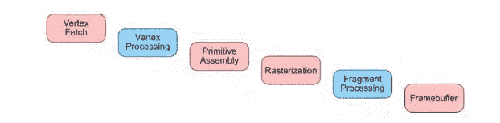
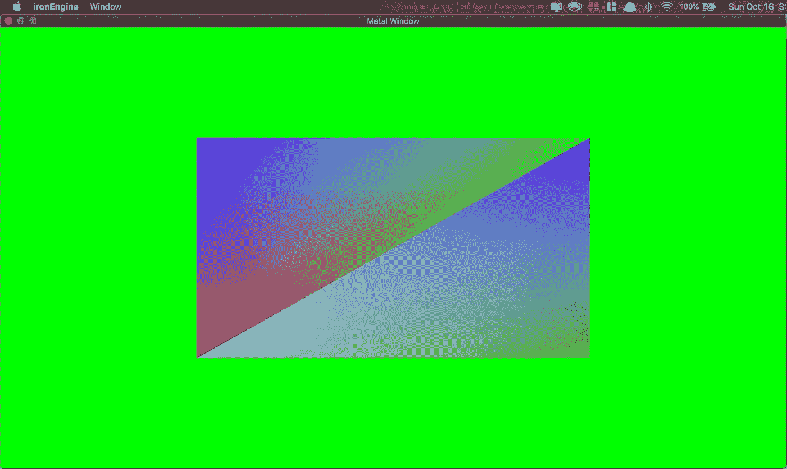

# Metal-cpp 教程 2:渲染 2D 网格

> 原文：<https://blog.devgenius.io/metal-cpp-tutorial-2-rendering-a-2d-mesh-81e96fdae63a?source=collection_archive---------3----------------------->

## 不要这么古板…

# 介绍

在 N 系列的第 2 部分中，我们将看看如何使用臭名昭著的金属图形库来渲染一个网格。请务必查看我的[之前的教程](https://lilabi.medium.com/metal-cpp-tutorial-1-creating-a-window-2cedef4a497)，因为我们将基于这些概念进行构建。

# 渲染管道

为了在屏幕上显示图像，我们首先需要配置渲染管道来描述图像是如何绘制的。在一个典型的基于金属的渲染器中， *MTL::RenderPipeLineState* 对象用于告诉 GPU 应该如何绘制几何数据。 *MTL::RenderPipeLineState* 对象定义图形状态，顶点&片段着色器函数。创建对象是一个开销很大的过程，因此建议在执行主运行循环之前或每当有加载操作时创建它们。一旦我们设置了 *MTL::RenderPipeLineState* 对象需要的所有必要数据并提交了命令缓冲区，渲染流水线阶段就开始了。

渲染管道

渲染管道是顶点数据经过的操作过程，其中坐标被转换到不同的坐标空间。在 Metal 中，顶点和片段处理阶段是唯一可编程的着色器阶段。

## 顶点提取

**顶点提取**阶段的目的是从金属缓冲器中读取图元数据(三角形、线&点)并将它们传递给**调度器**单元。

## 顶点处理

**顶点处理**阶段是顶点数据逐个接受用户计算的阶段。顶点数据基于用户指定进行转换。可以进行顶点光照计算、顶点变换、纹理映射等操作。一个叫做**分配器**的硬件单元将一组顶点发送到**原始组件**。

## 原始装配

在**图元装配**阶段，从顶点处理发送的顶点组被装配以适合指定的图元。Metal API 提供了 5 种基本类型:面片、点、线、线条、三角形和三角形带。

## 光栅化

在这个阶段，光栅化器计算任意两个顶点之间的斜率，并构建一组斜率来构建图元。接下来，光栅器寻找什么是可见的，什么是不可见的。然后 Z 和模板测试删除不可见的片段。最后。**插值器**获取剩余的可见片段，并生成片段属性。

## 片段处理

在**片段处理**阶段，所有片段被一起内插以创建帧缓冲区中像素的最终颜色。

## 帧缓冲器

当片段已经被处理成像素时，**分配器**单元将像素发送到**颜色写入**单元。这个单元将在帧缓冲区中写入最终的颜色。

# **渲染器第二部分:**电动布加洛

让我们看看我们新的渲染器界面。

在我们的*渲染器*类中，我们有两个新函数:`BuildShaders()`用于编译和存储我们的着色器程序，以及`BuildBuffers()`用于构建一些测试顶点数据。我们还有一个类型为 *RenderPass，*的新数据成员，它将代表一个渲染过程。渲染过程的概念可以被认为是附件(缓冲区、纹理等)的集合..)，带有描述如何使用它们以及需要完成哪些渲染工作的命令。

一个简单的 *RenderPass* 对象可能看起来像

在类 *RenderPass 中，*我们存储了一个指向*MTL::RenderPipelineState*对象的指针和一个包含指向两个 *MTL::Buffer* s *的指针的网格对象。让一个 *RenderPass* 对象的想法是存储渲染器管道可能结束的不同状态。在*渲染器*构造函数中，我们调用`BuildShaders()` & `BuildBuffers()`来构建着色器程序，并用数据构建顶点缓冲区。*

# 构建着色器，我不是在说太阳镜。

Metal 使用高级着色器语言 ***金属着色语言****【MSL】来指定顶点和片段着色器。MSL 是基于 C++14 的，所以语法看起来应该和我们这些优秀的 C++程序员相似。*

*让我们看看我们将要使用的着色器文件。*

*看起来这里发生了很多疯狂的事情，让我们来分析一下。我们首先包含了 *metal_stdlib* 头来使用 MSLlib 函数和枚举。在第 4 行中，我们定义了一个结构`VertexOut`，它包含两个 *float4* 类型:位置&颜色。位置声明包含一个属性说明符`[[position]]`，它告诉光栅化器使用这个变量作为执行光栅化/插值的标准化屏幕空间位置。在第 9 行，我们指定了顶点着色器函数。这个函数的返回类型是我们之前创建的结构。在我们定义了返回类型之后，我们定义了着色器函数的类型，在这种情况下，它是一个“顶点”。后面是函数名“vertexMain”。该函数有 3 个参数。第一个参数定义了我们正在处理的顶点数。第二个参数是指向包含位置数据缓冲区的 GPU 内存地址的设备指针。第三个参数是另一个设备指针，指向包含颜色数据缓冲区的 GPU 内存地址。在函数内部，我们从缓冲区地址返回填充在 *VertexOut* 对象中的位置和颜色数据。在第 19 行，我们创建了片段着色器，它接收 *VertexOut* 对象并返回其中的颜色数据用于插值。*

*现在我们已经得到了着色器的源代码，让我们来看看`BuildShader()`函数。*

*让我们来分析一下这里发生了什么。在第 5 行中，我们传入我们想要编译的着色器文件的文件路径，并获得一个包含源代码内容的字符串。在第 10 行，我们创建了一个包含编译后的 metal 源代码的 *MTL::库*对象，这里的想法是我们将编译后的程序转换成一个“库”,它具有 GPU 可以调用的函数。第一个参数采用指向着色器源代码字符串的指针；第二个参数是一个指向 *MTL::编译选项*对象的指针，该对象指定了源代码应该如何构建；第三个参数采用一个指向 *NS:Error* 对象的指针，该对象包含着色器编译期间发生的任何错误。在第 17 行和第 18 行，我们创建了两个 *MTL::函数*，它们代表了一个 *MTL::库*对象中的着色器函数。我们通过将着色器文件中的函数名称作为第一个参数中的字符串进行传递来创建这些 *MTL::函数*对象；第二个参数是指定字符串类型的格式。在第 21 行，我们创建了一个*MTL::RenderPipelineDescriptor*实例，它指定了在渲染过程中使用的渲染状态。我们可以使用一个*RenderPipelineDescriptor*对象来指定着色器程序中的顶点和片段函数，以便在渲染过程的执行过程中使用。在第 23 行和第 25 行，我们建立了一个到当前编译的着色器程序的顶点和片段函数的链接。在第 27 行，我们指定了帧缓冲区的数据格式。在这种情况下，我们使用的格式是*pixelformatbgra 8 unrom _ sRGB*，它指定了**四个**连续的 8 位归一化无符号整数，表示组成单个像素的蓝、绿、红、阿尔法值。在第 30 行，我们通过传入一个*MTL::RenderPipelineDescriptor*对象和一个 *NS::Error* 对象来创建一个 MTL::RenderPipelineState；并将它存储在我们的 *RenderPass* 对象中。第 31 行只是一个测试，看看是否已经创建了一个 *RenderPipelineState* 对象。就像永远不要忘记释放你不再需要使用的对象！*

# *构建缓冲区*

*金属缓冲区是 GPU 上的非结构化内存区域。一台 Mac 可以包含多个 GPU，每个 GPU 都有一个**统一**或**离散**内存型号。当 Mac 的主板上没有独立显卡芯片时，会出现统一内存模式(例如:Macbook Air、Macbook Pro M1)；因此，GPU 和 CPU 共享系统内存。在离散内存模型中，GPU 有自己的内存，称为视频内存；GPU 仍可访问系统内存，但 CPU 无法访问视频内存。我们可以在不同的模式下设置金属 GPU 缓冲区，以控制 CPU 和 GPU 如何访问它们。*

*让我们来看看`BuildBuffer()`函数。*

*在第 7 行和第 16 行，我们创建了两个大小为 6 的类型为 *simd::float3* (三个 32 位浮点元素的向量)的数组(也可以认为是保持对称性的缓冲区)。在这种情况下，我们通过提供构建两个三角形所需的数据和每个顶点的颜色数据来聚合初始化这些缓冲区。一个数组包含所有顶点位置数据，另一个数组包含顶点颜色数据。在第 30 行和第 31 行，我们通过将总大小作为第一个参数传入，在 GPU 上创建一个缓冲区，第二个参数接受一个指定存储模式的 enum。存储模式`MTL::ResourceStorageModeManaged`指定缓冲区只能由 CPU 在初始化时访问，然后同步到 GPU 内存，最后由 GPU 访问。在第 34 行和第 35 行，我们使用`memcpy`将我们的本地顶点数据缓冲区复制到 *MTL::Buffer* 定义的位置。在第 38 行和第 39 行，我们告诉 GPU，通过指定更改范围，缓冲区已经被修改。在第 42 到 45 行中，我们在 *RenderPass* 对象中获得了对*网格*对象的引用，并更新了缓冲区指针和顶点数。*

# *呈现一个正方形*

*现在我们已经设置了我们的着色器程序和缓冲区。我们终于可以使用它们，画出我们一直努力的可爱的矩形。*

*让我们看看我们的`Draw()`函数。*

*第 13 行，我们将之前创建的*MTL::RenderPipelineState*对象传递给`setRenderPipelineState()`函数，告诉 GPU 我们将在接下来的绘制命令中使用这个渲染管道状态。在第 16 行和第 18 行，我们在缓冲区参数表中的特定索引和开始的偏移量处对缓冲区进行编码。缓冲区参数表指定哪个索引包含哪个缓冲区。在第 20 行，我们编码了一个 draw 命令，通过提供要绘制的图元类型、偏移量起点和顶点总数，使用顶点数据来呈现图元的实例。*

# *输出*

*如果您跟踪了所有到 tea 的内容，您应该得到如下所示的输出:*

**

*[**在这里查看项目资源库！**](https://github.com/lilAbi/Metal-cpp-Tutorial-2-Rendering-A-2D-Mesh)*

# ***结论***

*希望你从我的关于 Metal-cpp 的小文章中学到了很多。寻找第 3 部分，我们会更深入地了解疯狂……*