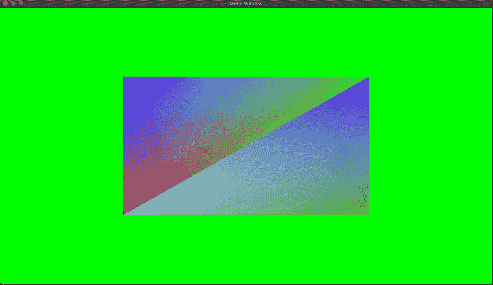

# Metal-cpp 教程 3:着色器参数缓冲区

> 原文：<https://blog.devgenius.io/metal-cpp-tutorial-3-shader-argument-buffer-68b2271c97ed?source=collection_archive---------9----------------------->

# 介绍

在本教程中，我们将看看如何创建一个参数缓冲区，为顶点着色器提供一种间接引用 GPU 上的数据缓冲区的方法。

# 着色器代码

让我们来看看一些示例金属着色器代码。

在这个着色器程序中，顶点着色器函数(第 14 行)的第一个参数采用一个指向 GPU 上的 *VertexData* 对象的指针，该对象包含指向 GPU 上的位置和颜色数据的缓冲区的指针，后面是一个属性说明符，该说明符指定我们传入的参数缓冲区中包含数据的索引。这里的想法是，当我们开始有更多的输入时，我们可以保持我们的参数列表较小；随着我们开发更复杂的功能。

# 重构

让我们看看更新后的*渲染器*类。

我们添加了两个新的数据成员，它们是指向一个着色器程序(第 15 行)和一个金属缓冲对象的指针，该对象的目的是存储参数数据(第 17 行)。在我们的`BuildShader()`函数中，我们将创建的着色器程序存储在 shaderLibrary 变量中。

让我们来看看我们新的`BuildBuffer()`函数:

从第 46 行开始，我们得到了指向金属顶点着色器函数“object”的指针。在第 48 行，我们创建了一个 *MTL::ArgumentEncoder* 对象，该对象将数据编码到顶点着色器函数中参数索引为 0 的参数中。在第 51 行，我们创建了一个金属缓冲区来存储参数。`encodedLength()`函数根据参数的内存需求和类型返回一个大小。在第行中，我们首先将参数缓冲区绑定到我们将要写入数据的编码器对象。然后在第 56 行和第 58 行，我们对各自的颜色和位置数据缓冲区的引用进行编码，并设置偏移量和索引(应该与 id 匹配。在第 61 行，我们告诉 GPU 缓冲区已经被修改。最后，我们将不再需要的对象释放到内存池中。

现在让我们看看我们的 update `Draw()`函数，它包含了新的变化。

我们新的 draw 函数比之前的实现小了一点。在第 16 行，我们将前面创建的参数缓冲区绑定到缓冲区参数表上的索引 0，从偏移量 0 开始。在第 18 行和第 20 行，我们将指向位置和颜色金属缓冲区的指针传递给`useResouce()`函数，该函数将告诉 GPU 绑定这些缓冲区。

# 结论

如果您正确地执行了所有操作，您应该得到以下输出:

像往常一样，查看[项目库](https://github.com/lilAbi/Metal-cpp-Tutorial-3-Shader-Argument-Buffer)以获取更多信息。