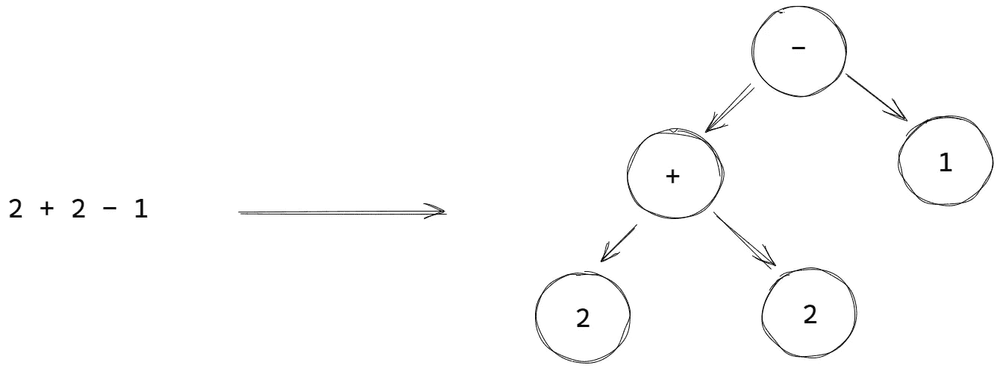

# Elixir 中的元编程

> 原文：<https://blog.devgenius.io/metaprogramming-in-elixir-4c74ba9dddc8?source=collection_archive---------1----------------------->

## 学习如何编写能写代码的代码

照片由 [Didssph](https://unsplash.com/@didsss?utm_source=unsplash&utm_medium=referral&utm_content=creditCopyText) 在 [Unsplash](https://unsplash.com/s/photos/russian-doll?utm_source=unsplash&utm_medium=referral&utm_content=creditCopyText) 上拍摄

通常，我们认为程序是操纵数据以达到某种结果的东西。

但是什么是数据呢？

我们能把程序本身作为数据吗？🤔

在今天的文章中，我们将在 Elixir 的帮助下进入兔子洞，这是一种渗透了元编程的编程语言。

# 什么是元编程？

元编程只是编写操纵程序的程序。这是一个相当广泛的术语，可以包括编译器、解释器和其他种类的程序。

在本文中，我们将重点关注元编程，因为它是在 Elixir 中完成的，涉及宏和编译时代码生成。

# Elixir 中的元编程

为了理解元编程在 Elixir 中是如何工作的，理解一些关于编译器如何工作的事情很重要。在编译过程中，每个计算机程序都被转换成抽象语法树(AST)——一种使计算机能够理解程序内容的树结构。

在 Elixir 中，AST 的每个节点(基本值除外)都是一个由三部分组成的元组:函数名、元数据和函数参数。

Elixir 使我们能够通过`quote`访问这个内部 AST 表示。

我们可以用[宏](https://elixir-lang.org/getting-started/meta/macros.html)修改这些 AST，这些宏是从 AST 到 AST 的函数，在编译时执行。

您可以使用宏来生成样板代码，创建新的语言特性，甚至构建特定于领域的语言(DSL)。

实际上，我们在 Elixir 中经常使用的许多语言结构，如`def`、`defmodule`、`if`等都是宏。此外，许多流行的库，如 [Phoenix](https://www.phoenixframework.org/) 、 [Ecto](https://hexdocs.pm/ecto/getting-started.html) 和[absinie](https://hexdocs.pm/absinthe/Absinthe.html)都自由地使用宏来创建方便的开发人员体验。

下面是文档中的一个 Ecto 查询示例:

Elixir 中的元编程是一个非常强大的工具。它在表现性上接近于[LISP](https://en.wikipedia.org/wiki/Lisp_(programming_language))(OG 元编程 steam roller)，但在抽象性上保持了一个层次，使您能够仅在需要时钻研 AST。换句话说，Elixir 是*基本上是* LISP 但是可读的。🙃

# 入门指南

那么我们如何引导这种巨大的力量呢？🧙

虽然元编程可能相当棘手，但在 Elixir 中开始元编程是相当简单的。你只需要知道三件事:引号，非引号，和 defmacro。

## 引用

`quote`将酏剂代码转换为其内部 AST 表示形式。

您可以将正则表达式和带引号的表达式的区别看作是两个不同请求的区别。

*   请说出你的名字。在这里，要求是用你的名字回复。
*   请说“你的名字”。在这里，请求是用语言中请求的内部表示——“你的名字”来回复。

`quote`编写宏变得轻而易举，因为我们不必手工生成或编写 AST。

## 引文止

但是如果我们想要访问`quote`内部的变量呢？解决方法是`unquote`。

`unquote`类似字符串插值的功能，使您能够从周围的上下文中将变量拉入引用的块中。

这是它在《长生不老药》中的样子:

如果我们不去引用`two`，我们将得到 Elixir 的内部表示，它是一个叫做 two 的未赋值变量。如果我们取消对它的引用，我们就可以访问引用块中的变量。

## 定义宏

[宏](https://elixir-lang.org/getting-started/meta/macros.html)是从 ASTs 到 ASTs 的功能。

例如，假设我们想创建一种新的表达式来检查数字的奇怪性。

我们可以用几行代码`defmacro`、`quote`和`unquote`为它制作一个宏。

# 什么时候应该使用元编程？

> *规则 1:不要写宏——Chris MC cord，Elixir 中的元编程*

虽然元编程可能是一个很棒的工具，但应该谨慎使用。

宏会使调试更加困难，并增加整体的复杂性。只有在必要的时候才应该求助于它们——当您遇到无法用常规函数解决的问题时，或者当您需要隐藏幕后的许多管道时。

不过，如果使用得当，它们会非常有益。

要了解宏在现实生活中是如何使用的，你可以看看我们的教程，为定义定制函数构建一个[宏。](https://serokell.io/blog/elixir-metaprogramming#build-your-own-macro-in-elixir)

# 进一步学习

如果您想了解更多关于 Elixir 中的宏的知识，我建议查看以下资源:

*   [仙丹中的元编程](https://pragprog.com/titles/cmelixir/metaprogramming-elixir/)。Chris McCord 的书通过精彩实用的代码示例对宏进行了相当深入的介绍。
*   [了解仙丹宏](https://www.theerlangelist.com/article/macros_1)。SAA juri 撰写的这个系列文章比我更详细地介绍了这个主题，如果您没有时间阅读 Chris 的书，这也是一个不错的选择。
*   不要写宏，但要学习它们是如何工作的。如果你更喜欢看视频，这是杰西·安德森的一个很好的演讲。

*最初发布于*[*https://sero Kell . io*](https://serokell.io/blog/elixir-metaprogramming)*。*