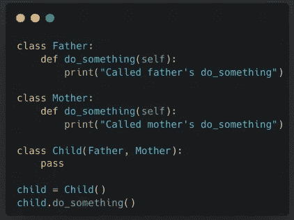
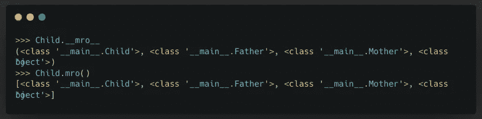
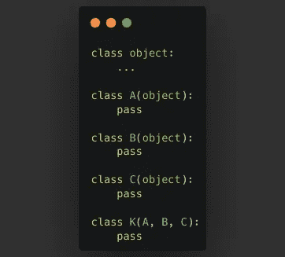
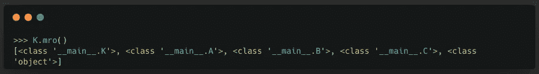
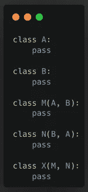
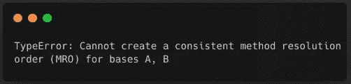

# Python 中的方法解析顺序

> 原文：<https://blog.devgenius.io/method-resolution-order-in-python-42505decb907?source=collection_archive---------5----------------------->

# 什么样的顺序是方法解析顺序？

这是 python 在类层次结构中搜索方法的顺序。当我们处理多重继承时，它特别有用。方法解析的重要性并不明显，直到我们处理一个我们绝对需要它的情况。

# 到底哪里需要？

假设我们有以下情况。我们有父亲班和母亲班。我们有一个子类，按照这个顺序继承父类和母类。



在这种情况下，当调用 child.do_something()时将调用哪个函数，因为父亲和母亲都有函数 do_something？这正是我们需要将类在层次结构中的顺序线性化的情况，这样我们就可以确定谁的方法或属性优先于谁。

# 如何获得一个类的 MRO？

为了显示类的方法解析顺序，我们可以访问类的`__mro__`属性或者调用`Child.mro()`函数。这将给出方法解析顺序。从这里我们可以看到，父亲的 do_something 方法将被调用，因为它是 MRO 中第一个具有 do_something 方法的类。



# 在基本情况下计算顺序的简单方法

实际上，在简单的情况下，通过使用深度优先的从左到右方案，只需查看它是如何被继承的，就可以确定 MRO。

*   决定优先级的第一个因素是继承的深度，即类在层次结构中的位置。这是一种理论，即子类覆盖了其父类的方法，这是非常标准的。
*   第二个要考虑的因素是同一代人中各阶级的地位。在这里，优先级从左到右。在我们的例子`class Child(Father, Mother)`中，父类先于母类。

所以考虑到以上两个因素，上面例子中我们的`Child`类的 MRO 应该是 Child>Father>Mother>object。

# C3 线性化

现在，我们试图更深入地挖掘算法的工作原理。在更复杂的类层次结构中，确定 MRO 并不容易。虽然我说过，为了我们的方便，可以在简单的情况下使用深度优先的从左到右方案来确定 MRO，但 python3 中用于确定 MRO 的实际算法是 C3 线性化。C3 线性化产生三个重要特性:

*   一致扩展优先图
*   保留本地优先顺序
*   单调排序

## 定义

*   类的 C3 线性化是
    *类本身加上
    *其父类的线性化加上父类列表的唯一合并
*   父项线性化的合并是通过选择不出现在任何其他列表尾部的列表的第一个头部来完成的。从输出列表的合并列表中取出选定的标题。
*   重复第二步，直到所有的类都从合并列表中出来，进入输出列表。

## 我们自己做个 C3 连载吧

下面是一个多重继承的例子。让我们在下面的例子中计算类 K 的 MRO。



解决方案:

```
First, let's get the linearization of the base class
L(object) = [object] --Eq1 // since it is has no base class it's linearization list only has itselfNow, to get the linearization of 1st generations.
From the definition of [C3 Linearization, we can write, L(A) = [A] + merge(L(object), [object])`
L(A) = [A] + merge(L(object), [object]) 
     = [A] + merge([object], [object]) // from [Eq1]
     = [A, object] // object added to the output list because it's the only head doesn't appear in any tailSimilarly, for B & C,L(B) = [B, object] 
L(C) = [C, object]Now, let's calculate the linearization for K
From the definition of [C3 Linearization], L(K) is class + unique merge of (linearizations of parents + list of parent from left to right),
L(K) = [K] + merge(L(A), L(B), L(C), [A, B, C])                      
     = [K] + merge([A, object], [B, object], [C, object], [A, B, C]) // Replacing all the L(A), L(B), L(C) with their actual value
     = [K, A] + merge([object], [B, object], [C, object], [B, C])    // Added A to the output list because it only appears in the head of all list in the merge part
     = [K, A, B] + merge([object], [object], [C, object], [C])       // Skipped object (going from left to right) and added B to the output list because it only appears in the head of all list in the merge part
     = [K, A, B, C] + merge([object], [object], [object])
     = [K, A, B, C, object]
```

我们可以通过调用。mro()函数



## 你能想到多重继承会破裂的情况吗？

因为 C3 线性化要求保持局部优先顺序。当 C3 线性化中断时，通常是因为设计选择不当。下面给出了一个这样的例子:



A & B 的顺序在 M & N 的继承中是颠倒的。这不会引起任何问题。但是当 X 从 M 和 N 继承时，局部优先级在类 X 的层次结构中没有保留。



# 结论

因此，在 python 和任何支持多重继承的编程语言中，MRO 都是一个非常有用的概念。这是 python 在类的层次结构中寻找方法的顺序。在这篇博客中，我们了解了一些它的内部运作。您可以在参考资料部分提供的链接中阅读关于这个主题的更多信息。

# 参考

[MRO 通过非吉多·范·罗苏姆本人莫属](http://python-history.blogspot.com/2010/06/method-resolution-order.html)

[C3 线性化](https://en.wikipedia.org/wiki/C3_linearization)