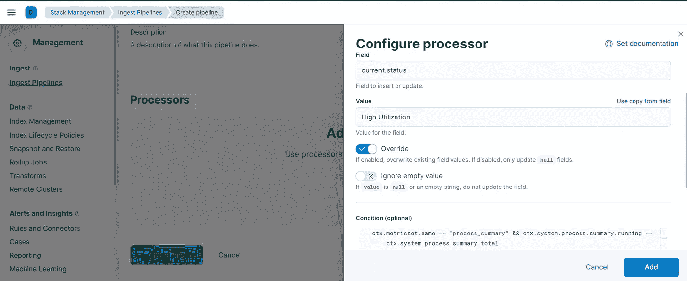

# Metricbeat:用接收管道处理数据

> 原文：<https://blog.devgenius.io/metricbeat-handle-data-with-an-ingest-pipeline-dd705cb6b5b9?source=collection_archive---------18----------------------->


斯蒂芬·道森在 [Unsplash](https://unsplash.com/s/photos/pipeline-tech?utm_source=unsplash&utm_medium=referral&utm_content=creditCopyText) 上拍摄的照片

怎么了伙计们😁？欢迎回来！今天，我们将了解如何使用接收管道来创建一个新的字段或转换 Metricbeat 生成的事件。在阅读本文之前，我强烈建议您阅读关于 [Metricbeat](/metricbeat-with-local-elasticsearch-and-kibana-c330c902e473) 的文章以及关于[摄取管道](https://medium.com/@mhdabdel151/elasticsearch-ingest-pipelines-6335d349a0a)的文章。

让我们把自己放在上下文中。Metricbeat 部署在我们的本地主机上。根据我们的配置，系统模块被启用，当前活动的一些度量集是*进程*和*进程 _ 摘要*。 *process_summary* 指标集提供了当前主机中正在执行的进程的当前快照的概述或摘要。


我们还知道开发摄取管道的最佳方式是首先熟悉我们想要转换的文档的结构。因此，让我们转到 Kibana 的 *Discover* 部分，检查我们的文档结构。例如，我们可以通过添加过滤器来过滤属于 *process_summary* 指标集的文档。为此，单击( **+)** 图标，并填写 *metricset.name* 字段，在此我们可以检查该字段是否等于 *process_summary* ，因此作为操作符，我们填写' *is'* ，作为值' *process.summary'* 。


一旦应用了过滤器，将返回包含指标集 *process_summary* 的所有文档。您可以通过点击展开图标来展开每个文档，以获得完整的结构，并选择将文档作为*单个文档*打开。在底部，您将看到与*过程 _ 总结*相关的信息。

在继续之前，明智的做法是复制本文档的 *id* 以及它的*索引*，以便能够在创建我们的管道时将其用作测试文档。

现在让我们开发我们的接收管道。进入基巴纳**栈管理**段，打开**摄取管道**。在这里，通过点击 new pipeline 按钮，您必须输入一个名称和一个描述(*可选*)。为要执行的转换选择一个有意义且有特征的名称。接下来，让我们向接收管道添加处理器。以*添加一个字段*为例，我们可以使用**设置**处理器。只需填写要插入的字段以及默认值，或者使用[无痛脚本语言](https://www.elastic.co/guide/en/elasticsearch/reference/current/modules-scripting-painless.html) ( *一种专门为 Elasticsearch* 设计的高性能、安全的脚本语言)添加一个条件。例如，在这里，我们可以根据正在进行的流程数量添加一个*状态*字段。



让我们通过点击 a *dd 按钮*来保存我们的处理器。Kibana 的一个有趣特性允许我们在完成创建之前测试管道。我们可以通过点击*添加文档*来使用该功能，在这里您可以手动添加一个文档，也可以通过填写上面保存的文档的**索引名称**以及 **id** 从索引中添加文档。Kibana 将自动从 Elasticsearch 中提取文档，并在此包含示例。一旦应用了管道，我们就可以证明生成的文档已经通过了配置的转换，因为已经添加了我们的字段。


一旦一切正常，你可以点击**创建管道。**

既然已经创建了管道，那么有必要更改 Metricbeat 的配置，以便它考虑我们新创建的管道。在`metricbeat.yml`文件中，在`output.elasticsearch`级别，我们添加了**管道**字段，该字段带有要作为值应用的管道的唯一标识符(*在其创建*期间指定的名称)。它应该是这样的:

```
output.elasticsearch:
  # Array of hosts to connect to.
  hosts: ["localhost:9200"]
  pipeline: *TYPE_HERE*
```

重新启动 Metricbeat，去基巴纳看看我们的管道有没有被考虑进去。我们重复上述相同的过滤器创建过程，并检查一个返回的文档。注意:我们可以为自己感到骄傲，我们的管道工作得非常完美😎！

今天到此为止。感谢您的阅读，如果您对本文有任何问题或评论，请在下面留下您的评论。

我们下次再见，看更多的帖子🚀。

阿卜杜尔-巴吉