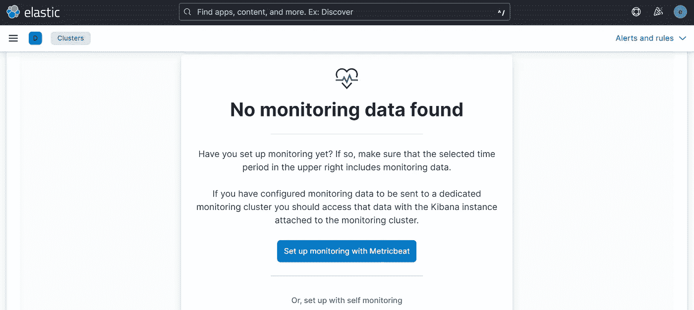
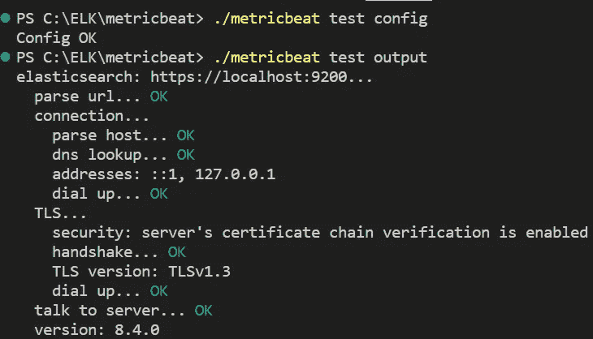
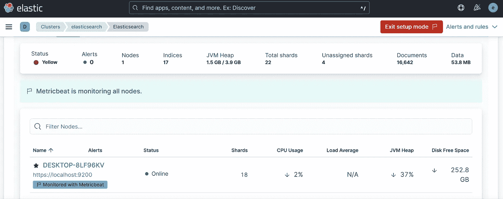
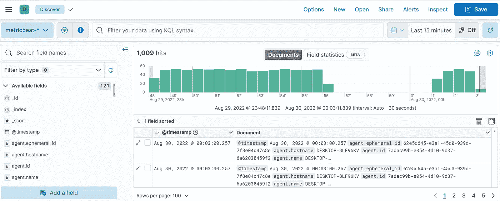

# Metricbeat 带有本地弹性搜索和 Kibana

> 原文：<https://blog.devgenius.io/metricbeat-with-local-elasticsearch-and-kibana-c330c902e473?source=collection_archive---------14----------------------->

什么是好人？很高兴在这个系列中再次见到你😁！

在[的上一篇文章](https://medium.com/@mhdabdel151/discovering-kibana-685bc6cefc1)中，我们看到我们可以使用 Kibana 进行数据可视化，也可以使用**进行监控**，而无需深入细节。当您刚刚安装了 Elasticsearch 和 Kibana 后，如果您打开监控页面，您可能会看到以下屏幕:



Kibana 通知我们，我们还没有在集群上配置监控。这就是我们今天要做的事情，遵循以下步骤:

*   在要监控的系统上安装 Metricbeat
*   将指标发送至 Elasticsearch
*   在 Kibana 上查看这些指标

在开始之前，确保已经部署了 Elasticsearch 和 Kibana。如果不是这样，我邀请你读一读关于[在 Windows](https://medium.com/@mhdabdel151/elasticsearch-and-kibana-on-windows-lets-get-started-ff005f1fe2fc) 上安装 Elasticsearch 和 Kibana 的文章，或者读一读关于 [Docker 容器](https://medium.com/@mhdabdel151/run-elasticsearch-and-kibana-as-docker-containers-c5f5f5460afd)的文章。

让我们安装 Metricbeat。为此，请访问[官方网站](https://www.elastic.co/fr/downloads/beats/metricbeat)，在那里您将找到不同的 Metricbeat 安装方法，具体取决于您的发行版。本教程是在 Elasticsearch 和 Kibana 的 Windows 部署上完成的。因此，我们必须下载*。zip* 存档并解压。

完成后，打开配置文件 *metricbeat.yml* ，它位于文件夹的根目录。需要定义一些参数。转到 O **输出部分**并添加该配置以连接 Elasticsearch。

```
output.elasticsearch:hosts: ["localhost:9200"]
protocol: "https"
username: "elastic"
password: "your-password"ssl:
  enabled: true
  ca_trusted_fingerprint: "your_fingerprint"
```

自然地将这些值替换为您环境中的值。不建议在这里填写敏感信息，相反，您应该将敏感值存储在[机密密钥库中](https://www.elastic.co/guide/en/beats/metricbeat/8.4/keystore.html)。

*指纹*是第一次启动 Elasticsearch 时生成的 CA 证书的十六进制编码 SHA-256。如果您丢失了它，不要惊慌，您总是可以使用以下命令找回它:

```
openssl x509 -fingerprint -sha256 -in config/certs/http_ca.crt
```

请注意，该命令不能在 Windows 终端上运行，您需要下载并安装 [Git](https://git-scm.com/download/win) ，打开 *Git CMD* 并从 Elasticsearch 根文件夹运行该命令。

获取指纹的一个更简单的方法是打开位于 kibana 的 configs 文件夹中的 *kibana.yml* 文件，在最底部你会找到你要找的东西，只需复制粘贴即可。

Metricbeat 附带了一组实用程序来检查配置或连接是否就绪。从根文件夹中，依次运行以下命令:

```
./metricbeat test config
./metricbeat test output
```



现在一切似乎都正常了，让我们在 Metricbeat 中启用并配置 **Elasticsearch x-pack 模块**。从 Metricbeat 根文件夹运行以下命令:

```
./metricbeat modules enable elasticsearch-xpack
```

您应该得到如下回报:*启用 elasticsearch-xpack。*

因为启用了安全性，所以需要额外的配置。所以让我们打开文件:*modules . d/elastic search-xpack . yml*并添加这些信息:

```
- module: elasticsearch
    xpack.enabled: true
    period: 10s
    hosts: ["https://localhost:9200"]
    username: "remote_monitoring_user"
    password: "your_password"
    ssl:
      enabled: true
      ca_trusted_fingerprint:  "your_fingerprint"
```

这里使用的是内置用户 *remote_monitoring_user* 。您可以在 Kibana 的*堆栈管理用户*部分更改其默认密码。现在只要启动 Metricbeat 就大功告成了。

```
./metricbeat -e
```



默认情况下，首次安装 Metricbeat 时，名为 *system* 的模块被激活。因此，您可以在 *modules.d/system.yml* 文件中管理收集的指标。此外，要设置**资产**来解析、索引和可视化您的数据，您可以运行以下命令:

```
./metricbeat setup
```

注意:`-e`是可选的，将输出发送到标准错误，而不是配置的日志输出。

一旦执行，您的仪表板将生成，重启 Metricbeat，欣赏 Kibana🪄.的魔力



这里有太多的东西要讨论，不幸的是我们不能涵盖一切，但不要担心，其他文章很快就会出现。

今天就到这里，请随意查看关于这个主题的[官方文档](https://www.elastic.co/guide/en/beats/metricbeat/8.4/metricbeat-installation-configuration.html#metricbeat-installation-configuration)了解更多细节。感谢您的阅读，如果您对本文有任何问题或评论，请在下面留下您的评论。

我们下次再见，看更多的帖子🚀。

阿卜杜尔-巴吉