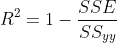
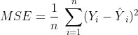
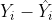
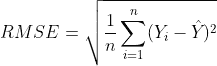

# 评估线性回归模型的度量标准

> 原文：<https://blog.devgenius.io/metrics-for-evaluating-linear-regression-models-36df305510d9?source=collection_archive---------0----------------------->

您已经有了一个样本数据集，并且刚刚使用线性回归模型完成了机器学习算法的工作。但是现在，您想知道您对数据的分析和预测是否准确，是否具有统计学意义，是否提供了解决问题所需的相关见解。

光信用:Unsplash

有许多指标用于评估线性回归模型的性能。它们包括:

*   **R 平方:**很少用于评估模型拟合度
*   **MSE(均方误差):**用于评估模型拟合度
*   **RMSE(均方根误差):**始终用于评估模型拟合度

让我们看一下这些指标，好吗？

**R 平方**:

*   也称为决定系数
*   测量由预测器(独立)变量中的预测器解释的响应(独立)变量的变化百分比。
*   每个回归的值都在 0 到 1 之间。其中， **0.3 和 0.5 之间的值表示弱 r 平方**， **0.5 和 0.7 表示中等 r 平方，**和值 **> 0.7 表示强 r 平方。**
*   值> 0.7 意味着 70%的变化在其平均值附近
*   r 平方越高，模型就越符合您的数据*(对此有一个警告…)* 因为一个好的模型可能有一个低的 r 平方值，反之亦然
*   是模型拟合的相对度量。这意味着它们不是确定模型与数据拟合程度的好方法。
*   有时被认为在统计学上是无关紧要的。
*   sklearn 模块:`sklearn.metrics.**r2_score**`
*   数学公式:

r 平方公式

**均方误差(MSE):**

*   测量观察值和实际值之间的平均平方差。
*   是模型拟合的绝对度量。
*   值为 0 表示完全符合，这意味着数据准确地预测了结果，但是在大多数情况下，很难做到这一点。
*   sklearn 模块:`sklearn.metrics.**mean_squared_error**`
*   数学公式:

MSE 公式

理解这一点很重要

残差

***残差:***

*   是实际值和预测值之间的差值
*   用于检查模型的有效性，以及是否要考虑假设或假说
*   应该是随机的(即没有模式)
*   一个好的残差的例子是残差以 0 为中心的散点图
*   statsmodels 模块:`RegressionResults.resid`

**均方根误差(RMSE):**

*   是实际值和预测值之间距离的度量
*   RMSE 越低，拟合度越好。这意味着数据的分布变化很小
*   是模型预测目标的准确程度的一个很好的衡量标准
*   被认为是确定模型和响应变量之间关系的最佳统计
*   表示实际值和预测值之间的 1-标准偏差(残差)
*   它从回归线测量数据点的分布。
*   使用 sklearn 和数学模块执行 RMSE

rmse.py

*   数学公式:

RMSE 公式

为了熟悉数据科学中使用的概念和模型，最好对统计学有深入的了解。不确定从哪里开始，这篇[文章](https://medium.com/dev-genius/statistics-for-data-science-ddbc284d4016)应该会给你一个进入统计领域的开端。

值得注意的是，这些指标仅适用于回归模型，而不适用于分类模型。还有其他可以使用的性能测量。我最近参与了一个项目[(红酒质量数据集)](https://medium.com/dev-genius/red-wine-quality-prediction-using-classification-and-regression-model-f19337821b71)，并使用上面的一些指标来评估我的模型的性能。您能告诉我这个指标在问题数据集上表现得好还是差吗？为什么？

现在，您知道了如何使用线性回归模型有效地处理数据集。感谢您抽出时间阅读。

有兴趣了解更多关于性能指标的信息，请查看这篇文章【https://bit.ly/2WWHC2E 