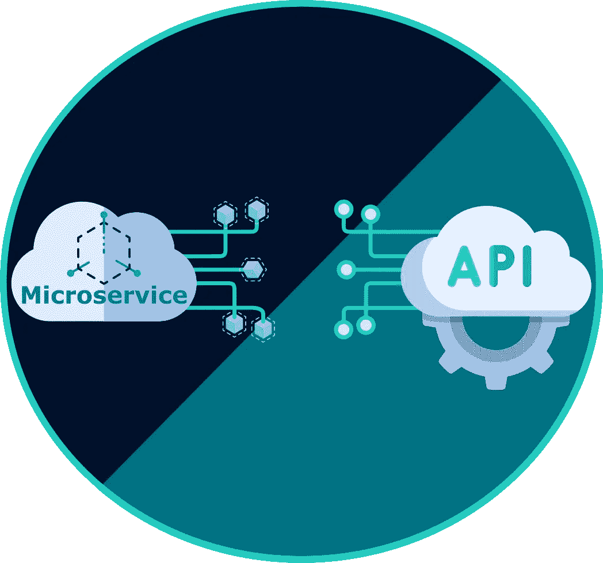
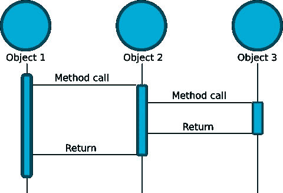
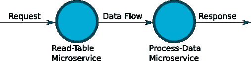
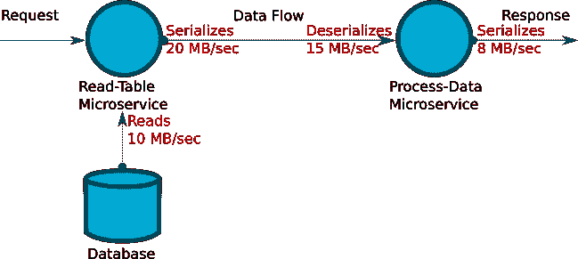

# 微 API 还是微服务？

> 原文：<https://blog.devgenius.io/micro-apis-or-microservices-cc707870d126?source=collection_archive---------0----------------------->

微服务架构是一种新的范式，这意味着不可能用面向对象(OO)的思维方式来完全理解。这并不意味着不需要 OO，这意味着我们需要额外的知识。

我认为微服务不仅仅是一个实体，而是一个网络，因为很少一个微服务能够端到端地覆盖一个完整的用例，通常你需要几个微服务来处理一个请求。有许多方法可以实现这一点。让我们首先回顾一个**错误的**方法——假设我们有三个微服务，它们使用同步请求/响应方法相互通信:

在这种方法下，微服务 1 将处于空闲状态，直到微服务 2 和 3 完成处理。

如果我们使用对象而不是服务来实现相同的功能，我们将得到完全相同的行为:我们需要等待对象 2 和 3 完成，然后才能从对象 1 获得返回值。

在面向对象编程(OOP)中，这很酷，没有任何问题，但是在微服务中，这是一个性能问题。

微服务不仅仅是设计系统的一种好的新方法，它是一种更好地处理大量信息的架构，在微服务的网络中，我们不能接受闲置的服务。

现在假设我们有三个应用程序，它们的 REST 接口使用同步请求/响应方法进行调用。这没有什么错，如果应用程序 1 在应用程序 2 和 3 完成之前一直处于空闲状态，这是完全可以的，因为通常应用程序并不打算处理高性能需求。

***当我们试图混合来自不同领域的设计原则时，问题就来了，结果，我们是在做微服务还是迷你应用就不清楚了。***

# 你可能从未听说过的微服务设计原则

我相信你已经听说过坚实的原则、功能范围、数据存储隔离、流量管理、高内聚等等。问题是这听起来很像面向对象设计(OOD)。

仅仅遵循面向对象的原则，你将无法处理微服务网络中最复杂的部分，例如组件并行、进程并行、流水线并行、数据分区、数据聚合、不对称等等。

即使你从未听说过微服务网络有这样的属性，这些属性在任何过程中都以有向无环图(DAG)的形式排列。这实际上就是微服务网络——DAG。

这也意味着以这种方式排列的微服务(如图所示)是一种反模式，因为正如您所看到的，请求/响应在图中形成了一个循环。

# 但是一个周期到底有什么问题呢？

循环作业定义通常是不可取的——它们会导致死锁，即每个微服务都在等待另一个微服务运行。循环依赖本身不会导致死锁。只有当周期中的所有微服务同时尝试访问共享资源时，才会发生这种情况。

通常您会在处理大量数据负载时看到死锁，但高数据负载不是根本原因。根本原因是设计问题，这表现在高数据量上，因为在这种情况下，系统将遇到几种组合，最终达到死锁。

这意味着更好的解决方案是配置为 DAG 的一组微服务。*任何解决方案都可以用这种方式建模*，然而，新手可能会努力尝试用这种方式建模解决方案，并可能会尝试在设计中加入循环。而且也不是更难，你只需要学会范式(一种解决问题的新的思维方式)。

现在，许多工程师，甚至公司，都建议为每个微服务建立一个数据库，也许是为了避免死锁问题。这项建议的问题在于它没有解决真正的问题。你不需要遵循这些建议，你可以更好地理解问题，权衡利弊，然后提出解决方案。

# 数据流编程

如果我们遵循 OOP 原则实现特定微服务的内部功能，这是可以的，但是我们不能将相同的原则扩展到 DAG，因为对象和 DAG 具有不同的性质。

相反，我们使用数据流编程(DFP)原则。使用由非循环流互连的微服务来可视化建模数据流和业务规则，这就是我们所说的 DFP。

实际上，任何业务规则都可以建模为工作流；我们可以更进一步，用 DAG 对业务规则建模。DAG 中的每个阶段都有可能成为微服务。

比方说，我们想从一个表中读取和处理记录，并向一个远程客户机发送一个响应。

*   要使用 OOP 做到这一点，您必须创建一个对象来查询表。该对象的类将位于存储库包下。一个不同的对象，最好是一个服务，应该调用我们的 repository 对象从 DB 中获取一组完整的记录。由于该服务从表中读取和处理数据，因此它必须在一个循环中迭代每条记录，并应用业务规则处理每条记录。然后，它将通过控制器层向客户端返回响应。
*   为了使用 DFP 实现这一点，并且使之变得简单，我们至少需要两个微服务(理想情况下是三个)，一个从表中读取记录，另一个处理记录并序列化对客户端的响应。读表微服务可能一次读取一条记录，并将其发送给流程数据微服务；或者一次读取一堆记录，并将它们发送到 Process-Data 微服务(这是一个技术决定，您应该根据延迟和其他一些因素来决定)。然后，Process-Data 微服务将应用业务规则转换每条记录，最后，它将在每次收到记录时产生一个响应。

这些解决方案中的哪一个旨在更快地处理大量数据？

当然是 DFP 解决方案。在 OOP 解决方案下，我们需要等待存储库读取所有记录；它会在内存中分配记录(此时我们已经受到内存容量的限制)；然后我们需要等待服务来迭代每个记录；最后，它必须序列化所有记录以产生响应。在 OOP 中，我们需要等待每一层完成处理，然后才能继续前进。

另一方面，使用 DFP，我们将从表中读取第一条记录，将其发送到下一个微服务，依此类推。

当我们读取 Read-Table 中的第二条记录时，Process-Data 正在处理第一条记录。当我们读取第三个记录时，下一个服务将处理第二个记录，依此类推。通过这种方式，我们的微服务将永远不会空闲，因为它们在内存中总是有一个记录，所以它们可以比 OOP 服务更快地处理任何数量的数据。

# 数据流速度

到目前为止一切听起来还可以，但是 DFP 有一个问题，就是数据流速度波动。这是任何网络的通病，微服务也不例外。

微服务网络中的数据流可能停止或变慢的原因主要有两个:1)服务由于内部错误而不可用，或者 2)表现出如此高的吞吐量/延迟而变慢甚至不可用，在等待不可用的服务响应时，调用方可能会消耗线程等资源。这可能会导致资源耗尽，从而使调用服务无法处理其他请求。在这种情况下，一项服务的故障或速度下降会影响到其他服务。

现在的问题是——如何防止一个网络或服务网络级联到其他服务？—广泛接受的解决方案是—断路器—我不会解释断路器的工作原理(因为这是一个广为人知的解决方案)。但是断路器的问题是，只有当我们的网络出现故障时，它才会起作用。

首先，如果服务由于内部错误(未处理的异常等)而变得不可用，这是开发团队最终必须解决的问题，在这种情况下，断路器更像是一个紧急杠杆。

其次，如果系统由于高吞吐量/延迟而失败，这听起来很像是架构问题。在这种情况下，断路器是一个补丁，而不是一个真正的解决方案。

# 高效处理高吞吐量的真正解决方案

首先我们来了解一下真正的问题，为什么一个微服务的网络会因为高吞吐量/延迟而失效。

假设我们有与上面相同的示例，但是现在我们知道每个微服务的读/写吞吐量。

我们应该问的第一个问题是——为什么在相同的服务中，我们在读取和写入时有不同的吞吐量？—我们先来回顾一下读表微服务。根据该图，服务…

*   以每秒 10 MB 的速度从表中读取记录。
*   然后，服务将每个记录转换成 JSON 格式。如您所知，JSON 是一种冗长的格式，所以在输出中，每条记录都会附带字段名和一些其他元数据。在输出中，我们发送的信息与从表中读取的信息完全相同，加上元数据，这就是它重复的原因。

流程数据微服务将执行一些业务和过滤逻辑:

*   该服务反序列化输入 JSON。
*   它将对每条记录应用业务规则。
*   现在让我们假设在业务规则之后，可以根据业务定义的一些标准过滤掉不需要的记录。
*   最后，它以 JSON 格式序列化输出记录。这就是为什么我们在输出端得到的吞吐量比输入端少，因为我们在过滤。

现在的问题是——如果读表服务每秒能够产生 20 MB 的 JSON，为什么流程数据服务每秒只能读取 15 MB？

这听起来像是一个问题，事实上，的确如此。流程数据微服务只能处理 15mb/秒，因为它处理更多的业务逻辑，因此需要更多的 CPU。显而易见的解决方案是——让我们添加更多的 CPU、更多的线程——但事情并没有那么简单。

如果系统在足够长的时间内达到最大吞吐量，进程数据服务将变得不可用，如果我们等待一段时间，它将级联到读表服务。这种情况经常发生，微服务的容量比其他服务高或低。

## 流动缓冲

解决这个问题的一个方案是通过流缓冲。缓冲区是存储的分配。微服务使用流缓冲区来临时存储输入数据，以便处理微服务之间的吞吐量差异。

流量缓冲影响:

*   性能:微服务必须确定是否在缓冲区中存储记录，缓冲区是否有空间，等等。
*   磁盘空间需求:如果缓冲区溢出，其内容需要写入临时文件。

## 持久缓冲

另一个解决方案是持久缓冲，这也是我最喜欢的。这种解决方案允许缓冲区大小实际上是无限的。我们不需要堆内存，并且具有非常好的性能，在每秒百万条消息的范围内。

持久缓冲的含义:

*   磁盘速度:这种解决方案的运行速度将与您的硬盘处理数据的速度一样快。
*   成本:如今，许多硬盘能够以与任何 CPU 相同的速度处理数据，代价将是成本。

持久缓冲的一个很好的实现是 Kafka Topics。

## 虚幻的解决方案

我们可能会说，另一个解决方案是升级处理数据微服务，这样我们将有一个读取表的服务和两个处理数据的服务。当然，这将暂时解决问题，但这种“解决方案”是脆弱的。

*   如果由于某种原因更新了配置，您可能会看到错误返回。
*   由于数据的性质，数据条件可能随时变化，吞吐率也会频繁变化。
*   业务规则更新可能会随时影响吞吐量。

升级微服务是一个解决方案，但不是为了这个。