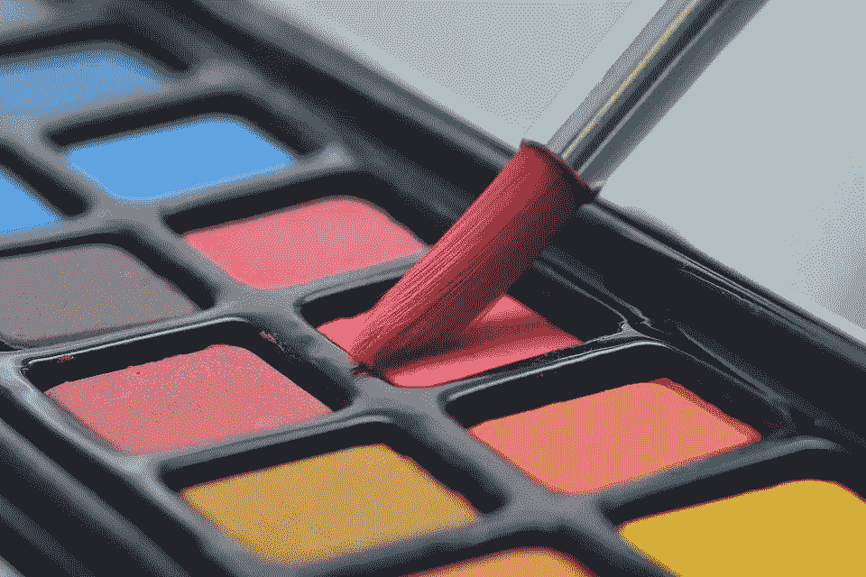
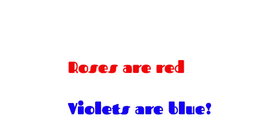

# 微博:定制 Python 简化仪表盘，定制主题等等！

> 原文：<https://blog.devgenius.io/microblog-customising-python-streamlit-dashboards-with-custom-themes-and-more-f09084d23ae7?source=collection_archive---------5----------------------->

## 创建 Streamlit 主题的快速指南



[图片来自 Pixabay](https://pixabay.com/photos/watercolor-colour-art-paint-brush-3445376/)

# 介绍

同时使用 Streamlit dashboard 快速轻松地建立数据模型(期待即将发布的博客！)，我决定从标准的 Streamlit 元素中分出一部分，用一些定制设计来丰富我的 Python 仪表盘。Streamlit 通过其主题特性提供了这一点，但通过一些定制的 HTML，您可以根据自己的喜好更多地改变主题。如果你也有兴趣给你的 Streamlit 仪表盘添加一些自定义的活力，看看这个博客吧！

# 创建全球简化主题

要创建[全局自定义精简它们](https://docs.streamlit.io/library/advanced-features/theming) e，您需要在`~/.streamlit`修改配置文件，因此在 Mac 或 Linux 上，导航到您的主目录，然后再导航到`.streamlit`。

```
cd ~/.streamlit
```

接下来，搜索`config.toml`文件。

```
find config.toml
```

如果该文件不存在，请创建一个！运行`streamlit config show`将返回配置选项；将该值分配给`config.toml`。

```
streamlit config show > config.toml 
```

> 想要一份 Linux 命令的快速备忘单吗？看看这个博客！

现在你可以用你最喜欢的文本编辑器编辑文件了。在[主题]标签下，您可以更改主要、背景、次要背景、文本颜色和字体类型(从三个选项中)。如果您只想更改基础模型的一部分，也可以指定一个基础-亮或暗。

```
[theme]base="light"
primaryColor="#FF0000"
backgroundColor="#FFFFFF"
secondaryBackgroundColor="#999999"
textColor="#000000"
font="serif"
```

要找到每个元素的确切变化，请查看文档！保存文档并运行您的应用程序，您会发现您的应用程序现在使用新的自定义主题运行了！

# 更多定制？

要添加更多的自定义功能，包括自定义字体，您可以使用自定义 CSS 和 HTML。要利用定制元素，只需将参数`allow_unsafe_html = True`添加到`st.write`函数中。

> 为什么不安全？这是 Streamlit 让用户知道恶意第三方[可以将代码注入仪表板](https://discuss.streamlit.io/t/why-is-using-html-unsafe/4863/2)的方式。

例如，要使用自定义字体，您可以从您最喜欢的[谷歌字体](https://fonts.google.com/)中复制并粘贴 CSS，并将其添加到仪表板顶部。

```
st.write("""<style>@import url('https://fonts.googleapis.com/css2?family=Fascinate');html, body, [class*="css"]  {
   font-family: 'Fascinate', cursive;
}</style>""", unsafe_allow_html=True)
```

这将改变整个仪表板使用迷人的字体。

您还可以将 CSS 与 Streamlit 仪表板集成，以自定义字体颜色。Streamlit 中主题选项的限制之一是它要求几乎所有文本都是一种颜色。然而，通过少量的 CSS，你可以改变某些区域的文本颜色，比如用较暗的第二背景。

```
st.write('<p style = "color:red">Roses are red</p><p style = "color:blue">Violets are blue!</p>', unsafe_allow_html=True)
```

这是我们探索半荒谬的进一步定制的结果！



勘探结果

# 资源

恭喜你写完了博客！有了这种能力，您现在可以构建和创建自定义的 Streamlit 主题，并超越基本的自定义主题，创建适合您口味的仪表板！

我强烈建议查看 Streamlit 文档，了解更多关于使用 Streamlit 构建定制主题的细节。

[](https://docs.streamlit.io/library/advanced-features/theming) [## 主题化-简化文档

### 在本指南中，我们提供了 Streamlit 页面元素如何受各种主题配置选项影响的示例。对于…

docs.streamlit.io](https://docs.streamlit.io/library/advanced-features/theming) 

此外，如果你是一个 Python 开发者，有兴趣探索一点 CSS 来美化你的仪表板，w3schools 是一个学习 CSS 来创建最棒的仪表板的极好的免费网站。

[](https://www.w3schools.com/css/) [## CSS 教程

### CSS 是我们用来设计 HTML 文档样式的语言。CSS 描述了 HTML 元素应该如何显示。这个…

www.w3schools.com](https://www.w3schools.com/css/)