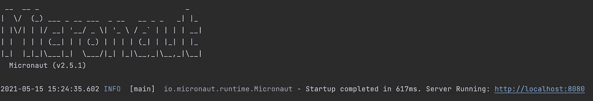
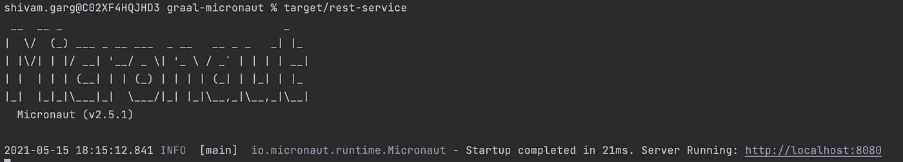

# Spring 的问题，Micronaut 如何解决它，以及后者对 GraalVM 的支持

> 原文：<https://blog.devgenius.io/micronaut-application-comparison-with-spring-boot-and-support-for-graalvm-d0fb0d933d55?source=collection_archive---------0----------------------->

Java 有一个非常健壮和成熟的生态系统，但是大多数 JAVA 开发人员有时会被关于 JAVA 内存消耗和启动时间的问题所困扰。

我已经在本文的第一部分 *—* 的 ***中讨论了 **Spring Boot** 应用程序的这一方面，以及 **GraalVM** 如何在这方面提供惊人的突破性改进***

 [## 具有 GraalVM 本机映像的 Spring Boot 应用程序

### GraalVM 本机映像极大地改善了启动和内存消耗

blog.devgenius.io](/spring-boot-application-with-graalvm-native-image-8074034ba35f) 

但问题仍然挥之不去…

*我们能表现得更好吗？
Spring 框架本身是否有某些方面导致了这个问题？
有没有已经把事情做得更好的框架？*

好吧，我们会试着通过深入研究找到这些问题的答案-

*   **Micronaut 框架与 Spring Boot 有什么不同**
*   **创建一个类似于我们在第 1 部分中所做的 REST 应用程序**
*   **使用 GraalVM** 将应用程序转换为本机映像

所以，系好安全带，我们开始吧😉

# 弹簧的缺点

嗯，我们都知道 Spring 是开发微服务的一个很棒的框架。在 **DI** (依赖注入)和 **AOP** (面向方面编程)方面都是极其强大的。

但是…… **它在运行时做这些！！！！**

*   [对于每个 bean，它读取字节码并执行运行时分析](https://github.com/spring-projects/spring-framework/tree/main/spring-core/src/main/java/org/springframework/core/type/classreading)
*   [创建完整的注释元数据，即关于源代码中注释的元信息](https://github.com/spring-projects/spring-framework/blob/main/spring-core/src/main/java/org/springframework/core/annotation/AnnotationUtils.java)
*   [为每个 bean 生成反射元数据，进行依赖注入，并进行 Bean 自检](https://github.com/spring-projects/spring-framework/blob/main/spring-beans/src/main/java/org/springframework/beans/CachedIntrospectionResults.java)

那么，运行时有什么问题呢？嗯，它消耗了 ***整整一大堆内存。*** Spring 的运行时反射方式导致 ***更长的启动时间*** 也是如此。

# Micronaut 有何不同？

现在，剩下的问题是—

**“我们如何才能在控制内存的同时，充分利用 Spring 的优势和它的生产力优势？”**

嗯，答案是 [**Micronaut**](https://micronaut.io/) **。**它通过大幅减少启动时间和 RAM 消耗来弥补性能问题。而且，这是打开真正的无服务器世界的大门。

那么，它到底是如何做到这一点的呢？答案是**编译！！！**

Micronaut 使用 ***提前编译(AOT)*** 到在编译时收集必要的信息。并表演—

*   依赖和配置注入(DI)
*   AOP 代理
*   预计算注释元数据

换句话说，**它提供了春天的美好，但尽可能无反射。因此，它避免了支付更多内存和更长启动时间的成本。这无疑增加了编译时间，但这是为更多好处付出的小小代价！！！**

想了解更多信息，请浏览 Micronaut 创始人 Graeme Rocher 的精彩演讲

# 示例 Micronaut 应用程序

现在让我们编写一个 Micronaut 应用程序。它将完全基于我们在第 1 部分编写的 Spring Boot 应用程序。应用程序将公开两个 REST 端点，这两个端点都将接受 HTTP GET 请求。

*   第一个端点应该提供对应于 Github 用户 **( /users/{githubUserName})的信息。**
*   第二个端点应该提供一个 Github 库的贡献者
    **(**[**/contributors/{ githubOrgName }/{ githubRepoName }**](http://localhost:8081/contributors/%7BgithubOrgName%7D/%7BgithubRepoName%7D)**)对应的信息。**

`GithubController`可以定义如下—

我们在 Micronaut 中使用`@ Controller`注释来编写 Rest 控制器。
`HttpResponse`是 Micronaut 相当于 Spring Boot 的`ResponseEntity`。

我们使用`GithubClient`类来获取用户或贡献者的详细信息。

这里，我们使用 Micronaut 内置的反应式非阻塞 HTTP 客户端— `RxHttpClient`。我们使用`@ Client`注释注入它。
注意`@ Singleton`注释被用在类的顶部来声明必须创建一个单独的 bean。另外，请注意，`toBlocking()`被用作我们在第 1 部分中使用的`RestTemplate`,在 Spring Boot 是一个阻塞的 HTTP 客户端。

现在，让我们看看`User` DTO 类，它将被用作 REST 响应。

仔细注意这里使用了`@ Introspected`注释。它使您能够进行**无反射 bean 自省**。这有助于在不使用反射的情况下封送/解封送 JSON。

Github API **强加了一个速率限制**，因此你不能在一个小时内从一个给定的 IP 发出超过`60`个请求。我们可以使用 Github 身份验证令牌来提高这个速率限制。

让我们将`GithubProperties`定义为微型机器人`ConfigurationProperties`。

所以，现在我们可以在`application.properties` / `application.yaml`中添加一个名为`github.token`的属性。

现在，在尝试调用 Github API 时，如何使用这个令牌呢？嗯，我们需要实现`HttpClientFilter`。这与我们在第 1 部分中定义的`RestTemplate`拦截器的工作原理相同。

这里，`GithubAppTokenFilter`的`doFilter`函数添加了一个`Authorization`请求头，其中包含所提供令牌的编码值。
由于使用了`@ Valid`和`@ Pattern`注释，因此将确保属性遵循上述正则表达式。

`RateLimitHeaderFilter`的`doFilter`功能提取
`X-RateLimit-Remaining`响应报头并提供`log`语句以提供关于剩余速率限制的信息。

代码的最后一部分是应用程序的入口点。

到目前为止我们讨论过的代码可以在这里找到—

 [## shivamgarg7276/graal-micronaut

### 这个示例项目展示了一个没有 AOT 的 Micronaut 应用程序，然后使用 GraalVM 将它转换成一个本机映像…

github.com](https://github.com/shivamgarg7276/graal-micronaut/) 

现在，使用`mvn clean install`进行构建。
Spring Boot 应用程序的构建时间是`2.6 sec`，而 Micronaut 显然需要更长的时间— `4.3 sec`。

然后运行`mvn mn:run`命令，应用程序将在`8080`端口启动。

因此，在我的机器上启动大约需要`**600 ms**`，内存消耗大约为`**155 MB**`，这比我们在 Spring Boot 应用程序中看到的结果要好得多。

随着负载的增加，Micronaut 应用程序消耗的内存越来越少。每秒请求数也相当好。

**您可以在这里根据多项指标查看这两者之间的深入比较—**

# ❤️·格拉沃姆

您一定已经在第 1 部分中了解了 GraalVM 如何使用 AOT 来形成原生映像，从而大幅改善了启动时间和内存消耗。

[**GraalVM**](https://www.graalvm.org/) **使用静态分析来完成所有这些工作，由于 Micronaut 消除了反射、运行时代理、动态类加载和字节码生成，它在 GraalVM 中开箱即用，效果非常好。**

现在让我们将同一个应用程序转换成本机映像。

不像在第 1 部分中，我们必须使用 **Spring Native，在本例中是**——GraalVM`native-image-maven-plugin`已经在
`micronaut-parent` maven 依赖中派上了用场。

因此，对于用 AOT 构建，您可以简单地使用这个命令-
`mvn package -Dpackaging=native-image`来构建模块

这将在模块的`target`文件夹下创建一个包含 Micronaut 应用程序的本地可执行文件。
简单调用— `target/rest-service`。

如果你现在看到，我机器的启动时间是`**21 ms**`😳 😯

**快如闪电！！！**

此外，与 JIT 变体中的`**155 MB**`相比，这次的内存消耗应该在`**30 MB**`左右。

**这清楚地证明了 GraalVM + Micronaut 是一个致命的组合。低 RAM 消耗显示了这种方法对于无服务器世界的价值，在这个世界中，每兆字节的 RAM 都是要花钱的。**

# 结论

Micronaut 框架提供了 Spring 的所有优点，而不必牺牲内存和启动时间。

**那么，我们应该抛弃 Spring，开始使用 Micronaut 吗？🤔**

老实说，超越春天是一项艰巨的任务。有很多 Spring 的粉丝和用户(包括我😂)，而切换到 Micronaut 并不是一个容易做出的选择。

Micronaut 仍处于新兴状态，正在证明自己的勇气。它获得应有的巨大认可只是时间问题。**和 GraalVM 在一起，那绝对是一头野兽！！！**

**竞争对行业总是有好处的。也许，Micronaut 的设计改进很少能进入 Spring 框架😁**

在本文的下一部分，我们将讨论 GraalVM 的高级配置设置和一些关键案例。

可以在评论里发表自己的看法，给出建议。

谢谢😊