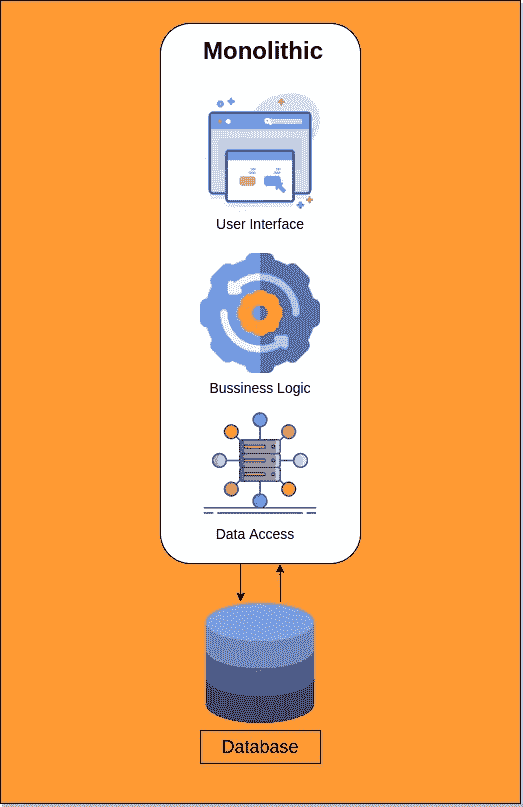
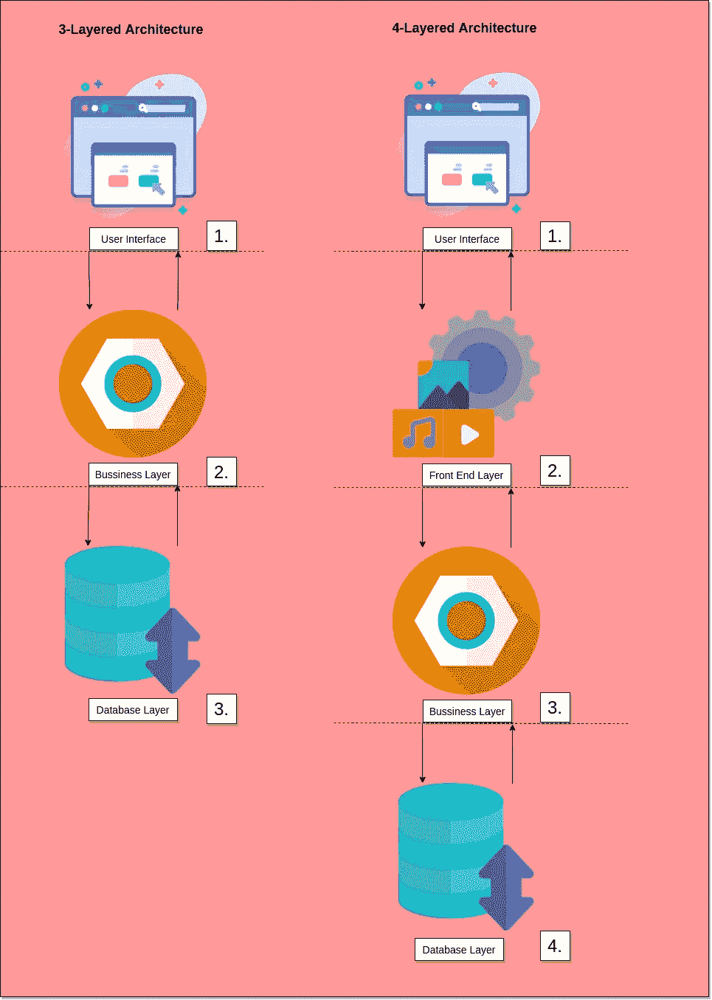
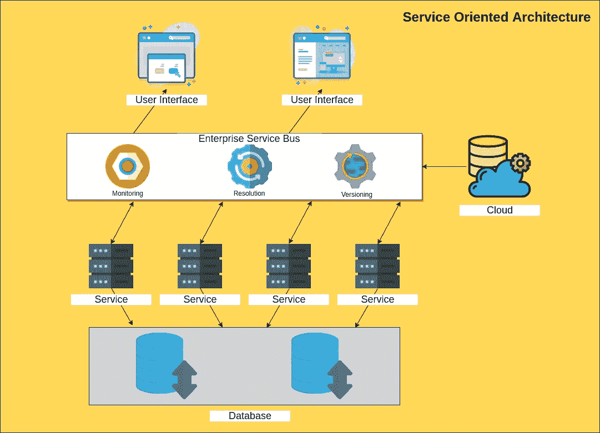
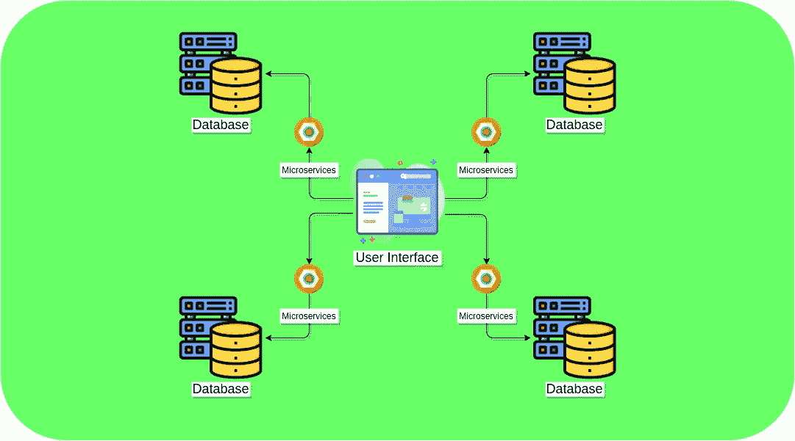

# 微服务和其他架构

> 原文：<https://blog.devgenius.io/microservice-and-other-architecture-f23b5dd69edd?source=collection_archive---------2----------------------->

微服务架构有一套提高速度和规模的实践，并且与技术无关。微服务是建立在小型服务(微服务)的组件之上的，这些小型服务支持有限的上下文。

服务是可独立部署的组件，通过基于消息的通信支持互操作性。

> “微服务是协同工作小型自治服务”——萨姆·纽曼

微服务应用程序的独立级别、有限范围和分解将创建高度内聚和松散耦合的服务。

# 整体建筑。

这是构建应用程序的默认状态，通常更普遍。这是一个由一个代码库紧密耦合管理的单一统一应用程序。应用程序的每个部分都按照我们的预期运行，否则系统会失败。

**好处**

1.  易于开发
2.  易于扩展(负载平衡器)
3.  易于测试

**挑战**

1.  致力于单一堆栈技术
2.  难以融入新的团队成员
3.  大型单片有一个大的代码库
4.  大型数据库给管理带来了问题

# 分层架构(也称为“n 层”)

分层体系结构是一种具有独立进程的客户端-服务器体系结构。主要的是客户/表示层、业务层和数据库层。这些层可以部署在不同的机器或服务器上。各层之间的通信是通过网络完成的。这将创建一个“关注点分离”,其中每一层只允许使用其下一层进行通信。

三层架构的主要部分:

**表示层/用户界面**

这是应用程序的入口点。这是用户与程序交互的地方。

**业务层**

该层协调应用程序进程和命令，此外，它还做出逻辑决策、评估和执行计算。在两个周围层之间移动数据。

**数据库层**

这是应用程序的基础。这是数据存储和持久化的地方，通常是数据库。

你可能会遇到其他术语。

1.  表示层
2.  应用层
3.  畴层
4.  持久层

# **面向服务的架构**

这是计算机软件设计中的一种架构模式，其中组件通过通信协议共享服务。每个组件都是一个服务，每个服务都是松散耦合的。与 monolithic 不同，每个服务都可以通过介质直接与任何其他服务通信。

# 深度微服务

我们可以把一个整体分成模块或子域。每个子域将负责特定的服务。
有了好的领域驱动设计，我们可以复制每个模块的依赖关系，以归档绑定上下文。

为了深入了解微服务，我们可以看看它如何处理 3 个主要部分。即**表示层**、**业务层、数据库层。**

## 用户界面/ **表示层**

每个团队都是孤立发展的。这意味着一个团队可以设计和开发用户界面，并为案例提供最好的 UX。但是这可能不容易维持。最好的方法是实现一个 UI 组合。

UI 构图会带来两种设计模式。

1.  **服务器端页面组合** —通过组合每个团队开发的 Html 片段，帮助在服务器上构建网页
2.  **客户端组合/SPA-** 通过浏览器上呈现的 UI 片段。

## 业务层(域)/ **业务层**

每个模块都是独立打包和部署的。每个去耦模块将能够通过以下方式相互通信

***API(应用程序用户界面)*** 。—他们会有一个沟通协议和风格。这包含两个通信族。

***【远程过程调用/远程方法调用(RPC/RMI)***——基于请求/回复原理工作。一个服务将请求和回复。这些调用可以是同步的，也可以是异步的。

***消息传递*** —这是指微服务通过代理或渠道交换消息或事件。一个服务将向代理发布一条消息，如果感兴趣，其他微服务将订阅代理。

## **数据库层**/数据访问

不像单片集成电路那样将整个数据存储在一个数据库中。每个模块都应该有独立的数据库来保存数据。每个数据库基于其微服务可以有不同的存储要求。一个服务可以依赖于事务，另一个依赖于只读，其他服务可能有只写条款。

数据同步可能是一个问题，比如没有分布式事务或即时一致性。在这种情况下，将使用最终一致性来捕获数据更改。

有几种方法可以使用工具来发布事件，如 **AKKA** 、**卡夫卡**或**兔子** MQ Debizuim。

**微服务的优势**

1.  采用新工具—允许您选择最适合特定功能的技术
2.  每项服务都是独立部署的
3.  易于扩展
4.  独立团队协作
5.  弹性/灵活性—一项服务中的故障不会影响其他服务。如果您在一个服务/模块中有单一或庞大的服务错误，它会影响其他模块/功能。
6.  故障隔离

**挑战**

1.  监视
2.  生产力
3.  测试挑战
4.  更复杂，尤其是大规模的

**结论**

这些是一些主要的架构模式。还有一些更复杂的模式，如区块链使用的对等体系结构、基于空间的体系结构等，不在此范围内