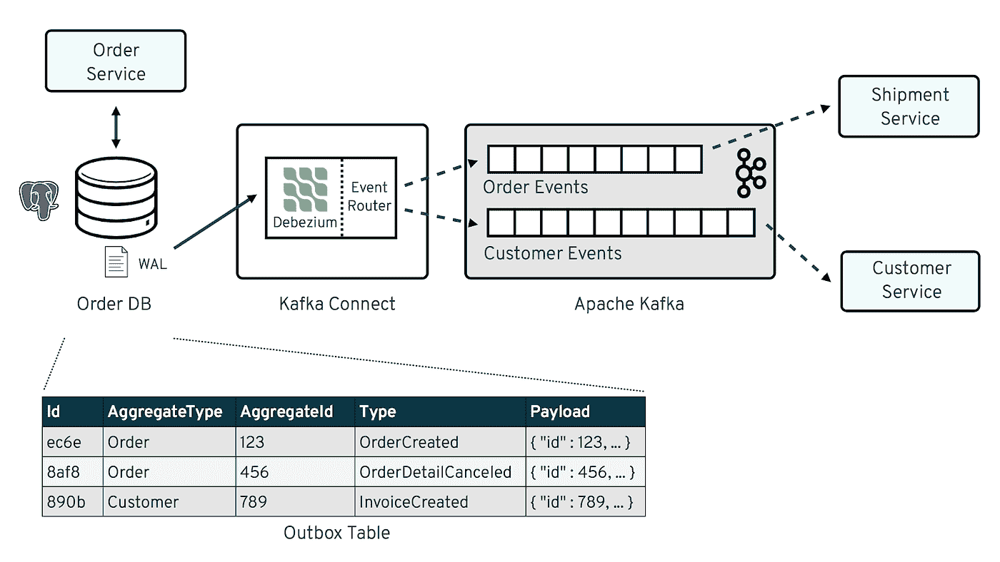

# 微服务架构——通信和设计模式

> 原文：<https://blog.devgenius.io/microservice-architecture-communication-design-patterns-70b37beec294?source=collection_archive---------0----------------------->

处理微服务中的进程间通信和执行流

地球(来源: [Pixabay](https://pixabay.com/photos/network-earth-block-chain-globe-3607641/) )

[微服务](https://en.wikipedia.org/wiki/Microservices)的目标是将应用程序充分分解/解耦为围绕业务功能组织的松散耦合的服务。分布式微单元共同服务于应用目的。

将单个应用拆分为微服务后，跨越多个服务的事务(读写)变得不可避免。然后**跨微服务边界的通信——工作流管理——数据存储机制变得具有挑战性。**系统应该遵守一个被称为[分布式计算谬误](https://en.wikipedia.org/wiki/Fallacies_of_distributed_computing)的准则。[**ACID**](https://en.wikipedia.org/wiki/ACID) 跨多个服务(每个服务都有自己的业务逻辑&数据库)处理事务时，无法保证数据库系统保证的真实性。 [**上限定理**](https://en.wikipedia.org/wiki/CAP_theorem) 表明你将在一致性(C)和可用性(A)之间进行权衡，因为分区容差(P)在分布式系统中是一个不理想的现实。在这篇博文中，我们将探索这些挑战和设计模式的解决方案。

# **协调服务间的沟通**

针对不同环境和目标的客户和服务可以通过不同的机制进行通信。根据协议的不同，它可以是同步的也可以是异步的。

## **同步通信——请求响应方法**

在同步通信中，需要一个预定义的源服务地址，准确地将请求发送到哪里，并且服务**(调用者和被调用者)此时都应该启动并运行。虽然协议可以是同步的，但是 I/O 操作可以是异步的，客户端不需要等待响应。这就是 **I/O 和**协议的区别。web API 常见的请求-响应方法包括 REST、GraphQL 和 gRPC。**

## ****异步通信****

**在异步通信的情况下，调用方不需要知道被调用方的特定目的地。一次处理多个消费者变得相对容易(因为服务可能会增加消费者)。此外，如果接收服务关闭，消息会排队等候，并在稍后服务启动时继续。从**松耦合、多服务通信、应对部分服务器故障的角度来看，这一点尤为重要。**这些是使**微服务向异步通信**倾斜的决定性因素。像 MQTT，STOMP，AMQP 这样的异步协议是由 Apache Kafka Stream，RabbitMQ 这样的平台处理的。**

**了解何时何地使用同步模型和异步模型是设计有效微服务通信的基本决策。你可以在这里分析微服务中基于 REST 的 vs 异步通信[。](https://solace.com/blog/messaging-between-microservices/)**

# ****消息&事件****

**在异步通信中，常见的机制是消息传递和事件流。**

## **消息**

****消息**是发送到特定目的地的一项数据，它封装了**意图/动作**(必须发生什么)并通过消息传递等渠道分发。队列存储消息，直到消息被处理和删除。在消息驱动的系统中，可寻址的接收者等待消息的到达并对它们做出反应，否则就处于休眠状态。**

## ****事件****

**事件封装了状态的变化(发生了什么),侦听器被附加到事件源，以便在发出事件时调用它们。**

*   **域事件—与应用程序生成的业务域相关联的事件(下图中的 OrderRequested、CreditReserved、InventoryReserved)。这些事件是事件源的关注点。**
*   **变更事件—从数据库生成的指示状态转换的事件。这些事件是变更数据捕获的关注点。**

**事件流是持久的、持久的、容错的，不需要任何消费者的想法。在这种情况下，处理器是哑的(在某种意义上，它仅充当消息路由器),客户端/服务拥有以域为中心的逻辑，使得**转储处理器和活动客户端。**这避免了复杂的集成平台，如传统 SOA 设计中使用的 ESB**。****

****

**图微服务设计中的事件**

## ****微服务原理——智能消费哑管道****

**微服务社区推广了[智能端点和哑管道](https://simplicable.com/new/smart-endpoints-and-dumb-pipes)的理念。马丁·福勒提倡他所谓的微服务通信的智能端点和哑管道。统治 SOA 世界的 ESB 有许多与复杂性、成本和故障排除相关的问题。**

# ****异步通信协议****

*   ****MQTT —** 消息队列遥测传输( [MQTT](https://en.wikipedia.org/wiki/MQTT) )是一种基于 ISO 标准发布订阅的轻量级消息协议[，广泛应用于物联网](https://www.integrasources.com/blog/mqtt-protocol-iot-devices/)。**
*   ****AMQP —** 高级消息队列协议(AMQP)是面向消息中间件的开放标准应用层协议。**
*   ****STOMP —** 简单面向文本的消息协议( [STOMP](http://stomp.github.io/) )，是一种基于文本的协议，以 HTTP 为模型，用于在服务之间交换数据。**

**有关这些协议的深入比较，请参考此处的。**

## ****通用消息/流媒体平台****

*   **[ActiveMQ](http://activemq.apache.org/)**
*   **[卡夫卡](http://kafka.apache.org/)**
*   **[RabbitMQ](https://www.rabbitmq.com/)**
*   **[Redis Streams](https://redis.io/topics/streams-intro)**

**评估标准的一些常见基线包括可用性、持久性/持久性、持久性、拉/推模式、可伸缩性和消费者能力。这些平台的详细对比可以参考[这里的](https://otonomo.io/blog/redis-kafka-or-rabbitmq-which-microservices-message-broker-to-choose/)。**

# ****微服务设计模式****

**微服务建立在独立自主的服务、可伸缩性、松散耦合的高内聚和容错的原则之上。这将带来挑战，包括复杂的管理和配置。设计模式是关于在给定的特定上下文中描述一个问题的可重用解决方案。我们将讨论这些模式，以应对挑战，提供经过验证的解决方案，使架构更加高效。**

# ****Saga 模式——跨多个服务维护原子性****

**单个事务可能跨越多个服务。例如，在电子商务应用程序中，新订单(与订单服务相关联)不应超过客户信用限额(与客户服务相关联)，并且商品(与库存服务相关联)应该可用。该事务不能使用本地 ACID 事务。**

**saga 是本地事务的序列，它更新每个服务并发布消息/事件以触发下一个本地事务。在任何本地事务失败的情况下，saga 执行一系列的**补偿事务**，这些补偿事务撤消先前本地事务所做的更改，从而保持**的原子性**。**

*   ****基于编排的传奇—** 参与者在没有集中控制点的情况下交换**事件**。**
*   ****基于编排的 saga —** 集中控制器告诉 saga 参与者要执行哪些本地事务。**

****

**图 1 .编舞和编排传奇**

**在这两种模式中进行选择取决于工作流的复杂性、参与者的数量、耦合性和其他因素，在这里[详细解释](https://docs.microsoft.com/en-us/azure/architecture/reference-architectures/saga/saga)。**

## ****两阶段提交****

**与 saga 类似，事务分两个阶段发生:准备和提交阶段。在准备阶段，要求所有参与者准备数据&在提交阶段，进行实际的更改。然而，与不希望的副作用和性能问题同步，它被认为[在微服务架构](https://developers.redhat.com/blog/2018/10/01/patterns-for-distributed-transactions-within-a-microservices-architecture/#:~:text=When%20a%20microservice%20architecture%20decomposes,services%2C%20it%20can%20break%20transactions.&text=If%20any%20step%20fails%2C%20the,guaranteed%20by%20the%20database%20system.)中不切实际。**

# ****事件源—面向状态的持久性的替代方案****

**持久化数据的传统方式是通过更新现有数据来保持实体状态的最新版本。假设，如果我们必须改变一个用户实体的名称，我们用一个新的用户名改变当前的状态。如果我们需要在任何时间点或时间旅行中重建国家呢？在这种情况下，我们需要考虑这种持久性策略的替代方案。**

**与这种面向状态的持久性相反，Event Sourcing 将每个状态突变存储为一个称为 Event 的独立事件，应用程序状态存储为一系列不可变的事件，而不是修改数据。通过有选择地重放事件，我们可以随时了解应用程序的状态。应用程序保存在名为事件存储的仅附加事件日志中。一个众所周知的例子是事务数据库系统的事务日志。**

**事件源依赖于三个服务层:**

*   ****命令**:命令处理程序处理的状态改变请求。**
*   ****事件**:状态变化的不变表现。**
*   ****聚合**:领域模型当前状态的聚合表示。**

**事件源有利于提供准确的审计日志记录、状态重建(任意时间点)、简单的时态查询、时间旅行、性能和可伸缩性因素。网飞用事件源解决了[离线下载功能](https://netflixtechblog.com/scaling-event-sourcing-for-netflix-downloads-episode-2-ce1b54d46eec)。这里用一个典型的例子讨论[的实现细节](https://www.eventstore.com/blog/what-is-event-sourcing)。**

# ****CQRS —命令查询责任分离****

**如果我们将 CRUD 操作设计成可以由两个独立的读写模型来处理，会怎么样？这显然增加了系统的复杂性，但是好处是什么&我们什么时候需要它？这种分离有助于增加另一层可伸缩性、性能和灵活性，允许在处理复杂的域模型时进行粒度读写优化。**

**CQRS 清楚地将在应用程序中进行更改的模型/对象与读取应用程序数据的模型/对象分开。命令只是一些方法，它们的唯一目的是执行操作(创建、更新、删除),要么被接受，要么被拒绝——而不会暴露系统状态。查询是读取系统状态而不做任何修改的方法。更进一步，我们可以通过引入一种保持同步的机制来分离数据存储的写部分和读部分(可以由多个数据库管理)。**

****

**图 1 .具有相同和不同数据存储的 CQRS**

## ****活动采购和 CQRS****

**这些通常被称为互补模式。**

> **“您可以在没有活动采购的情况下使用 CQRS，但在有活动采购的情况下，您必须使用 CQRS。”——Greg Young—[CQRS 和活动采购—海滩上的代码 2014](https://www.youtube.com/watch?v=JHGkaShoyNs&feature=youtu.be) 。**

**如前所述，事件存储由一系列不可变的事件组成。通常，业务需求想要**执行复杂的查询，这不能由单个聚合**来回答。每次都重复事件的顺序在计算上将是昂贵的(并且在巨大的数据集中是不实际的)。在这种情况下，隔离将证明是有益的。**

**在下图中，命令更新事件存储将发布事件。查询服务使用更改日志事件，并为将来的查询构建一个预测。**

****

**图 1 服务中的事件源和 CQRS**

# **事务发件箱模式**

**在某些情况下，我们需要在数据库中进行更新，并调用另一个动作，通常是在外部系统上。例如，在电子商务应用程序中，我们需要保存订单并向客户发送电子邮件。如果任何一个事务失败，都会导致系统不一致。**

**在这种情况下，**发件箱**和**消息中继**可以协同工作，可靠地保持状态并调用另一个动作。一个“**发件箱**”表驻留在服务的数据库中。随着主要变化(例如在订单表中创建订单)，表示事件的记录(orderPlaced)也被引入到同一数据库事务中的发件箱表中。在非关系数据库中，通常通过在文档中存储事件来实现。**

**然后，消息中继读取发件箱表，并将消息转发到相应的目的地。消息分派过程可以是轮询发布者(轮询发件箱表)或事务日志跟踪(跟踪数据库提交日志)。**

****

**图交易发件箱模式**

## **变更数据捕获(CDC)**

**应用程序状态保存在数据库中。变更数据捕获跟踪源数据库中的变更，并将这些变更转发到目标，以便与相同的增量变更同步。CDC 可以是基于[日志的](https://debezium.io/blog/2018/07/19/advantages-of-log-based-change-data-capture/)(事务数据库将所有更改存储在事务日志中)或基于查询的(定期使用查询检查源数据库，因为事务日志在类似 [Teradata](https://www.teradata.com/) 的数据库中可能不可用)。**

**下图显示了基于日志的 CDC，用于捕获发件箱表中的新条目(使用[Debezium connector for Postgres](https://debezium.io/docs/connectors/postgresql))并将它们传输到 Apache Kafka。事件捕获以非常低的开销近乎实时地发生，并且事件是订阅的目的地服务。**

****

**图使用 Apache Kafka 的 CDC 事务发件箱**

# **微服务设计的考虑因素**

**我们将简要介绍设计微服务时需要的一些杂项想法/原则。**

## **幂等交易**

**幂等事务是那些发出多个相同请求的事务，这些请求具有与发出单个请求相同的效果。在一个 [REST API](https://en.wikipedia.org/wiki/Representational_state_transfer) 中，GET 方法是等幂的(可以重复调用，保证结果与处理该方法一次相同)，而 POST 方法不是等幂的(item 在每个请求上不断增加)。**

**在分布式系统的上下文中， [**你不能拥有恰好一次的消息传递**](https://bravenewgeek.com/you-cannot-have-exactly-once-delivery/) 。消息代理，比如 Apache Kafka 或 RabbitMQ，实现了**至少一次交付**，这为同一个事务创建了多次调用的可能性。因此，在分布式系统中，消费者需要是幂等的。如果消费者不是等幂的，多次调用会导致 bug&不一致。**

**Airbnb 实现了[**【Orpheus】**，一个跨多个支付服务的通用幂等库](https://medium.com/airbnb-engineering/avoiding-double-payments-in-a-distributed-payments-system-2981f6b070bb#:~:text=This%20is%20critical%20for%20Airbnb,API%20to%20achieve%20eventual%20consistency.)、，其中一个**幂等键**被传递到框架中，表示单个幂等请求。Paypal 使用 [MsgSubId(消息提交 ID)](https://developer.paypal.com/docs/archive/express-checkout/integration-guide/ec-related-ops/#api-idempotency) 在 API 中实现幂等，Google Service Payment 使用[请求 ID](https://developers.google.com/standard-payments/reference/idempotent-behavior-examples#idempotency_and_google_standard_payments) 实现幂等。**

****

**图 1 列车目的地标志控制中的开/关。按下 On 按钮是等幂的，因为无论按一次还是多次，效果都是一样的。同样，按下关闭是幂等的。(来源:[维基百科](https://en.wikipedia.org/))**

## **最终一致性**

**在分布式系统中，一致性定义了对一个节点/服务的更新是否以及如何传播到所有服务。也被称为**乐观复制**，最终一致性只是承认在将一台机器上所做的更改传播到所有其他副本时存在无限延迟。**

**网络分区是分布式系统的一个不理想的现实，网络可能会发生故障。由于分区容差(P)是不可避免的，CAP 定理表明您将在一致性和可用性之间进行权衡。如果您选择可用性，您不能有强一致性，但是您仍然可以在您的系统中提供最终的一致性。**

**许多业务系统对数据不一致性的容忍度比通常认为的更高，可用性高于一致性。**(**B**A**A**可用， **S** oft 状态，**E**vent Consistency)系统优于酸系统。****

> ****对于分布式系统来说，维护强一致性极其困难，这意味着每个人都必须管理最终的一致性****
> 
> ****马丁·福勒****

********

****图 4 分布式系统中的最终一致性****

## ******分布式跟踪******

****在微服务中，与请求相关联的元数据(可能跨越多个服务)将有助于不同的原因:监控、日志聚合、故障排除、延迟和性能优化、服务依赖性分析和分布式上下文传播。****

****分布式跟踪是从头到尾捕获请求的**元数据**的过程，确保日志记录开销保持最小。一个**唯一的事务 ID** 被分配给外部请求&，该请求通过分布式拓扑&中每个事务的调用链传递，包括在所有消息中(以及时间戳和元数据)。****

****唯一标识符可以通过使用数据库票服务器(如 [Flickr](https://code.flickr.net/2010/02/08/ticket-servers-distributed-unique-primary-keys-on-the-cheap/) ) [、](https://code.flickr.net/2010/02/08/ticket-servers-distributed-unique-primary-keys-on-the-cheap/),) UUID 或 Twitter 雪花所使用的)来生成。常见的分布式追踪工具有 [OpenTracing](https://opentracing.io/) 、 [Jaeger](https://www.jaegertracing.io/) 、 [Zipkin](https://zipkin.io/) 和 [AppDash](https://opentracing.io/registry/appdash/) 。****

## ****服务网格****

****微服务中的服务网格是处理进程间通信的可配置网络基础设施层。这类似于通常所说的边车代理或边车网关。它提供的功能包括:****

*   ****负载平衡****
*   ****服务发现****
*   ****健康检查****
*   ****安全性****

****Envoy 是一款流行的开源代理，专为云原生应用而设计。 [Istio](https://istio.io/) 是一个开放平台，用于连接、管理和保护 Kubernetes 社区中流行的微服务。****

****为了向客户端应用程序公开你的微服务 API，请参考我的[博文:微服务设计——API 网关模式](https://medium.com/dev-genius/microservices-design-api-gateway-pattern-980e8d02bdd5)。****

## ****参考****

1.  ****[https://martinfowler.com/articles/microservices.html](https://martinfowler.com/articles/microservices.html)****
2.  ****[https://docs.microsoft.com](https://docs.microsoft.com/)****
3.  ****[https://microservices . io](https://microservices.io/)****
4.  ****[https://www.nginx.com](https://www.nginx.com/blog)****
5.  ****[https://www . confluent . io](https://www.confluent.io/blog/)****
6.  ****微服务从设计到部署——Chris Richardson 与 Floyd Smith****
7.  ****https://www.infoq.com 优步-微服务-分布式-追踪—****
8.  ****[https://netflixtechblog.com](https://netflixtechblog.com/)****
9.  ****[https://medium.com/airbnb-engineering](https://medium.com/airbnb-engineering)****
10.  ****构建微服务— Sam Newman****