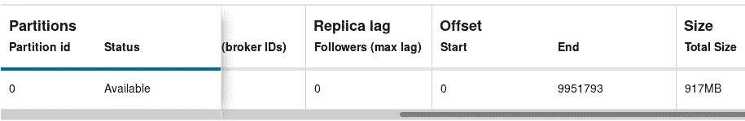
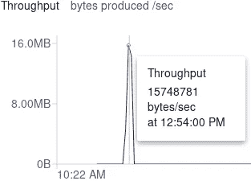

# 与 Apache Kafka 的微服务通信

> 原文：<https://blog.devgenius.io/microservice-communication-with-apache-kafka-ae3ccb05a4b6?source=collection_archive---------8----------------------->

微服务必须面对的挑战之一是沟通。但是有一种简单的方法可以带来最大的好处。使用 Apache Kafka 来交流微服务的最显著的好处之一是:

*   零数据包丢失。
*   非常高的吞吐量(单个微服务仅使用一个 CPU 就可以处理 10mb/秒)。
*   实时处理。
*   CPU 限制的可扩展性(这意味着，如果您有一个微服务的两个实例，每个实例在一个 CPU 中运行，您的应用程序将扩展到处理 20mb/秒，如果您有 3 个实例，您将扩展到处理 30mb/秒，依此类推)。

对于这个基准测试，我获得了 10mb/秒的吞吐量，但是处理速度将主要取决于 CPU 能力、业务逻辑复杂性、数据等。

我用来生成基准的完整代码和项目位于这个 GitHub repo:[Kafka-reactive-app](https://github.com/alejandro-mosso/kafka-reactive-app.git)。

# 个案研究

我们的案例研究代表了一个数据管道，它接收股票运动，并将这些运动发送到一个反应角度应用程序。

我们将关注数据是如何沿着我们的数据管道流动的。

**制作者**:这是一个模拟微服务，生成 CSV 随机值来模拟一个源。该组件生成的所有记录都存储在一个主题中。

**监听器**:获取每条记录并执行数据类型验证。无效记录存储在不同的主题中。

**登陆**:将 CSV 转换成 JSON。

**处理器**:每条记录都被分支，在一个主题中存储股票价格，在另一个主题中存储股票信息。

**Messenger** :这是一个 web 套接字，用于向 Angular 应用程序发送数据。

# 设置您的环境:

要设置您的环境，只需使用这个 [docker-compose.yml](https://github.com/alejandro-mosso/kafka-reactive-app/blob/master/docker-compose.yml) 文件运行“docker-compose up”。

这将使用默认集群启动一个融合环境。一旦您的环境启动，转到 [http://localhost:9021/](http://localhost:9021/) 并创建以下主题:

*   输入主题
*   着陆区
*   着陆误差
*   中转区
*   股票价值
*   库存比率
*   库存比率不足
*   股票价格下跌

# 1)以传统方式运行作业

首先，我们用 java -jar 以传统方式开始我们的生产者工作(在 [REDME.md](https://github.com/alejandro-mosso/kafka-reactive-app/blob/master/producer/README.md) 文件中找到所有命令):

下图显示了该作业如何开始消耗 CPU。我们可以看到，所有的 CPU 都使用了大约 80%的总容量来处理一个任务。

在这种方法下，我们得到了这样的数据生产吞吐量:

# 2)使用无共享方法运行

现在让我们看看这个作业在无共享架构下是如何工作的。Shared-nothing 意味着我们的作业不会与任何其他进程共享 CPU(这是 Linux 名称空间的主要特性，但不仅仅是隔离 CPU，我们还可以隔离网络、磁盘、内存等)。

了解您的 CPU 架构非常重要。在我的例子中，我的 CPU 使用超线程，每个 CPU 有两个线程，这意味着如果我有 4 个物理 CPU，我的操作系统将显示 8 个 CPU，因此，如果我想使用单个物理 CPU 处理我的作业，我应该以这种方式运行我的作业:

如果您跟踪 CPU，您应该会看到类似这样的内容:

现在，我没有让所有 CPU 都以大约 80%的速度运行，而是只让一个 CPU 以 100%的速度运行，并发性非常低，而且我的吞吐量稍微好一些:

## 传统方法与无共享

这非常有趣，因为使用单个 CPU 比使用所有 CPU 有更好的性能。如果你想更好地理解无共享是如何工作的，你应该读一读另一篇文章“[让我们用无共享来烧掉它](https://medium.com/swlh/lets-burn-it-with-shared-nothing-architecture-2662b02d50c9?source=friends_link&sk=b130bc826537a3f20487ac3a963e354b)”。

正如我们在第一张图表中看到的，所有的 CPU 都在并发工作，试图将处理能力交给一个单独的任务。乍一看，这听起来很棒，但事实并非如此；在传统方法下，我们有一个严重的性能问题——每当 CPU 切换到并发处理单个任务时，它也会浪费时间:一个 CPU 会处理一小段时间，然后它会切换，下一个 CPU 会开始处理，依此类推。问题是，它给人的印象是所有的 CPU 都以总容量的 80%工作，但我们有很多浪费。

另一方面，当我们将进程绑定为仅使用一个 CPU 时，我们也减少了并发性，正如我们在第二个图表中看到的，数据生产率甚至有所提高，所有其他 CPU 看起来压力较小。

# 3)将吞吐量从 600 KB/秒提高到 10mb/秒

在生产者微服务中，我们没有任何复杂性，它只是一种持续产生价值的方法。我们管道中的下一个微服务是监听器:这个组件解析每个 CSV 记录，将其分成 12 个字段；然后，它验证每个字段的数据类型。与 producer 不同，listener 确实有一些业务逻辑，并且在理论上，它应该需要更多的 CPU 来处理相同数量的数据。

一段时间后，我们的制作人微服务已经生成了大约 1000 万条记录:

现在，我们的侦听器组件将使用大约 1000 万条记录来拆分和验证它们。

一旦我们启动监听器进程，我们的 CPU 表现如下:

这很奇怪，因为 CPU 看起来一点也不紧张，它只消耗了总 CPU 容量的 60%。

但更有趣的是吞吐量，这个比 producer 逻辑更复杂的作业有更好的性能。该图表显示监听器正在读取**16mb/秒**。

在进行数据类型验证之后，工作是将**10mb/秒**写入着陆区主题。

我们在 **149.69 秒**内处理了 1049 万条记录。

那么，生产者微服务和听者微服务有什么区别呢？为什么听众比制作人有更好的表现？

Listener 获得了显著的性能提升，因为这里我们使用了 Apache Kafka 流。

# 4)用 Kafka 主题和 Kafka 流进行数据转换

让我们做最后一个测试。现在我们想知道这个解决方案在进行数据转换时表现如何。

在管道中，下一个组件是“着陆”。这个微服务将 CSV 记录转换成 JSON。

现在我们正在读取大约 990 万条记录，因为验证流程拒绝了大约 50 万条记录。

我们再次开始我们的过程:

显然，读取吞吐量变慢了，现在我们正在读取**6.25 MB/秒**。

但是该进程正在以更高的速度写入数据:**15.01 MB/秒**。

我们在输出中比在输入中有更高的吞吐量，这很容易解释，因为我们正在将 CSV 输入数据转换成 JSON。JSON 有额外的元数据，所以在输入和输出中我们都有 990 万条记录，但是在输出主题中数据的大小增加了，从 917 MB 增加到 2.21 GB。

整个过程花费了 **150.76 秒**来处理**990 万条**记录，几乎与我们使用监听器验证**1050 万条**记录中的数据类型的时间相同( **149.69 秒**)。

# 结论

为了获得最大的性能和可伸缩性，最好的组合是 Kafka 主题来传递微服务，Kafka 流来处理数据。

如果你在没有微服务架构的情况下使用 Kafka 主题和 Kafka 流，你将错过无共享架构的好处。

基本上，我提出了四种不同的场景和不同的结果:

**1)以传统方式运行作业:** Quarkus 在无共享架构之外运行。
**2)以无共享方式运行:** Quarkus 运行在无共享架构中。
**3)将你的吞吐量从 600 KB/秒提升到 10mb/秒:** Quarkus + Kafka 流运行在无共享架构中。
**4)Kafka 主题和 Kafka 流的数据转换:**运行在无共享架构中的 Quarkus + Kafka 流。

我邀请你进行你自己的测试，并在下面的评论区分享你的结果。