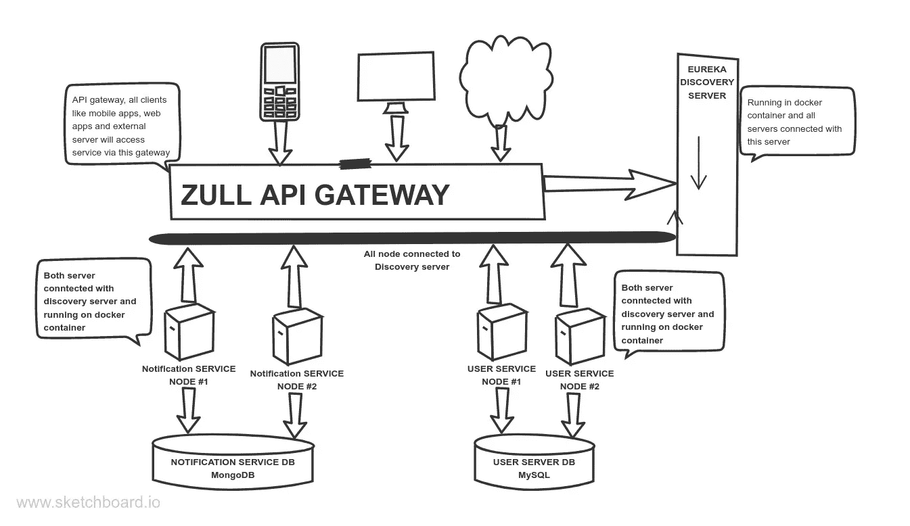
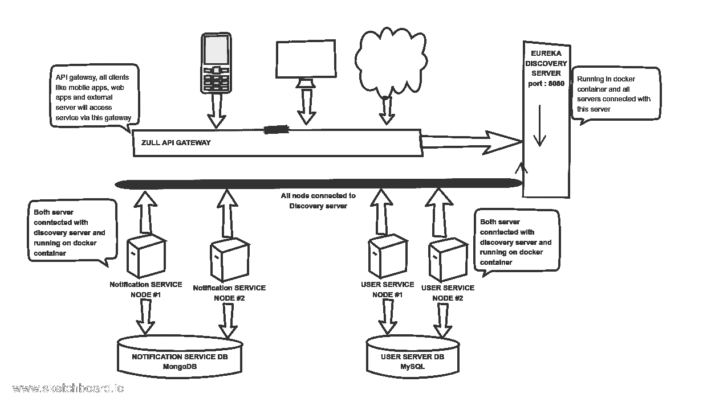
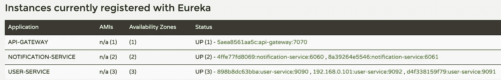
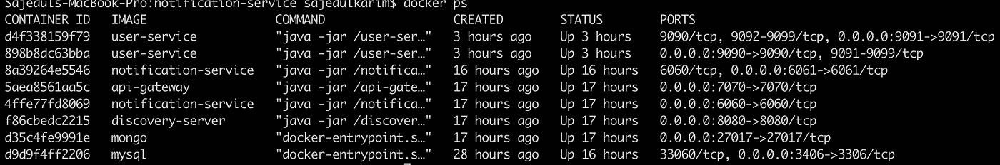
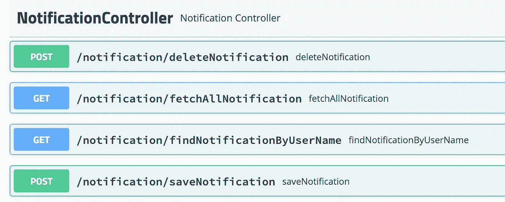

# 使用 Spring Cloud 和 Docker:网飞堆栈实现微服务

> 原文：<https://blog.devgenius.io/microservice-implementation-using-spring-cloud-with-docker-netflix-stack-76a367a5cf05?source=collection_archive---------0----------------------->

## 发现服务器、API 网关 ZUUL、ribbon、服务间通信和 docker

微服务是一种使用容器构建分布式应用程序的架构设计。微服务之所以得名，是因为应用程序的每个功能都作为独立的服务运行。这种架构允许每个服务在不中断应用程序中其他服务的情况下进行扩展或更新。


在 [Unsplash](https://unsplash.com?utm_source=medium&utm_medium=referral) 上由 [Austin Distel](https://unsplash.com/@austindistel?utm_source=medium&utm_medium=referral) 拍摄的照片

在这篇文章中，我将解释和实现以下几点

1.  什么是微服务及其重要性？
2.  整体架构和微服务架构的比较
3.  在我们的案例中，网飞·斯达克(尤里卡、祖尔和丝带等)如何成为生命的救星？
4.  网飞技术堆栈的详细描述
5.  描述并实现我们提出的微服务架构(服务发现、API 网关路由和负载平衡、微服务间通信及其负载平衡等)
6.  验证微服务如何连接，如何根据数据进行负载平衡。
7.  描述代码库和共享代码

**先决条件** :
在开始这篇文章之前，你需要了解 docker、MongoDB 和 spring boot。要做到这一点，你可以检查这些文章

[](https://medium.com/dev-genius/dockerizing-spring-app-with-gradle-3b6fbd650bf7) [## 用 Gradle 编写 spring 应用程序

### 根据文档，Docker 是一个开发、运输和运行应用程序的开放平台。码头工人…

medium.com](https://medium.com/dev-genius/dockerizing-spring-app-with-gradle-3b6fbd650bf7) [](https://mesukcse08.medium.com/scalable-system-implementation-using-rabbitmq-java-and-mysql-2d5fe0fa182e) [## 使用 RabbitMQ、Java 和 MySQL 的可伸缩系统实现

### RabbitMQ 是一个广泛使用的开源消息代理

mesukcse08.medium.com](https://mesukcse08.medium.com/scalable-system-implementation-using-rabbitmq-java-and-mysql-2d5fe0fa182e) 

**infra structure 架构**



我们项目的建筑图

我们的应用程序业务逻辑如下所示

1.  用户服务部负责注册我们的客户。注册成功后，用户服务将调用通知服务发送通知。
2.  用户服务有 N 个实例。这里我们将展示两个实例的例子，它们都与 MySQL 数据库相连。两者都部署在 docker 容器中。
3.  通知服务将通知数据存储到 MongoDB 数据库中。用户服务在客户注册后调用此服务。它也有 N 个实例，我们将给出两个实例的例子。这两个实例都运行在 docker 容器上。
4.  MySQL 和 MongoDB 这两个数据库都运行在 docker 容器中。

**单片架构**

**整体架构**被认为是构建应用的传统方式。整体式应用程序是作为一个不可分割的单元构建的。通常，这种解决方案包括客户端用户界面、服务器端应用程序和数据库。它是统一的，所有功能都在一个地方进行管理和服务。

传统的整体架构如下所示


图片来自 https://www.n-ix.com/

通常，单片应用程序有一个大的代码库，缺乏模块化。如果开发人员想要更新或改变某些东西，他们访问相同的代码库。所以，他们一次改变整个堆栈。

单片架构的局限性如下

*   组件之间的紧密耦合，因为一切都在一个应用程序中
*   集成开发环境可能会变得过载，而且规模也可能会降低启动时间
*   您必须在每次更新时重新部署整个应用程序。
*   每个元素都与其他元素紧密相关且相互依赖，因此很难更改为新的或高级的技术、语言或框架
*   变更的影响通常没有被很好的理解，这导致了大量的手工测试。
*   当不同的模块有冲突的资源需求时，单一的应用程序也很难扩展。
*   单片应用的另一个问题是可靠性。任何模块中的错误(例如内存泄漏)都有可能导致整个进程停止。此外，因为应用程序的所有实例都是相同的，所以这个错误会影响整个应用程序的可用性。
*   单一应用程序阻碍了新技术的采用。由于框架或语言的变化会影响整个应用程序，因此在时间和成本上都非常昂贵。

**微服务架构**

微服务是一种将大型软件项目分解为松散耦合的模块的方式，这些模块通过简单的应用编程接口(API)相互通信。

微服务在过去几年变得越来越流行。它们是模块化架构风格的一个例子，基于将大型软件项目分解成较小的、独立的、松散耦合的部分的哲学，这种风格在 API 管理和高度定义的离散任务的执行中以其动态和敏捷的品质在开发人员中获得了突出地位。

> 简而言之，微服务架构风格是一种将单个应用程序开发为一套小服务的方法，每个小服务都在自己的进程中运行，并通过轻量级机制(通常是 HTTP 资源 API)进行通信。马丁·福勒

微服务的优势如下

*   所有服务都可以独立部署和更新，这提供了更大的灵活性。
*   一个微服务中的 bug 只会影响特定的服务，而不会影响整个应用程序。此外，向微服务应用程序添加新功能要比向单一应用程序添加新功能容易得多。
*   微服务应用分成更小更简单的组件，更容易理解和管理。你只需专注于与你的业务目标相关的特定服务。
*   微维护比整体维护更快。较小的服务也易于测试，节省了程序员的时间。随着时间的推移，它提高了效率并节省了资金。
*   微服务稳定，最可靠。破坏一部分只会影响该元素，而其他部分保持不变。这种灵活性允许一个功能的快速开发和引入变化，而不会干扰其他功能。
*   在微服务的情况下，可伸缩性要容易得多，因为我们可以只伸缩那些需要更多资源的部分。
*   工程团队从一开始就不受所选技术的限制。他们可以自由地为每个微服务应用各种技术和框架。
*   微服务应用中的任何故障只会影响特定的服务，而不会影响整个解决方案。所以所有的改变和实验都是以更低的风险和更少的错误实现的。

**网飞栈详情**

网飞 OSS 是网飞写的一套框架和库，用来大规模解决一些有趣的分布式系统问题。通过一些简单的注释，您可以快速启用和配置应用程序中的通用模式，并使用久经考验的网飞组件构建大型分布式系统。提供的模式包括服务发现(Eureka)、断路器(Hystrix)、智能路由(Zuul)和客户端负载平衡(Ribbon)。

**服务发现(尤里卡)**

服务发现是基于微服务架构的关键原则之一。试图手动配置每个客户端或某种形式的约定可能很难做到，而且可能很脆弱。Eureka 是网飞服务发现服务器和客户端。可以将服务器配置和部署为高度可用，每台服务器将已注册服务的状态复制给其他服务器。

它确实会吼叫

*   Eureka 是一个基于 REST(表述性状态转移)的服务，主要用于 AWS 云中定位服务，以实现中间层服务器的负载平衡和故障转移。
*   服务发现服务器网飞尤里卡允许微服务在运行时注册它们自己，因为它们出现在系统中。
*   它是一个注册表，客户端(你的微服务)可以连接到它(注册)，让你的 Eureka 服务器知道你的微服务位于哪里，有多少，以及它们是否健康。
*   Discovery Server 帮助发现我们需要的服务。当某个服务需要访问另一个服务时，Discovery Server 会提供所请求服务的所有端点详细信息来建立连接。
*   所有服务都需要向发现服务器注册，否则，发现服务器不知道该服务。

**网飞丝带**

*   网飞 Ribbon 是一个进程间通信(IPC)云库。Ribbon 主要提供客户端负载平衡算法。
*   服务消费者可以使用动态路由和负载平衡器网飞功能区在运行时查找服务。
*   带状负载平衡器在动态环境(如云)中提供服务发现。功能区库中包括与尤里卡和网飞服务发现组件的集成
*   Ribbon API 可以动态地确定服务器是否在实时环境中启动和运行，并且可以检测那些关闭的服务器
*   Ribbon 使用 Eureka 中可用的信息来定位适当的服务实例。如果找到多个实例，Ribbon 将应用负载平衡，将请求分散到可用的实例上。
*   它提供了一个可配置的负载平衡规则。Ribbon 支持 *RoundRobinRule* 、*AvailabilityFilteringRule*、 *WeightedResponseTimeRule* 开箱即用，还支持定义自定义规则
*   功能区不是作为一个单独的服务运行，而是作为每个服务消费者中的一个嵌入组件。
*   Ribbon API 基于名为“命名客户端”的概念工作。在应用程序配置文件中配置 Ribbon 时，我们为负载平衡所包含的服务器列表提供了一个名称。

**发现客户端**

每个服务都必须向发现服务器注册。这里，我们的用户服务和通知服务都与发现服务器相连。这两个都是发现客户端。单个服务可能有多个实例。

**网飞祖尔语:API 网关**

Zuul 是从设备和网站到网飞流媒体应用后端的所有请求的前门。作为一个边缘服务应用，Zuul 旨在实现动态路由、监控、弹性和安全性。

路由是微服务架构不可或缺的一部分。例如，用户可以调用用户服务来获得用户信息，或者调用通知服务来获得最新的通知。Zuul 是网飞基于 JVM 的路由器和服务器端负载均衡器。

*   边缘服务器 Zuul(当然)是我们与外界的看门人，不允许任何未经授权的外部请求通过。
*   Zuul 还为系统环境中的微服务提供了一个众所周知的入口点。
*   Zuul 使用 Ribbon 查找可用的服务，并将外部请求路由到适当的服务实例。
*   我们不需要担心客户端的负载平衡，Zuul 正在使用 Ribbon 进行负载平衡。
*   Zull 也连接了发现服务器。

Zuul 给了我们很多洞察力、灵活性和弹性，部分是通过利用其他网飞 OSS 组件:

*   Hystrix 用于将呼叫打包到我们的源，这允许我们在出现问题时减少流量并对流量进行优先排序。
*   代理使用 Ribbon 来定位要通过 discovery 转发到的实例，并且所有请求都在 hystrix 命令中执行，因此失败将显示在 Hystrix 度量中，并且一旦电路打开，代理将不会尝试联系服务。

**网飞堆栈如何在我们的架构中帮助我们**

假设我们的项目是一个单一的应用程序。单个项目和单个数据库。我们项目的主要瓶颈将是单一的数据库。在大流量期间，数据库的读写将需要很长时间。

在我们提出的微服务架构中，网飞堆栈可以解决我们的问题。这里我们将使用两个不同的数据库来分解用户服务和通知服务。这两个服务基于它们的业务和技术是独立的。用户服务使用 RDBMS，但通知服务使用 NoSQL 数据库。

现在，这两个服务都使用网飞客户端与发现服务器连接。对于 pick hour，我们可以根据我们的流量使用 Docker 或 Kubernetes 来扩展我们的实例。运行应用程序后，它将自动与我们的发现服务器连接。

工作流程如下



发现服务器上连接的组件如下所示



1.  软件的顶层是发现服务器。首先，它运行并准备好接受来自网飞客户端的连接请求。客户端将使用发现服务器 IP 和端口作为默认区域的发现服务器。
2.  用户服务和通知服务各有两个实例。启动实例后，两者都将使用自己的 IP 和端口与发现服务器连接。这主要是客户端和服务器之间的套接字连接。这两个实例可以在同一台机器上，也可以在具有不同 IP 地址的不同机器上。
3.  用户服务有时会调用通知服务。但是通知服务有两个实例。什么实例会调用？网飞用一种有趣的方法解决了这个问题。每个客户端都有不同的客户端 id。这里，用户服务 id 是用户服务，通知服务 id 是通知服务
4.  在服务对服务过程中，呼叫功能区起着重要的作用。它拥有目标服务的所有注册中心和每个可用节点的可用性。它需要一个基于定义的负载平衡算法的实例和一个基于服务 id 的调用。
5.  Zuul API 网关启动后，它将作为客户端与发现服务器连接。所有外部组件，如移动应用程序、web 应用程序、外部服务器都将调用 Zuul gateway。这是公共获取服务。Zuul 将根据 API 模式将请求重定向到特定的服务器。在这里，ribbon 还将提供服务实例并平衡客户端负载。

**实施我们的架构**

在我们的架构中，有以下数据库

1.  **Mysql 数据库**:为用户服务。可以在 docker 上运行数据库，也可以在本地机器上运行。您将把 DB 脚本放到项目文件夹中。
2.  **MongoDB 数据库**:用于通知服务。可以在 docker 上运行数据库，也可以在本地机器上运行。

在这个架构中，我们有四个项目

1.  发现服务器
2.  用户服务程序
3.  通知服务
4.  ZUUL API 网关

它们的实现如下所示

**发现服务器(尤里卡)**

这里是`build.gradle`文件

在这里，唯一重要的部分是网飞尤里卡服务器依赖。这里春云版也很重要。

application.yml 文件如下所示

这里是运行在 8080 端口上，上下文路径是`discovery-server`。尤里卡实例的名字是`discoveryServer`

应用程序文件如下所示

这里，使用 **EnableEurekaServer** 注释将充当发现服务器。

文档如下所示

通过`Gradle` clean build 构建 jar 之后，您必须构建一个 docker 映像并从该 docker 映像运行容器。其命令如下所示

```
docker image build -t discovery-server .
 docker run -d -p 8080:8080 -it api-gateway
```

这里，发现服务器运行在 8080 端口上。访问网址如下

[http://localhost:8080/discovery-server/](http://localhost:8080/discovery-server/)

在运行所有实例(如 API 网关、用户服务和通知服务)之后，发现服务器将如下所示


码头集装箱如下所示



这里，在注册表中，它显示了基于应用程序 id 的可用性区域、实例数。

假设 API-GATEWAY 有且只有一个可用性区域，并且它的状态是启动并运行。它运行在 7070 端口上。

[5 AEA 8561 aa5c:API-gateway:7070](http://192.168.0.101:7070/actuator/info)这里，左侧是 docker 容器 id。如果它与物理机连接，那么它将显示机器名称。

对于通知服务，它在注册表中有两个实例。如果来自客户端的访问 URL `api/notification-service/`的请求到达 API 网关，那么 ribbon 将获得两个实例，之后，它将根据负载平衡算法选择其中一个实例

对于用户服务，它连接了三个实例。两个来自 docker 容器，一个来自物理机。客户端的请求将通过 ribbon 在连接的实例之间分发。

Discovery server 定期 ping 连接的实例，如果实例的后续 ping 失败，它将显示通知。此外，在新的客户端实例连接后，它会自动显示在这里。

就这样，您的发现服务器准备好了。

**通知服务**

通知服务的`build.gradle`文件如下

这里主要的依赖项是网飞尤里卡客户端、执行器和 MongoDB

下面给出了`application.yml`文件

这里，它有一些部分。第一部分是添加应用程序名称。这里通知服务被命名为。它将被添加为发现服务器的 id。

第二部分是与 MongoDB 数据库的连接。这里 MongoDB 端口是 27017。也表示服务器将在 6060 端口上运行

在另一部分，它显示了发现服务器。这里的默认区域将是发现服务器的 URL。此外，您必须启用`registerWithEureka` 和 fetchRegistry。

应用程序类别如下所示

这里，EnableDiscoveryClient 注释使它成为发现客户机。

它有一些花哨的 API，比如用于负载平衡器测试的保存通知和获取通知。在每个响应中，我添加了一个字段`**notificationServer**` ，它实际上是机器信息。如果应用程序运行在物理机上，那么它的名字和 docker 容器的容器 id。这是 API 列表



假设保存通知，请求和响应如下所示

在这个 API 中，通知数据保存在 MongoDB 数据库中，并使用`**notificationServer**` 参数返回请求。该 API 将在用户注册期间由用户服务调用。

这里我没有展示实现代码。你可以从 GitHub 仓库中查看。

docker 文件如下所示

构建 jar 之后，您可以创建一个 docker 映像，并使用 docker 容器运行该映像。下面是简单的命令

```
docker image build -t notification-service .
docker run -d -e SERVER_PORT=6060 -p 6060:6060 -it notification-service
docker run -d -e SERVER_PORT=6061 -p 6061:6061 -it notification-service
```

这里，使用标签**通知服务**构建 docker 映像，并从映像标签为端口 6060 和 6061 运行 docker 容器

**用户服务**

`build.gradle`文件如下

这里的主要依赖是网飞尤里卡客户端，MySQL 数据库，c3p0 连接池和驱动器。

application.yml 文件如下所示

这里，应用程序名为 user-service，通过端口 3406 连接 MySQL 数据库。应用服务器端口是 9090

在另一部分，它显示了发现服务器。这里的默认区域将是发现服务器的 URL。您还必须启用 registerWithEureka 和 fetchRegistry。

应用程序类别如下所示

这里，EnableDiscoveryClient 注释使它成为发现客户机。

这里我们正在为 **RestTemplate 初始化一个 bean。**并且标注了**@ loadbalanced。**什么意思？

Spring 网飞 Eureka 有一个名为 Ribbon 的内置客户端负载平衡器。

Ribbon 可以通过将`RestTemplate`注册为 bean 并用`@LoadBalanced`对其进行注释来自动配置。当此用户服务尝试访问通知服务时，Ribbon 将自动在所有连接的服务器之间平衡负载。这里，通知服务有两个实例，默认情况下，功能区的负载平衡算法是循环调度的。

这里有一些为测试应用程序而集成的花哨的 API。API 列表如下


例如，为了保存用户，我们首先将用户的数据保存到 MySQL 数据库，在用户之后，服务调用通知服务。代码如下所示

下面给出了实际的通知服务 URL

```
http://localhost:6060/notification/saveNotification
```

这里，仔细检查通知服务器调用的 URL。这里的 API 模式是

```
HTTP://SERVICE-ID/EXTRA_URL_PATH
```

这里，我们没有使用任何 IP 地址或域名来调用目标通知服务器。我们用服务 id 打电话。在调用 **restTemplate** 的过程中，已经对**进行了负载平衡**，ribbon 将根据负载平衡算法找到最佳实例。

下面是两个客户注册请求和响应数据的示例

在这里，仔细检查，对于每个请求通知响应→通知服务器是变化的。这意味着它正在重定向到连接的不同实例。

Docker 文件如下所示

构建完 jar 之后，你可以构建一个 docker 映像，并以下面的方式运行你的容器

```
docker image build -t user-service . docker run -d -e SERVER_PORT=9090 -p 9090:9090 -it user-service 
 docker run -d -e SERVER_PORT=9091 -p 9091:9091 -it user-service 
 docker run -d -e SERVER_PORT=9092 -p 9092:9092 -it user-service
```

**ZUUL API 网关**

`build.gradle`文件如下

在这里，网飞尤里卡客户端用于连接发现服务器。网飞 zuul 是 API 网关。您需要 actuator 依赖关系，因为通过这种依赖关系发现服务器将检查实例的健康状况。

现在 application.yml 文件如下

这个文件有不同的部分

1.  应用程序身份:spring 应用程序名称是这个应用程序的身份。这里的身份是`api-gateway`
2.  服务注册:Eureka 的客户机服务 URL 将接受发现服务器 URL。这里它是从哪个服务器连接，它也应该添加，否则在 AWS ec2 部署和 docker 部署可能会产生问题
3.  API 网关:正在添加`zuul` 前缀作为 API。对于路由，它添加了两个服务。用户服务和通知服务及其路径和服务 id。使用服务 id 功能区将从 eureka 获取可用的实例并重定向请求。
4.  `hystrix` 和`ribbon` 配置

应用文件

在这里，注释完成了所有的工作。不需要更多的代码。

该项目的文档如下

构建完 jar 后，您只需执行 docker 命令来构建 jar，并从 docker 映像运行容器

```
docker image build -t api-gateway .
docker run -d -p 7070:7070 -it api-gateway
```

这里，在 7070 端口上运行容器。

通过 API 网关访问用户服务:

用户服务实际 URL 如下所示，用于获取所有客户

```
[http://localhost:9090/user/fetchAllCustomer](http://localhost:9090/user/fetchAllCustomer)
```

因此，外部客户机的用户服务 URL 将是

```
[*http://localhost:7070/api/user-service/user/fetchAllCustomer/*](http://localhost:7070/api/user-service/user/fetchAllCustomer/)
```

IP: port (localhost:7070)用于 zuul 服务器。在 **/api/** 前缀和**用户服务/** 之后，它将检测对用户服务实例的调用。Ribbon 将基于负载均衡算法获取**用户服务** ids 实例。在这种情况下，功能区将获得 3 个用户服务实例，并从中选择一个。然后调用提供 API 的实例。

下面是通过 API 网关获取连续三个请求的客户的示例输出。

这里，对于输出中的每个请求 **IP** 的值都是变化的。因为作为响应，IP 值来自被请求机器的地址。所以 Ribbon 定期调用三个实例。

通知服务器的 URL 是

```
[*http://localhost:7070/api/notification-service/notification/fetchAllNotification*](http://localhost:7070/api/notification-service/notification/fetchAllNotification)
```

通过 API 网关的两个连续请求的通知获取 URL 的输出如下所示

这里，通知服务器根据每个请求而变化。这意味着功能区为每个请求获取不同的实例。

**该架构的代码库**

发现服务器:[检查此处](https://github.com/mesuk/discovery-server)

API 网关:[检查此处](https://github.com/mesuk/api-gateway)

用户服务:[查看此处](https://github.com/mesuk/user-service)

通知服务:[检查此处](https://github.com/mesuk/NotificationService)

在这里，我们手动管理所有的 Docker 容器。在下一篇文章中，我将展示 Kubernetes 如何帮助我们管理所有的容器。

感谢阅读。快乐编码