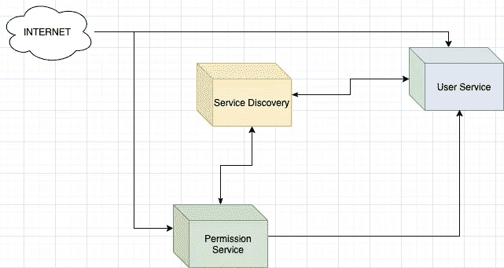
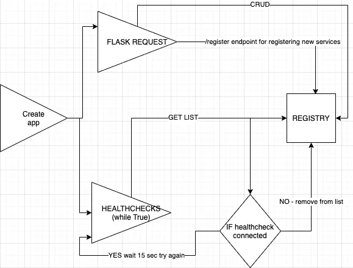
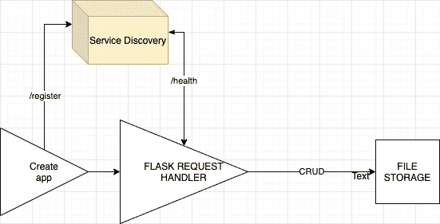
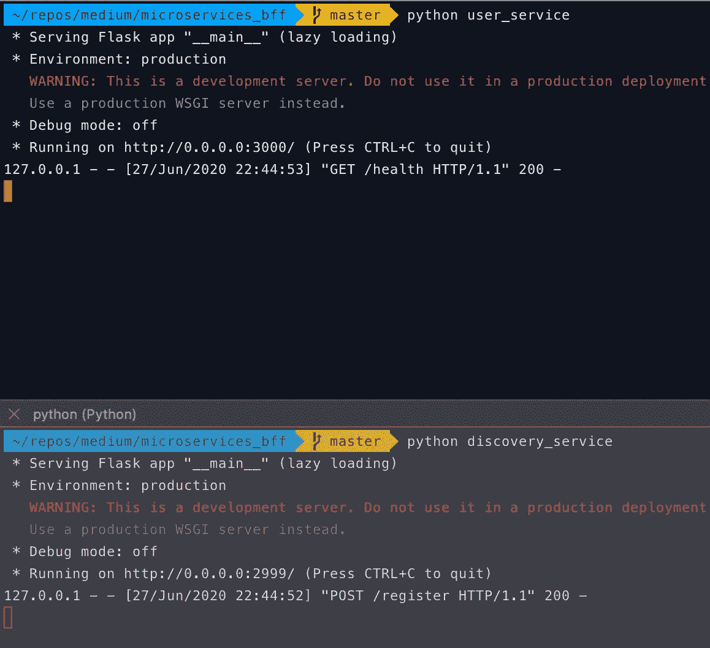
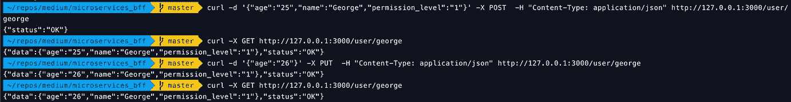
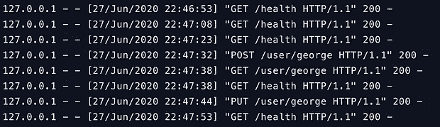
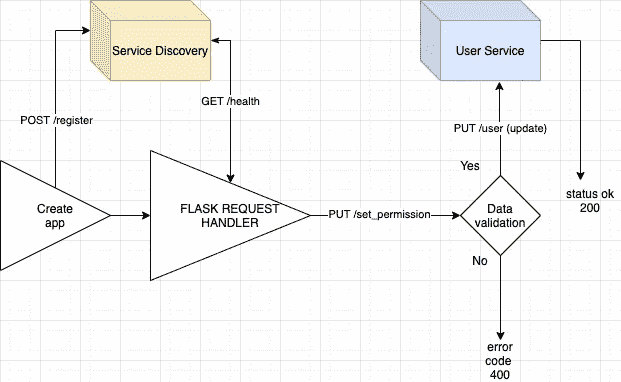
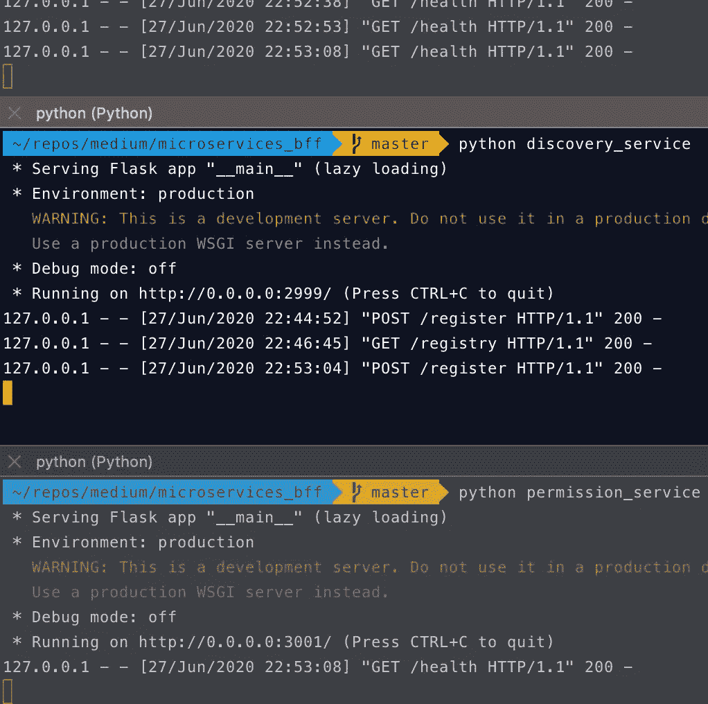
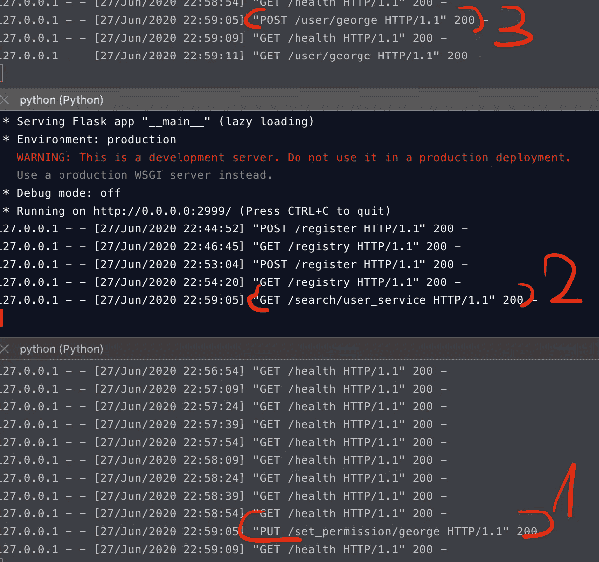
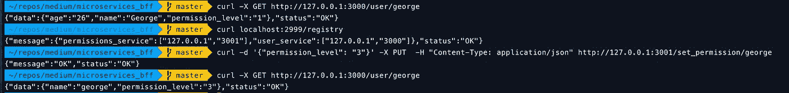

# 微服务—直接模式

> 原文：<https://blog.devgenius.io/microservices-api-tutorial-80d7011c56f1?source=collection_archive---------11----------------------->


由 [Marvin Meyer](https://unsplash.com/@marvelous?utm_source=medium&utm_medium=referral) 在 [Unsplash](https://unsplash.com?utm_source=medium&utm_medium=referral) 上拍摄的照片

最近热门的新架构模型。它非常适合 dockerization、Kubernetess 和无服务器基础设施。太棒了。如果实施得当的话。

# 什么是微服务？

微服务软件架构模式全是潜水逻辑；业务逻辑、应用程序逻辑分成更小的、可重用的部分。

由于每个服务都可以是独立的应用程序，因此 ops 可以更轻松、更精确地进行扩展。组件 A 需要那么多实例，那么多 CPU 和 RAM。然而，组件 B 使用较少，它只需要基本资源就能正常工作。

安全性是另一个方面:并不是所有的微服务都需要对公众可见，更重要的是，在将微服务 API 连接到前端时，还有几种模式。

“微”并不意味着服务本身必须有 X 行代码，或者很小。我们也不应该把我们的代码分成太多的服务，这就像干法则，但是要考虑一些未来的自我。

例如，让我们说，我们有整体电子商务商店。它是一个整体，有一些模块/逻辑分离类，如:`user management`、`permission account control list (acl)`和一些其他业务逻辑，如`calculate income`、`shopping cart`或`search`。

为什么在一个地方有这么多？嗯，你可以说，开发肯定更容易，但是团队成员有限。同样，出于可伸缩的目的，每个模块可以有自己的团队，或者团队 A 可以处理 X、Y、Z 模块，而团队 B 处理 V、U、M

## 好吧，这是代码分离，但是数据呢？

由于编码逻辑可以分离，数据库结构也可以分离。如果需要数据库，最好使用`Database per Service`！

经常发生的情况是，一些模块只是做计算，从其他模块获取数据并返回结果，所以总的来说，它不需要数据库。

另一个好处是，我们可以有几种数据库类型，最适合特定的服务。例如，对于服务 A，它可以是一个`Non-SQL`，而另一个是`PostgreSQL`。

# 给我看看密码，伙计

哈哈，当然。这是一个简单的组件示例，它创建用户，更新用户的权限，并动态地协同工作。
这意味着可以动态删除或添加每个服务的实例，以便应用程序正常工作。

## 服务发现

为了实现这一点，我们需要使用`Service Discovery`模式的服务。在云中，通常是`Load-Balancer`可以自己发现实例(在 AWS 中，是`Target Group`可以连接到`ALB` 并发现新创建的`ECS Tasks`)。

对于我们的示例，假设我们没有将它存储在云中，并且希望全部手工完成，因此 API 的模式应该是:



微服务服务发现

如您所见，没有必要让`Service Discovery`从互联网可达，因为它只是与内部资源对话。

在这个`direct pattern`中，所有微服务 API 都可以从互联网和前端看到。后者还决定向哪个微服务发出整合数据的请求。

让我们回到`Service Discovery`。它是如何工作的？
我想到了这样的东西:



服务发现图

首先，它有内存注册表变量。它是一个列表，将`{URL, PORT}`存储在`service name as a KEY`下。

要注册新变量只需运行`POST /register {name, port, host}`端点。

但是如何防止`unactive`服务不显示在`registry`中呢？
一种方法是在发送`SIGTERM`时创建`/unregister`端点。
其他方法通过`healthcheck`；这就是为什么除了 Flask 之外我们还有第二个线程。它每 15 秒检查一次服务中的`/health`端点是否在工作。如果它不能连接到它，则从集合中移除服务。

简单的实现:

服务发现 python 实现

如你所见，简单的豌豆柠檬汁。它正在工作，但为了向您展示如何获取，让我们实现另一个微服务。

## 2.用户服务程序

我实现的另一个服务是用户服务。它基本上是将内容保存到文件存储的 CRUD，但是它必须连接到服务发现，以便其他服务知道它的存在。



用户服务图

和一个代码:

用户服务实现

所以没有什么奇特的，简单的，基本的 CRUD:更新文件，通过请求删除文件:

```
# CREATE
curl -d '{"age":"25","name":"George","permission_level":"1"}' -X POST  -H "Content-Type: application/json" [http://127.0.0.1:3000/user/george](http://127.0.0.1:3000/user/george)# RETRIEVE
curl -X GET [http://127.0.0.1:3000/user/george](http://127.0.0.1:3000/user/george)# UPDATE
curl -d '{"age":"26"}' -X PUT  -H "Content-Type: application/json" [http://127.0.0.1:3000/user/george](http://127.0.0.1:3000/user/george)# DELETE
curl -X DELETE [http://127.0.0.1:3000/user/george](http://127.0.0.1:3000/user/george)
```

## 测试服务和发现

首先，我们应该看看微服务是否通过我们的服务得到了正确的发现。



具有服务发现的微服务

到目前为止还不错；`service_discovery`得到了调用的`/register`端点，`user_service`得到了`/health`端点。让我们看看`service_discovery`看到了什么:


服务发现注册表检索

厉害！让我们测试 CRUD 请求:



如您所见，CRUD 请求正在工作，除了来自`discovery_service`的几个`/health`端点请求之外，它还正确地获得了其他查询，这些查询创建并更新了用户 George。

现在让我们添加另一个微服务，权限。

## 许可服务

这个有点复杂。它不仅连接到服务发现，还连接到`user_service`。



权限微服务示例

它只有一个端点(如果您愿意，可以自由扩展)用于更改用户权限级别和一些数据验证，同样是非常简单的服务:

让我们看看它是否连接到服务发现。剧透:的确如此:)



上层:用户服务，中层:发现服务，下层:许可服务

现在我们的`discovery_service`长这样:

```
>>> curl localhost:2999/registry
<<<
{"message":{
     "permissions_service":["127.0.0.1","3001"],
     "user_service":["127.0.0.1","3000"]
},"status":"OK"}
```

我知道可以做得更好，也应该这样做。真正的发现应该能够有多个给定 id 的服务实例，并使用像`round-robin` 这样的`load-balancing`算法，并返回最少使用的服务实例。
不过，这只是一个例子。:)

下一步是看`permission_service`是否可以通过`discovery_service` 连接到`user_service`来更新数据。

那么，我们来做:`curl -d ‘{“permission_level”: “3”}’ -X PUT -H “Content-Type: application/json” [http://127.0.0.1:3001/set_permission/george](http://127.0.0.1:3001/set_permission/george)`



微服务模式连接

所以发生了几件事。
首先我们对`permission_service`做了一个 PUT 请求。
然后`permission_service`问`discovery_service`“嘿，我能在哪里找到`user_service`以便我能问他一件小事？”
最后，在`discovery_service`响应之后，我们最初的服务运行请求并更新用户 George:



如您所见，George 的 permission_level 从 1 提高到了 3。

## 当一个服务离线时会发生什么？

好吧，这取决于你。我已经决定在`permission_service`中省略这个验证检查，但是您可以添加简单的`try:...except:...`来捕捉失败的请求并通过它来处理它。

关于`discover_service`当 healthcheck 停止时，它从注册表中删除服务，并在搜索给定的微服务时返回 404。

在下面的 GIF 中，您可以看到，在给定的时间缺乏健康，它从注册表中删除，然后动态地将其添加到注册表中:

# 摘要

这是一个如何使用微服务构建 API 的简单例子。正如我之前说过的，如果你在云中工作，那么适当地设置基础设施就可以做到。
在下一篇文章中，我将尝试向您解释微服务 API 到前端的连接模式。

让我们保持联系。