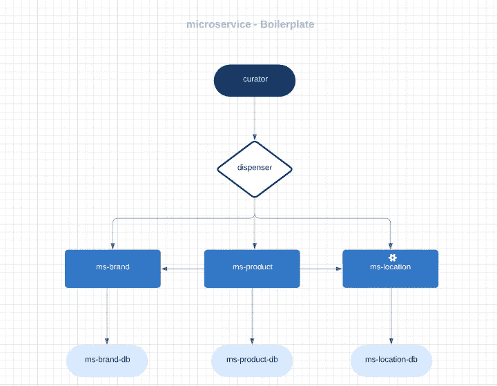

# 微服务样板文件—带有 Lumen + Laravel + Nginx + Mysql →部分(2/3)

> 原文：<https://blog.devgenius.io/microservices-boilerplate-with-lumen-laravel-nginx-mysql-part-2-3-a3c0cc241cf4?source=collection_archive---------3----------------------->

## 在这个系列中

*   [微服务样板文件:设置(第 1/3 部分)](https://medium.com/@shadysmaoui/micro-services-with-lumen-laravel-nginx-mysql-70b3554e8068)
*   [微服务样板:设计(第 2/3 部分)](https://medium.com/@shadysmaoui/microservices-boilerplate-with-lumen-laravel-nginx-mysql-part-2-3-a3c0cc241cf4)

现在我们的设置已经完成，并且**可扩展**架构的基础已经准备好，我们可以向前迈进，更深入地思考我们整个系统的期望设计。

我们将根据我们将选择的设计要求，在我们必须实施现有微服务或创建新的微服务时，尝试建立遵循的准则，并且我们将必须进行一些 DevOps 调整，以确保所有部分一起正常运行。与此同时，值得一提的是，总的来说，设置中枯燥的部分已经过去，随着时间的推移，我们越来越接近最有趣的部分。

正如本系列开始时提到的，这些文章的主要目的是首先介绍**微服务架构**，然后提供如何设计和实现它的分步演示。

虽然这种软件架构风格没有精确的定义，但围绕 ***有一些共同的特征:可伸缩性、持续集成、自动化部署、端点智能、解耦业务逻辑、语言无关组件和数据的分散控制*** 。
鉴于本系列的教育性质和范围，我们将无法涵盖上述所有要素，尤其是那些与实际生产流程相关的要素，如 **CICD(持续集成/持续部署)。**另一方面，我们将尝试从设计的角度对所有重要方面有一个清晰的概述。

## 系统定义

出于学习目的，我们将创建一个管理电子商务公司产品库存的 **ERP(企业资源规划)**系统的最小可行产品。为了使这个过程尽可能顺利和简单，我们将做一些抽象，避免深入挖掘 ERP 的业务逻辑。然而，我们将坚持定义一个 **ERP** 的工作流程的主要指导方针，以便给我们的 **MVP** 一个更现实的方法。

## 主要组件

*   **策展人**，这是 Laravel 应用程序，将使用我们的微服务公开的 API，并将为整个系统扮演 UI(用户界面)的角色，以及用户的登录页面。这将是一个具有仪表板的网站，允许创建，列表，编辑和删除资源(产品/品牌等)。
*   **分发器**将是微服务生态系统的主要入口点，正如其名称所规定的，它将分发微服务生态系统的入站和出站请求和响应。用技术术语来说，**分配器**将是微服务 API 网关。
*   **ms-product，**是负责管理产品的主要微服务。它将接收和响应所有与产品相关的请求。它将有自己的数据库，这个数据库将是唯一的真理来源，当谈到产品。
*   **ms-brand —** 与微服务的解耦逻辑一样， **ms-brand** 将负责管理所有与产品品牌相关的请求。基于与 ms-product 相同的推理，ms-brand 将拥有自己的数据库，该数据库将成为品牌信息的唯一来源。
*   **ms-location —** 我们的产品将存放在一个地方，可能是后台商店、前台商店、仓库等。 **ms-location** 将作为处理位置业务逻辑的参考。

微服务样板

## 微服务缓存

为了充分利用**微服务架构，**我们将为每个微服务使用一个缓存系统。考虑到我们将通过 **Redis** 缓存使用**内存中数据存储**方法，这将允许我们的微服务获得极快的响应时间。与 PostgreSQL、Cassandra、MongoDB 和其他将大部分数据存储在磁盘或固态硬盘上的数据库相比，所有 Redis 数据都驻留在服务器的主内存中。与传统的基于磁盘的数据库(其中大多数操作需要往返磁盘)相比，**内存中的数据存储**如 **Redis** 不会遭受同样的损失。因此，它们可以支持一个数量级、更多的操作和更快的响应时间。结果是极快的性能，平均读取或写入操作不到一毫秒，支持每秒数百万次操作。

## 添加微服务

现在我们对系统设计有了更清晰的了解，让我们添加不同的组件。

`->$ composer create-project --prefer-dist laravel/lumen apps/ms-product`

`->$ composer create-project --prefer-dist laravel/lumen apps/ms-brand`

`->$ composer create-project --prefer-dist laravel/lumen apps/ms-location`

至此，我们应该有了我们**全新三微服务**的架构。是时候添加每个微服务的容器了，所以我们先添加各自的 docker 文件。

→ `./apps/ms-product/Dockerfile`

鉴于这是我们第三次产生一个新的微服务，我确信你将能够通过正确地为 **ms-brand** 以及 **ms-location 创建 Dockerfile 来做同样的事情。**

## 运行状况检查实施

我们将一起为**分发器**实现`HealthCheckController`,我将让您负责将它添加到其他微服务中。您只需复制/粘贴相同的文件，不做任何更改。

第一步，创建`HealthCheckController`:

`-> ./apps/dispenser/app/Http/Controllers/HealthCheckController.php`

现在我们的`HealthCheckController`已经实现，让我们在`web.php`中添加与之相关的路由。

`-> dispenser/routes/web.php`

如果你喜欢这篇文章，请**鼓掌并订阅**！干杯！！✌🏽💕💕👌🏽

下面是与这个项目相关的 Github 资源库:

https://github.com/shsma/microservices-workspace……别忘了明星

**双回阅读第一部分在这里:**

 [## 带有 Lumen + Laravel + Nginx + Mysql 的微服务样板->第 2/3 部分

### 在这篇文章中，我将一步一步地演示如何用 Lumem 和 Laravel 将你的微服务项目 dockerize

medium.com](https://medium.com/@shadysmaoui/micro-services-with-lumen-laravel-nginx-mysql-70b3554e8068)