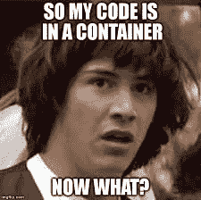

# 面向外行人的微服务和容器

> 原文：<https://blog.devgenius.io/microservices-containers-for-lay-people-1aafa67e418?source=collection_archive---------19----------------------->

[Cytonn 摄影](https://unsplash.com/@cytonn_photography?utm_source=medium&utm_medium=referral)在 [Unsplash](https://unsplash.com?utm_source=medium&utm_medium=referral) 上拍照

在过去的几年中，信息技术领域中，描述软件开发和管理的内部工作方式的流行词汇的使用有所增加。鉴于低代码/无代码平台和其他工具的兴起，这是具有讽刺意味的，这些平台和工具试图在以前有沟通/协作困难的团队之间架起桥梁(想想 pm 和外部团队的 ProductboardZeplin 面向设计师和其他利益相关者)。尽管有两个相反的趋势(一个扩大了软件开发领域，另一个使其民主化)，仍然存在连接不同社区的显著需求。事实上，需要建立一座桥梁，让外行人能够更自信、更流畅地与他们的技术同行交流。

为了建立这种联系，我认为必须做两件事。首先，甚至在他们步入与他们的技术同行相同的(虚拟)房间之前，非工程师——称他们为业务和操作所有者——需要开发不一定很深的背景知识，以理解软件开发实践为什么以及如何以他们当前的形式出现。第二，外行人*必须*努力学习开发人员和技术项目经理的语言。同理心不能通过坐在象牙塔里和斜着看下坡路来实现——事实上，一个人必须下来并参与其中，如果沟通是错位的，不可理解的，我们敢说，有时因为害怕暴露自己的真正无知而不存在，这将是毫无意义的。

为此，我首次尝试向非技术人员解释一个已经成为主流的流行主题:微服务和容器。目标是记录微服务的兴起；集装箱从何而来；以及为什么支持容器编排的托管服务对软件开发团队如此重要。

《第一集:铁板一块的威胁》

首先，我认为掌握现代软件开发最佳实践的演变是很重要的。过去，在一个遥远的星系中，开发团队会开发我们称之为单片应用程序的东西。顾名思义，应用程序只有一层，换句话说，在应用程序、数据和基础结构层之间有一个连接组织。

网飞是记录微服务崛起的杰出例子，因为他们在这个问题上已经透明了很长时间。他们的应用程序一开始是单块的(尽管你会发现情况不再是这样了),因为它有自己的优势。单一的应用程序结构帮助他们的开发团队专注于业务逻辑。该团队使用所有相同的工具、名称空间和框架，因此没有必要花费大量时间来监督这些投资，因为它们是同质的。开发团队一开始规模很小，这意味着如果要进行更改，他们可以很快完成，因为应用程序代码库是集中的。因此，维护也很容易管理，因为只需要监管一个代码库。

但是后来网飞开始扩大他们的团队，因为他们必须成长以应对新产品的需求。以下挑战开始生根发芽。随着新成员的加入，认知负荷变得难以承受。一个新的开发人员必须了解整个代码库，以便准确地将他们的贡献放在哪里。这降低了开发人员的工作效率。开发也变慢了，因为为了同步和更新特性，整个应用程序代码库必须更新。这意味着推向生产需要几周，有时甚至几个月。如果有一个 bug，要花很长时间才能找到断点，因为所有东西都是相互关联的，所以必须对整个代码库进行梳理。应用程序的某些部分(例如，首先是登录页面，然后是支付服务组件)必须独立于其他服务进行扩展。但是，由于应用程序是单块的，整个应用程序必须横向扩展，这意味着基础架构利用率没有得到优化，成本激增。网飞实质上成了他们自身成功的受害者。

进入微服务革命。网飞，就像那些面临类似挑战的公司一样，最终通过采用服务架构，摆脱了单一的设计模式。我们正在跳过青春期阶段——这被称为面向服务的体系结构——但是可以说开发人员已经开始分离构成这些整体应用程序的功能部分。通过这样做，他们将关注微服务，或者换句话说，应用程序的组件，每个组件都有特定的角色和/或功能要完成。所以在优步 app 中，匹配到出租车是微服务；处理支付信息和处理它是另一回事；填写个人资料页面是另一个问题。

这种类型的架构是由一种叫做容器的软件开发创新促成的。以前，由于虚拟化，运营团队可以最大限度地提高计算和存储资源的利用率，虚拟机管理程序可以创建底层主机操作系统的来宾拷贝。相反，容器只会打包应用程序及其依赖项(系统、库、运行时)。它之所以轻量级，是因为它没有搭载完整的操作系统，也就是说上下启动都非常快；开机关机的资源更少。此外，容器是可移植的，因为它们不依赖于底层硬件——它可以在任何环境下运行。此外，容器可以用其作者(开发者)喜欢的任何语言来构建，并且因为它是可移植的(可在任何环境中部署)，公司可以雇用广泛的人才，因为他们不受制于底层平台。雇用能够异步编写和部署代码的更深层次的人才库是一个转变点，这关系到开发人员更加敏捷和以分布式方式工作的能力(现在是后 covid 世界的*事实上的工作方式*)

拥有基于微服务的架构有什么好处？首先，现在让新开发人员加入变得更容易了——他们可以专注于他们的部分(他们将工作的服务)以立即开始贡献代码，而不是让他们理解整个代码库。其次，隔离微服务意味着可以单独管理它们的整个生命周期——每次想要更新一个微服务时，您不必再协调整个整体代码库来推送。最重要的是，如果一个服务关闭，它不会关闭整个应用程序。第三，您可以单独扩展微服务，最大限度地提高基础架构资源的利用率，而无需过度调配。

**第五集:我是你的父亲，库贝内特斯**

但是灰姑娘的故事并没有就此结束——毕竟，她确实在午夜溜出去之前忘记了她的水晶鞋，导致了传统的迪士尼故事结局……同样的事情也会发生在我们的遇险少女集装箱身上。就在微服务看起来好得难以置信的时候，我们遇到了微服务急剧增长带来的固有复杂性。人们可以想象，随着应用程序变得越来越复杂，有数百个功能必须相互交互，微服务的数量不仅会激增，而且它们的通信路径似乎也会成倍增长。看看亚马逊和网飞的微服务地图——很复杂，不是吗？

简而言之，向现代分布式架构(我们称之为基于微服务的架构)的转变使企业无法以一致、可靠的方式监控、管理和保护其模块化应用组件。开发团队面临着管理和协调这些微服务的底层基础设施以及它们之间的通信的挑战。

就这样，kubernetes 诞生了，这个词来源于希腊语κυβερνήτης，或舵手，当你想到它的潜在目的时，这并不奇怪。Kubernetes 比喻地说是冥河的舵手，监管、管理、指导船上的成分——容器。事实上，Kubernetes 监督容器的编排。简而言之，这意味着 Kubernetes 是一组应用程序编程接口，代表您编排您的容器，以便您的基础架构变得抽象。当您安装 Kubernetes 时，它会代表用户工作负载处理计算、网络和存储。这使您可以专注于您的应用程序，而不用担心底层环境。而且，我们不要忘记，Kubernees 是可移植的，这意味着如果你在一个云平台上有容器，你可以把它带到另一个——甚至是本地的。

也就是说，自己建立和管理 Kubernetes 并不容易。到目前为止，使用 k8s 的最大障碍是学习如何安装和管理自己的集群。虽然 kubernetes 将处理底层基础设施的管理，但您仍然需要设置 kubernetes 来启动该操作。Kelsey [Hightower](https://github.com/kelseyhightower/kubernetes-the-hard-way) ，Google 的开发倡导者，写了一个关于如何建立 K8s (kubernetes 简称 kubernetes)集群的逐步过程(艰难的方式…):

*   选择云或裸机提供商
*   供应机器
*   选择操作系统和容器运行时
*   配置网络:pod 的 IP 范围(为了简单起见，将它们视为容器的底层单元)、软件定义的网络、负载平衡器
*   设置安全性:生成证书和配置加密
*   启动群集服务，如域名服务器、日志记录和监控

一旦你有了所有这些东西，你就可以开始使用 k8s 并部署你的第一个应用程序了。而且你感觉很棒很开心因为 k8s 很牛逼！但是，你必须推出一个更新…

…您进入了“第 2 天”运营领域，在这里，您不仅需要工具，还需要相当多的运营专业知识来管理 k8s 群集的生命周期。基本上，您会遇到以下挑战:

*   **多个 kubernetes 集群难以管理**:您的开发人员最终不得不管理底层的 Kubernetes 集群，即使他们将此任务交给运营团队，这两个集群之间的协调也会影响工作效率。如果你有一个小团队，这会给你的开发团队的生产力带来更大的负担，因为他们必须承担看不见的运营团队的责任。
*   **对 Kubernetes 进行监控和故障排除是很困难的:**在 devops 语言中，左移意味着在开发周期中尽早且经常地加入测试。其必然结果是需要尽早进行检测，这样您就可以更快地看到什么发生了中断，以及它在您的代码库中的什么位置发生了中断。大规模测试和监控非常困难，因为这些系统需要进行测试和管理。
*   **扩展 kubernetes** :对多个集群进行版本控制既耗时又困难，这给运营团队带来了不必要的负担，他们必须首先配置基础设施。事实上，要扩展平台(即添加更多集群或调整每个集群的大小)，需要执行手动运行的配置脚本。

因此，托管服务产品应运而生，以解决自主和手动处理 kubernetes 编排所固有的问题。微软(我曾经工作过的地方)，发布了 Azure Kubernetes 服务；AWS 有两种产品(EKS/ECS)；而 Google (hello paycheck provider)有 Google Kubernetes 引擎(有趣的是 Google 是同名开源容器平台的创始人)。我们将在另一个时间对这三者进行比较，但足以说明这些供应商代表您管理 kubernetes，因此您可以专注于编写代码，而不是管理设置虚拟机和配置您的计算和存储选项。

**第六集:产品主女士回归？**

一个非工程师角色(比如你尊敬的作者)需要理解微服务和容器的起源，因为它们是现代软件开发架构的基础。过程——包括但不限于敏捷开发、gitops——是必然的主题，稍后再探讨，但前面几页中提到的问题仍然是基础，因为它展示了随着时间的推移，我们如何改进团队构建、测试和发布应用程序的方式。我们已经研究了这种架构模式的兴起，以了解我们已经走了多远，并且希望在这一过程中，我们已经学会了一些术语，这些术语将使商业奇迹能够更自信地使用技术同行的语言。

请记住，微服务和容器与现代时代的要求密不可分:速度和敏捷性。市场竞争从未如此激烈，而且只会随着时间的推移而加剧。为了领先于竞争对手，产品负责人女士需要能够比她的竞争对手更快地迭代；对关键的反馈和错误做出更快的反应，以维护和保护她的品牌资产；并以超越竞争对手的速度创新。现在她知道了微服务——由容器驱动——如何帮助实现她的目标，她现在可以通过绘制她的应用程序架构图来与她的技术同行合作；并就可以添加哪些新功能和组件，同时仍然适合其组成微服务的结构提出想法。从她对技术同行的工具和实践的欣赏和理解中，一座桥梁诞生了。