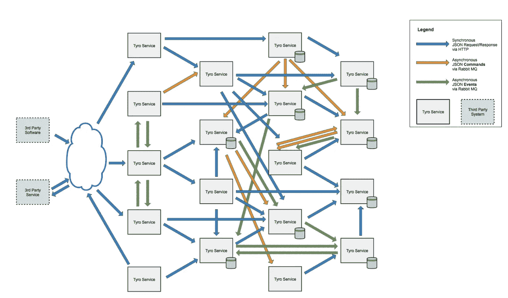
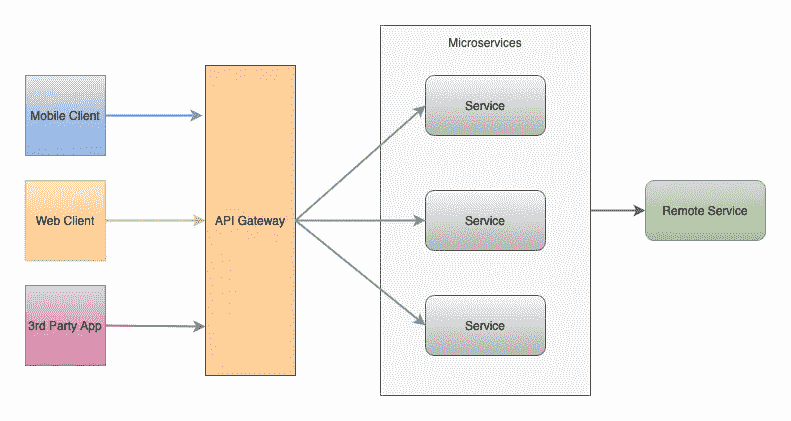
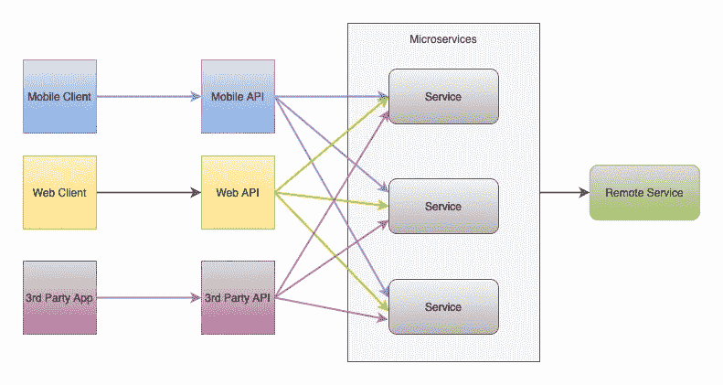
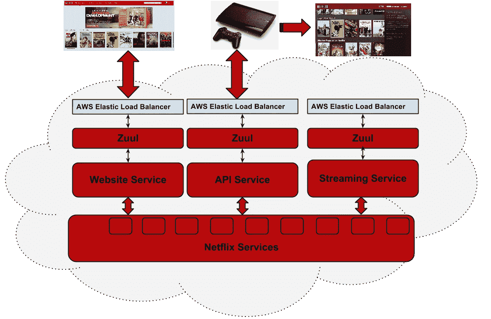
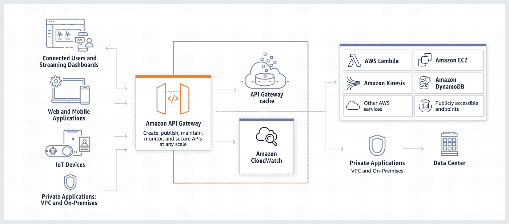
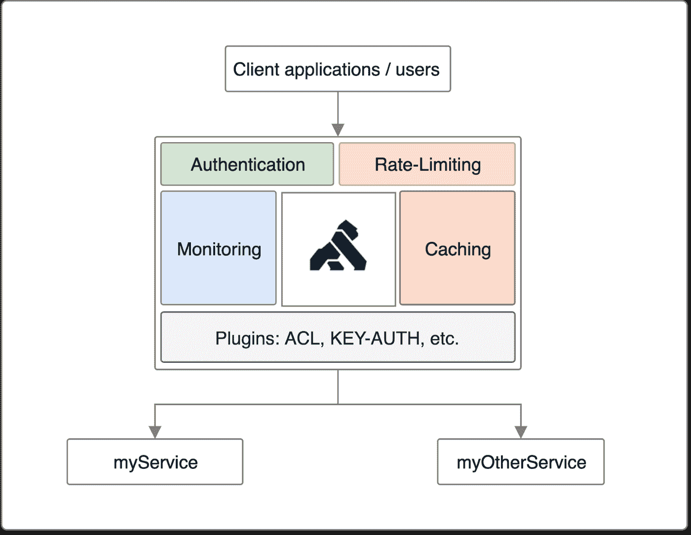
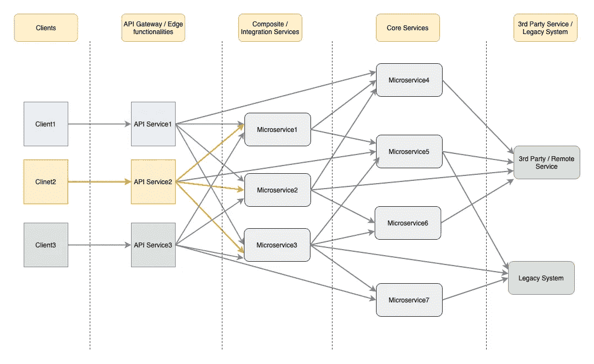
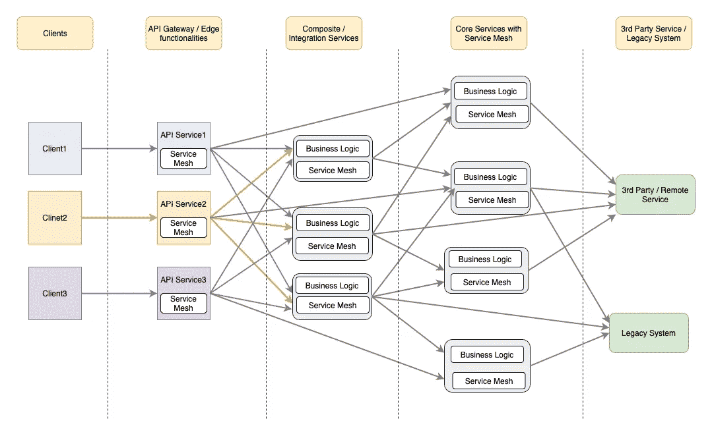

# 微服务设计- API 网关模式

> 原文：<https://blog.devgenius.io/microservices-design-api-gateway-pattern-980e8d02bdd5?source=collection_archive---------0----------------------->

通往尼泊尔 Ghorepani Poonhill 的门户(来源:[维基百科](https://www.wikipedia.org/)

根据 Gartner 的定义: ***“微服务是一个紧密作用域、强封装、松耦合、可独立部署、可独立扩展的应用组件*** *。”*

微服务的目标是将应用程序充分分解/解耦为松散耦合的微服务/模块，这与模块高度耦合并作为单个大块部署的整体应用程序形成对比。由于以下原因，这将是有帮助的:

*   每个微服务都可以独立于应用程序中的兄弟服务进行部署、升级、扩展、维护和重启。
*   敏捷开发&由自治的跨职能团队进行敏捷部署。
*   使用技术的灵活性和可扩展性。

不同的松散耦合服务基于它们自己的特定需求进行部署，其中每个服务都有其细粒度的 API 模型来服务不同的客户端(Web、移动和第三方 API)。

## 客户端到微服务的连接

图微服务中的通信

在考虑客户端**直接与每个部署的微服务**通信时，应考虑以下挑战:

1.  在微服务向客户端公开细粒度 API 的情况下，客户端应该向每个微服务发出请求。在典型的单个页面中，可能需要**多个服务器往返**才能完成请求。这对于诸如移动设备的低网络操作设备来说可能更糟。
2.  **微服务中存在的多种通信协议(**如 gRpc、thrift、REST、AMQP e.t.c **)** 使得客户端采用所有这些协议具有挑战性且庞大。
3.  **公共网关功能**(如认证、授权、登录)必须在每个微服务中实现。
4.  在不中断客户端连接的情况下，很难对微服务做出改变。例如，在合并或划分微服务时，可能需要重新编码客户端部分。

# API 网关

为了应对上述挑战，在客户端和服务器之间引入了一个附加层，作为从客户端到服务器的反向代理路由请求。类似于面向对象设计的外观模式，它提供了封装底层系统架构的 API 的单一入口点，称为 API Gateway。

简而言之，它的行为与 API 管理完全一样，但重要的是不要将 [API 管理与 API 网关](https://www.getambassador.io/docs/latest/topics/concepts/microservices-api-gateways/)混淆。

图微服务 API 网关

# API 网关的功能:

## 按指定路线发送

该网关封装了底层系统并与客户端分离，为客户端提供了与微服务系统通信的单一入口点。

## 卸下

API gateway 整合了边缘功能，而不是让每个微服务都实现它们。一些功能包括:

*   认证和授权
*   服务发现集成
*   响应缓存
*   重试策略、断路器和 QoS
*   速率限制和节流
*   负载平衡
*   日志记录、跟踪、关联
*   标题、查询字符串和声明转换
*   IP 白名单
*   InternationalAssociationofMachinists 国际机械师协会
*   集中式日志记录(跨服务器的事务 ID、错误日志记录)
*   身份提供者、认证和授权

# 后端对前端(BFF)模式

它是 API 网关模式的**变体。它不是客户端的单一入口点，而是基于客户端提供多个网关。目的是根据客户的需求提供定制的 API，消除为所有客户制作通用 API 造成的大量臃肿。**

图前端(BFF)模式的后端

## 你需要多少个闺蜜？

BFF 的基本概念是为每个用户体验开发合适的后端。菲尔·卡尔卡多的指导方针是“**一次经历，一个最好的朋友**”。如果客户端(IOS 客户端、android 客户端、web 浏览器等)的需求差异很大，并且单个代理或 API 的上市时间出现问题，BFF 是一个很好的解决方案。还应注意，更复杂的设计需要复杂的设置。

# GraphQL 和 BFF

GraphQL 是一种用于 API 的查询语言。[Phil calado](https://philcalcado.com/)在这篇[文章](https://philcalcado.com/2019/07/12/some_thoughts_graphql_bff.html)中提出，BFF 和 GraphQL 是相关但不互斥的概念。他补充说，BFF 不是关于端点的形状，而是关于给你的客户端应用程序自主权，在这种情况下，你可以构建尽可能多的 BFF 或 OSFA(一种尺寸适合所有人)API。

# 著名的 API 网关

## 网飞 API 网关: [Zuul](https://github.com/Netflix/zuul)

在超过 1000 种不同设备类型(电视、机顶盒、智能手机、游戏系统、平板电脑等)上可用的[网飞](https://netflixtechblog.com/embracing-the-differences-inside-the-netflix-api-redesign-15fd8b3dc49d)流媒体服务在高峰时段每秒处理 50，000 个请求，发现 OSFA(一刀切)REST API 方法的实质性限制，并使用了为每个设备量身定制的 API 网关。

网飞的 Zuul 2 是所有请求进入网飞云基础设施的大门。Zuul 2 显著改进了架构和功能，使我们的网关能够处理、路由和保护网飞的云系统，并帮助我们的 1.25 亿会员提供最佳体验。

图 https://netflixtechblog.com 云架构中的 Zuul(图片来源:)

## 亚马逊 API 网关

AWS 为创建、发布、维护、监控和保护 REST、HTTP 和 WebSocket 提供完全托管的服务，开发人员可以在其中创建访问 AWS 或其他 web 服务的 API，以及存储在 [AWS Cloud](https://aws.amazon.com/what-is-cloud-computing/) 中的数据。

图 AWS API 网关

## Kong API 网关

Kong Gateway 是一款针对微服务优化的开源轻量级 API 网关，提供无与伦比的延迟性能和可扩展性。如果你只是想要基本的，这个选项将为你工作。通过添加更多节点，它可以轻松地进行水平扩展。它以极低的延迟支持大量的可变工作负载。

图 1 .香港应用编程接口网关

## 其他 API 网关

*   [API 网关](https://apigee.com/api-management/)
*   [MuleSoft](https://www.mulesoft.com/platform/api-management)
*   [Tyk.io](https://github.com/TykTechnologies/tyk)
*   [阿卡纳](https://www.akana.com/products/api-platform/api-gateway)
*   [SwaggerHub](https://swagger.io/tools/swaggerhub/)
*   [Azure API 网关](https://azure.microsoft.com/en-us/services/api-management/)
*   [Express API 网关](https://www.express-gateway.io/)
*   [卡肯维](https://www.krakend.io/)

## 选择正确的 API 网关

评估标准的一些常见基线包括简单性、开源与专有、可扩展性和灵活性、安全性、功能、社区、管理(支持、监控和部署)、环境供应(安装、配置、托管服务)、定价和文档。

# API 组合/聚合

API Gateway 中的一些 API 请求直接映射到单个服务 API，可以通过将请求路由到相应的微服务来提供服务。然而，在需要来自几个微服务的结果的复杂 API 操作的情况下，可以由 **API 组合/聚合**(一种分散-聚集机制)来服务。在需要同步通信的情况下，如果一个服务依赖另一个服务，则必须遵循链式组合模式。组合层必须支持 ESB/集成功能的重要部分，例如转换、编排、弹性和稳定性模式。

根容器部署有特殊的分发器和聚合器功能(或微服务)。分配器负责分解成粒度任务，并将这些任务分配给微服务实例。聚合器负责聚合业务工作流从组合的微服务中获得的结果。

## API 网关和聚合

具有附加特性的 API 网关导致了过于雄心勃勃的网关，这鼓励了继续难以测试和部署的设计。强烈建议避免在 API 网关中进行聚合和数据转换。领域智能更适合在遵循定义的软件开发实践的应用程序代码中完成。网飞 API Gateway， [Zuul 2](https://github.com/netflix/zuul/) 从他们在 Zuul 的 Gateway 到 origin 系统中移除了很多业务逻辑。更多详情，请参考[此处](https://www.infoq.com/news/2016/10/netflix-zuul-asynch-nonblocking/)。

图:分层微服务中的复合/集成服务

# 服务网格和 API 网关

微服务中的服务网格是处理进程间通信的可配置网络基础设施层。这类似于通常所说的边车代理或边车网关。它提供了许多功能，例如:

*   负载平衡
*   服务发现
*   健康检查
*   安全性

从表面上看，似乎 API 网关和服务网格解决了相同的问题，因此是多余的。它们确实解决了相同的问题，但在不同的背景下。 API gateway 部署为业务解决方案的一部分，可被处理南北向流量的外部客户端发现(面向外部客户端)，但是，服务网格处理东西向流量(在不同的微服务之间)。

实现服务网格避免了弹性通信模式，如断路器、发现、健康检查、您自己代码中的服务可观察性。对于少量的微服务，应该考虑故障管理的替代策略，因为服务网格集成可能会弄巧成拙。对于数量更多的微服务来说，将是有益的。

结合这两种技术是确保应用程序正常运行时间和弹性的强大方法，同时确保您的应用程序易于使用。将两者视为同时代可能不是一个好主意，在涉及微服务和 API 的部署中，最好将两者视为互补。

图带有服务网格的分层微服务

## API 网关实现的注意事项:

*   可能的单点故障或瓶颈。
*   由于通过 API 网关的额外网络跳跃和复杂性风险，响应时间增加。

## 参考资料:

1.  [https://microservices.io/index.html](https://microservices.io/index.html)
2.  https://docs.microsoft.com/en-us/azure/architecture/
3.  [https://github . com/wso2/reference-architecture/blob/master/API-driven-microservice-architecture . MD](https://github.com/wso2/reference-architecture/blob/master/api-driven-microservice-architecture.md)
4.  [https://TSH . io/blog/design-patterns-in-micro services-API-gateway-BFF-and-more/](https://tsh.io/blog/design-patterns-in-microservices-api-gateway-bff-and-more/)
5.  [https://www.infoq.com/articles/service-mesh-ultimate-guide/](https://www.infoq.com/articles/service-mesh-ultimate-guide/)
6.  [https://samnewman.io/patterns/architectural/bff/](https://samnewman.io/patterns/architectural/bff/)
7.  [https://netflixtechblog.com/](https://netflixtechblog.com/)