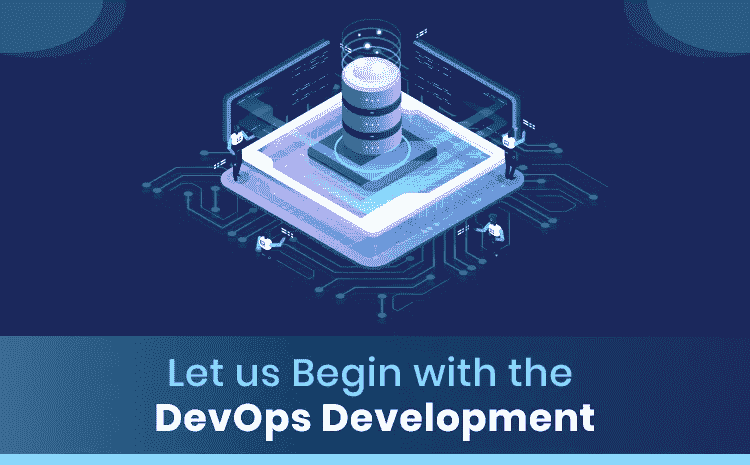
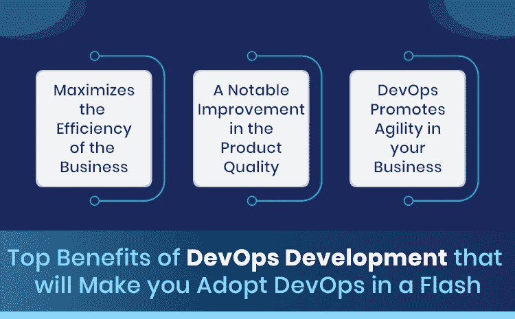

# 微服务框架和 DevOps 开发:获得两种技术的优势

> 原文：<https://blog.devgenius.io/microservices-framework-and-devops-development-get-the-best-of-both-technologies-844fc1eaa349?source=collection_archive---------5----------------------->

**简介:**

企业非常努力地跟上当前的趋势和技术。然而，别无选择，因为正是这些技术彻底影响了商业发展的概念。说到这里，今天我们就来谈谈 2021 年最具影响力的三项技术:微服务框架、 [DevOps 开发](https://www.inexture.com/services/devops-solutions/)和 spring 云平台。

# 让我们从 DevOps 开发开始:

DevOps 是开发(dev)和运营(Ops)的结合。开发 DevOps 是为了实现应用程序和软件的快速开发。DevOps 专门设计用于交付工具和实践，以简化您的业务开发，并提高您的组织交付比传统软件开发服务更快的服务的能力。

# DevOps 开发的主要优势将使您立即采用 DevOps:

**业务效率最大化:**

由于 DevOps 主要设计用于提供快速服务，它直接影响到核心的业务发展。当你的客户准时收到你的服务时，他们会非常感激。使用 DevOps，您可以轻松实现提供服务和保留潜在客户的目标。

**产品质量的显著提高:**

开发和运营团队之间的协作引领企业实现重大里程碑和客户参与。因为顾客真正欣赏的是根据他们喜好提供的产品。

**DevOps 提升您业务的敏捷性:**

将敏捷性引入您的业务非常重要，因为它有助于您在市场竞争中保持领先。借助 DevOps，您可以实现业务的可扩展性。

# 微服务框架与 DevOps 开发结合的意义是什么？

[微服务架构](https://www.dailycupoftech.com/4-reasons-why-you-should-adopt-microservices-architecture-for-faster-development/)使开发团队能够在生产过程中进行测试，而 DevOps 提供了所需的功能来运行和检测异常和问题，以根据需要调整和应用错误修复或回滚到过去的版本。这就是 DevOps 和微服务如何协同工作，并引导企业获得向客户提供的高级解决方案。

**在这里，我们将阐述 DevOps 和微服务架构框架共同提供的惊人优势**:

# 快速部署

每个微服务框架都独立运行，有自己的代码库。因此，团队不应该等到整个应用程序都准备好部署。每个团队都可以保持他们自己的部署进度，以加快应用程序交付的整体速度。为了保持简洁明了，微服务提供了一定的灵活性，从而在更短的构建、测试和部署周期的帮助下加速交付。

# 它提高了可靠性

微服务框架架构的模块化方法不仅详细描述了服务的功能，还描述了与服务相关的错误。简单来说，微服务确保服务中的任何一个错误都会影响应用程序的其他方面。

# 通过描述改进了产品质量

当策略的每个方面都很好并且预先决定时，它帮助团队为每一个应用程序生成一个好的和精确的代码；那也不用花很长时间。

[DevOps](https://www.inexture.com/services/devops-solutions/) 和微服务的巧妙融合实现了测试和交付流程的端到端自动化。它最终会对企业的成长和发展产生积极的影响。

**底线:**

现在，您已经了解了开发运维服务和微服务如何帮助您缓解业务发展之旅，您对这一概念有什么看法？