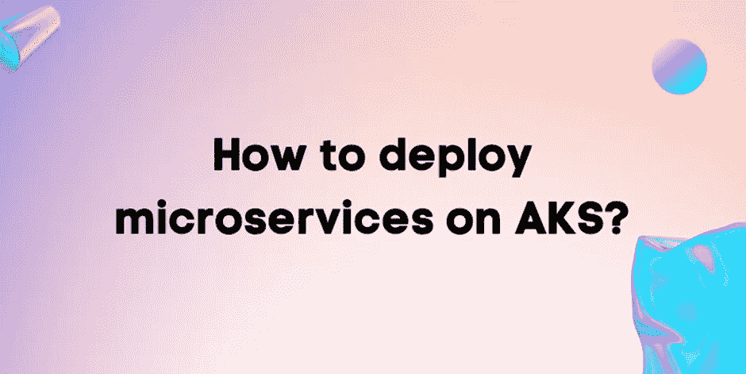
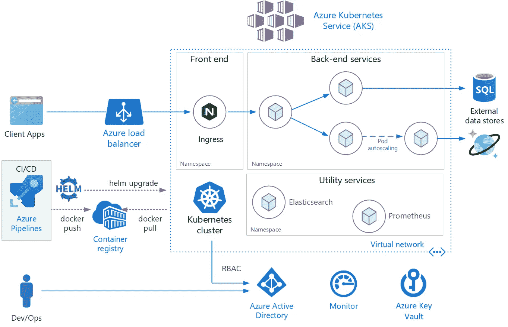

# AKS 上的微服务

> 原文：<https://blog.devgenius.io/microservices-on-aks-8affc90d9bbd?source=collection_archive---------4----------------------->

AKS 或 Azure Kubernetes 服务是在云中使用 Kubernetes 最简单快捷的方式。它有助于监控和管理容器化的微服务。在本文中，我们将看到如何在 AKS 上部署微服务，以及相同的好处。

**什么是 Azure Kubernetes 服务(AKS)？**

Kubernetes(K8S)是一个容器编排开源服务，允许开发者管理他们的容器。说到 K8S，有自管和云管两种。在自我管理的 Kubernetes 中，作为管理员，您完全负责从安装 Kubernetes 到集群创建、管理和安全的所有事情，其中像 Azure 这样的云服务提供商管理基于云的 K8S。从安装到安全，一切都由云提供商处理。

所以，Azure Kubernetes Service(AKS)是微软 Azure 提供的容器编排服务，具有自动打补丁、自动伸缩、节点自我修复、与其他 Azure 服务平滑集成等功能。AKS 帮助我们轻松部署容器化的应用程序，具有强大的安全性和可伸缩性。Azure 还通过 Kubernetes 提供无服务器和 CI/CD 管道特性。

**使用 Azure Kubernetes 服务(AKS)有什么特点和好处？**

●灵活的自动化、可扩展性和降低的管理成本。

●通过 Azure Monitor 轻松监控集群。

●支持 GPU 的节点池。

●可以使用 AKS 管理门户、AKS CLI 或 Azure 资源管理器来访问和操作 AKS。

● Azure AD 提供基于角色的对 AK 的访问，以实现安全性和监控。

●用户还可以为 AK 创建自定义标签。

●负载平衡

●接近零停机时间

**Azure Kubernetes 服务(AKS)费用**

AKS 是一项免费服务，因此 Kubernetes 集群管理是免费的，但用户需要支付网络、其他集成资源和计算资源的费用。

**Kubernetes 的架构**

在 Kubernetes 上部署微服务意味着将其部署到 Kubernetes 集群，集群是称为节点的虚拟机的集合。有一个父节点来管理集群，其他节点称为工作节点来运行实际的应用程序。Kubernetes pods 是一个集群的构建块，代表一个运行的进程。pod 被复制以处理更多的流量。

**在 AK 上部署您的微服务**

现在让我们看看如何在 Azure Kubernetes Service(AKS)上部署微服务。在我们进入部署部分之前，请确保您已经准备好了微服务的 docker 映像。另外，请下载并安装 Azure CLI。

[https://docs . Microsoft . com/en-us/CLI/azure/install-azure-CLI](https://docs.microsoft.com/en-us/cli/azure/install-azure-cli)

[https://docs . Microsoft . com/en-us/CLI/azure/install-azure-CLI-windows？tabs=azure-cli](https://docs.microsoft.com/en-us/cli/azure/install-azure-cli-windows?tabs=azure-cli)

接下来，在本地计算机上安装 Kubernetes CLI 或 Kubectl，以便从本地计算机连接集群。在 Azure CLI 中使用以下命令安装 Kubectl。

*az aks install-cli*

此外，您将需要 [Docker](https://docs.docker.com/install/) 来创建您的微服务的映像，并需要 [Azure 订阅](https://azure.microsoft.com/en-us/pricing/purchase-options/pay-as-you-go/)来部署 AKS。

我们开始吧

**创建资源组**

在 Azure 中创建任何资源之前，首先创建一个资源组。它充当云中资源的逻辑组。可以通过 Azure 门户手动创建，也可以使用 Azure CLI 创建。

查看您的订阅中的可用地区列表:

*az 账户列表-位置-o 表*

您可以在此处查看 AKS [供货的地区列表。](https://azure.microsoft.com/en-us/global-infrastructure/services/?products=kubernetes-service)

使用以下代码创建一个资源组，并根据您所在的地区更改[location]:

*az group create-l[location]-n my resource group*

**创建 Azure 容器注册中心**

ACR 就像是容器映像的私有注册表，可以让您安全地构建和部署应用程序。要创建 Azure 容器注册表，请使用以下命令并用注册表的名称更改[registry-name]。

*az ACR create-g my resource group-n[注册表名称] — sku Basic — admin-enabled*

-n 选项用于指定注册表的名称，-g 用于指定资源组的名称。在输出中，您将看到您的注册中心的服务器，它将是这样的形式— *【注册中心名称】. azurecr.io*

**将容器图像推入注册表**

登录到您的 Azure 容器注册表，使用 Azure CLI 推送容器映像。

*az acr 登录名称*

接下来，要将容器图像推入 ACR，我们需要标记它们。让我们假设您有两个名为 system 和 inventory 的容器映像。在本文中，我们不讨论创建容器图像的部分。因为我们的重点是了解映像部署。

用下面的命令标记您的容器映像，并用您的服务器名替换[registry-server]。

*docker 标签系统:1.0-快照【注册表-服务器】/系统:1.0-快照*

*docker 标签库存:1.0-快照【注册表-服务器】/库存:1.0-快照*

把图像推给 ACR。

*docker 推送【注册表-服务器】/系统:1.0-快照*

*docker 推送【注册表-服务器】/库存:1.0-快照*

**在 AKS 上创建 Kubernetes 集群**

要在 Azure 中创建集群，使用 *az aks create* 命令。AKS 集群还需要一个服务主体来分配角色和权限，以便与其他资源和 API 进行交互。默认情况下，以下命令将创建一个主体。

*az aks create-g my resource group-n my cluster*

该命令将在 *myResourceGroup* 中创建一个名为 *myCluster* 的集群。您还可以使用*–node-count-c*在池中添加特定数量的节点。否则，默认情况下将向节点池分配三个节点。

将集群凭据合并到当前 K8S 配置中。

*az aks get-credentials-g my resource group-n my cluster*

获取群集中正在运行的节点的状态。

*Kubect1 获取节点*

**存储 Azure 容器注册表凭证**

注册凭证必须通过一个秘密添加到您的服务中，以便从 ACR 中提取图像。

查看 ACR 的密码。

*az ACR credential show-n[registry-name]—查询“密码[0]”。值"-0 tsv*

创建一个密码来保存注册表的凭据。确保替换[]中所有必需的详细信息，并且[密码]是您的注册表密码。

*kubectl 创建秘密 docker-registry guide secret \*

*—docker-server =[registry-server]\*

*—docker-username =[registry-name]\*

*— docker-password=【密码】\*

*— docker-email=【电子邮件地址】*

**将微服务部署到 AKS**

我们已经创建了集群，我们的容器映像也准备好了。所以现在我们需要将微服务部署到 AKS。

K8S YAML 文件包含服务、部署等所有信息。我们需要更新它。将[registry-server]替换为您的服务器名称，并将映像名称替换为—*[registry-server]/inventory:1.0-SNAPSHOT*和*[registry-server]/system:1.0-SNAPSHOT*。部署 *kubernetes.yaml* 文件的资源。

*kube CTL create-f kubernetes . YAML*

获取服务的外部 IP 地址来测试它。

*kubectl 获取服务/系统服务*

*kubectl 获取服务/库存-服务*

因此，我们刚刚在 Azure Kubernetes Service(AKS)上部署了我们的微服务，我们可以使用外部 IP 地址来访问微服务。