# 微服务[第 1 部分] —与 Maven、Spring Boot 和 Docker 合作

> 原文：<https://blog.devgenius.io/microservices-part-1-with-maven-spring-boot-and-docker-4888a6bd05b5?source=collection_archive---------0----------------------->


微服务插图由 [**贝林圣**](https://dribbble.com/shots/3274271-Microservices-illustration-for-magazine-1)

***微服务*** 现在在 IT 界已经是家喻户晓，不需要特别介绍了。如果你以前使用过单体程序，你就会理解部署它们有多困难。从一系列的观点来看，软件越大，维护起来就越困难。

微服务 ***将组件*** 解耦，让我们可以专注于整个应用的一部分，部署更快，改进更快。最好的特性之一是能够使用各种数据库和技术。

在本文中，我将教你如何使用 ***Spring Boot*** 创建一个连接到运行在 ***Docker*** 上的 ***PostgreSQL*** 数据库的微服务。到源代码库的链接将在本教程的末尾添加。

## 设置 Maven

我们将使用 ***Maven*** 作为这个项目的构建工具。如果已经安装了 Maven，可以跳过这一部分。如果没有，可以在 这里找到您的操作系统的安装指南 [***。然而，如果将 Maven 添加到您的路径变得令人头痛，有另一种方法可以解决它，如果您使用 ***IntelliJ IDEA*** 作为您当前的 IDE。***](https://maven.apache.org/guides/getting-started/maven-in-five-minutes.html)

你可以在你的 IntelliJ 目录下的 plugins 文件夹中找到 Maven 的路径(如果你像我一样使用 Windows 的话)。之后，进入 ***系统属性*** ，选择 ***环境变量*** :

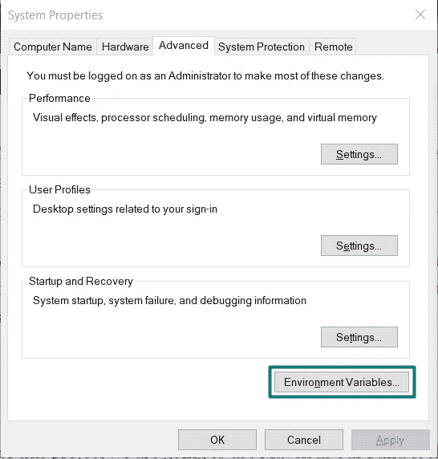

系统属性菜单

然后，在【系统变量】 ***中添加一个新变量*** :

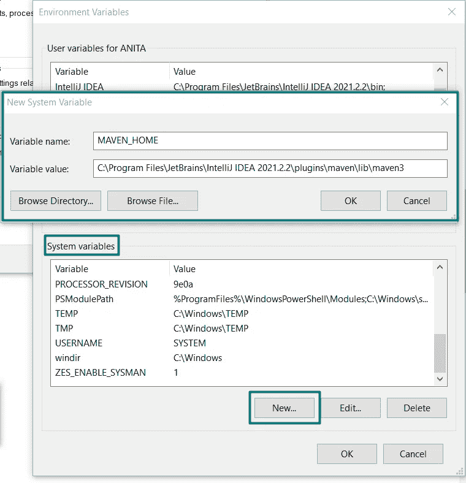

向环境变量添加 MAVEN_HOME

保存更改并使用您的命令提示符 ***检查您的 Maven 版本*** :

```
mvn -v
```

它看起来会像这样:

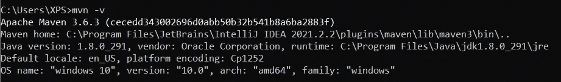

检查 Maven 版本

## 创建项目

在你喜欢的任何地方创建一个目录，并从那里运行一个 shell。通过浏览到要从中启动命令提示符窗口的文件夹，并在窗口顶部的地址栏中输入 cmd，可以快速打开文件夹中的终端窗口。一旦你按下回车键，命令提示符将在你选择的地方打开。这在过去节省了我很多时间。

在你的命令行上执行下面的 ***Maven 目标*** 来创建一个新的 Maven 项目(你可以改变 *groupId* 、 *artifactId* 以及类似的其他参数):

```
mvn archetype:generate -DgroupId=com.anita.practice -DartifactId=anitaservices -DarchetypeArtifactId=maven-archetype-quickstart -DarchetypeVersion=1.4 -DinteractiveMode=false
```

成功的生成过程如下所示:

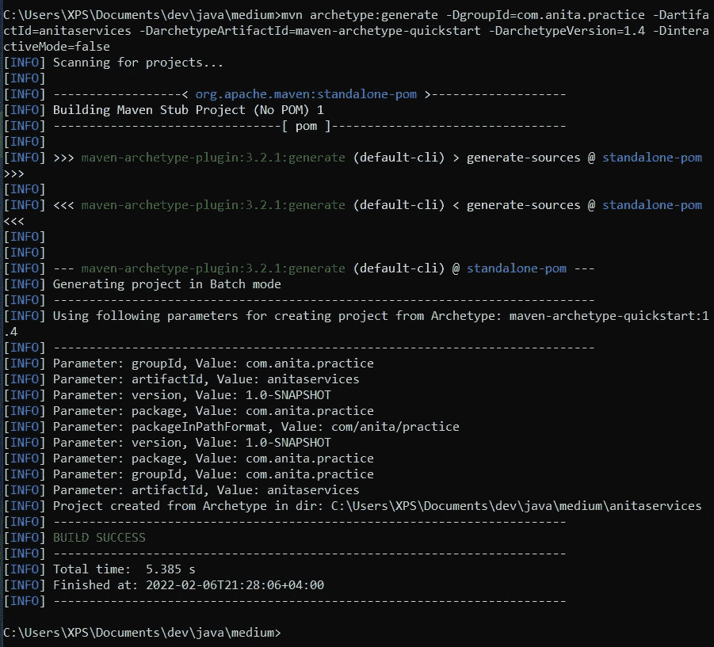

成功生成 Maven 项目

如您所见， ***生成目标*** 创建了一个与 *artifactId* 同名的新目录。转到该目录，使用命令查看文件夹的结构:

```
tree
```

它将类似于这样:

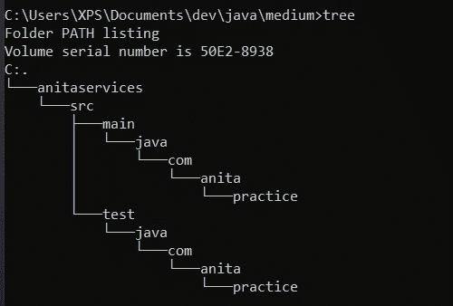

父项目结构

如你所见，这是一个标准的 Maven 项目。让我们从在 ***IntelliJ*** 中打开项目开始。

## 设置父模块相关性

你可以自由使用任何 Java LTS 版本，只要它与我们的教程兼容。我用的是 ***Java 17*** 下面是我的项目结构:

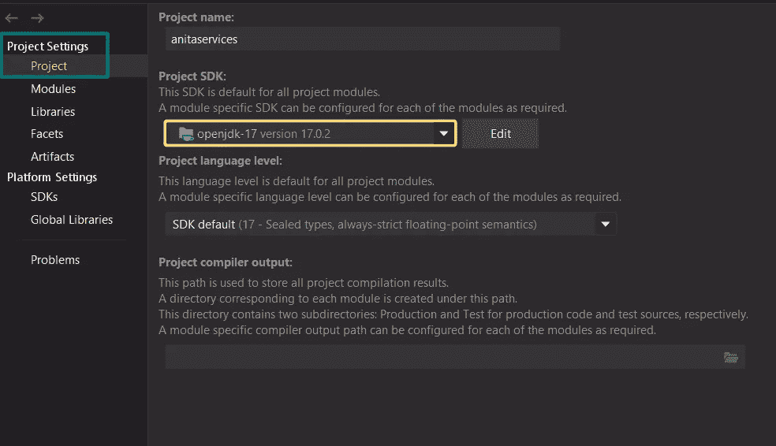

项目结构

根文件夹是 ***父项目*** ，在我的例子中是“***anti taservices***”。我们将使用 Maven 的多模块来拥有许多不同的依赖项，每个子模块将能够选择导入和使用哪些依赖项。在父模块中，我们还可以对所有微服务实施依赖。

您现在可以从父项目中移除 src 文件夹；我们在本课中不需要它，因为它只是一个父模块。

打开 ***pom.xml*** 文件。保留属性并删除依赖项的内容，因为我们将在几分钟后添加我们自己的内容。也删除所有插件。之后，文件应该如下所示:

```
<?xml version="1.0" encoding="UTF-8"?>

<project  xmlns:xsi="http://www.w3.org/2001/XMLSchema-instance"
  xsi:schemaLocation="http://maven.apache.org/POM/4.0.0 http://maven.apache.org/xsd/maven-4.0.0.xsd">
  <modelVersion>4.0.0</modelVersion>

  <groupId>com.anita.practice</groupId>
  <artifactId>anitaservices</artifactId>
  <version>1.0-SNAPSHOT</version>

  <name>anitaservices</name>
  <url>https://www.example.com</url>

  <properties>
    <project.build.sourceEncoding>UTF-8</project.build.sourceEncoding>
    <maven.compiler.source>17</maven.compiler.source>
    <maven.compiler.target>17</maven.compiler.target>
  </properties>

  <dependencies>
  </dependencies>

  <build>
    <pluginManagement>*<!-- lock down plugins versions to avoid using Maven defaults (may be moved to parent pom) -->* <plugins>
      </plugins>
    </pluginManagement>
  </build>
</project>
```

首先，让我们为插件添加一些 ***新属性*** 和 ***依赖管理*** :

```
<properties>
  <project.build.sourceEncoding>UTF-8</project.build.sourceEncoding>
  <maven.compiler.source>17</maven.compiler.source>
  <maven.compiler.target>17</maven.compiler.target>
  <spring.boot.maven.plugin.version>2.5.7</spring.boot.maven.plugin.version>
  <spring.boot.dependencies.version>2.5.7</spring.boot.dependencies.version>
</properties>
```

如果你愿意，你可以单独控制这些版本*。*

*在依赖关系上面，添加***dependency management***标签和下面的依赖关系:*

```
*<dependencyManagement>
  <dependencies>
    <dependency>
      <groupId>org.springframework.boot</groupId>
      <artifactId>spring-boot-dependencies</artifactId>
      <version>${spring.boot.dependencies.version}</version>
      <scope>import</scope>
      <type>pom</type>
    </dependency>
  </dependencies>
</dependencyManagement>*
```

*这里我们将为项目中的每个模块添加 ***可选*** 的依赖项。*

*我们现在添加一些 ***强制依赖*** 。*

```
*<dependencies>
  <dependency>
    <groupId>org.projectlombok</groupId>
    <artifactId>lombok</artifactId>
  </dependency>
  <dependency>
    <groupId>org.springframework.boot</groupId>
    <artifactId>spring-boot-starter-test</artifactId>
  </dependency>
</dependencies>*
```

*之后，我们再来添加一个 ***插件，用于构建神器*** 。*

```
*<build>
  <pluginManagement>*<!-- lock down plugins versions to avoid using Maven defaults (may be moved to parent pom) -->* <plugins>
      <plugin>
        <groupId>org.springframework.boot</groupId>
        <artifactId>spring-boot-maven-plugin</artifactId>
        <version>${spring.boot.maven.plugin.version}</version>
      </plugin>
    </plugins>
  </pluginManagement>
</build>*
```

*修改后重新加载文件，您会注意到所有必需的子项目依赖项都被添加到了 ***父模块依赖项*** :*

*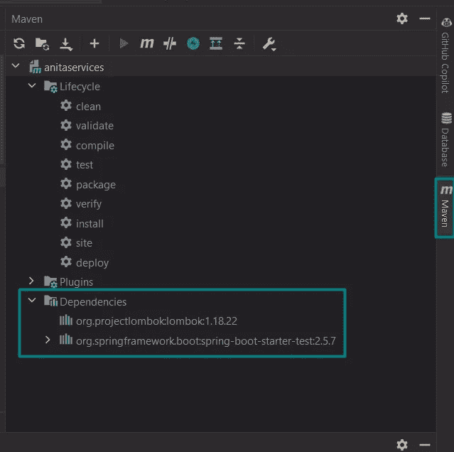*

*父模块依赖关系*

*你可以运行 ***清理*** 和 ***验证*** 来确保一切顺利运行。*

## *添加第一个微服务*

*现在我们已经完成了基础架构，我们可以开始考虑我们的第一个微服务， ***学生*** 。我们还将构建一个 RESTful API，允许我们发布关于学生和数据库的信息。*

*让我们从在父文件夹中创建一个 ***独立模块*** 开始:*

*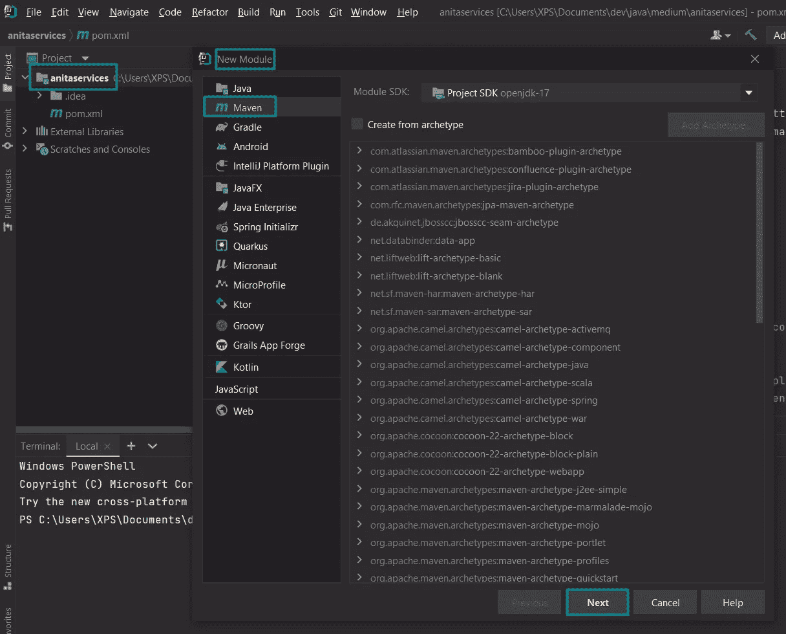*

*为学生微服务创建单独的模块*

*通过命名下一页中的模块，您实际上就是在命名微服务。本模块的 ***groupId*** 与父模块的相同，但是 ***artifactId*** 不同，可以在 ***中看到工件坐标*** :*

*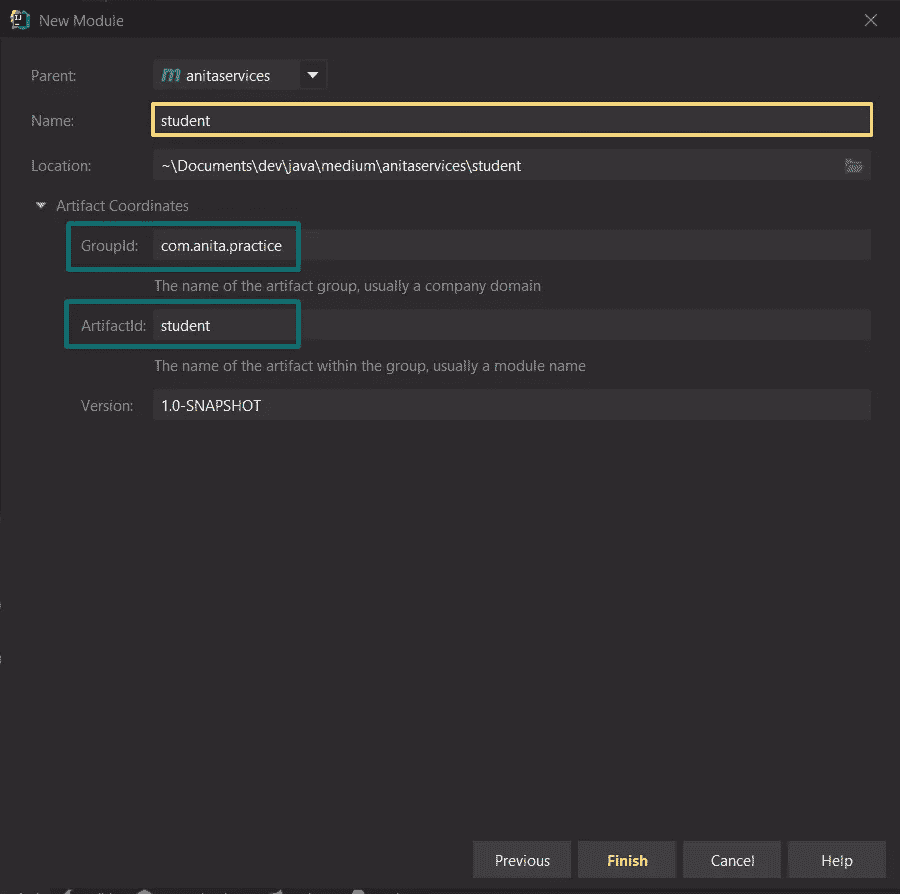*

*学生微服的神器坐标*

*单击“完成”后，项目中将出现一个新文件夹。如果打开 ***父 pom.xml*** 文件，您还会看到新添加的 ***模块部分*** :*

*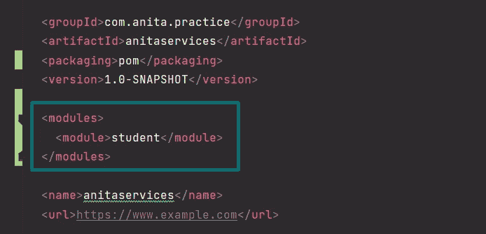*

*父模块的 pom.xml 文件中的模块部分*

*当您打开 student 文件夹时，您会注意到它的结构与标准 Maven 项目非常相似。 ***学生的 pom.xml*** 文件中还有一个 ***父节*** :*

*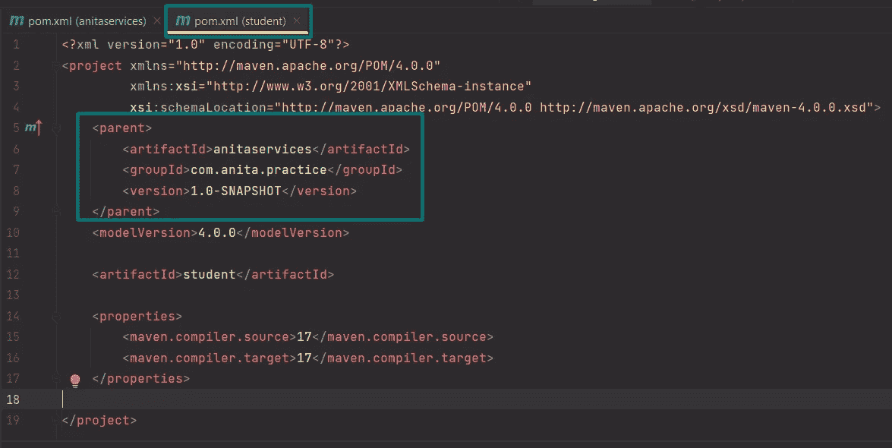*

*模块的 pom.xml 文件中的父节*

*在这个模块中，我们需要一个 ***RESTful web 服务*** 。我们将通过向 pom.xml 文件添加以下几行来添加一个 ***web 依赖关系*** :*

```
*<dependencies>
    <dependency>
        <groupId>org.springframework.boot</groupId>
        <artifactId>spring-boot-starter-web</artifactId>
    </dependency>
</dependencies>*
```

*如果您单击依赖项部分旁边的这个小 ***符号****

*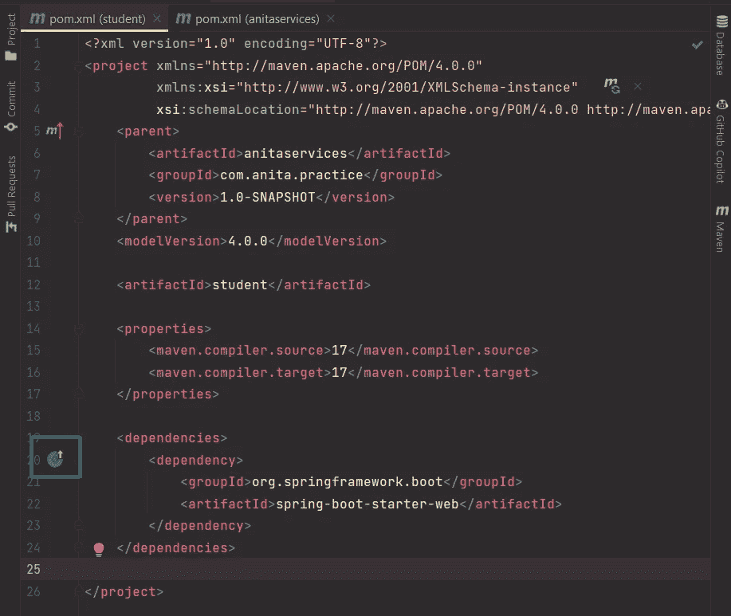*

*它会将您导航到版本 2.5.7 的 ***春季启动依赖项****

*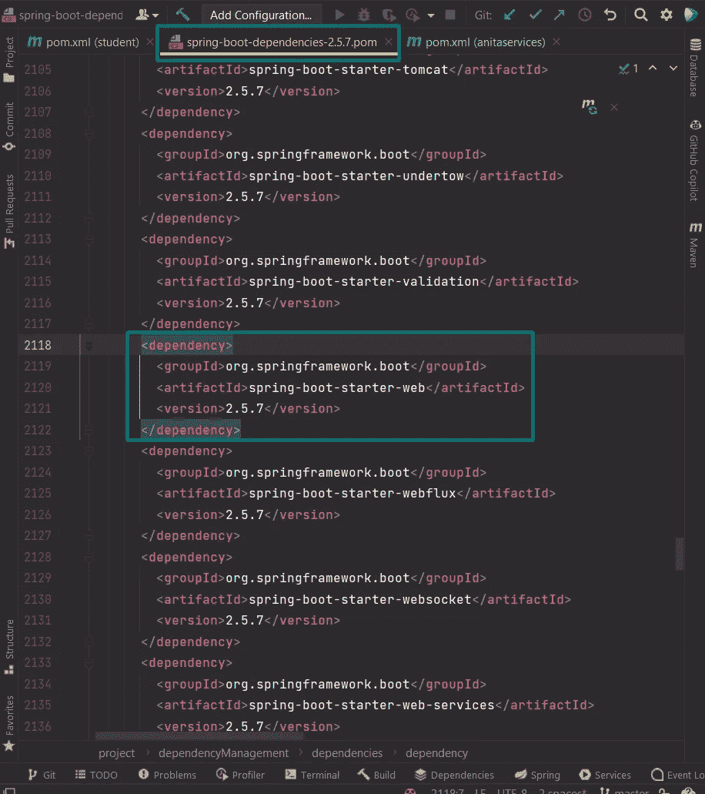*

*根据父 pom.xml 文件中指定的版本的 Spring Boot 依赖项*

*正如您可能已经预料到的，这个 web 依赖项来自于 ***父 pom.xml*** 文件中提到的 spring boot 依赖项。从这里，每个微服务可以选择它需要的依赖项。*

*在项目的 java 文件夹中创建一个 ***新包*** ，并在那里创建一个***student application***类:*

*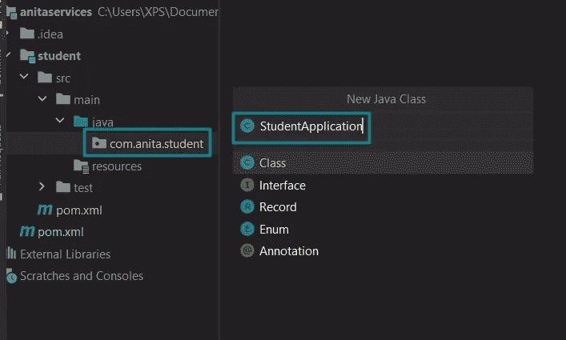*

*学生应用程序主类*

*我们准备用***@ spring boot application***来注释这个类，并插入负责运行应用的 main 方法。完成这个基本设置后，该类应该如下所示:*

```
*package *com.anita.student*;

import *org.springframework.boot.SpringApplication*;
import *org.springframework.boot.autoconfigure.SpringBootApplication*;

*@SpringBootApplication* public class *StudentApplication* {

    public static void main(*String*[] *args*) {
        *SpringApplication*.*run*(*StudentApplication*.class, *args*);
    }

}*
```

*我们也在模块的 ***资源*** 文件夹中创建一个 ***application.yml*** 文件，并声明基本属性:*

```
*server:
  port: 8080

spring:
  application:
    name: student*
```

*现在，如果您在 IDE 中检查您的 ***Maven 部分*** ，您将会看到它也包含我们新模块的动作:*

*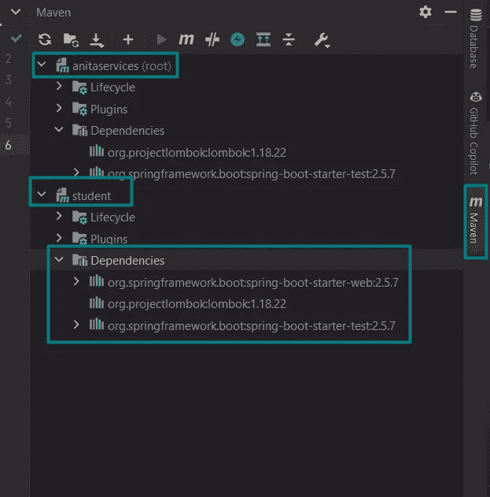*

*Maven 部分包含学生模块及其自己的依赖项*

*Web 依赖项仅包含在学生模块中，测试和 Lombok 依赖项对于父模块的 pom.xml 中指定的模块是必需的。*

*你也可以为你的模块创建一个 ***自定义横幅*** ，这很疯狂吧？前往 [***本网站***](https://devops.datenkollektiv.de/banner.txt/index.html) 并从那里复制横幅:*

*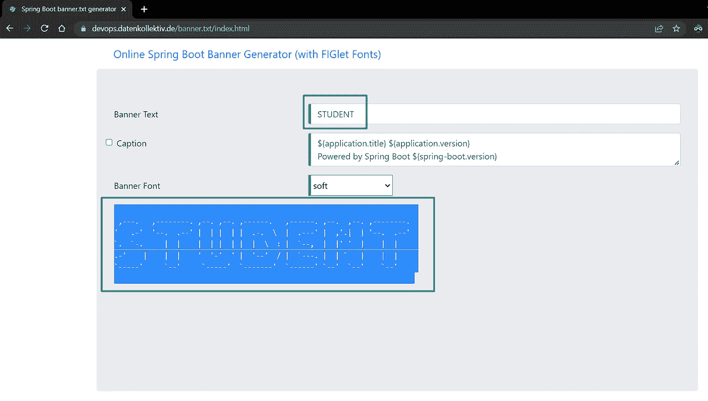*

*为 Spring Boot 应用程序创建自定义横幅*

*返回，在 resources 文件夹中创建一个 ***banner.txt*** 文件并粘贴到。Spring Boot 会自动帮你捡起来。*

*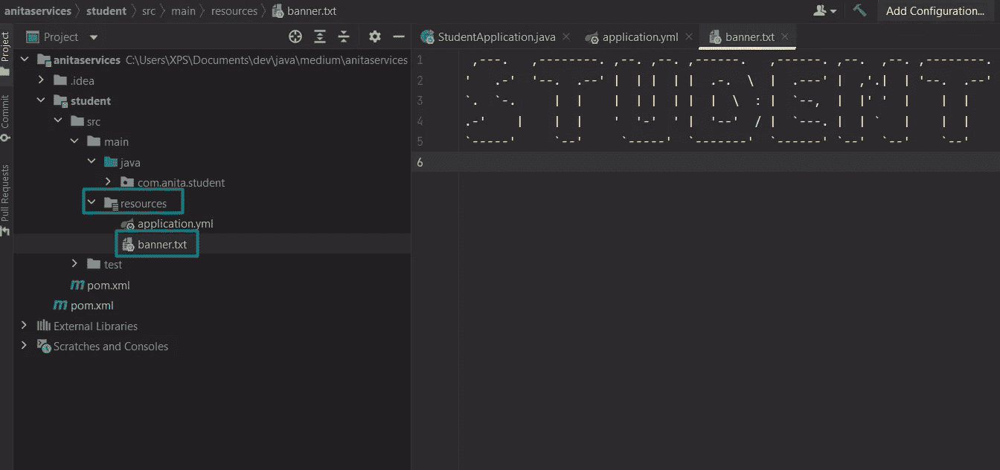*

*将 banner.txt 添加到资源文件夹*

*现在，如果您运行***student application***，您会看到应用程序将以指定的自定义横幅开始:*

*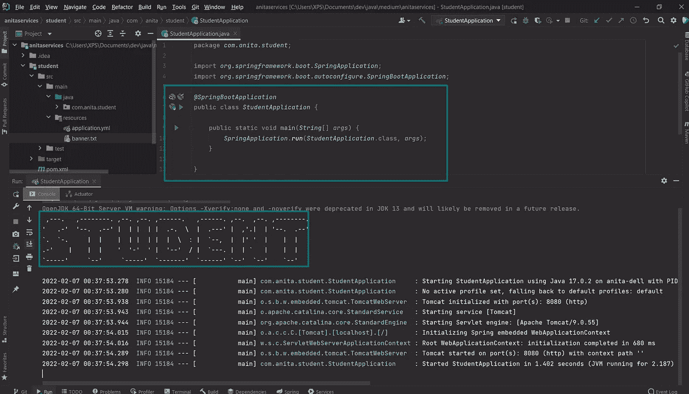*

*应用程序已使用自定义横幅成功启动*

## *创建模型、控制器和服务*

*如你所见，用 Spring Boot 启动这个项目非常容易。现在，在我们的主工作文件夹中，让我们为我们的微服务创建一个简单的 ***学生*** 模型:*

```
*package *com.anita.student*;

import *lombok.Builder*;
import *lombok.Data*;

*@Data
@Builder* public class *Student* {
    private *Long* id;
    private *String* firstName;
    private *String* lastName;
    private *String* email;
}*
```

*接下来，让我们创建一个用于表示学生注册请求的***StudentRegistrationRequest***模型。为此，我使用了 Java 的新记录特性。Record 是一个很棒的特性，因为它消除了 POJOs 附带的样板代码，但是如果您使用的是旧版本的 Java，您可以只使用一个普通的类。*

```
*package *com.anita.student*;

public record *StudentRegistrationRequest*(
        *String* firstName,
        *String* lastName,
        *String* email) {
}*
```

*让我们创建一个 ***学生服务*** 来处理这些请求:*

```
*package *com.anita.student*;

import *org.springframework.stereotype.Service*;

*@Service* public record *StudentService*() {
    public void registerStudent(*StudentRegistrationRequest request*) {
        *Student* student = *Student*.*builder*()
                .firstName(*request*.firstName())
                .lastName(*request*.lastName())
                .email(*request*.email())
                .build();

        *// TODO: Validate Request
        // TODO: Store Student in DB* }
}*
```

*目前，我已经在代码中插入了一些 TODOs，但我们会很快回来。*

*我们还需要为我们的服务定义一个 REST***student controller****:**

```
**package *com.anita.student*;

import *lombok.extern.slf4j.Slf4j*;
import *org.springframework.web.bind.annotation.PostMapping*;
import *org.springframework.web.bind.annotation.RequestBody*;
import *org.springframework.web.bind.annotation.RequestMapping*;
import *org.springframework.web.bind.annotation.RestController*;

*@Slf4j
@RestController
@RequestMapping*("api/v1/students")
public record *StudentController*(*StudentService* studentService) {

    *@PostMapping* public void registerStudent(*@RequestBody StudentRegistrationRequest studentRegistrationRequest*) {
        log.info("New Student Registration {}", *studentRegistrationRequest*);
        studentService.registerStudent(*studentRegistrationRequest*);
    }
}**
```

**如您所见，该应用程序正在逐渐成形。现在是时候让 ***建立我们的数据库*** 和 ***配置我们的应用程序*** 以便我们可以在其中存储我们的学生。**

## **Docker 上的 PostgreSQL 和 pgAdmin**

**在父文件夹 anitaservices 中创建一个名为***docker-compose . yml***的新文件，并将以下设置放入其中:**

```
**services:
  postgres:
    container_name: postgres
    image: postgres
    environment:
      POSTGRES_USER: postgres
      POSTGRES_PASSWORD: postgres
      PGDATA: /data/postgres
    volumes:
      - postgres:/data/postgres
    ports:
      - "5432:5432"
    networks:
      - postgres
    restart: unless-stopped pgadmin:
    container_name: pgadmin
    image: dpage/pgadmin4
    environment:
      PGADMIN_DEFAULT_EMAIL: ${PGADMIN_DEFAULT_EMAIL:-pgadmin4@pgadmin.org}
      PGADMIN_DEFAULT_PASSWORD: ${PGADMIN_DEFAULT_PASSWORD:-admin}
      PGADMIN_CONFIG_SERVER_MODE: 'False'
    volumes:
      - pgadmin:/var/lib/pgadmin
    ports:
      - "5050:80"
    networks:
      - postgres
    restart: unless-stopped

networks:
  postgres:
    driver: bridge

volumes:
  postgres:
  pgadmin:**
```

**我们不会涉及太多细节，但是请记住，我们在这里声明了两个*服务、网络和卷*。对于数据库和 GUI，我们将分别使用 ***Postgres*** 和 ***pgAdmin*** 。在设置中，我们将 ***暴露端口*** 并在它们之间定义一个 ***共享网络*** 。**

**如果您有 IntelliJ IDEA 的终极版，您可以直接从文件中运行它，但是我将教您如何从终端运行它。在 docker-compose.yml 文件所在的目录下打开一个 shell，运行以下命令 ***启动 docker 进程*** :**

```
**docker compose up -d**
```

**这些进程将在一个*分离线程*中运行。您可以通过调用 ***来检查状态*****

```
**docker compose ps** 
```

**你会看到我们有两个容器****【Postgres】在端口 5432*** 和 ***pgAdmin 在端口 5050*** 通过共享网络相互通信。***

**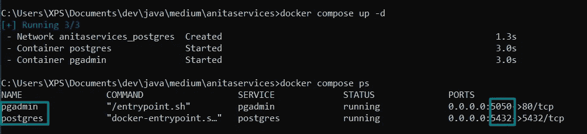**

**您可以在浏览器中导航到 URL[***HTTP://localhost:5050***](http://HTTP://localhost:5050)，如果您看到类似这样的内容，那么恭喜您，您已经成功启动了 docker 进程:**

**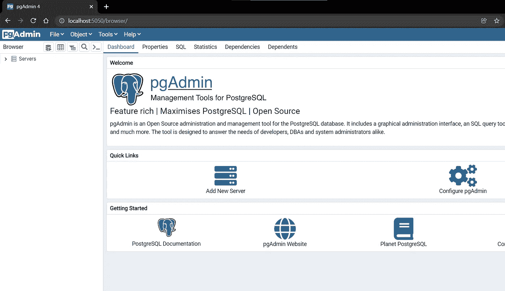**

## **创建新服务器**

**让我们创建一个 ***新服务器*** 。当我们从一个容器连接到另一个容器时，主机是 Postgres。网络已在配置文件中定义。为该服务器命名，并使用您的凭据填写连接属性，如下所示:**

**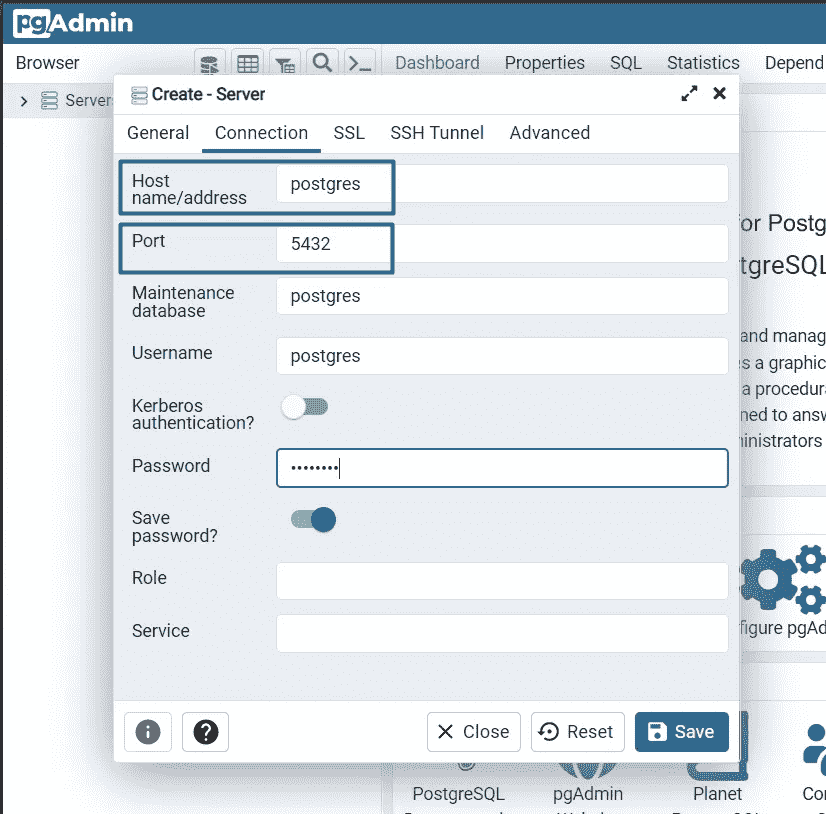**

**在添加新服务器时，如果你和我一样有 ***奇怪的问题*** ，当*主机拒绝连接*或者你因为 *Postgres 角色不存在*而无法登录 Postgres 容器时，让我来帮助你，让你节省一天的研究和调试时间。**

**其中一个问题可能是 *Postgres 在本地同一个端口*上运行，所以容器运行有问题。如果您不需要 PostgreSQL，您可以在本地删除它，或者只是从 Windows 服务菜单中停止该服务(如果您使用的是 Windows)。**

**第二个问题可能是错误消息*“数据库认证失败”，同时提供正确的凭证*。即使您尝试使用用户 postgres 登录容器，它也可能会告诉您找不到角色 postgres。这些命令可以节省您的时间，并允许您最终创建一个新服务器:**

```
**docker-compose down --volumes
docker-compose down --rmi all --volumes
docker-compose up -d --force-recreate**
```

**希望您已经有了一个我们可以使用的数据库，现在，我们可以 ***配置我们的微服务*** 来连接它。**

## **春季数据 JPA**

**复制以下代码，并将其粘贴到您的 ***application.yml*** 文件中的应用程序名称下方:**

```
**datasource:
  username: 'postgres'
  url: jdbc:postgresql://localhost:5432/student
  password: 'postgres'
jpa:
  properties:
    hibernate:
      dialect: org.hibernate.dialect.PostgreSQLDialect
      format_sql: 'true'
  hibernate:
    ddl-auto: update
  show-sql: 'true'**
```

**数据源键、用户名、URL 和密码都存在。因为我们的应用程序不是作为容器启动的，所以 ***URL 是 localhost*** 。如果它是一个容器，我们必须通过网络连接。**

**由于我们的数据库的名称是 student，让我们用这个名称 ***创建一个数据库*** :**

**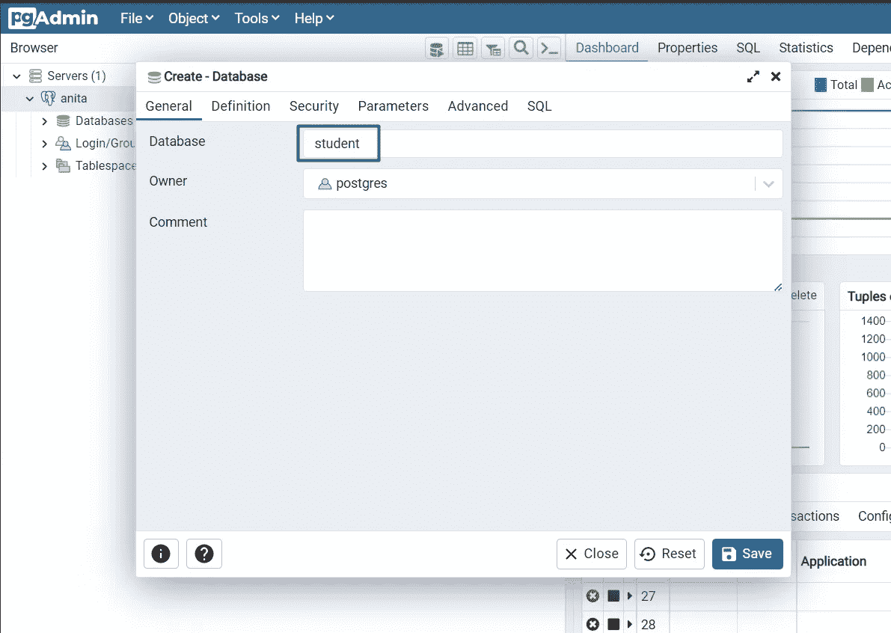**

**数据库学生**

**最后一步是打开 ***学生的 pom.xml*** 文件，添加 ***JPA*** 和 ***PostgreSQL*** 依赖项。**

```
**<dependency>
    <groupId>org.springframework.boot</groupId>
    <artifactId>spring-boot-starter-data-jpa</artifactId>
</dependency>
<dependency>
    <groupId>org.postgresql</groupId>
    <artifactId>postgresql</artifactId>
    <scope>runtime</scope>
</dependency>**
```

**要正确地将学生表示为数据库对象，请打开您的 ***学生*** 类，并进行以下更改:**

```
**package *com.anita.student*;

import *lombok.AllArgsConstructor*;
import *lombok.Builder*;
import *lombok.Data*;
import *lombok.NoArgsConstructor*;

import *javax.persistence.**;

*@Data
@Builder
@Entity
@AllArgsConstructor
@NoArgsConstructor* public class *Student* {
    *@Id
    @SequenceGenerator*(
            name = "student_id_sequence",
            sequenceName = "student_id_sequence"
    )
    *@GeneratedValue*(
            strategy = *GenerationType*.SEQUENCE,
            generator = "student_id_sequence"
    )
    private *Long* id;
    private *String* firstName;
    private *String* lastName;
    private *String* email;
}**
```

**为学生创建一个简单的 JPA***StudentRepository***:**

```
**package *com.anita.student*;

import *org.springframework.data.jpa.repository.JpaRepository*;

public interface *StudentRepository* extends *JpaRepository*<*Student*, *Long*> {
}**
```

*****将*** 这个资源库注入到 ***学生服务*** 和 ***保存*** 学生数据库中。**

```
**package *com.anita.student*;

import *org.springframework.stereotype.Service*;

*@Service* public record *StudentService*(*StudentRepository* studentRepository) {
    public void registerStudent(*StudentRegistrationRequest request*) {
        *Student* student = *Student*.*builder*()
                .firstName(*request*.firstName())
                .lastName(*request*.lastName())
                .email(*request*.email())
                .build();

        *// TODO: Validate Request* studentRepository.save(student);
    }
}**
```

## **测试应用程序**

**重新启动应用程序以应用更改。如果您检查 pgAdmin，您将看到新添加的表和序列:**

**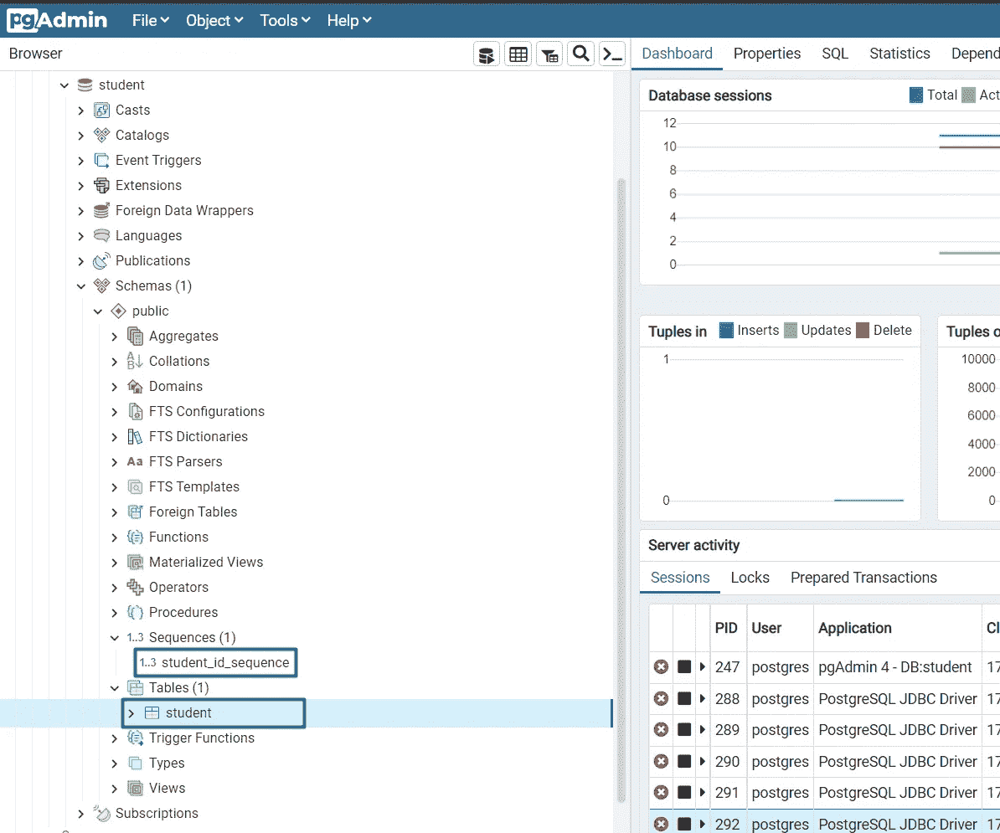**

**学生数据库中的学生表和序列**

**然而，该表目前是空的。您可以使用 ***Postman*** 向我们的 API 提交 POST 请求，并检查我们是否可以保存一个学生:**

**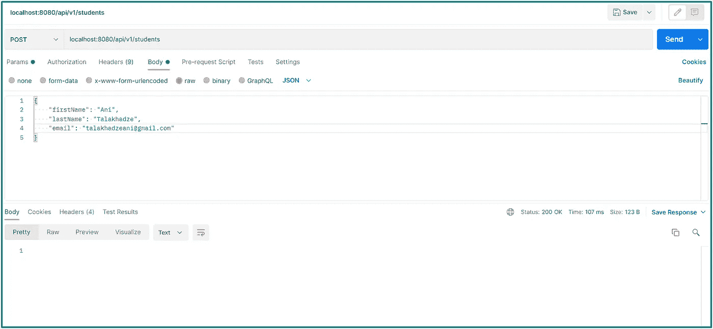**

**向学生 API 提交发布请求**

**让我们 ***对我们的表运行一个查询*** ，看看我们得到了什么:**

**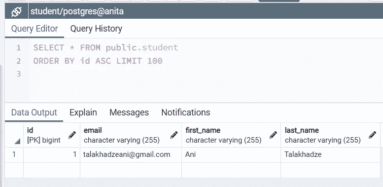**

**检查数据库中的学生表**

**你可以看到我们的微服务连接到自己的数据库。**

****

**我知道这个教程有点冗长，但是我希望你喜欢学习这些东西。如果你错过了什么，所有代码都可以在我的 [***GitHub 资源库***](https://github.com/anitalakhadze/microservices_practice) 上找到。**

**在下面的教程中，让我们看看如何使用我们的项目和 ***Spring Cloud*** 和 *Kubernetes* 。**

*****敬请期待，不要错过！*****