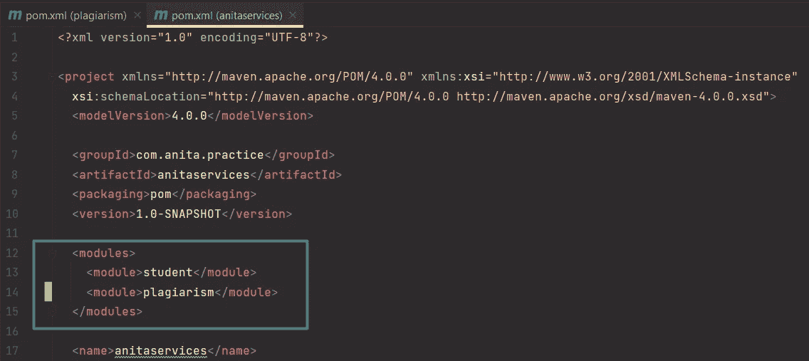

# 微服务[第二部分] —与 Maven、Spring Boot 和 Docker 合作

> 原文：<https://blog.devgenius.io/microservices-part-2-with-maven-spring-boot-and-docker-a9e9745180bd?source=collection_archive---------3----------------------->


使用 ***Maven、Spring Boot 和 Docker*** 构建微服务的系列课程仍在进行中。你可以在第一篇博客 [***这里***](https://medium.com/dev-genius/microservices-part-1-with-maven-spring-boot-and-docker-4888a6bd05b5) 中看到一个关于设置 Maven 项目和创建一个非常简单的微服务 ***学生*** 的分步教程，这个微服务连接到一个运行在 Docker 容器中的 PostgreSQL 数据库。

让我们在这部分建立第二个名为 ***抄袭*** 的微服务。它将与学生微服务进行交流，并验证学生是否抄袭。

到 ***源代码库*** 的链接将在本教程的末尾添加。

## 抄袭微服务

让我们首先为`**Plagiarism**`创建一个新模块，这将是一个 ***Maven 项目*** :


抄袭微服务的新模块

现在，在`**pom.xml**`文件的 ***依赖项段*** 中添加`**Spring Boot Starter Web**`:

```
<dependencies>
    <dependency>
        <groupId>org.springframework.boot</groupId>
        <artifactId>spring-boot-starter-web</artifactId>
    </dependency>
</dependencies>
```

您可能已经注意到，我们的新微服务已经被配置为引用其父服务— `**anitaservices**`:


抄袭微服务的 pom.xml 中的父节

我们还可以导航到父文件的`**pom.xml**`中，看到新的抄袭模块也被添加到 ***模块部分*** 中:



父项目的 pom.xml 中的 Modules 部分

在`**src/main/java**`文件夹中创建一个名为`**com.anita.plagiarism**`的新包，并在那里添加主类`**PlagiarismApplication**`:

```
package *com.anita.plagiarism*;

import *org.springframework.boot.SpringApplication*;
import *org.springframework.boot.autoconfigure.SpringBootApplication*;

*@SpringBootApplication* public class *PlagiarismApplication* {

    public static void main(*String*[] *args*) {
        *SpringApplication*.*run*(*PlagiarismApplication*.class, *args*);
    }

}
```

在`**resources**`文件夹中为抄袭模块创建一个`**application.yml**`文件，并粘贴以下关于*应用程序名称*和*服务器端口的信息(w* e 正在指定一个不同的端口而不是默认端口，因为我们不希望两个应用程序同时运行时在同一个端口上启动):

```
server:
  port: 8081

spring:
  application:
    name: plagiarism
```

如果你愿意，你也可以添加一个自定义的`**banner.txt**`文件。


自定义横幅. txt 文件

之后，启动两个应用程序，以确保一切顺利运行。此外，不要忘记启动 Docker 容器，以便学生微服务可以毫无问题地连接到数据库。

接下来，我们为抄袭微服务添加一个数据库。

## 数据库设置

在典型的*微服务架构中，您通常希望每个微服务 有一个 ***数据库。但是，出于本教程的目的，我们只使用同一个数据库实例，并在其中添加一个数据库:****

**

*创建一个新的数据库——剽窃*

*将以下 ***数据源配置*** 添加到`**application.yml**`文件中:*

```
*server:
  port: 8081

spring:
  application:
    name: plagiarism
  datasource:
    username: 'postgres'
    url: jdbc:postgresql://localhost:5432/plagiarism
    password: 'postgres'
  jpa:
    properties:
      hibernate:
        dialect: org.hibernate.dialect.PostgreSQLDialect
        format_sql: 'true'
    hibernate:
      ddl-auto: update
    show-sql: 'true'*
```

*打开剽窃申请的`**pom.xml**`文件，添加`**spring boot data JPA**`和`**PostgreSQL**`依赖项。*

```
*<dependency>
    <groupId>org.springframework.boot</groupId>
    <artifactId>spring-boot-starter-data-jpa</artifactId>
</dependency>
<dependency>
    <groupId>org.postgresql</groupId>
    <artifactId>postgresql</artifactId>
    <scope>runtime</scope>
</dependency>*
```

*在我们的主包中添加一个新的 Java 类`**PlagiarismCheckHistory**`:*

```
*package *com.anita.plagiarism*;

import *lombok.AllArgsConstructor*;
import *lombok.Builder*;
import *lombok.Data*;
import *lombok.NoArgsConstructor*;

import *javax.persistence.**;
import *java.time.LocalDateTime*;

*@Data
@Builder
@AllArgsConstructor
@NoArgsConstructor
@Entity* public class *PlagiarismCheckHistory* {
    *@Id
    @SequenceGenerator*(
            name = "plagiarism_id_sequence",
            sequenceName = "plagiarism_id_sequence"
    )
    *@GeneratedValue*(
            strategy = *GenerationType*.SEQUENCE,
            generator = "plagiarism_id_sequence"
    )
    private *Long* id;
    private *Long* studentId;
    private *Boolean* isPlagiarist;
    private *LocalDateTime* createdAt;
}*
```

*重启抄袭微服务，确保一切正常。您也可以在`**port 5050**`上查看`**pgadmin**`中的顺序和表格:*

**

*最近创建的序列和剽窃数据库中的一个表*

*在此之后，让我们继续构建控制器、服务和存储库。*

## *控制器、服务和存储库*

*首先，创建一个`**PlagiarismCheckHistoryRepository**`:*

```
*package *com.anita.plagiarism*;

import *org.springframework.data.jpa.repository.JpaRepository*;

public interface *PlagiarismCheckHistoryRepository* extends *JpaRepository*<*PlagiarismCheckHistory*, *Long*> {
}*
```

*然后，创建一个`**PlagiarismCheckService**` ，此时它将始终返回 false，但这肯定会根据实际的业务逻辑而改变:*

```
*package *com.anita.plagiarism*;

import *lombok.AllArgsConstructor*;
import *org.springframework.stereotype.Service*;

import *java.time.LocalDateTime*;

*@Service
@AllArgsConstructor* public class *PlagiarismCheckService* {
    private final *PlagiarismCheckHistoryRepository* plagiarismCheckHistoryRepository;

    public boolean isPlagiaristStudent(*Long studentId*) {
        plagiarismCheckHistoryRepository.save(
                *PlagiarismCheckHistory*.*builder*()
                        .studentId(*studentId*)
                        .isPlagiarist(false)
                        .createdAt(*LocalDateTime*.*now*()).build()
        );
        return false;
    }
}*
```

*创建一个`**PlagiarismCheckResponse**`类。我们目前只包括一个布尔值，但您可以在将来添加任何想要的信息:*

```
*package *com.anita.plagiarism*;

import *lombok.AllArgsConstructor*;
import *lombok.Getter*;
import *lombok.NoArgsConstructor*;
import *lombok.Setter*;

*@Getter
@Setter
@NoArgsConstructor
@AllArgsConstructor* public class *PlagiarismCheckResponse* {
    private *Boolean* isPlagiarist;
}*
```

*最后，创建一个简单的`**PlagiarismController**`,其方法将返回学生是否抄袭的信息:*

```
*package *com.anita.plagiarism*;

import *lombok.AllArgsConstructor*;
import *lombok.extern.slf4j.Slf4j*;
import *org.springframework.web.bind.annotation.GetMapping*;
import *org.springframework.web.bind.annotation.PathVariable*;
import *org.springframework.web.bind.annotation.RequestMapping*;
import *org.springframework.web.bind.annotation.RestController*;

*@RestController
@RequestMapping*("api/v1/plagiarism-check")
*@AllArgsConstructor
@Slf4j* public class *PlagiarismController* {

    private final *PlagiarismCheckService* plagiarismCheckService;

    *@GetMapping*(path = "{studentId}")
    public *PlagiarismCheckResponse* isPlagiarist(*@PathVariable*("studentId") *Long studentId*) {
        boolean isPlagiaristStudent = plagiarismCheckService.isPlagiaristStudent(*studentId*);
        log.info("Plagiarism check request for student {}", *studentId*);
        return new PlagiarismCheckResponse(isPlagiaristStudent);
    }

}*
```

*配置完这些部分后，我们现在可以继续看微服务 之间的 ***通信是如何工作的。****

## *通过 RestTemplate 通信*

*微服务之间的通信可以通过多种方式实现。让我们在本教程中讨论一下`**RestTemplate**`解决方案，把`**Service Discovery**`配置留给下一个。*

*一个学生微服务现在运行在`**port 8080**`上，一个抄袭微服务现在运行在`**port 8081**`上。我们希望学生提交一份抄袭请求，以确定某个已注册的学生是否是抄袭者。*

*打开`**StudentService**`类，在`**register**`方法中修改我们在上一部分留下的 todos:*

```
**@Service* public record *StudentService*(*StudentRepository* studentRepository) {
    public void registerStudent(*StudentRegistrationRequest request*) {
        *Student* student = *Student*.*builder*()
                .firstName(*request*.firstName())
                .lastName(*request*.lastName())
                .email(*request*.email())
                .build();

        *// TODO: Validate Request
        // TODO: Check if plagiarist* studentRepository.save(student);
        *// TODO: Send notification* }
}*
```

*然后创建一个新的`**StudentConfig**`类来返回一个 rest 模板:*

```
*package *com.anita.student*;

import *org.springframework.context.annotation.Bean*;
import *org.springframework.context.annotation.Configuration*;
import *org.springframework.web.client.RestTemplate*;

*@Configuration* public class *StudentConfig* {

    *@Bean* public *RestTemplate* restTemplate() {
        return new RestTemplate();
    }

}*
```

*将这个配置注入我们的`**StudentService**`:*

```
*package *com.anita.student*;

import *org.springframework.stereotype.Service*;
import *org.springframework.web.client.RestTemplate*;

*@Service* public record *StudentService*(*StudentRepository* studentRepository, *RestTemplate* restTemplate) {
    public void registerStudent(*StudentRegistrationRequest request*) {
        *Student* student = *Student*.*builder*()
                .firstName(*request*.firstName())
                .lastName(*request*.lastName())
                .email(*request*.email())
                .build(); *// TODO: Validate Request
        // TODO: Check if plagiarist* studentRepository.save(student);
        *// TODO: Send notification* }
}*
```

*在这个类中，我使用了 Java 的新特性— `**record**`，这是一种声明类型的方式。如果你有兴趣的话，你可以在这里 详细阅读这个以及所有其他添加到 Java 12 到 Java 17 [***最新版本中的很酷的特性。***](https://medium.com/p/7e1152f86829)*

*要查看一个学生是否抄袭，我们需要他或她的 ID，只有当这个学生被保存到数据库中时才可以使用。因此，我们将使用 `**saveAndFlush**`在过程结束前捕捉 ID:*

```
*public void registerStudent(*StudentRegistrationRequest request*) {
    *Student* student = *Student*.*builder*()
            .firstName(*request*.firstName())
            .lastName(*request*.lastName())
            .email(*request*.email())
            .build();

    *// TODO: Validate Request* studentRepository.saveAndFlush(student);
    *PlagiarismCheckResponse* plagiarismCheckResponse = restTemplate.getForObject(
            "http://localhost:8081/api/v1/plagiarism-check/{studentId}",
            *PlagiarismCheckResponse*.class,
            student.getId()
    );
    if (plagiarismCheckResponse.isPlagiarist()) {
        throw new IllegalStateException("Student is a plagiarist!");
    }
    *// TODO: send notification* }*
```

## *测试微服务之间的 HTTP 通信*

*测试我们的应用程序的时候到了！*

*重启两个微服务，打开`**Postman**`向学生微服务发送请求。您将收到一个`**200 status code**`:*

**

*测试来自邮递员的更改*

*打开`**pgadmin**`并检查数据库:*

**

*学生数据库*

**

*抄袭数据库*

*就是这个！我们已经成功地修改了项目，添加了新的微服务，并实施了必要的逻辑来建立应用程序之间的通信。*

*如果你错过了什么，所有代码都可以在我的 [***GitHub 资源库***](https://github.com/anitalakhadze/microservices_practice) 上找到。*

*`**RestTemplate**`对于本教程来说可能是一个很好的解决方案，但是，当我们有几个应用程序实例正在运行，微服务必须知道每个实例的网络信息才能连接时，它就不适合这些情况。*

*我们将不再处理端口，而是用`**Eurika Server**`集中处理，让它负责微服务之间的请求负载平衡。 ***所以，敬请期待，不要错过！****

*此外，请在下面评论您希望在以下博客中看到的内容。*

****快乐编码！****