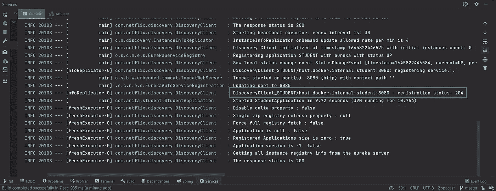

# 微服务[第三部分] —与 Maven、Spring Boot 和 Docker 合作

> 原文：<https://blog.devgenius.io/microservices-part-3-with-maven-spring-boot-and-docker-e750fd62dce7?source=collection_archive---------1----------------------->

在微服务系列的 [***part 1***](/microservices-part-1-with-maven-spring-boot-and-docker-4888a6bd05b5) 和 [***part 2***](/microservices-part-2-with-maven-spring-boot-and-docker-a9e9745180bd) 中，我们花了一些时间构建了两个简单的微服务——***学生*** 和 ***抄袭*** ，并在它们之间建立了 HTTP 通信。


然而，当您的应用程序需要伸缩并且您有多个实例在运行时，这可能不是一个好的解决方案。在这种情况下，微服务需要知道该应用程序的所有现有端口。这可能会成为一个相当复杂的问题，并变成一场噩梦。

在本教程中，我将向您展示如何使用 ***服务注册中心*** 来解决这个问题。到 ***源代码库*** 的链接将在本教程的末尾添加。

## Eureka 服务器和客户端

我们不会在这里详细讨论，只是简单地提一下，根据[术语定义](https://avinetworks.com/glossary/service-discovery/#:~:text=Service%20discovery%20is%20the%20process,of%20networks%20by%20identifying%20resources.)，服务发现是自动检测网络上的设备和服务的过程。

在 Spring Boot，保存所有客户服务应用程序信息的应用程序被称为 ***尤里卡服务器*** 。在这种情况下，微服务可以被称为 ***尤里卡客户端*** 。

简而言之，客户端 ***向服务器注册*** ，服务器知道服务运行的确切信息——主机和端口。当微服务想要相互连接时，它们会通过这个服务器进行通信。

在我们的例子中，微服务应该做的第一件事是将自己注册为 Eureka 服务器的客户端。`**Plagiarism**`实例也应该这样做。如果`**Student**`微服务决定通过 HTTP 与`**Plagiarism**`对话，它做的第一件事就是发送服务发现请求，找出`**Plagiarism**`的位置。服务器将返回实例(或其中一个实例)的地址，然后，请求将发送到特定的实例`**Plagiarism**`。

你可以看到 Eureka 服务器在整个通信游戏中扮演着非常重要的角色。如果因为任何原因宕机，所有这些微服务之间的连接都将丢失。这就是为什么不惜一切代价保持 Eureka 服务器正常运行是非常重要的。

## 春云依赖

你可以导航到 Spring 的 [***官方网页***](https://spring.io/projects/spring-cloud)*看看所有的功能 ***春云*** 优惠。现在，让我们从添加`**Spring Cloud Dependency**`到我们的项目开始。*

*打开主`**pom.xml**`文件，并在`**dependencyManagement**`部分添加以下依赖项，以使每个微服务能够选择它想要的依赖项:*

```
*<dependency>
  <groupId>org.springframework.cloud</groupId>
  <artifactId>spring-cloud-dependencies</artifactId>
  <version>${spring.cloud-version}</version>
  <type>pom</type>
  <scope>import</scope>
</dependency>*
```

*在属性部分中声明 spring cloud 版本(该版本可能与您的不同):*

```
*<spring.cloud-version>2020.0.5</spring.cloud-version>*
```

*重新加载文件以应用更改，让我们继续设置 ***服务发现*** 。*

## *配置 Eurika 服务器*

*在本节中，我们将构建一个服务，负责服务发现、解决端口问题以及将我们的微服务相互连接起来。*

*在项目中创建一个名为`**eurekaserver**`的新模块:*

**

*在项目中为 eureka 服务器创建一个新模块*

*打开这个新创建的模块的`**pom.xml**`文件，并添加以下依赖项:*

```
*<dependencies>
    <dependency>
        <groupId>org.springframework.cloud</groupId>
        <artifactId>spring-cloud-starter-netflix-eureka-server</artifactId>
    </dependency>
</dependencies>*
```

*如果按下小 ***蓝色按钮*** 旁边的依赖项*

**

*导航到父库*

*您将导航到相应版本的 spring-cloud-网飞-依赖项(因为我们在父文件`**pom.xml**`中添加了依赖项):*

**

*春云网飞依赖，版本 3.1.1*

*现在我们有了依赖关系，在 java 文件夹中创建一个新的包`**com.anita.eurekaserver**`。然后创建一个`**EurekaServerApplication**`类并用`**@EnableEurekaServer**`注释它:*

```
*package *com.anita.eurekaserver*;

import *org.springframework.boot.SpringApplication*;
import *org.springframework.boot.autoconfigure.SpringBootApplication*;
import *org.springframework.cloud.netflix.eureka.server.EnableEurekaServer*;

*@SpringBootApplication
@EnableEurekaServer* public class *EurekaServerApplication* {

    public static void main(*String*[] *args*) {
        *SpringApplication*.*run*(*EurekaServerApplication*.class, *args*);
    }

}*
```

*将`**application.yml**`添加到资源文件夹中，并将下面几行粘贴进去:*

```
*spring:
  application:
    name: eureka-server

server:
  port: 8765

eureka:
  client:
    fetch-registry: false
    register-with-eureka: false*
```

*如果愿意，可以添加自定义的`**banner.txt**`文件:*

**

*eureka 服务器模块的自定义横幅*

*当应用程序在`**port 8765**`启动时，打开网络浏览器并导航到该端口。您将看到一个代表 ***Eureka 仪表板*** 的网页，给出了关于服务本身的信息，包括当前向 Eureka 注册的实例(目前没有，因为我们还没有告诉我们的微服务连接到该服务器)。*

**

*尤里卡仪表板*

*这个页面现在没有给出很多信息，但是当我们在 Eureka 服务器上注册我们的服务时，这些部分将会更新。*

## *配置 Eureka 客户端*

*让 Eureka 服务器保持运行，让我们从配置`**Student**`微服务开始。打开它的`**pom.xml**`文件并添加以下依赖项:*

```
*<dependency>
    <groupId>org.springframework.cloud</groupId>
    <artifactId>spring-cloud-starter-netflix-eureka-client</artifactId>
</dependency>*
```

*打开主`**StudentApplication**`类并用`**@EnableEurekaClient**`对其进行注释:*

```
*package *com.anita.student*;

import *org.springframework.boot.SpringApplication*;
import *org.springframework.boot.autoconfigure.SpringBootApplication*;
import *org.springframework.cloud.netflix.eureka.EnableEurekaClient*;

*@SpringBootApplication
@EnableEurekaClient* public class *StudentApplication* {

    public static void main(*String*[] *args*) {
        *SpringApplication*.*run*(*StudentApplication*.class, *args*);
    }

}*
```

*打开`**application.yml**`并在文件末尾添加以下配置:*

```
*eureka:
  client:
    service-url:
      defaultZone: http://localhost:8765/eureka*
```

*启动`**StudentApplication**`查看一切正常。从控制台日志中，可以看到 ***发现客户端*** 已经启动:*

**

*日志通知发现客户端*

*如果您查看网页，您会看到实例部分也已更新:*

**

*更新了 Eureka 仪表板上的实例部分*

*仪表板上应用程序的名称来自于`**application.yml**`文件，因此，给它们起一个合理的名称将极大地帮助您将来区分网页上的应用程序:*

**

*在 application.yml 文件中声明应用程序名称*

*现在回到 IntelliJ 并打开配置，复制`**StudentApplication**`并修改程序参数字段:*

**

*应用程序配置菜单*

**

*复制学生应用程序*

**

*修改新配置的名称和程序参数*

*运行`**StudentApplication 2**`并重新加载网页。可用性区域的数量将增加到 2 个，因为我们有两个`**StudentApplication**`实例(您还会注意到服务器维护每个实例的地址):*

**

*尤里卡仪表盘上可用区域的数量增加*

*我们不再需要`**StudentApplication**`的第二个实例，所以您可以停止它并删除配置。*

*现在，为抄袭模块重复同样的过程。用同样的方法修改它的`**pom.xml**`(添加尤里卡客户端依赖)、`**application.yml**`(添加尤里卡服务配置)和`**PlagiarismApplication**`(添加启用尤里卡客户端的注释)文件。*

*现在，如果您启动所有应用程序并重新加载页面，您将看到一个`**Student**`实例和一个`**Plagiarism**`实例:*

**

*仪表板上的学生和剽窃实例*

## *负载平衡请求*

*此时，`**Student**`对`**StudentService**`类中的`**Plagiarism**`进行网络调用。使用 ***服务发现*** 的主要原因正是为了消除这种需要。我们让 Eureka 服务器处理这些信息，我们只需要我们想要连接的应用程序的名称:*

```
*"http://PLAGIARISM/api/v1/plagiarism-check/{studentId}",*
```

*名字**抄袭**会解析到对应的 IP 地址。*

*转到学生的`**application.yml**`文件，将`**ddl-auto**`设置从`**update**`修改为`**create-drop**`(当然，我们不希望在您想要保存数据的生产环境中这样做)。从配置中复制`**PlagiarismApplication**`，重启`**Student**`和`**Plagiarism**`，打开 Postman，向`**Student**`服务发送如下请求:*

```
*{
    "firstName": "Ani",
    "lastName": "Talakhadze",
    "email": "talakhadzeani@gmail.com"
}*
```

*由于未知的内部异常，我们将出现内部错误:*

**

*发送请求时，邮递员出现内部服务器错误*

*实际上，这是因为有两个抄袭实例，RestTemplate 不知道向哪个模板发送请求。为了解决这个问题，我们需要在`**StudentConfig**` 类中为 RestTemplate 添加一个注释`**@LoadBalanced**`，以便能够对请求进行负载平衡:*

```
*package *com.anita.student*;

import *org.springframework.cloud.client.loadbalancer.LoadBalanced*;
import *org.springframework.context.annotation.Bean*;
import *org.springframework.context.annotation.Configuration*;
import *org.springframework.web.client.RestTemplate*;

*@Configuration* public class *StudentConfig* {

    *@Bean
    @LoadBalanced* public *RestTemplate* restTemplate() {
        return new RestTemplate();
    }

}*
```

*这一次，在重启`**StudentApplication**`之后，当您发送请求时，它不会因为向实例发送请求而混淆:*

**

*邮递员成功发送请求*

*您还可以检查控制台日志。您将看到只有一个`**Plagiarism**`应用程序日志包含关于学生请求的信息。*

*我们已经成功地将新模块集成到我们的项目中，建立了服务注册中心，并通过服务发现连接了微服务。如果你错过了什么，所有代码都可以在我的 [***GitHub 资源库***](https://github.com/anitalakhadze/microservices_practice) 上找到。*

*如果你对即将到来的博客有任何问题、评论或建议，请告诉我。*

****敬请关注，不要错过以下教程！****