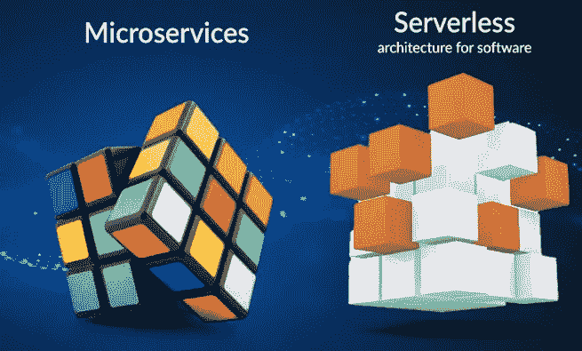

# 微服务与无服务器

> 原文：<https://blog.devgenius.io/microservices-vs-serverless-254cc8683ddd?source=collection_archive---------14----------------------->

微服务与无服务器

-在谈论这个话题之前，让我们先弄清楚协议和架构在软件世界中意味着什么。

*   REST 和 SOAP 是两种不同的在线数据通信方式。
    这些允许我们构建应用程序编程接口(API)，
    可用于在 web 应用程序之间传递数据。剩下的就是一堆建筑原理。SOAP 是结构化信息的消息传递协议。主要区别在于 SOAP 是一种协议——REST 不是。
*   协议:如果你得到一个 SOAP，它就是一个协议。
*   建筑:如果你休息了，那就是建筑。在这里，我们可以根据需求进行修改。

# 微服务

*   是架构(不是协议)。这意味着你可以使用任何平台/任何工具/任何语言来开发你的**微服务架构。**

对于微服务，我们需要完成两件事。

1.  可独立部署
2.  可独立扩展(具有有限的上下文)

*   假设你要为一个组织设计一个系统。因此，可能会有员工服务、项目服务、财务服务、人力资源服务等，这些服务必须独立部署(每个服务不应在其他服务的数据库级别搜索数据。它们应该集成在 rest 服务级别/HTTP 层中)
*   假设员工服务和人力资源服务共享同一个数据库。因此，当两者访问同一个数据库时，员工服务数据库的流量会非常大。
*   是的，当然。我们可以扩大员工服务..

但是…..

*   即使扩展了服务，它仍然会在数据库上产生瓶颈(但是如果它可以定制为没有或没有产生任何问题，那么共享同一个数据库是很好的)
*   独立可扩展:当我们按需扩展服务的某些部分时，我们不需要联系或通知任何其他服务，因为这些服务是独立的。
*   以员工服务为例。它应该只关心员工，但不应该担心项目或财务或人力资源。员工服务只负责自己的服务。
*   在微服务架构中，我们可以使用不同的语言来构建每个服务。

假设有三种服务。

> 人力资源服务-Java
> 
> 项目服务-节点 Js
> 
> 金融服务-节点+快递

像 wise 这样的语言或技术并不重要，因为每个服务都使用通用的协议来相互通信，比如 HTTP。

不仅如此，我们还可以在任何平台上部署这些服务。

> 人力资源服务-码头工人+码头工人群体
> 
> 项目服务-Docker+Kubernetes
> 
> 金融服务-亚马逊弹性容器服务(亚马逊 ECS)

*   像 wise 一样，每个服务都是独立于平台的。但要确保如果我们这样做，我们应该有一个 DevOps 团队。
*   因为他们应该能够负责创建集群，管理 kubernetes 集群，确保为每个 docker 分配足够的内存，检查 docker 是否得到了正确的配置，安全方面有很多需要关注的。

# 无服务器

*   在无服务器部署中，与微服务无关。无服务器意味着你只需要担心程序或开发。但是你不需要担心如何部署，如何扩展。
*   想想你有 100 个请求，伸缩部分会由云自己照顾。
*   但是这有一个缺点。
*   如果我们在 ECS 或 Kubernets 上运行我们的程序，实例就在云上运行，如果是 amazon AWS，我们**必须为你运行的 ECS 实例按小时**付费。

> 假设您的一个服务使用内存和处理器 5 秒钟。即使我们必须支付一个小时的费用，如果每小时使用一次(每天 24 次)，那一天只需要 120 秒。但事情是为了这个目的，它将收取 24 小时，因为它是在 24 小时的基础上。

这是一个巨大的劣势。

> 另一点是，如果我们的代码部署在容器上，无论这些容器处于睡眠模式。我们必须“冷启动”它们。因此，启动它们需要一些时间，这将增加延迟，这是一个缺点。

希望你能从这篇文章中得到一些启示。更多有价值的文章和我保持联系。

参考: