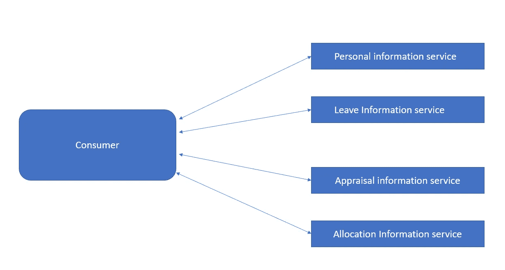
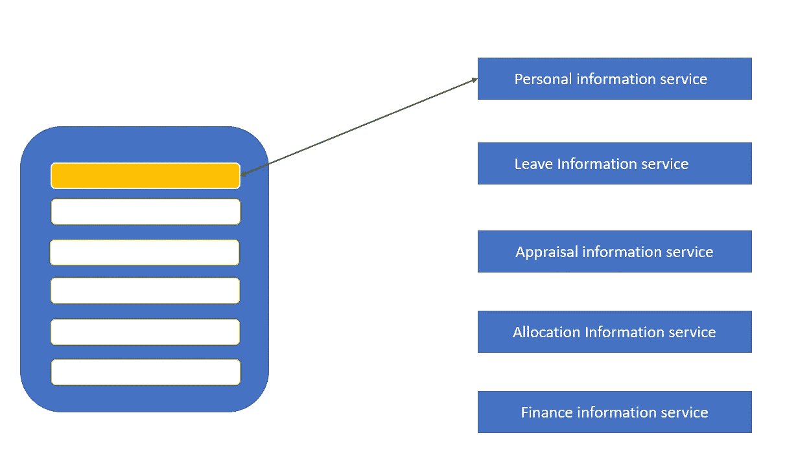
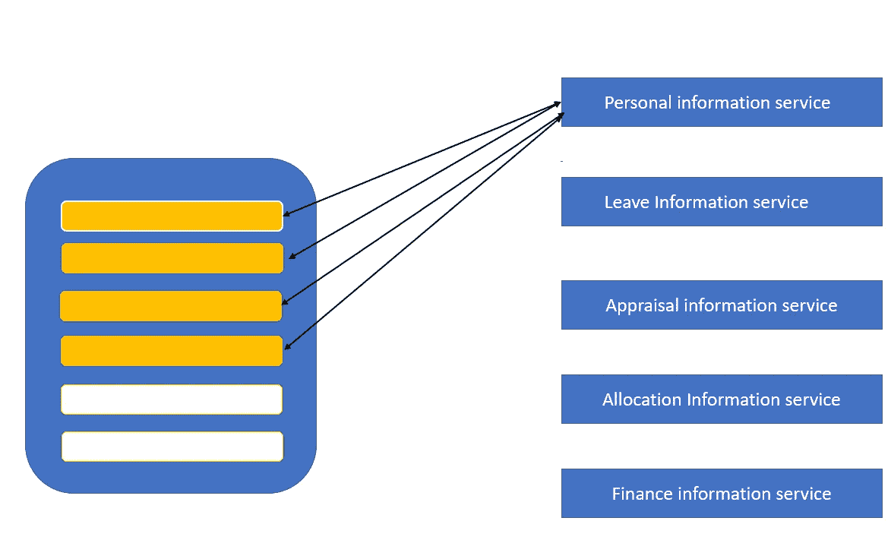
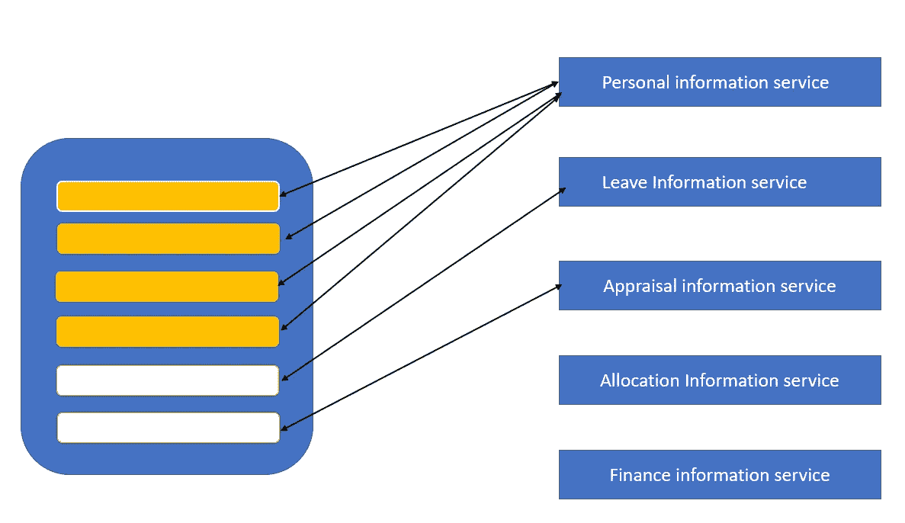
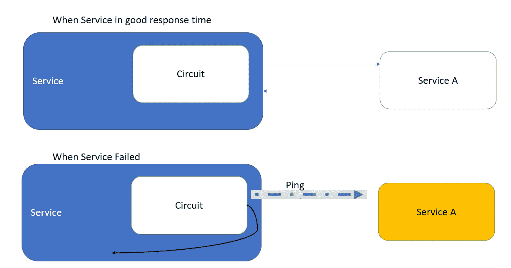

# 断路器模式的微服务

> 原文：<https://blog.devgenius.io/microservices-with-circuit-breaker-pattern-5fef166e4cc4?source=collection_archive---------2----------------------->

*   这里我们将讨论如何用断路器模式保护/创建可持续服务。

*   正如我们在上一篇[文章](https://medium.com/@imilamaheshan30/design-patterns-for-microservices-1399eea583b7)中所讨论的，我们已经提到了 4 种不同的服务，所以当我们有多个服务时，这些服务很可能有多个后端。所以我们可以创建一个类似聚合器的模式来调用这些服务。
*   服务的可用性:我们通常说服务是 99.999%的正常运行时间得到保证。

**但是……**

> 99.999%的运行时间意味着 0.001 的停机时间。
> 
> 这意味着每年有 5.256 分钟的停机时间。(525600 分钟*0.001=5.25 分钟)
> 
> 但是在微服务架构中有多个服务，假设我们有 100 个服务，那么将有(100*5.25 分钟=525 分钟)525 分钟的停机时间，这是不可接受的。

**让我们看看中断服务的情况有哪些:**

*   假设我们有 5 个不同的微服务，我们通过 web 服务器调用它。我们有 5 个服务，当我们收到请求时，这意味着一个服务分配一个线程来调用后端(个人信息服务)。

*   这里个人信息服务使用一个线程。所以一个线程被分配给该服务。现在服务有点延迟-线程正在等待，直到超时。
*   一个线程等待很好。那将是相当长的等待时间。但是，如果许多线程都要等待超时，那该怎么办呢？

*   如果服务是高需求服务，当它将有更多的请求。因此线程池中的线程一个接一个地等待。同时，其他空闲线程可以分配给其他服务。

> 因此此后所有的线程都将被阻塞。
> 
> 现在，进入此服务的剩余线程将被排队。web 服务仍在尝试处理队列中的所有请求。结果，此 web 服务器将永远无法恢复，因为当它处理队列时，会有越来越多的请求进入。这将导致服务中断。所以服务会下线。

**解决方案:**

> 断路器模式

*   假设您已经定义了阈值，它应该在 200 毫秒内响应。
*   如果大量请求(假设 75%)达到上限(150 到 200 之间)，这意味着现在服务正在缓慢失败。
*   因此，如果发生次数超过 200 毫秒，这是您为该服务设置的最大阈值。
*   如果它超过了你可以配置的次数，那么这个代理知道服务不再响应，所以下一个访问服务的请求将会失败。(断开代理和服务之间的连接)这意味着它不会等待。

*   假设我们有 30 秒的暂停。如果每个请求都试图命中服务而不考虑其失败，所有来自消费者的请求将等待 30 秒。最终循环结束，一切都将超时。但是在这 30 秒的时间内，服务 a 将尝试注册到达消费者的剩余资源。那些人正在排队等候。
*   现在，断路器模式所做的是，如果故障超过给定阈值，它将根本不会尝试运行服务。它将回切到消费者，说服务 a 不可用。

因此，让我们看看它将如何连接回来…

*   它确实在后台，在 ping 请求中。当该响应时间回到正常阈值时，它将再次接通该电路。
*   这意味着剩余的使用**服务 A** 的请求将直接发送到**服务 A。**在失败期间，使用**服务 A、**的所有记录都将返回错误消息。
*   所以现在没有排队。当服务备份时，它将消耗新的流量。

参考:

请继续关注我的博客，下一篇文章将讨论使用代理模式的微服务。