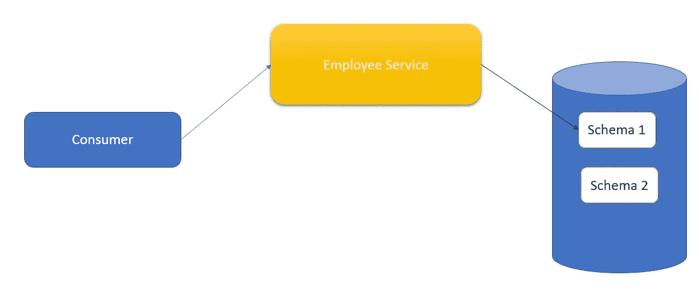
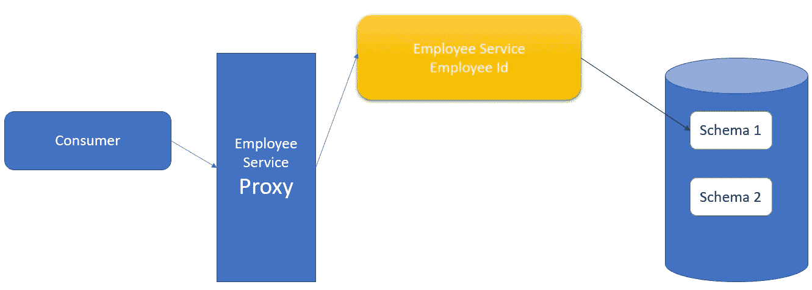
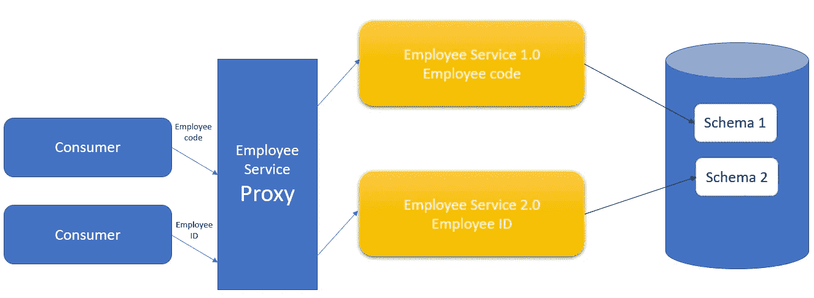

# 具有代理模式的微服务

> 原文：<https://blog.devgenius.io/microservices-with-proxy-pattern-6224632b9628?source=collection_archive---------10----------------------->

*   在这里，我们讨论当从单一应用程序迁移到微服务架构时，以及当服务结构频繁变化时，如何使用代理设计模式。
*   让我们假设你的客户有一个单一的应用程序，你将进入微服务架构。
*   假设您有一个获取员工出勤信息的微服务。所以我们会通过员工代码来获取考勤信息。考虑这样一个场景，客户决定重新构建数据库，他们决定将雇员 ID 作为所有记录关系跟踪键。所以现在我们必须更新我们的服务，从雇员 ID 而不是雇员代码中获取数据。
*   现在，我们必须相应地部署新版本的服务。

*   因此，目前消费者正在使用您的第 1 版员工服务。现在消费者将传递雇员代码。但是对于版本 2，我们必须输入员工 ID。
*   如果我们部署/更新我们当前的服务，这将导致消费者的失败，因为他们不知道如何传递员工 Id。

**解决方案:**

*   作为解决方案，我们需要创建不同的代理服务。

*   现在消费者涉及代理服务。我们修改了代理服务，使其在消费者为雇员服务的版本 2(模式 2)传递雇员 ID 时起作用。如果消费者传递员工代码，则调用员工服务的版本 1。
*   这样，我们可以独立地部署我们的服务，而不会干扰消费者。

**语义版本**

> 少校- **2**
> 
> 次要- **5**
> 
> 补丁- **9**

**Major**-当服务与以前的服务不兼容时使用的主要版本。

**次要** -每当我们有新功能时使用，但是以前的功能将保持不变。

我们可以实现我们想要的方式，这与我们做得如何无关。

**服务发现:**当我们创建服务时，最好使用外部方来发现服务，因为随着基础设施改变主机名，IP 地址同样一切都可以改变。

*   但是在服务发现的帮助下，代理将调用服务发现工具，并且代理将从服务发现工具请求员工服务版本 1(或者可能是版本 2)。所以服务发现工具告诉服务版本 1 的 ip 地址是什么。

**使用消息队列:**如果一些服务需要很长时间来响应，那么接下来的服务将一个接一个地受到影响，这将产生级联效应。这种影响将通过所有其他服务传递给它。

*   为了避免这种情况，我们可以使用消息队列。对于所有的消息，它将存储这些，然后队列处理器将处理一个接一个。

**超时**:当我们的版本 1 越来越延迟时，如果我们不指定一个超时实现，那么阻塞线程会影响版本，这是很重要的。为了避免这类事件，定义超时是一个非常必要的方面。

参考: